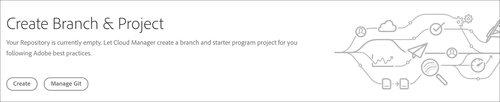

# Creating an AEM Application Project {#aem-application-project}

## Utilizzo della procedura guidata per creare un progetto di applicazione AEM {#using-wizard-to-create-an-aem-application-project}

Per aiutare a far iniziare i nuovi clienti, Cloud Manager è ora in grado di creare un progetto AEM minimo come punto di partenza. Questo processo è basato sul tipo di archivio del progetto [**AEM **](https://github.com/Adobe-Marketing-Cloud/aem-project-archetype).


Per creare un progetto di applicazione AEM in Cloud Manager, procedi come segue:

1. Una volta effettuato l&#39;accesso a Cloud Manager e la configurazione del programma di base è completa, nella schermata **Panoramica** verrà visualizzata una speciale chiamata alla scheda azione, se il repository è vuoto.

   

1. Fate clic su **Crea** per passare alla schermata **Crea un ramo e un progetto** .

   

1. La sezione Creazione **progetto in corso** viene visualizzata nella schermata Panoramica ** programma.

   

1. Una volta completata la creazione del programma, la sezione **Aggiungi ambiente** viene visualizzata nella pagina Panoramica *del* programma.
   

   Per informazioni su come aggiungere o gestire gli ambienti, fare riferimento a [Gestione degli ambienti](/help/implementing/cloud-manager/manage-environments.md) .

## Impostazione del progetto {#setting-up-your-project}

### Modifica dei dettagli di impostazione del progetto {#modifying-project-setup-details}

Per essere generati e distribuiti correttamente con Cloud Manager, i progetti AEM esistenti devono rispettare alcune regole di base:

* I progetti devono essere realizzati con Apache Maven.
* Nella directory principale dell’archivio Git deve essere presente un file *pom.xml* . Questo file *pom.xml* può fare riferimento a tutti i sottomoduli (che a loro volta possono avere altri sottomoduli, ecc.) se necessario.

* Potete aggiungere riferimenti ad altri archivi di artefatti Maven nei file *pom.xml* . Tuttavia, l&#39;accesso ai repository di artifact protetti da password o protetti da rete non è supportato.
* I pacchetti di contenuto distribuibile vengono rilevati mediante la scansione dei file *zip* del pacchetto di contenuto contenuti contenuti in una directory denominata *target*. Un numero qualsiasi di sottomoduli può produrre pacchetti di contenuto.

* Gli artifact del Dispatcher distribuibile vengono rilevati mediante la scansione di file *zip* (ancora, contenuti in una directory denominata *target*) con directory denominate *conf* e *conf.d*.

* In presenza di più pacchetti di contenuto, l&#39;ordine delle distribuzioni dei pacchetti non è garantito. Se è necessario un ordine specifico, per definire l’ordine è possibile utilizzare le dipendenze del pacchetto di contenuto. I pacchetti possono essere [ignorati](#skipping-content-packages) dalla distribuzione.


## Dettagli ambiente build {#build-environment-details}

Cloud Manager crea e verifica il codice utilizzando un ambiente di build specializzato. Questo ambiente ha i seguenti attributi:

* L&#39;ambiente di costruzione è basato su Linux, derivato da Ubuntu 18.04.
* Apache Maven 3.6.0 è installato.
* La versione Java installata è Oracle JDK 8u202.
* Sono installati alcuni pacchetti di sistema aggiuntivi necessari:

   * bzip2
   * decomprimere
   * libpng
   * imagemagick
   * graphicsmagick

* Altri pacchetti possono essere installati in fase di creazione come descritto [di seguito](#installing-additional-system-packages).
* Ogni costruzione è fatta su un ambiente incontaminato; il contenitore di compilazione non mantiene alcuno stato tra le esecuzioni.
* Maven è sempre eseguito con il comando: mvn — *batch-mode clean org.jacoco:jacoco-maven-plugin:Preparare-agent package*
* Maven è configurato a livello di sistema con un file settings.xml che include automaticamente il repository pubblico di Adobe **Artifact** . Per ulteriori informazioni, consultate [Adobe Public Maven Repository](https://repo.adobe.com/) .


## Variabili di ambiente {#environment-variables}

### Variabili di ambiente standard {#standard-environ-variables}

In alcuni casi, i clienti trovano necessario variare il processo di creazione in base alle informazioni sul programma o sulla pipeline.

Ad esempio, se si sta effettuando una minificazione JavaScript in fase di creazione, attraverso uno strumento come gulp, potrebbe essere necessario utilizzare un livello di minificazione diverso quando si crea un ambiente di sviluppo anziché costruire per il palco e la produzione.

Per supportare questa funzione, Cloud Manager aggiunge queste variabili di ambiente standard al contenitore di build per ogni esecuzione.

| **Nome variabile** | **Definizione** |
|---|---|
| CM_BUILD | Sempre impostato su &quot;true&quot; |
| BRANCH | Il ramo configurato per l&#39;esecuzione |
| CM_PIPELINE_ID | Identificatore numerico della pipeline |
| CM_PIPELINE_NAME | Il nome della pipeline |
| CM_PROGRAM_ID | Identificatore numerico del programma |
| CM_PROGRAM_NAME | Nome del programma |
| ARTIFACTS_VERSION | Per una fase o una pipeline di produzione, la versione sintetica generata da Cloud Manager |
| CM_AEM_PRODUCT_VERSION | Nome della versione |


### Variabili di ambiente personalizzate {#custom-environ-variables}

In alcuni casi, il processo di creazione di un cliente può dipendere da variabili di configurazione specifiche che non sarebbe appropriato inserire nel repository git. Cloud Manager consente di configurare queste variabili da un rappresentante Adobe a livello cliente. Queste variabili sono memorizzate in una posizione di archiviazione protetta e sono visibili solo nel contenitore di compilazione per il cliente specifico. I clienti che desiderano utilizzare questa funzione devono contattare il proprio rappresentante Adobe per configurare le proprie variabili.

Una volta configurate, queste variabili saranno disponibili come variabili di ambiente. Per utilizzarle come proprietà Maven, potete farvi riferimento all&#39;interno del file pom.xml, potenzialmente all&#39;interno di un profilo come descritto in precedenza:

```xml
        <profile>
            <id>cmBuild</id>
            <activation>
                  <property>
                        <name>env.CM_BUILD</name>
                  </property>
            </activation>
            <properties>
                  <my.custom.property>${env.MY_CUSTOM_PROPERTY}</my.custom.property>  
            </properties>
        </profile>
```

>[!NOTE]
>
>I nomi delle variabili di ambiente possono contenere solo caratteri alfanumerici e caratteri di sottolineatura (_). Per convenzione, i nomi devono essere tutti maiuscoli.

## Attivazione dei profili condivisi in Cloud Manager {#activating-maven-profiles-in-cloud-manager}

In alcuni casi limitati, potrebbe essere necessario variare leggermente il processo di creazione quando si esegue in Cloud Manager rispetto a quando viene eseguito su workstation sviluppatore. Per questi casi, [Maven Profiles](https://maven.apache.org/guides/introduction/introduction-to-profiles.html) può essere utilizzato per definire in che modo la build deve essere diversa in ambienti diversi, incluso Cloud Manager.

L&#39;attivazione di un profilo Maven all&#39;interno dell&#39;ambiente di generazione di Cloud Manager deve essere effettuata cercando la variabile di ambiente CM_BUILD descritta in precedenza. In alternativa, un profilo destinato ad essere utilizzato solo al di fuori dell&#39;ambiente di build di Cloud Manager dovrebbe essere fatto cercando l&#39;assurdità di questa variabile.

Ad esempio, se desideri inviare un messaggio semplice solo quando la build viene eseguita in Cloud Manager, effettua questa operazione:

```xml
        <profile>
            <id>cmBuild</id>
            <activation>
                  <property>
                        <name>env.CM_BUILD</name>
                  </property>
            </activation>
            <build>
                <plugins>
                    <plugin>
                        <artifactId>maven-antrun-plugin</artifactId>
                        <version>1.8</version>
                        <executions>
                            <execution>
                                <phase>initialize</phase>
                                <configuration>
                                    <target>
                                        <echo>I'm running inside Cloud Manager!</echo>
                                    </target>
                                </configuration>
                                <goals>
                                    <goal>run</goal>
                                </goals>
                            </execution>
                        </executions>
                    </plugin>
                </plugins>
            </build>
        </profile>
```

>[!NOTE]
>
>Per testare questo profilo su una workstation sviluppatore, è possibile attivarlo sulla riga di comando (con `-PcmBuild`) o nell&#39;ambiente di sviluppo integrato (IDE).

Se desideri inviare un messaggio semplice solo quando la build viene eseguita al di fuori di Cloud Manager, effettua le seguenti operazioni:

```xml
        <profile>
            <id>notCMBuild</id>
            <activation>
                  <property>
                        <name>!env.CM_BUILD</name>
                  </property>
            </activation>
            <build>
                <plugins>
                    <plugin>
                        <artifactId>maven-antrun-plugin</artifactId>
                        <version>1.8</version>
                        <executions>
                            <execution>
                                <phase>initialize</phase>
                                <configuration>
                                    <target>
                                        <echo>I'm running outside Cloud Manager!</echo>
                                    </target>
                                </configuration>
                                <goals>
                                    <goal>run</goal>
                                </goals>
                            </execution>
                        </executions>
                    </plugin>
                </plugins>
            </build>
        </profile>
```


## Installazione di pacchetti di sistema aggiuntivi {#installing-additional-system-packages}

Alcune build richiedono l&#39;installazione di pacchetti di sistema aggiuntivi per funzionare completamente. Ad esempio, una build può richiamare uno script Python o ruby e, di conseguenza, deve disporre di un interprete lingua appropriato installato. Questo può essere fatto chiamando [exec-maven-plugin](https://www.mojohaus.org/exec-maven-plugin/) per richiamare APT. In genere, questa esecuzione deve essere racchiusa in un profilo Maven specifico per Cloud Manager. Ad esempio, per installare python:

```xml
        <profile>
            <id>install-python</id>
            <activation>
                <property>
                        <name>env.CM_BUILD</name>
                </property>
            </activation>
            <build>
                <plugins>
                    <plugin>
                        <groupId>org.codehaus.mojo</groupId>
                        <artifactId>exec-maven-plugin</artifactId>
                        <version>1.6.0</version>
                        <executions>
                            <execution>
                                <id>apt-get-update</id>
                                <phase>validate</phase>
                                <goals>
                                    <goal>exec</goal>
                                </goals>
                                <configuration>
                                    <executable>apt-get</executable>
                                    <arguments>
                                        <argument>update</argument>
                                    </arguments>
                                </configuration>
                            </execution>
                            <execution>
                                <id>install-python</id>
                                <phase>validate</phase>
                                <goals>
                                    <goal>exec</goal>
                                </goals>
                                <configuration>
                                    <executable>apt-get</executable>
                                    <arguments>
                                        <argument>install</argument>
                                        <argument>-y</argument>
                                        <argument>--no-install-recommends</argument>
                                        <argument>python</argument>
                                    </arguments>
                                </configuration>
                            </execution>
                        </executions>
                    </plugin>
                </plugins>
            </build>
        </profile>
```

Questa stessa tecnica può essere utilizzata per installare pacchetti specifici per la lingua, ad esempio per `gem` RubyGems o `pip` per Python Packages.

>[!NOTE]
>
>L&#39;installazione di un pacchetto di sistema in questo modo **non** lo installa nell&#39;ambiente di runtime utilizzato per eseguire Adobe Experience Manager. Se hai bisogno di installare un pacchetto di sistema nell’ambiente AEM, contatta il tuo rappresentante Adobe.

## Skiping Content Packages {#skipping-content-packages}

In Cloud Manager, le build possono generare un numero qualsiasi di pacchetti di contenuto.
Per diversi motivi, può essere utile produrre un pacchetto di contenuti ma non distribuirlo. Questo può essere utile, ad esempio, quando si creano pacchetti di contenuto utilizzati solo per il test o che verranno reinseriti in un pacchetto da un altro passaggio del processo di creazione, ovvero come pacchetto secondario di un altro pacchetto.

Per soddisfare questi scenari, Cloud Manager cercherà una proprietà denominata ***cloudManagerTarget*** nelle proprietà dei pacchetti di contenuto incorporati. Se questa proprietà è impostata su none, il pacchetto verrà ignorato e non distribuito. Il meccanismo per impostare questa proprietà dipende dal modo in cui la build produce il pacchetto di contenuto. Ad esempio, con il filevault-maven-plugin si configura il plugin come segue:

```xml
        <plugin>
            <groupId>org.apache.jackrabbit</groupId>
            <artifactId>filevault-package-maven-plugin</artifactId>
            <extensions>true</extensions>
            <configuration>
                <properties>
                    <cloudManagerTarget>none</cloudManagerTarget>
                </properties>
        <!-- other configuration -->
            </configuration>
        </plugin>
```

Con content-package-maven-plugin è simile:

```xml
        <plugin>
            <groupId>com.day.jcr.vault</groupId>
            <artifactId>content-package-maven-plugin</artifactId>
            <extensions>true</extensions>
            <configuration>
                <properties>
                    <cloudManagerTarget>none</cloudManagerTarget>
                </properties>
        <!-- other configuration -->
            </configuration>
        </plugin>
```
