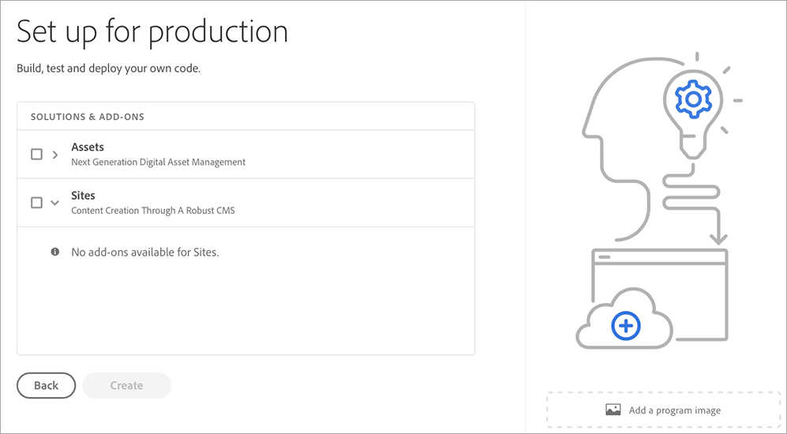

# Creazione di un programma di produzione {#create-production-program}

Un programma *Produzione* è destinato a un utente che ha dimestichezza con AEM e Cloud Manager ed è pronto per iniziare a scrivere, creare e testare il codice allo scopo di distribuirlo in Produzione.

Segui i passaggi seguenti per creare un programma di produzione:

1. Avvia la pagina di destinazione di Cloud Manager e fai clic su **Aggiungi programma** dall’angolo in alto a destra dello schermo.

   

   >[!NOTE]
   >Per informazioni su come accedere a Cloud Manager, consulta [Pagina di destinazione di Cloud Manager](/help/onboarding/what-is-required/navigate-to-cloud-manager.md) per ulteriori dettagli.

1. Seleziona **Imposta per produzione** nella procedura guidata Crea programma per creare un programma di produzione. L&#39;utente può accettare il nome del programma predefinito o modificarlo prima di selezionare **Crea**.

   

1. L&#39;utente selezionerà le soluzioni da includere nel programma nella schermata che verrà presentata dopo la schermata precedente.

   

1. Dopo aver selezionato le soluzioni, fai clic su **Crea**.

1. Una volta visualizzata la scheda del programma nella pagina di destinazione, passa il puntatore del mouse su di essa per selezionare l’icona Cloud Manager per passare alla pagina Cloud Manager **Panoramica**.

   

1. La scheda di chiamata all’azione principale guiderà l’utente a creare un ambiente, creare una pipeline non di produzione e, infine, una pipeline di produzione.
   

   >[!NOTE]
   >Un programma di produzione non dispone della funzione **Configurazione automatica**.
