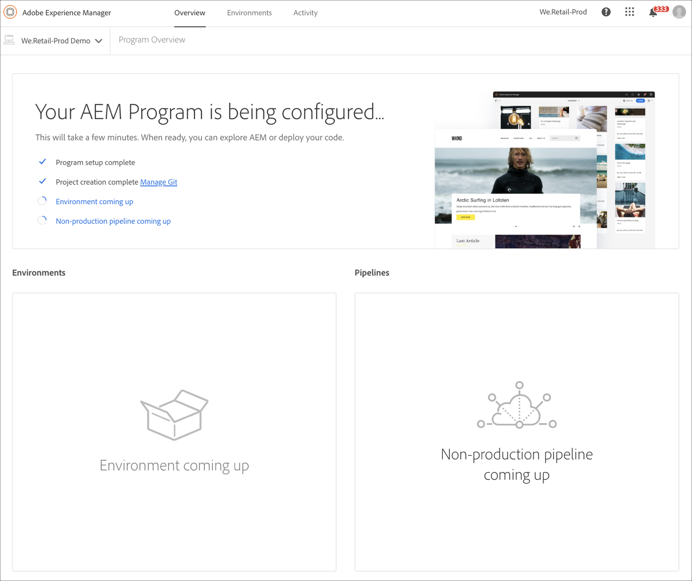

# Creazione di un programma sandbox {#create-sandbox-program}

Per creare un programma sandbox, effettua le seguenti operazioni:

1. Dalla procedura guidata di creazione del programma, seleziona **Imposta una sandbox**. L&#39;utente invia il nome del programma prima di selezionare **Crea**.

   

1. L’utente visualizza la nuova scheda del programma sandbox sulla pagina di destinazione e può passare il cursore sopra di essa per selezionare l’icona Cloud Manager per passare alla pagina di panoramica di Cloud Manager. La scheda informerà l&#39;utente sullo stato di configurazione automatica del programma sandbox appena creato. L&#39;utente vedrà la progressione.

   

1. Al termine della configurazione del programma e della fase di creazione del progetto, l’utente può accedere al collegamento **Manage Git** , come illustrato nella figura seguente:

   

   >[!NOTE]
   >
   >Per ulteriori informazioni sull’accesso e la gestione dell’archivio Git tramite Gestione account Git self-service dall’interfaccia utente di Cloud Manager, consulta [Accesso a Git](/help/implementing/cloud-manager/accessing-git.md).

1. Una volta creato l&#39;ambiente di sviluppo, l&#39;utente può accedere al collegamento **AEM di accesso** , come illustrato nella figura seguente:

   

1. Una volta completata la distribuzione della pipeline non di produzione allo sviluppo, la procedura guidata guida l’utente ad accedere AEM (in fase di sviluppo) o a distribuire il codice nell’ambiente di sviluppo:

   

   >[!NOTE]
   >Puoi anche modificare, cambiare o aggiungere un programma dalla pagina Panoramica di Cloud Manager, come illustrato di seguito:

   
