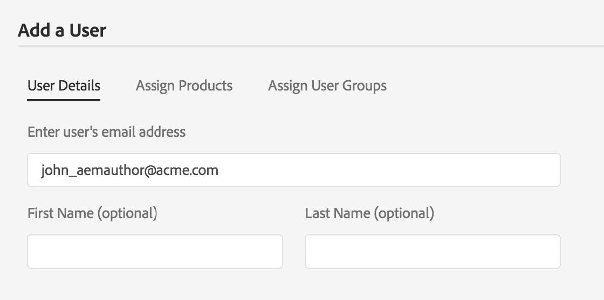

# AEM come Cloud Service: Onboarding e accesso

In questa pagina sono elencate le risorse di supporto autonomo relative al processo di provisioning, ad Experience Manager come Cloud Service.

## Panoramica del processo di provisioning AEM as a Cloud Service

Questa sezione riguarda gli articoli principali su:

* Accesso a AEM come Cloud Service
* Processo di onboarding e provisioning di Adobe Experience Manager as a Cloud Service
* Aiuto e risorse

### Accesso a AEM come Cloud Service

Una volta completato il provisioning automatico:

* Diritti di accesso concessi : l’Adobe creerà un’organizzazione all’interno di Adobe Identity Management System (IMS)
* Per impostazione predefinita, l’amministratore designato dispone delle autorizzazioni di amministratore
* L’amministratore può aggiungere utenti e ruoli per altri membri del team tramite l’Admin Console
* Rivedere le autorizzazioni basate su ruoli per gli utenti al fine di determinare le assegnazioni di autorizzazioni in Cloud Manager

> 

Per ulteriori informazioni, visita [Onboarding to Experience Manager as a Cloud Service su Experience League](https://experienceleague.adobe.com/docs/experience-manager-cloud-service/onboarding/home.html?lang=en)

### Risorse e collegamenti

• [Supporto IMS per AEM as a Cloud Service](https://experienceleague.adobe.com/docs/experience-manager-cloud-service/security/ims-support.html?lang=en)\
・ [Autorizzazioni basate sul ruolo in Cloud Manager](https://experienceleague.adobe.com/docs/experience-manager-cloud-service/onboarding/what-is-required/role-based-permissions.html?lang=en#what-is-required)\
• [Accesso a Experience Manager as a Cloud Service](https://experienceleague.adobe.com/docs/experience-manager-cloud-service/onboarding/getting-access/navigation.html?lang=en#getting-access)

## Processo di onboarding di Adobe Experience Manager as a Cloud Service

### 1. L&#39;ordine di acquisto attiva il provisioning automatico.

### 2. Organizzazioni integrate in Adobe Admin Console:

>   

* Amministratore di sistema:
   * Provisioning di programmi e ambienti AEM.
   * Passare all&#39;Admin Console per le attività amministrative.
   * Richiede un dominio per confermare la proprietà del rispettivo dominio
   * Imposta le directory utente.
   * Configurazione IDP.
* Amministratore AEM:
   * Gestisci gruppi, autorizzazioni e privilegi locali.

### 3. Utenti onboard e gestione dell&#39;accesso in Admin Console:

>   

Tre metodi per integrare gli utenti, a seconda delle dimensioni e delle preferenze:
* Creare manualmente gli utenti in Admin Console
* Carica file .csv
* Sincronizza utenti da Enterprise Active
Directory

### 4. L’amministratore configura l’organizzazione e concede agli utenti e ai gruppi l’accesso agli ambienti

## Aiuto e risorse

* [Primo accesso - Cloud Service](https://experienceleague.adobe.com/docs/experience-manager-cloud-service/onboarding/getting-access/cloud-service-programs/first-time-login.html#getting-access)
* [Configurazione dell’accesso a AEM come Cloud Service](https://experienceleague.adobe.com/docs/experience-manager-learn/cloud-service/accessing/overview.html?lang=en#accessing)
