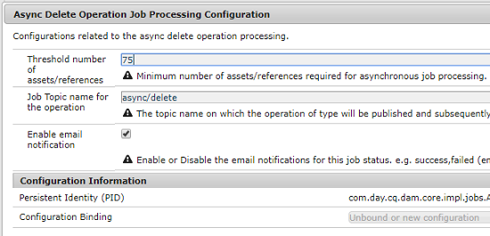

# Operazioni asincrone {#asynchronous-operations}

Per ridurre l&#39;impatto negativo sulle prestazioni, Adobe Experience Manager elabora in modo asincrono alcune operazioni a lungo termine e che richiedono risorse. L’elaborazione asincrona comporta l’accodamento di più processi e la loro esecuzione in modo seriale, in base alla disponibilità di risorse di sistema.

Tali operazioni comprendono:

* Eliminazione di molte risorse
* Spostamento di più risorse o risorse con più riferimenti
* Esportazione/importazione in massa dei metadati di una risorsa
* Recupero delle risorse, che superano il limite di soglia impostato, da una distribuzione Experience Manager  remota
* Spostamento delle pagine
* Rollout Live Copy

Potete visualizzare lo stato dei processi asincroni dal dashboard Stato **[!UICONTROL processo]** Async in Navigazione **** globale > **Strumenti** > **Operazioni** > **Processi**.

>[!NOTE]
>
>Per impostazione predefinita, i processi asincroni vengono eseguiti in parallelo. Se *`n`* è il numero di core CPU, per impostazione predefinita *`n/2`* i processi possono essere eseguiti in parallelo. Per utilizzare le impostazioni personalizzate per la coda di processi, modificate la configurazione **[!UICONTROL della coda predefinita dell&#39;operazione]** Async e la configurazione **Sposta pagina operazione** Async e Rollout dalla console Web.
>
>Per ulteriori informazioni, consultate [Configurazione](https://sling.apache.org/documentation/bundles/apache-sling-eventing-and-job-handling.html#queue-configurations)della coda.

## Monitorare lo stato delle operazioni asincrone {#monitor-the-status-of-asynchronous-operations}

Ogni volta che AEM elabora un’operazione in modo asincrono, riceverete una notifica nella [inbox](/help/sites-cloud/authoring/getting-started/inbox.md) e tramite e-mail (se abilitata).

Per visualizzare nel dettaglio lo stato delle operazioni asincrone, andate alla pagina Stato **[!UICONTROL processo]** asincrono.

1. Nell’interfaccia di Experience Manager  fate clic su **[!UICONTROL Operazioni]** > **[!UICONTROL Processi]**.

1. Nella pagina Stato **[!UICONTROL processo]** asincrono, controllate i dettagli delle operazioni.

   

   Per determinare l&#39;avanzamento di una particolare operazione, vedere il valore nella colonna **[!UICONTROL Stato]** . A seconda dell’avanzamento, viene visualizzato uno dei seguenti stati:

   * **[!UICONTROL Attivo]**: Elaborazione dell&#39;operazione in corso

   * **[!UICONTROL Successo]**: Operazione completata

   * **[!UICONTROL Fail]** or **[!UICONTROL Error]** (Non riuscito o errore): impossibile elaborare l’operazione

   * **[!UICONTROL Pianificato]**: L&#39;elaborazione dell&#39;operazione è pianificata per un momento successivo

1. Per interrompere un&#39;operazione attiva, selezionatela dall&#39;elenco e fate clic su **[!UICONTROL Interrompi]** nella barra degli strumenti.

   

1. Per visualizzare ulteriori dettagli, ad esempio la descrizione e i registri, selezionate l’operazione e fate clic su **[!UICONTROL Apri]** nella barra degli strumenti.

   

   Viene visualizzata la pagina dei dettagli del processo.

   

1. Per eliminare l&#39;operazione dall&#39;elenco, selezionare **[!UICONTROL Elimina]** dalla barra degli strumenti. Per scaricare i dettagli in un file CSV, fate clic su **[!UICONTROL Scarica]**.

   >[!NOTE]
   >
   >Non potete eliminare un processo se il suo stato è **Attivo** o **In coda**.

## Elimina processi completati {#purging-completed-jobs}

AEM esegue un processo di eliminazione ogni giorno alle 01:00 per eliminare i processi asincroni completati con più di un giorno.

È possibile modificare la pianificazione per il processo di eliminazione e la durata per la quale i dettagli dei processi completati vengono conservati prima di essere eliminati. Potete inoltre configurare il numero massimo di processi completati per i quali i dettagli vengono conservati in qualsiasi momento.

1. In Navigazione globale, fate clic su **[!UICONTROL Strumenti]** > **[!UICONTROL Operazioni]** > Console **** Web.
1. Aprite il processo **[!UICONTROL di rimozione dei processi Async di]** Adobe Granite Scheduled.
1. Specificate:
   * Il numero di giorni di soglia dopo i quali i processi completati vengono eliminati.
   * Il numero massimo di processi per i quali i dettagli vengono conservati nella cronologia.
   * L&#39;espressione cron per quando deve essere eseguita la rimozione.
   

1. Salva le modifiche.

## Configurare l&#39;elaborazione asincrona {#configuring-asynchronous-processing}

Potete configurare la soglia del numero di risorse, pagine o riferimenti per l’elaborazione asincrona di una determinata operazione, nonché attivare o disattivare le notifiche e-mail per l’elaborazione dei processi.

### Configurare le operazioni di eliminazione asincrone delle risorse {#configuring-synchronous-delete-operations}

Se il numero di risorse o cartelle da eliminare supera la soglia, l’operazione di eliminazione viene eseguita in modo asincrono.

1. In Navigazione globale, fate clic su **[!UICONTROL Strumenti]** > **[!UICONTROL Operazioni]** > Console **** Web.
1. Dalla console Web, aprite la configurazione della coda predefinita del processo **[!UICONTROL asincrono.]**
1. Nella casella **[!UICONTROL Soglia numero di risorse]** , specificate il numero di soglia di risorse/cartelle per l’elaborazione asincrona delle operazioni di eliminazione.

   

1. Selezionate l’opzione **Abilita notifica** e-mail per ricevere le notifiche e-mail per questo stato del processo. Ad esempio, il successo non è riuscito.
1. Salva le modifiche.

### Configurare le operazioni di spostamento asincrono delle risorse {#configuring-asynchronous-move-operations}

Se il numero di risorse/cartelle o riferimenti da spostare supera il numero di soglia, l&#39;operazione di spostamento viene eseguita in modo asincrono.

1. In Navigazione globale, fate clic su **[!UICONTROL Strumenti]** > **[!UICONTROL Operazioni]** > Console **** Web.
1. Dalla console Web, aprite la configurazione **[!UICONTROL Async Move Operation Job Processing.]**
1. Nella casella **[!UICONTROL Soglia numero di risorse/riferimenti]** , specificate il numero di soglia di risorse/cartelle o riferimenti per l’elaborazione asincrona delle operazioni di spostamento.

   

1. Selezionate l’opzione **Abilita notifica** e-mail per ricevere le notifiche e-mail per questo stato del processo. Ad esempio, il successo non è riuscito.
1. Salva le modifiche.

### Configurare le operazioni di spostamento asincrone delle pagine {#configuring-asynchronous-page-move-operations}

Se il numero di riferimenti alle pagine da spostare supera il numero di soglia, l&#39;operazione di spostamento viene eseguita in modo asincrono.

1. In Navigazione globale, fate clic su **[!UICONTROL Strumenti]** > **[!UICONTROL Operazioni]** > Console **** Web.
1. Dalla console Web, aprite la configurazione **[!UICONTROL Async Page Move Operation Job Processing.]**
1. Nel campo **[!UICONTROL Soglia numero di riferimenti]** , specificate il numero di soglia di riferimenti per l&#39;elaborazione asincrona delle operazioni di spostamento della pagina.

   

1. Selezionate l’opzione **Abilita notifica** e-mail per ricevere le notifiche e-mail per questo stato del processo. Ad esempio, il successo non è riuscito.
1. Salva le modifiche.

### Configurare le operazioni MSM asincrone {#configuring-asynchronous-msm-operations}

1. In Navigazione globale, fate clic su **[!UICONTROL Strumenti]** > **[!UICONTROL Operazioni]** > Console **** Web.
1. Dalla console Web, aprite la configurazione **[!UICONTROL Async Page Move Operation Job Processing.]**
1. Selezionate l’opzione **Abilita notifica** e-mail per ricevere le notifiche e-mail per questo stato del processo. Ad esempio, il successo non è riuscito.

   

1. Salva le modifiche.

>[!MORELIKETHIS]
>
>* [Creazione e organizzazione delle pagine](/help/sites-cloud/authoring/fundamentals/organizing-pages.md)
>* [Importare ed esportare i metadati delle risorse in blocco](/help/assets/metadata-import-export.md).
>* [Utilizza le risorse collegate per condividere le risorse DAM da distribuzioni](/help/assets/use-assets-across-connected-assets-instances.md)remote.

