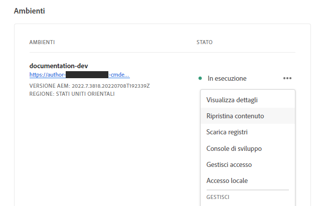

# Ripristino dei contenuti in AEM as a Cloud Service {#content-restore}

>[!CONTEXTUALHELP]
>id="aemcloud_golive_backuprestore"
>title="Backup e ripristino"
>abstract="Scopri come ripristinare il contenuto as a Cloud Service AEM dal backup utilizzando Cloud Manager."

Scopri come ripristinare il contenuto as a Cloud Service AEM dal backup utilizzando Cloud Manager.

## Panoramica {#overview}

Il processo di ripristino self-service di Cloud Manager copia i dati dai backup del sistema Adobe e li ripristina nell’ambiente originale. Viene eseguito un ripristino per restituire i dati persi, danneggiati o accidentalmente eliminati nelle condizioni originali.

Il processo di ripristino influisce solo sul contenuto, lasciando invariati il codice e la versione di AEM. È possibile avviare un&#39;operazione di ripristino dei singoli ambienti in qualsiasi momento.

Cloud Manager fornisce due tipi di backup dai quali è possibile ripristinare il contenuto.

* **Punto nel tempo (PIT):** Questo tipo ripristina i backup continui del sistema dalle ultime 24 ore dall&#39;ora corrente.
* **La settimana scorsa:** Questo tipo ripristina i backup del sistema negli ultimi sette giorni, escludendo le 24 ore precedenti.

In entrambi i casi, la versione del codice personalizzato e la versione AEM rimangono invariate.

Le metriche delle prestazioni per il ripristino dei contenuti in AEM as a ContentService fanno riferimento ai benchmark standardizzati:

* **Obiettivo del tempo di ripristino (RTO):** L&#39;obiettivo del tempo di ripristino varia a seconda delle dimensioni dell&#39;archivio, ma come regola generale, una volta che la sequenza di ripristino inizia, dovrebbe richiedere circa 30 minuti.
* **RPO (Recovery Point Objective):** L&#39;obiettivo del punto di ripristino è 24 ore al massimo

>[!TIP]
>
>È inoltre possibile ripristinare i backup [utilizzando l’API pubblica.](https://developer.adobe.com/experience-cloud/cloud-manager/reference/api/)

## Limitazioni  {#limitations}

L’utilizzo del meccanismo di ripristino self-service è soggetto alle seguenti limitazioni.

* Le operazioni di ripristino sono limitate a sette giorni, il che significa che non è possibile ripristinare uno snapshot più vecchio di sette giorni.
* È consentito un massimo di dieci ripristini riusciti in tutti gli ambienti in un programma per mese di calendario.
* Dopo la creazione dell&#39;ambiente, sono necessarie sei ore prima che venga creato il primo snapshot di backup. Fino alla creazione dello snapshot, non è possibile eseguire alcun ripristino sull&#39;ambiente.
* Un&#39;operazione di ripristino non viene avviata se per l&#39;ambiente è in esecuzione una pipeline di configurazione a livello Web o stack completa.
* Impossibile avviare un ripristino se un altro ripristino è già in esecuzione nello stesso ambiente.
* In rari casi, a causa del limite di 24 ore/sette giorni sui backup, il backup selezionato potrebbe non essere disponibile a causa di un ritardo tra la selezione e l&#39;avvio del ripristino.
* I dati provenienti da ambienti eliminati vengono persi in modo permanente e non possono essere recuperati.

## Ripristino del contenuto {#restoring-content}

Determina innanzitutto l’intervallo di tempo del contenuto da ripristinare. Quindi, per ripristinare il contenuto dell&#39;ambiente da un backup, esegui questi passaggi.

>[!NOTE]
>
>Un utente con **Proprietario business** o **Gestione distribuzione** per avviare un&#39;operazione di ripristino, è necessario effettuare l&#39;accesso al ruolo .

1. Accedi a Cloud Manager all&#39;indirizzo [my.cloudmanager.adobe.com](https://my.cloudmanager.adobe.com/) e selezionare l&#39;organizzazione appropriata.

1. Fare clic sul programma per il quale si desidera avviare il ripristino.

1. Da **Panoramica del programma** nella pagina **Ambienti** fare clic sul pulsante con i puntini di sospensione accanto all&#39;ambiente per il quale si desidera avviare il ripristino e selezionare **Ripristina contenuto**.

   

   * In alternativa, puoi passare direttamente al **Ripristina contenuto** scheda della pagina dei dettagli dell’ambiente di un ambiente specifico.

1. Sulla **Ripristina contenuto** scheda della pagina dei dettagli dell’ambiente, seleziona innanzitutto l’intervallo di tempo del ripristino nella sezione **Tempo di ripristino** a discesa.

   1. Se si seleziona **Ultime 24 ore** i vicini **Time** consente di specificare l’ora esatta entro le ultime 24 ore da ripristinare.

      

   1. Se si seleziona **La settimana scorsa** i vicini **Giorno** consente di selezionare una data negli ultimi sette giorni, escluse le 24 ore precedenti.

      

1. Dopo aver selezionato una data o specificato un’ora, il **Backup disponibili** la sezione seguente mostra un elenco dei backup disponibili che è possibile ripristinare

   

1. Trova il backup che desideri ripristinare utilizzando l&#39;icona delle informazioni per visualizzare le informazioni relative alla versione del codice e AEM rilascio inclusi nel backup e considera le implicazioni di un ripristino quando [scegliere il backup.](#choosing-the-right-backup)

   

   * Tenere presente che la marca temporale visualizzata per le opzioni di ripristino si basa interamente sul fuso orario del computer dell&#39;utente.

1. Fai clic sul pulsante **Ripristina** a destra della riga che rappresenta il backup da ripristinare per avviare il processo di ripristino.

1. Rivedi i dettagli sul **Ripristina contenuto** finestra di dialogo prima di confermare la richiesta facendo clic su **Ripristina**.

   

Il processo di backup viene avviato e puoi visualizzarne lo stato nel **[Ripristina attività](#restore-activity)** tabella. Il tempo necessario per il completamento di un’operazione di ripristino dipende dalle dimensioni e dal profilo del contenuto da ripristinare.

Al termine del ripristino, l’ambiente:

* Esegui lo stesso codice e AEM rilascio al momento dell&#39;avvio dell&#39;operazione di ripristino.
* Avere lo stesso contenuto disponibile al timestamp dello snapshot scelto, con gli indici ricostruiti in modo che corrispondano al codice corrente.

## Scelta del backup corretto {#choosing-backup}

Ripristina solo il AEM del contenuto. Per questo motivo, è necessario considerare attentamente le modifiche del codice apportate tra il punto di ripristino desiderato e l&#39;ora corrente esaminando la cronologia del commit tra l&#39;ID commit corrente e quello ripristinato in.

Ci sono diversi scenari.

* Il codice personalizzato nell’ambiente e il ripristino si trovano nello stesso archivio e nello stesso ramo.
* Il codice personalizzato nell’ambiente e il ripristino si trovano nello stesso archivio ma un ramo diverso con un commit comune.
* Il codice personalizzato sull&#39;ambiente e il ripristino si trovano su archivi diversi.
   * In questo caso, non verrà visualizzato un ID commit.
   * Si consiglia vivamente di clonare entrambi gli archivi e utilizzare uno strumento di confronto delle diramazioni.

Inoltre, ricorda che un ripristino potrebbe causare la mancata sincronizzazione degli ambienti di produzione e di staging. Sei responsabile delle conseguenze del ripristino dei contenuti.

## Ripristina attività {#restore-activity}

La **Ripristina attività** La tabella mostra lo stato delle dieci richieste di ripristino più recenti, comprese le operazioni di ripristino attive.

Facendo clic sull&#39;icona delle informazioni per un backup è possibile scaricare i log per quel backup e analizzare i dettagli del codice, comprese le differenze tra lo snapshot e i dati al momento dell&#39;avvio del ripristino.

## Backup fuori sede {#offsite-backup}

I backup regolari coprono il rischio di eliminazioni accidentali o di errori tecnici in AEM Cloud Services, ma possono verificarsi rischi aggiuntivi in caso di errore in un’area geografica. Oltre alla disponibilità, il rischio maggiore in tali interruzioni di area è la perdita di dati.

AEM as a Cloud Service riduce questo rischio per tutti gli ambienti di produzione AEM copiando continuamente tutti i contenuti AEM in un&#39;area remota e rendendoli disponibili per il ripristino per un periodo di tre mesi. Questa funzionalità viene definita backup offsite.

Il ripristino di AEM Cloud Services per ambienti di staging e produzione dal backup offsite viene eseguito da AEM Service Reliability Engineering in caso di interruzioni dell’area dati.
