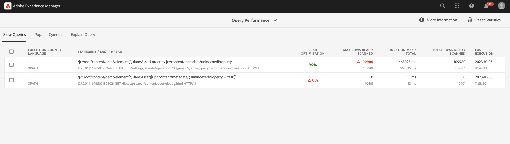
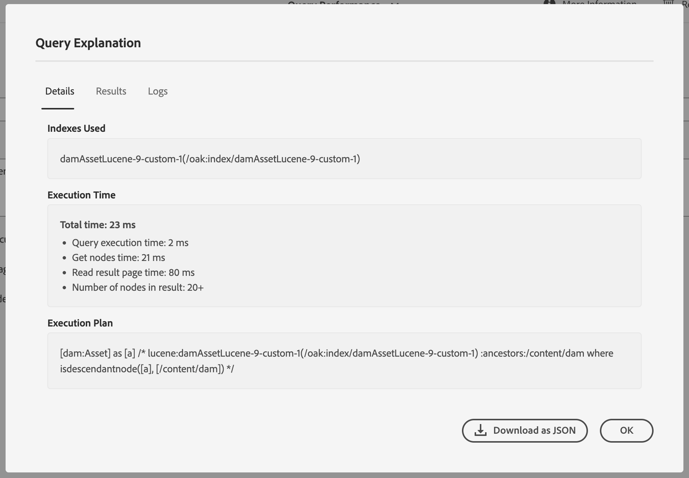

# Best practice per query e indicizzazione {#query-and-indexing-best-practices}

In AEM as a Cloud Service, tutti gli aspetti operativi relativi all’indicizzazione sono automatizzati. Questo consente agli sviluppatori di concentrarsi sulla creazione di query efficienti e sulle relative definizioni di indice.

## Quando utilizzare le query {#when-to-use-queries}

Le query sono un modo per accedere ai contenuti, ma non sono l’unica possibilità. In molte situazioni, si può accedere ai contenuti dell’archivio in modo più efficace con altri mezzi. Dovresti verificare se le query sono il modo migliore e più efficiente per accedere al contenuto nel caso d’uso.

### Struttura dell’archivio e della tassonomia {#repository-and-taxonomy-design}

Durante la progettazione della tassonomia di un archivio, occorre tenere conto di diversi fattori, tra cui: controlli di accesso, localizzazione, ereditarietà di componenti e proprietà di pagina e altro ancora.

Durante la progettazione di una tassonomia che tenga conto di questi problemi, è importante anche considerare la “fruibilità” del design di indicizzazione. In questo contesto, la fruibilità è la capacità di una tassonomia di consentire l’accesso prevedibile ai contenuti in base al relativo percorso. Questo garantisce un sistema più efficiente e più semplice da gestire rispetto a uno che richiede l’esecuzione di più query.

Inoltre, durante la progettazione di una tassonomia, è importante considerare l’importanza dell’ordinamento. Nei casi in cui non è richiesto un ordinamento esplicito e si prevede un numero elevato di nodi di pari livello, è preferibile utilizzare un tipo di nodo non ordinato come `sling:Folder` o `oak:Unstructured`. Nei casi in cui è richiesto l’ordinamento, `nt:unstructured` e `sling:OrderedFolder` potrebbero essere più adatti.

### Query nei componenti {#queries-in-components}

Poiché le query possono essere una delle operazioni più gravose su un sistema AEM, è consigliabile evitarle nei componenti. Spesso, l’esecuzione di più query ogni volta che viene eseguito il rendering di una pagina può compromettere le prestazioni del sistema. Esistono due strategie che possono essere utilizzate per evitare l&#39;esecuzione di query durante il rendering dei componenti: **[navigazione dei nodi](#traversing-nodes)** e **[preacquisizione dei risultati](#prefetching-results)**.

### Navigazione dei nodi {#traversing-nodes}

Se l’archivio è progettato in modo da consentire una conoscenza preventiva della posizione dei dati richiesti, il codice che recupera tali dati dai percorsi necessari può essere distribuito senza dover eseguire query per trovarli.

Un esempio potrebbe essere il rendering di contenuti che rientrano a una determinata categoria. Un approccio consiste nell’organizzare i contenuti con una proprietà di categoria su cui è possibile eseguire una query per compilare un componente che mostra gli elementi in una categoria.

Un approccio migliore consisterebbe nello strutturare i contenuti in una tassonomia per categoria, in modo da poterli recuperare manualmente.

Ad esempio, se il contenuto viene memorizzato in una tassonomia simile a:

```xml
/content/myUnstructuredContent/parentCategory/childCategory/contentPiece
```

Il nodo `/content/myUnstructuredContent/parentCategory/childCategory` può essere semplicemente recuperato, i relativi nodi secondari possono essere analizzati e utilizzati per eseguire il rendering del componente.

Inoltre, quando si tratta di un set di risultati piccolo o omogeneo, può essere più rapido attraversare l’archivio e raccogliere i nodi richiesti, anziché creare una query per restituire lo stesso set di risultati. In generale, occorre evitare le query laddove possibile.

### Preacquisizione dei risultati {#prefetching-results}

A volte il contenuto o i requisiti relativi al componente non consentono l’uso della navigazione dei nodi come metodo per recuperare i dati richiesti. In questi casi, è necessario eseguire le query obbligatorie prima di eseguire il rendering del componente in modo da garantire prestazioni ottimali.

Se i risultati richiesti per il componente possono essere calcolati al momento della creazione e non c’è alcuna aspettativa che il contenuto cambi, la query può essere eseguita dopo aver apportato una modifica.

Se i dati o il contenuto vengono modificati regolarmente, la query può essere eseguita secondo una pianificazione o tramite un listener per gli aggiornamenti dei dati sottostanti. Dopodiché, i risultati possono essere scritti in una posizione condivisa nell’archivio. Tutti i componenti che necessitano di questi dati possono quindi richiamare i valori da questo singolo nodo senza dover eseguire una query in fase di esecuzione.

Una strategia simile può essere utilizzata per mantenere il risultato in una cache in memoria, che viene popolata all’avvio e aggiornata ogni volta che vengono apportate modifiche (utilizzando `ObservationListener` JCR o `ResourceChangeListener` Sling).

## Ottimizzazione delle query {#optimizing-queries}

La documentazione di Oak fornisce una [panoramica di alto livello sulle modalità di esecuzione delle query](https://jackrabbit.apache.org/oak/docs/query/query-engine.html#query-processing). Questo costituisce la base di tutte le attività di ottimizzazione descritte nel presente documento.

AEM as a Cloud Service fornisce lo [strumento Prestazioni query](#query-performance-tool), progettato per supportare l&#39;implementazione di query efficienti.

* Vengono visualizzate le query già eseguite con le relative caratteristiche di prestazione e la pianificazione delle query.
* Consente l’esecuzione di query ad-hoc a vari livelli, a partire dalla semplice visualizzazione della pianificazione delle query, fino all’esecuzione della query completa.

Lo strumento Prestazioni query è raggiungibile tramite [Developer Console in Cloud Manager](https://experienceleague.adobe.com/docs/experience-manager-learn/cloud-service/debugging/debugging-aem-as-a-cloud-service/developer-console.html?lang=it#queries). Lo strumento Prestazioni query di AEM as a Cloud Service fornisce ulteriori informazioni sui dettagli dell’esecuzione della query sulla versione 6.x di AEM.

Questo grafico illustra il flusso generale da utilizzare per ottimizzare le query con lo strumento Prestazioni query.


### Utilizzare un indice {#use-an-index}

Per fornire prestazioni ottimali, ogni query deve utilizzare un indice. Nella maggior parte dei casi, gli indici predefiniti esistenti dovrebbero essere sufficienti per gestire le query.

A volte è necessario aggiungere proprietà personalizzate a un indice esistente, in modo che sia possibile eseguire query sui vincoli aggiuntivi utilizzando l’indice. Per ulteriori dettagli, consulta il documento [Ricerca e indicizzazione dei contenuti](/help/operations/indexing.md#changing-an-index). La sezione [Scheda di riferimento rapido per le query JCR](#jcr-query-cheatsheet) di questo documento descrive come deve essere visualizzata una definizione di proprietà in un indice per supportare un tipo di query specifico.

### Utilizzare i criteri giusti {#use-the-right-criteria}

Il vincolo principale su qualsiasi query deve essere una corrispondenza di proprietà, in quanto questo è il tipo più efficiente. L’aggiunta di più vincoli di proprietà limita ulteriormente il risultato.

Il motore di query considera solo un singolo indice. Ciò significa che un indice esistente può e deve essere personalizzato aggiungendovi proprietà di indice più personalizzate.

La sezione [Scheda di riferimento rapido per le query JCR](#jcr-query-cheatsheet) di questo documento elenca i vincoli disponibili e illustra inoltre come deve essere visualizzata una definizione di indice in modo che venga selezionata. Utilizza lo [Strumento Prestazioni query](#query-performance-tool) per verificare la query e assicurarti che sia utilizzato l’indice corretto e che il motore di query non debba valutare i vincoli al di fuori dell’indice.

### Ordinamento {#ordering}

Se viene richiesto un ordinamento specifico del risultato, esistono due opzioni per ottenerlo da parte del motore di query:

1. L’indice può fornire il risultato completo e nell’ordine giusto.
   * Questa opzione funziona se le proprietà utilizzate per l’ordinamento vengono annotate con `ordered=true` nella definizione dell’indice.
1. Il motore di query esegue il processo di ordinamento.
   * Ciò può verificarsi quando il motore di query esegue il filtro all’esterno dell’indice oppure la proprietà di ordinamento non viene annotata con la proprietà `ordered=true`.
   * Questa opzione richiede che il set di risultati completo venga letto in memoria per l’ordinamento che è un processo molto più lento rispetto alla prima opzione.

### Limitare le dimensioni dei risultati {#restrict-result-size}

La dimensione recuperata del risultato della query è un fattore importante nelle prestazioni della query. Poiché il risultato viene recuperato in modo più lento, esiste una differenza nel recupero dei primi 20 risultati rispetto al recupero di 10.000 risultati, sia nella fase di esecuzione che nell’utilizzo della memoria.

Ciò significa anche che le dimensioni del set di risultati possono essere determinate correttamente solo se tutti i risultati vengono recuperati. Per questo motivo, il set di risultati recuperato deve sempre essere limitato, sia incrementando la query (per i dettagli, consulta la sezione [Scheda di riferimento rapido per le query JCR](#jcr-query-cheatsheet) del presente documento) o limitando la lettura dei risultati.

Tale limite impedisce inoltre al motore di query di raggiungere il **limite trasversale** di 100.000 nodi, che comporta un’interruzione forzata della query.

Consulta la sezione [Query con set di risultati di grandi dimensioni](#queries-with-large-result-sets) se è necessario elaborare completamente un set di risultati potenzialmente di grandi dimensioni.

## Strumento Prestazioni query {#query-performance-tool}

Lo strumento Prestazioni query (disponibile in `/libs/granite/operations/content/diagnosistools/queryPerformance.html` tramite [Developer Console in Cloud Manager](https://experienceleague.adobe.com/docs/experience-manager-learn/cloud-service/debugging/debugging-aem-as-a-cloud-service/developer-console.html?lang=it#queries)) fornisce:

* Un elenco di qualsiasi &quot;Query lente&quot;; attualmente definite come quelle che leggono/analizzano più di 5000 righe.
* Un elenco di &quot;Query popolari&quot;
* Lo strumento &quot;Spiega query&quot; consente di comprendere in che modo una particolare query verrà eseguita da Oak.



Le tabelle &quot;Query lente&quot; e &quot;Query popolari&quot; includono:

* L&#39;istruzione di query stessa.
* Dettagli dell’ultimo thread che ha eseguito la query, consentendo l’identificazione della pagina o della funzione dell’applicazione che esegue la query.
* Punteggio &quot;Ottimizzazione di lettura&quot; per la query.
   * Questo viene calcolato come rapporto tra il numero di righe/nodi analizzati per eseguire la query e il numero di risultati corrispondenti letti.
   * Una query per la quale ogni restrizione (e qualsiasi ordine) può essere gestita all’indice in genere ottiene un punteggio pari o superiore al 90%.
* Dettagli del numero massimo di righe -
   * Lettura: indica che una riga è stata inclusa in un set di risultati.
   * Analizzato: indica che una riga è stata inclusa nei risultati della query di indice sottostante (nel caso di una query indicizzata) o letta dal nodo (nel caso di un attraversamento dell’archivio).

Queste tabelle consentono di identificare le query non completamente indicizzate (vedere [Utilizzare un indice](#use-an-index) o leggere troppi nodi (vedere anche [Repository Traversal](#repository-traversal) e [Index Traversal](#index-traversal)). Tali domande saranno evidenziate - con le aree di preoccupazione appropriate contrassegnate in rosso.

L&#39;opzione `Reset Statistics` è fornita per rimuovere tutte le statistiche esistenti raccolte nelle tabelle. Ciò consente l’esecuzione di una particolare query (tramite l’applicazione stessa o lo strumento Explain Query) e l’analisi delle statistiche di esecuzione.

### Spiega query

Lo strumento Explain Query Tool consente agli sviluppatori di comprendere il piano di esecuzione delle query (vedere [Lettura del piano di esecuzione delle query](#reading-query-execution-plan)), inclusi i dettagli di eventuali indici utilizzati durante l&#39;esecuzione della query. Questo può essere utilizzato per comprendere l’efficacia dell’indicizzazione di una query per prevedere o analizzare retrospettivamente le prestazioni.

#### Spiegazione di una query

Per spiegare una query, eseguire le operazioni seguenti:

* Selezionare la lingua di query appropriata utilizzando l&#39;elenco a discesa `Language`.
* Immettere l&#39;istruzione di query nel campo `Query`.
* Se necessario, seleziona la modalità di esecuzione della query utilizzando le caselle di controllo fornite.
   * Per impostazione predefinita, non è necessario eseguire query JCR per identificare il piano di esecuzione delle query (questo non è il caso delle query QueryBuilder).
   * Sono disponibili tre opzioni per l’esecuzione della query:
      * `Include Execution Time` - eseguire la query ma non tentare di leggere alcun risultato.
      * `Read first page of results` - eseguire la query e leggere la prima &quot;pagina&quot; di 20 risultati (replicando le best practice per l&#39;esecuzione delle query).
      * `Include Node Count` - eseguire la query e leggere l&#39;intero set di risultati (in genere questo non è consigliato - vedi [Index Traversal](#index-traversal)).

#### Finestra a comparsa Spiegazione query {#query-explanation-popup}



Dopo aver selezionato `Explain`, all&#39;utente viene presentato un pop-up che descrive il risultato della query explain (e l&#39;esecuzione, se selezionata).
Questo pop-up include i dettagli di -

* Gli indici utilizzati durante l&#39;esecuzione della query (o nessun indice se la query verrebbe eseguita utilizzando [Repository Traversal](#repository-traversal)).
* Il tempo di esecuzione (se la casella di controllo `Include Execution Time` è stata selezionata) e il conteggio dei risultati letti (se sono state selezionate le caselle di controllo `Read first page of results` o `Include Node Count`).
* Il piano di esecuzione, che consente l&#39;analisi dettagliata del modo in cui viene eseguita la query. Per informazioni su come interpretare il piano, vedere [Lettura del piano di esecuzione della query](#reading-query-execution-plan).
* I percorsi dei primi 20 risultati della query (se la casella di controllo `Read first page of results` è stata selezionata)
* Registri completi della pianificazione della query, che mostrano i costi relativi degli indici considerati per l’esecuzione della query (verrà scelto l’indice con il costo più basso).

#### Lettura del piano di esecuzione della query {#reading-query-execution-plan}

Il piano di esecuzione della query contiene tutto ciò che è necessario per prevedere (o spiegare) le prestazioni di una determinata query. Comprendi l’efficienza dell’esecuzione della query confrontando le restrizioni e l’ordine nella query JCR originale (o Query Builder) con la query eseguita nell’indice sottostante (Lucene, Elastic o Property).

Considera la seguente query:

```
/jcr:root/content/dam//element(*, dam:Asset) [jcr:content/metadata/dc:title = "My Title"] order by jcr:created
```

...che contiene -

* 3 restrizioni
   * Tipo nodo (`dam:Asset`)
   * Percorso (discendenti di `/content/dam`)
   * Proprietà (`jcr:content/metadata/dc:title = "My Title"`)
* Ordinamento per proprietà `jcr:created`

La spiegazione di questa query determina il seguente piano:

```
[dam:Asset] as [a] /* lucene:damAssetLucene-9(/oak:index/damAssetLucene-9) +:ancestors:/content/dam +jcr:content/metadata/dc:title:My Title ordering:[{ propertyName : jcr:created, propertyType : UNDEFINED, order : ASCENDING }] where ([a].[jcr:content/metadata/dc:title] = 'My Title') and (isdescendantnode([a], [/content/dam])) */
```

All’interno di questo piano, la sezione che descrive la query eseguita nell’indice sottostante è -

```
lucene:damAssetLucene-9(/oak:index/damAssetLucene-9) +:ancestors:/content/dam +jcr:content/metadata/dc:title:My Title ordering:[{ propertyName : jcr:created, propertyType : UNDEFINED, order : ASCENDING }]
```

In questa sezione del piano si afferma che:

* Per eseguire questa query viene utilizzato un indice -
   * In questo caso verrà utilizzato l&#39;indice Lucene `/oak:index/damAssetLucene-9`, quindi le informazioni rimanenti sono nella sintassi di query Lucene.
* Tutte e 3 le restrizioni sono gestite dall’indice:
   * La restrizione del tipo di nodo
      * implicito, perché `damAssetLucene-9` indicizza solo nodi di tipo dam:Asset.
   * La restrizione del percorso
      * perché `+:ancestors:/content/dam` viene visualizzato nella query Lucene.
   * La restrizione della proprietà
      * perché `+jcr:content/metadata/dc:title:My Title` viene visualizzato nella query Lucene.
* L’ordinamento viene gestito dall’indice
   * perché `ordering:[{ propertyName : jcr:created, propertyType : UNDEFINED, order : ASCENDING }]` viene visualizzato nella query Lucene.

È probabile che una query di questo tipo funzioni correttamente, poiché i risultati restituiti dalla query di indice non verranno ulteriormente filtrati nel motore di query (oltre al filtro del controllo di accesso). Tuttavia, l&#39;esecuzione di una query di questo tipo può essere lenta se non vengono seguite le best practice. Vedere [Index Traversal](#index-traversal) di seguito.

Considerazione di una query diversa -

```
/jcr:root/content/dam//element(*, dam:Asset) [jcr:content/metadata/myProperty = "My Property Value"] order by jcr:created
```

...che contiene -

* 3 restrizioni
   * Tipo nodo (`dam:Asset`)
   * Percorso (discendenti di `/content/dam`)
   * Proprietà (`jcr:content/metadata/myProperty = "My Property Value"`)
* Ordinamento in base alla proprietà `jcr:created`**

La spiegazione di questa query determina il seguente piano:

```
[dam:Asset] as [a] /* lucene:damAssetLucene-9-custom-1(/oak:index/damAssetLucene-9-custom-1) :ancestors:/content/dam ordering:[{ propertyName : jcr:created, propertyType : UNDEFINED, order : ASCENDING }] where ([a].[jcr:content/metadata/myProperty] = 'My Property Value') and (isdescendantnode([a], [/content/dam])) */
```

All’interno di questo piano, la sezione che descrive la query eseguita nell’indice sottostante è -

```
lucene:damAssetLucene-9(/oak:index/damAssetLucene-9) :ancestors:/content/dam ordering:[{ propertyName : jcr:created, propertyType : UNDEFINED, order : ASCENDING }]
```

In questa sezione del piano si afferma che:

* Solo 2 (delle 3) restrizioni sono gestite dall&#39;indice -
   * La restrizione del tipo di nodo
      * implicito, perché `damAssetLucene-9` indicizza solo nodi di tipo dam:Asset.
   * La restrizione del percorso
      * perché `+:ancestors:/content/dam` viene visualizzato nella query Lucene.
* La restrizione della proprietà `jcr:content/metadata/myProperty = "My Property Value"` non viene eseguita nell&#39;indice, ma verrà applicata come filtro del motore di query sui risultati della query Lucene sottostante.
   * `+jcr:content/metadata/myProperty:My Property Value` non viene visualizzato nella query Lucene, poiché questa proprietà non è indicizzata nell&#39;indice `damAssetLucene-9` utilizzato per la query.

Questo piano di esecuzione della query determinerà la lettura di ogni risorsa sotto `/content/dam` dall&#39;indice e quindi l&#39;ulteriore filtraggio da parte del motore di query (che includerà solo quelle che corrispondono alla restrizione della proprietà non indicizzata nel set di risultati).

Anche se solo una piccola percentuale di risorse corrisponde alla restrizione `jcr:content/metadata/myProperty = "My Property Value"`, la query deve leggere un numero elevato di nodi per (tentare di) riempire la &quot;pagina&quot; di risultati richiesta. Ciò può causare una query con prestazioni insoddisfacenti, che verrà visualizzata con un punteggio basso di `Read Optimization` nello strumento Prestazioni query e può causare messaggi di avvertenza che indicano che un numero elevato di nodi viene attraversato (vedere [Index Traversal](#index-traversal)).

Per ottimizzare le prestazioni di questa seconda query, creare una versione personalizzata dell&#39;indice `damAssetLucene-9` (`damAssetLucene-9-custom-1`) e aggiungere la seguente definizione di proprietà -

```
"myProperty": {
  "jcr:primaryType": "nt:unstructured",
  "propertyIndex": true,
  "name": "jcr:content/metadata/myProperty"
}
```

## Scheda di riferimento rapido per le query JCR {#jcr-query-cheatsheet}

Per supportare la creazione di query JCR e le definizioni degli indici efficienti, la [Scheda di riferimento rapido per le query JCR](https://experienceleague.adobe.com/docs/experience-manager-65/deploying/practices/best-practices-for-queries-and-indexing.html?lang=it#jcrquerycheatsheet) è disponibile per il download e l’utilizzo come riferimento durante lo sviluppo.

Contiene query di esempio per QueryBuilder, XPath e SQL-2 comprendendo scenari multipli che si comportano in modo diverso in termini di prestazioni delle query. Fornisce inoltre consigli su come creare o personalizzare gli indici Oak. Il contenuto di questa Scheda di riferimento rapido si applica ad AEM as a Cloud Service e AEM 6.5.

## Best practice per la definizione degli indici {#index-definition-best-practices}

Di seguito sono riportate alcune best practice da considerare durante la definizione o l’estensione degli indici.

* Per i nodetype con indici esistenti (ad esempio `dam:Asset` o `cq:Page`) si preferisce l&#39;estensione degli indici OOTB all&#39;aggiunta di nuovi indici.
   * Si sconsiglia vivamente di aggiungere nuovi indici, in particolare indici full-text, sul tipo di nodo `dam:Asset` (vedi [questa nota](/help/operations/indexing.md##index-names-index-names)).
* Quando si aggiungono nuovi indici
   * Definisci sempre gli indici di tipo &quot;lucene&quot;.
   * Utilizzare un tag di indice nella definizione dell&#39;indice (e nella query associata) e `selectionPolicy = tag` per assicurarsi che l&#39;indice venga utilizzato solo per le query previste.
   * Assicurarsi che `queryPaths` e `includedPaths` siano entrambi forniti (in genere con gli stessi valori).
   * Utilizzare `excludedPaths` per escludere percorsi che non conterranno risultati utili.
   * Utilizzare le proprietà `analyzed` solo quando necessario, ad esempio quando è necessario utilizzare una restrizione di query full-text solo per tale proprietà.
   * Specificare sempre `async = [ async, nrt ] `, `compatVersion = 2` e `evaluatePathRestrictions = true`.
   * Specificare `nodeScopeIndex = true` solo se è necessario un indice full-text dell&#39;ambito del nodo.

>[!NOTE]
>
>Per ulteriori informazioni, consulta la [documentazione sull&#39;indice Oak Lucene](https://jackrabbit.apache.org/oak/docs/query/lucene.html).

I controlli automatizzati della pipeline di Cloud Manager applicheranno alcune delle best practice descritte in precedenza.

## Query con set di risultati di grandi dimensioni {#queries-with-large-result-sets}

Anche se si consiglia di evitare le query con set di risultati di grandi dimensioni, ci sono casi validi in cui è necessario elaborarli. Spesso le dimensioni del risultato non possono essere note subito, quindi si devono prendere alcune precauzioni per rendere affidabile l’elaborazione.

* La query non deve essere eseguita all’interno di una richiesta. La query deve invece essere eseguita come parte di un processo Sling oppure di un flusso di lavoro AEM. Essi non hanno limitazioni nella fase di esecuzione totale e vengono riavviati nel caso in cui l’istanza si abbassi durante l’elaborazione della query e dei relativi risultati.
* Per superare il limite di query di 100.000 nodi, è consigliabile utilizzare [Paginazione keyset](https://jackrabbit.apache.org/oak/docs/query/query-engine.html#Keyset_Pagination) e suddividere la query in più sottoquery.

## Archivio trasversale {#repository-traversal}

Le query che attraversano l’archivio non utilizzano un indice e si registrano con un messaggio simile al seguente.

```text
28.06.2022 13:32:52.804 *WARN* [127.0.0.1 [1656415972414] POST /libs/settings/granite/operations/diagnosis/granite_queryperformance.explain.json HTTP/1.1] org.apache.jackrabbit.oak.plugins.index.Cursors$TraversingCursor Traversed 98000 nodes with filter Filter(query=select [jcr:path], [jcr:score], * from [nt:base] as a /* xpath: //* */, path=*) called by com.adobe.granite.queries.impl.explain.query.ExplainQueryServlet.getHeuristics; consider creating an index or changing the query
```

Con questo frammento di log puoi determinare:

* La query stessa: `//*`
* Il codice Java che ha eseguito questa query: `com.adobe.granite.queries.impl.explain.query.ExplainQueryServlet::getHeuristics` per aiutare a identificare l’autore della query.

Con queste informazioni, è possibile ottimizzare questa query utilizzando i metodi descritti nella sezione [Ottimizzazione delle query](#optimizing-queries) di questo documento.

### Attraversamento indice {#index-traversal}

Le query che utilizzano un indice, ma leggono comunque un numero elevato di nodi vengono registrate con un messaggio simile al seguente (si noti il termine `Index-Traversed` anziché `Traversed`).

```text
05.10.2023 10:56:10.498 *WARN* [127.0.0.1 [1696502982443] POST /libs/settings/granite/operations/diagnosis/granite_queryperformance.explain.json HTTP/1.1] org.apache.jackrabbit.oak.plugins.index.search.spi.query.FulltextIndex$FulltextPathCursor Index-Traversed 60000 nodes with filter Filter(query=select [jcr:path], [jcr:score], * from [dam:Asset] as a where isdescendantnode(a, '/content/dam') order by [jcr:content/metadata/unindexedProperty] /* xpath: /jcr:root/content/dam//element(*, dam:Asset) order by jcr:content/metadata/unindexedProperty */, path=/content/dam//*)
```

Ciò può verificarsi per diversi motivi:

1. Non tutte le restrizioni nella query possono essere gestite nell’indice.
   * In questo caso, un superset del set di risultati finale viene letto dall’indice e successivamente filtrato nel motore di query.
   * Questa operazione è molto più lenta rispetto all’applicazione di restrizioni nella query dell’indice sottostante.
1. La query è ordinata in base a una proprietà non contrassegnata come &#39;ordinata&#39; nell&#39;indice.
   * In questo caso, tutti i risultati restituiti dall’indice devono essere letti dal motore di query e ordinati in memoria.
   * Questa operazione è molto più lenta dell’applicazione dell’ordinamento nella query dell’indice sottostante.
1. L&#39;esecutore della query sta tentando di iterare un set di risultati di grandi dimensioni.
   * Questa situazione può verificarsi per diversi motivi, elencati di seguito:

| Causa | Mitigazione |
|----------|--------------|
| La Commissione di `p.guessTotal` (o l&#39;utilizzo di un guessTotal molto grande) fa sì che QueryBuilder iterhi numerosi risultati di conteggio dei risultati | Fornisci a `p.guessTotal` un valore appropriato |
| Utilizzo di un limite grande o non limitato in Query Builder (ad esempio `p.limit=-1`) | Usa un valore appropriato per `p.limit` (idealmente 1000 o inferiore) |
| Utilizzo di un predicato di filtro in Query Builder per filtrare un numero elevato di risultati dalla query JCR sottostante | Sostituisci i predicati di filtro con restrizioni che possono essere applicate nella query JCR sottostante |
| Utilizzo di un ordinamento basato su Comparator in QueryBuilder | Sostituisci con ordinamento basato su proprietà nella query JCR sottostante (utilizzando le proprietà indicizzate come ordinate) |
| Filtraggio di un numero elevato di risultati a causa del controllo degli accessi | Applicare alla query una proprietà indicizzata o una restrizione di percorso aggiuntiva per rispecchiare il controllo di accesso |
| Utilizzo di &quot;impaginazione offset&quot; con un offset di grandi dimensioni | Valuta se utilizzare [Paginazione keyset](https://jackrabbit.apache.org/oak/docs/query/query-engine.html#Keyset_Pagination) |
| Iterazione di un numero elevato o non limitato di risultati | Valuta se utilizzare [Paginazione keyset](https://jackrabbit.apache.org/oak/docs/query/query-engine.html#Keyset_Pagination) |
| Indice scelto non corretto | Utilizza i tag nella definizione della query e dell’indice per garantire che venga utilizzato l’indice previsto |
