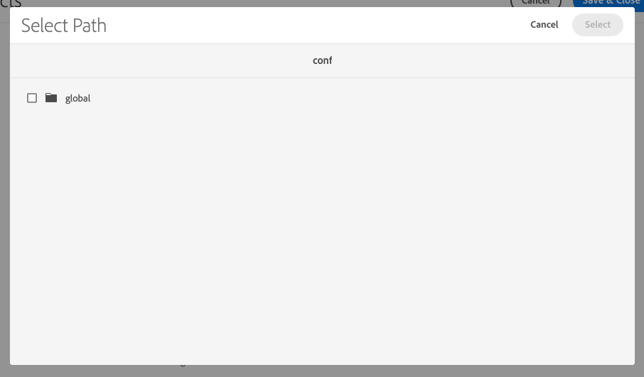

# Rimozione indice Lucene generico {#generic-lucene-index-removal}

Adobe intende rimuovere l’indice &quot;Lucene generico&quot; (`/oak:index/lucene-*`) da Adobe Experience Manager as a Cloud Service. Questo indice è diventato obsoleto a partire dalla versione 6.5 dell’AEM. In questo documento viene descritto l&#39;impatto di questa decisione, insieme a descrizioni dettagliate su come esaminare se un caso AEM è interessato. Contiene inoltre modi per modificare le query in modo che continuino a funzionare senza l’indice Lucene generico.

## Informazioni di base {#background}

In AEM, per query full-text si intendono quelle che utilizzano le seguenti funzioni:

* `jcr:contains()` in JCR XPATH
* `CONTAINS` in JCR-SQL2

Tali query non possono restituire risultati senza utilizzare un indice. A differenza di una query contenente solo restrizioni di percorso o proprietà, una query contenente una restrizione di testo completo per la quale non è possibile trovare alcun indice (e quindi viene eseguito un attraversamento) restituirà sempre zero risultati.

L&#39;indice Lucene generico (`/oak:index/lucene-*`) esiste da AEM 6.0 / Oak 1.0 per fornire una ricerca di testo completa nella maggior parte della gerarchia dell’archivio, anche se alcuni percorsi, come `/jcr:system` e `/var` sono sempre stati esclusi da questo. Tuttavia, questo indice è stato in gran parte sostituito da indici su tipi di nodo più specifici (ad esempio `damAssetLucene-*` per `dam:Asset` tipo di nodo), che supportano sia le ricerche full-text che quelle di proprietà.

In AEM 6.5 l&#39;indice Lucene generico è stato contrassegnato come obsoleto, indicando che sarebbe stato rimosso nelle versioni future. Da allora, è stato registrato un WARN quando l’indice è stato utilizzato come illustrato dal seguente snippet di registro:

```text
org.apache.jackrabbit.oak.plugins.index.lucene.LucenePropertyIndex This index is deprecated: /oak:index/lucene-2; it is used for query Filter(query=select [jcr:path], [jcr:score], * from [nt:base] as a where contains(*, 'search term') and isdescendantnode(a, '/content/mysite') /* xpath: /jcr:root/content/mysite//*[jcr:contains(.,"search term")] */ fullText="search" "term", path=/content/mysite//*). Change the query or the index definitions.
```

Nelle versioni recenti dell’AEM, l’indice Lucene generico è stato utilizzato per supportare un numero molto limitato di funzioni. Questi sono in fase di rielaborazione per utilizzare altri indici o sono stati modificati in altro modo per rimuovere la dipendenza da questo indice.

Ad esempio, le query di ricerca di riferimento, come nell’esempio seguente, ora devono utilizzare l’indice in `/oak:index/pathreference`, che indicizza solo `String` valori di proprietà corrispondenti a un’espressione regolare che cerca i percorsi JCR.

```text
//*[jcr:contains(., '"/content/dam/mysite"')]
```

Per supportare volumi di dati cliente più grandi, Adobe non crea più l’indice Lucene generico nei nuovi ambienti AEM as a Cloud Service. Inoltre, Adobe rimuove l’indice dagli archivi esistenti. [Visualizza la timeline](#timeline) alla fine del presente documento per ulteriori dettagli.

L&#39;Adobe ha già adeguato i costi dell&#39;indice tramite `costPerEntry` e `costPerExecution` per garantire che altri indici come `/oak:index/pathreference` vengono utilizzati di preferenza, ove possibile.

Le applicazioni dei clienti che utilizzano query che dipendono ancora da questo indice devono essere aggiornate immediatamente per utilizzare altri indici esistenti che possono essere personalizzati, se necessario. In alternativa, è possibile aggiungere nuovi indici personalizzati all’applicazione del cliente. Le istruzioni complete per la gestione dell’indice in AEM as a Cloud Service sono reperibili nella sezione [documentazione sull’indicizzazione](/help/operations/indexing.md).

## Siete Colpite? {#are-you-affected}

L’indice Lucene generico viene attualmente utilizzato come fallback se nessun altro indice full-text è in grado di servire una query. Quando si utilizza questo indice obsoleto, a livello di WARN viene registrato un messaggio simile al seguente:

```text
org.apache.jackrabbit.oak.plugins.index.lucene.LucenePropertyIndex This index is deprecated: /oak:index/lucene-2; it is used for query Filter(query=select [jcr:path], [jcr:score], * from [nt:base] as a where contains(*, 'test') /* xpath: //*[jcr:contains(.,"test")] */ fullText="test", path=*). Change the query or the index definitions.
```

In alcune circostanze, Oak potrebbe tentare di utilizzare un altro indice full-text (ad esempio `/oak:index/pathreference`) per supportare la query full-text, ma se la stringa di query non corrisponde all&#39;espressione regolare nella definizione dell&#39;indice, viene registrato un messaggio a livello WARN e la query probabilmente non restituirà risultati.

```text
org.apache.jackrabbit.oak.query.QueryImpl Potentially improper use of index /oak:index/pathReference with queryFilterRegex (["']|^)/ to search for value "test"
```

Una volta rimosso l’indice Lucene generico, viene registrato un messaggio come mostrato di seguito a livello WARN se una query full-text non è in grado di individuare alcuna definizione di indice adatta:

```text
org.apache.jackrabbit.oak.query.QueryImpl Fulltext query without index for filter Filter(query=select [jcr:path], [jcr:score], * from [nt:base] as a where contains(*, 'test') /* xpath: //*[jcr:contains(.,"test")] */ fullText="test", path=*); no results are returned
```

>[!IMPORTANT]
>
>**Azione cliente richiesta**
>
> Se viene registrato uno dei messaggi di avviso sopra indicati, potrebbe essere necessario rielaborare la query per utilizzare un indice full-text diverso o fornire un nuovo indice per supportare la query.
>
>I dettagli dei tipi di dipendenze che è possibile visualizzare e di come gestirle sono forniti nelle sezioni seguenti.

## Dipendenze potenziali dagli indici Lucene generici {#potential-dependencies}

Esistono diverse aree in cui le applicazioni e le installazioni AEM possono dipendere da indici Lucene generici sia sulle istanze di authoring che su quelle di pubblicazione.

### Istanza di pubblicazione {#publish-instance}

#### Query personalizzate dell’applicazione {#custom-application-queries}

L’origine più comune delle query che utilizzano l’indice Lucene generico su un’istanza di pubblicazione sono le query personalizzate dell’applicazione.

Nei casi più semplici, si potrebbe trattare di query prive di un tipo di nodo, il che implica `nt:base` o `nt:base` specificati esplicitamente, ad esempio:

```text
/jcr:root/content/mysite//*[jcr:contains(., 'search term')]
/jcr:root/content/mysite//element(*, nt:base)[jcr:contains(., 'search term')]
```

>[!IMPORTANT]
>
>**Azione cliente richiesta**
>
>Le query di cui sopra devono essere modificate per utilizzare un tipo di nodo appropriato, come descritto nella sezione seguente.

Ad esempio, le query possono essere modificate per restituire i risultati che corrispondono alle pagine o a uno qualsiasi degli aggregati sotto `cq:Page node`. La query potrebbe quindi diventare:

```text
/jcr:root/content/mysite//element(*, cq:Page)[jcr:contains(., 'search term')]
```

In altri casi, una query potrebbe specificare un tipo di nodo ma contenere una restrizione full-text che non può essere gestita da un altro indice full-text, ad esempio:

```text
/jcr:root/content/dam//element(*, dam:Asset)[jcr:contains(jcr:content/metadata/@cq:tags, 'NewsTopics:cateogries/domestic'))]
```

In questo caso, la query presenta `dam:Asset` tipo di nodo, ma contiene una restrizione full-text sul relativo `jcr:content/metadata/@cq:tags` proprietà.

Questa proprietà non è contrassegnata come analizzata in `damAssetLucene` index, l&#39;indice full-text più comunemente utilizzato per le query su `dam:Asset` tipo di nodo. Pertanto, questo indice non può essere utilizzato per questa query.

Di conseguenza, la query torna all’indice full-text generico in cui tutte le proprietà incluse sono contrassegnate come analizzate dalla corrispondenza con caratteri jolly in `/oak:index/lucene-2/indexRules/nt:base/properties/prop`.

>[!IMPORTANT]
>
>**Azione cliente richiesta**
>
>Contrassegno del `jcr:content/metadata/@cq:tags` come analizzato in una versione personalizzata di `damAssetLucene` L&#39;indice determina la gestione di questa query da parte di questo indice e non viene registrato alcun avviso.

### Istanza di authoring {#author-instance}

Oltre alle query nei servlet delle applicazioni del cliente, nei componenti OSGi e negli script di rendering, possono essere presenti diversi utilizzi specifici dell’autore dell’indice Lucene generico.

#### Ricerca di riferimento {#reference-search}

Storicamente, l’indice Lucene generico è stato utilizzato per supportare la ricerca di riferimento o la ricerca di contenuto che contiene riferimenti a un altro percorso di contenuto. Tali query devono essere già state aggiornate per utilizzare il nuovo `/oak:index/pathreference` indice.

#### Ricerca selettore campo percorso {#picker-search}

AEM include un componente per finestre di dialogo personalizzato con tipo di risorsa Sling `granite/ui/components/coral/foundation/form/pathfield`, che fornisce un browser/selettore per selezionare un altro percorso AEM. Il selettore di campi percorso predefinito, che viene utilizzato quando non è `pickerSrc` è definita nella struttura del contenuto, esegue il rendering di una barra di ricerca nella finestra di dialogo popup.

I tipi di nodo in base ai quali eseguire la ricerca possono essere specificati utilizzando `nodeTypes` proprietà.

Attualmente, in caso negativo `nodeTypes` è presente, la query di ricerca sottostante utilizzerà la proprietà `nt:base` tipo di nodo, e quindi è probabile che utilizzi l’indice Lucene generico, in genere registrando messaggi WARN simili ai seguenti.

```text
20.01.2022 18:56:06.412 *WARN* [127.0.0.1 [1642704966377] POST /mnt/overlay/granite/ui/content/coral/foundation/form/pathfield/picker.result.single.html HTTP/1.1] org.apache.jackrabbit.oak.plugins.index.lucene.LucenePropertyIndex This index is deprecated: /oak:index/lucene-2; it is used for query Filter(query=select [jcr:path], [jcr:score], * from [nt:base] as a where contains(*, 'test') and isdescendantnode(a, '/content') /* xpath: /jcr:root/content//element(*, nt:base)[(jcr:contains(., 'test'))] order by @jcr:score descending */ fullText="test", path=/content//*). Change the query or the index definitions.
```

Prima della rimozione dell’indice Lucene generico, il `pathfield` il componente verrà aggiornato in modo che la casella di ricerca sia nascosta per i componenti che utilizzano il selettore predefinito, che non forniscono `nodeTypes` proprietà.

| Selettore campo percorso con ricerca | Selettore campi percorso senza ricerca |
|---|---|
|  |  |

>[!IMPORTANT]
>
>**Azione cliente richiesta**
>
>Se il cliente desidera mantenere la funzionalità di ricerca nel selettore dei campi percorso, `nodeTypes` deve essere fornita una proprietà che elenca i tipi di nodo su cui si desidera eseguire la query. Questi possono essere specificati come elenco separato da virgole dei tipi di nodo in una `String` proprietà. Se non è richiesta alcuna ricerca, non è richiesta alcuna azione da parte del cliente.

>[!NOTE]
>
>L’Editor modello per frammenti di contenuto utilizza campi percorso specializzati con il tipo di risorsa Sling `dam/cfm/models/editor/components/contentreference`.
> * Al momento queste query eseguono query senza tipi di nodo specificati, con conseguente registrazione di un avviso a causa dell’utilizzo dell’indice Lucene generico.
> * Le istanze di questi componenti presto verranno impostate per impostazione predefinita su utilizzando `cq:Page` e `dam:Asset` tipi di nodo senza ulteriori azioni del cliente.
> * Il `nodeTypes` per ignorare questi tipi di nodo predefiniti.

## Timeline per la rimozione di Lucene generica {#timeline}

Adobe adotterà un approccio in due fasi per rimuovere l’indice Lucene generico.

* **Fase 1** (inizio pianificato 31 gennaio 2022): non più creare `/oak:index/lucene-*` sui nuovi ambienti AEM as a Cloud Service.
* **Fase 2** (inizio pianificato 31 marzo 2022): Rimuovi `/oak:index/lucene-*` indicizzazione da ambienti AEM as a Cloud Service esistenti.

Adobe monitorerà i messaggi di registro di cui sopra e tenterà di contattare i clienti che dipendono dall’indice Lucene generico.

Come mitigazione a breve termine, Adobe aggiungerà definizioni di indici personalizzati direttamente ai sistemi dei clienti per evitare problemi funzionali o di prestazioni derivanti dalla rimozione dell’indice Lucene generico, se necessario.

In questi casi, al cliente verrà fornita la definizione aggiornata dell’indice e gli verrà consigliato di includerla nelle versioni future della sua applicazione tramite Cloud Manager.
