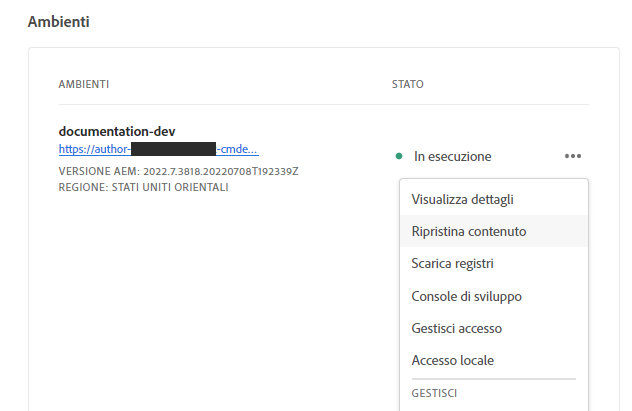
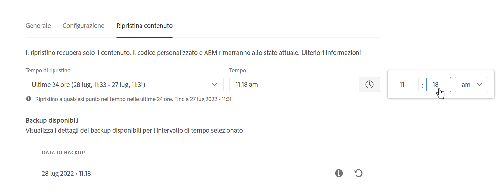
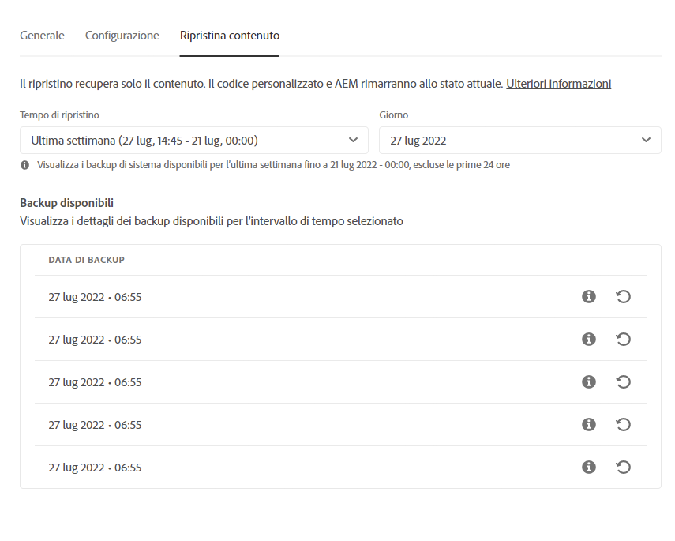

# Ripristino del contenuto in AEM as a Cloud Service {#content-restore}

Scopri come ripristinare il contenuto di AEM as a Cloud Service dal backup utilizzando Cloud Manager.

## Panoramica {#overview}

Il processo di ripristino self-service di Cloud Manager copia i dati dai backup del sistema Adobe e li ripristina nell’ambiente originale. Viene eseguito un ripristino per riportare alle condizioni originali i dati persi, danneggiati o accidentalmente eliminati.

Il processo di ripristino influisce solo sul contenuto, lasciando invariati il codice e la versione di AEM. È possibile avviare un’operazione di ripristino dei singoli ambienti in qualsiasi momento.

Cloud Manager fornisce due tipi di backup dai quali è possibile ripristinare il contenuto.

* **Punto nel tempo (PIT):** Questo tipo ripristina i backup continui del sistema delle ultime 24 ore dall&#39;ora corrente.
* **Ultima settimana:** questo tipo ripristina i backup del sistema degli ultimi sette giorni, escludendo le 24 ore precedenti.

In entrambi i casi, la versione del codice personalizzato e la versione di AEM rimangono invariate.

>[!TIP]
>
>È inoltre possibile ripristinare i backup [utilizzando l&#39;API pubblica](https://developer.adobe.com/experience-cloud/cloud-manager/reference/api/).

>[!WARNING]
>
>* Questa funzione deve essere utilizzata solo in caso di problemi gravi relativi al codice o al contenuto.
>* Il ripristino di un backup comporterà la perdita di dati recenti tra il momento del backup e il presente. Anche lo staging verrà ripristinato alla versione precedente.
>* Prima di avviare un ripristino del contenuto, prendere in considerazione altre opzioni di ripristino selettivo.

## Opzioni di ripristino selettivo dei contenuti {#selective-options}

Prima di eseguire il ripristino completo del contenuto, prendere in considerazione queste opzioni per ripristinare più facilmente il contenuto.

* Se è disponibile un pacchetto per il percorso eliminato, installarlo nuovamente utilizzando [Gestione pacchetti](/help/implementing/developing/tools/package-manager.md).
* Se il percorso eliminato era una pagina in Sites, utilizzare la funzione [Ripristina struttura](/help/sites-cloud/authoring/sites-console/page-versions.md).
* Se il percorso eliminato era una cartella di risorse e i file originali sono disponibili, ricaricali tramite [la console Assets](/help/assets/add-assets.md).
* Se il contenuto eliminato era costituito da risorse, provare a [ripristinare le versioni precedenti delle risorse](/help/assets/manage-digital-assets.md).

Se nessuna delle opzioni di cui sopra funziona e il contenuto del percorso eliminato è significativo, eseguire un ripristino del contenuto come descritto nelle sezioni seguenti.

## Crea Ruolo Utente {#user-role}

Per impostazione predefinita, nessun utente dispone dell’autorizzazione per eseguire ripristini del contenuto in ambienti di sviluppo, produzione o staging. Per delegare questa autorizzazione a utenti o gruppi specifici, segui la procedura generale riportata di seguito.

1. Crea un profilo di prodotto con un nome espressivo che faccia riferimento al ripristino del contenuto.
1. Fornisci l&#39;autorizzazione **Accesso al programma** per il programma richiesto.
1. Fornisci l&#39;autorizzazione **Creazione ripristino ambiente** per l&#39;ambiente richiesto o per tutti gli ambienti del programma, a seconda del caso d&#39;uso.
1. Assegna gli utenti a quel profilo di profilo.

Per informazioni dettagliate sulla gestione delle autorizzazioni, consulta la documentazione sulle [autorizzazioni personalizzate](/help/implementing/cloud-manager/custom-permissions.md).

## Ripristino del contenuto {#restoring-content}

Determina innanzitutto l’intervallo di tempo del contenuto da ripristinare. Quindi, per ripristinare il contenuto dell’ambiente da un backup, esegui questi passaggi.

>[!NOTE]
>
>Un utente deve disporre di [autorizzazioni appropriate](#user-role) per avviare un&#39;operazione di ripristino.

1. Accedi a Cloud Manager all’indirizzo [my.cloudmanager.adobe.com](https://my.cloudmanager.adobe.com/) e seleziona l’organizzazione appropriata.

1. Fare clic sul programma per il quale si desidera avviare il ripristino.

1. Nella pagina **Panoramica programma**, nella scheda **Ambienti**, fai clic sul pulsante con i puntini di sospensione accanto all&#39;ambiente per il quale vuoi avviare il ripristino e seleziona **Ripristina contenuto**.

   

   * In alternativa, puoi passare direttamente alla scheda **Ripristina contenuto** dalla pagina dei dettagli di un ambiente specifico.

1. Nella scheda **Ripristina contenuto** della pagina dei dettagli dell&#39;ambiente, selezionare innanzitutto l&#39;intervallo di tempo del ripristino nell&#39;elenco a discesa **Tempo di ripristino**.

   1. Se selezioni **Ultime 24 ore** il campo vicino **Ora** ti consente di specificare l&#39;ora esatta entro le ultime 24 ore da ripristinare.

      

   1. Se selezioni **Ultima settimana** il campo vicino **Giorno** ti consente di selezionare una data negli ultimi sette giorni, escluse le 24 ore precedenti.

      

1. Dopo aver selezionato una data o specificato un’ora, la sezione successiva **Backup disponibili** mostra un elenco dei backup che è possibile ripristinare.

   

1. Individuare il backup da ripristinare utilizzando l&#39;icona delle informazioni per visualizzare informazioni relative alla versione del codice e di AEM incluse nel backup e considerare le implicazioni di un ripristino quando [si sceglie il backup](#choosing-the-right-backup).

   

   * La marca temporale visualizzata per le opzioni di ripristino si basa sul fuso orario del computer dell&#39;utente.

1. Per avviare il processo di ripristino, fai clic sull&#39;icona **Ripristina** all&#39;estremità destra della riga che rappresenta il backup da ripristinare.

1. Rivedi i dettagli nella finestra di dialogo **Ripristina contenuto**, quindi conferma la richiesta facendo clic su **Ripristina**.

   

Il processo di backup è stato avviato e puoi visualizzarne lo stato nell&#39;elenco **[Attività di ripristino](#restore-activity)**. Il tempo necessario per il completamento di un’operazione di ripristino dipende dalle dimensioni e dal profilo del contenuto da ripristinare.

Dopo il corretto ripristino:

* l’ambiente esegue le stesse versioni del codice e di AEM presenti al momento dell’avvio dell’operazione di ripristino;
* l’ambiente ha lo stesso contenuto che era disponibile al momento dello snapshot scelto, con gli indici generati di nuovo in base al codice corrente.

## Scelta del backup corretto {#choosing-backup}

Il processo di ripristino self-service di Cloud Manager ripristina solo i contenuti in AEM. Per questo motivo, è necessario considerare attentamente le modifiche apportate al codice tra il punto di ripristino desiderato e l’ora corrente, esaminando la cronologia del commit tra l’ID commit corrente e quello in fase di ripristino.

Sono possibili diversi scenari.

* Il codice personalizzato di ambiente e ripristino si trovano nello stesso archivio e nello stesso ramo.
* Il codice personalizzato di ambiente e ripristino si trovano nello stesso archivio, ma in un ramo diverso con un impegno comune.
* Il codice personalizzato di ambiente e ripristino si trovano in archivi diversi.
   * In questo caso, non verrà visualizzato un ID impegno.
   * È fortemente consigliato di clonare entrambi gli archivi e utilizzare uno strumento di differenze per confrontare i rami.

Inoltre, ricorda che un ripristino potrebbe causare la mancata sincronizzazione degli ambienti di produzione e di staging. Le conseguenze del ripristino dei contenuti sono di tua responsabilità.

## Attività di ripristino {#restore-activity}

L&#39;elenco **Attività di ripristino** mostra lo stato delle dieci richieste di ripristino più recenti, incluse le operazioni di ripristino attive.

Facendo clic sull&#39;icona delle informazioni per un backup, è possibile scaricare i registri per tale backup e analizzare i dettagli del codice, comprese le differenze tra l&#39;istantanea e i dati al momento dell&#39;avvio del ripristino.

## Backup fuori sede {#offsite-backup}

I backup regolari coprono il rischio di eliminazioni accidentali o di errori tecnici in AEM Cloud Services, ma possono verificarsi rischi aggiuntivi in caso di errore di un’area. Oltre alla disponibilità, il rischio maggiore nel caso di interruzioni di area è la perdita di dati.

AEM as a Cloud Service riduce questo rischio per tutti gli ambienti di produzione AEM copiando in modo continuo tutti i contenuti AEM in un’area remota, rendendoli disponibili per il ripristino per un periodo di tre mesi. Questa funzionalità viene definita backup fuori sede.

Il ripristino di AEM Cloud Services per gli ambienti di pre-produzione e produzione dal backup fuori sede viene eseguito da AEM Service Reliability Engineering in caso di interruzioni dati di un’area.

## Limitazioni  {#limitations}

L’utilizzo del meccanismo di ripristino self-service è soggetto alle seguenti limitazioni.

* Le operazioni di ripristino sono limitate a sette giorni, pertanto non è possibile ripristinare uno snapshot creato più di sette giorni prima.
* È consentito un massimo di dieci ripristini riusciti in tutti gli ambienti in un programma per ogni mese di calendario.
* Dopo la creazione dell’ambiente, sono necessarie sei ore prima che venga creato il primo snapshot di backup. Fino alla creazione dello snapshot, non è possibile eseguire alcun ripristino sull’ambiente.
* Un’operazione di ripristino non viene avviata se per l’ambiente è in esecuzione una pipeline di configurazione full stack o a livello web.
* Non è possibile avviare un ripristino se un altro ripristino è già in esecuzione nello stesso ambiente.
* In rari casi, a causa del limite di 24 ore/sette giorni sui backup, il backup selezionato potrebbe non essere disponibile a causa di un ritardo tra la selezione e l’avvio del ripristino.
* I dati provenienti da ambienti eliminati vengono persi in modo permanente e non possono essere recuperati.
