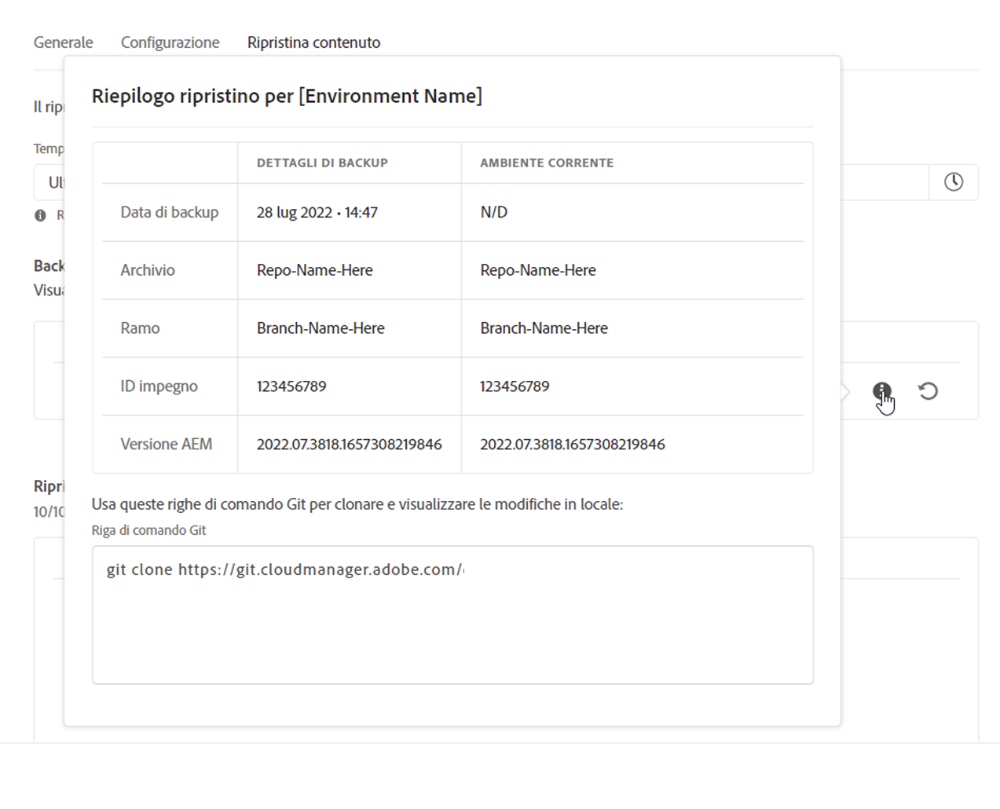
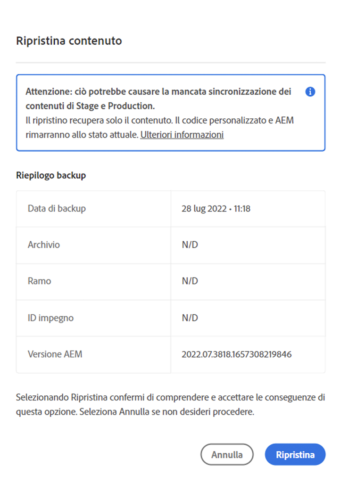
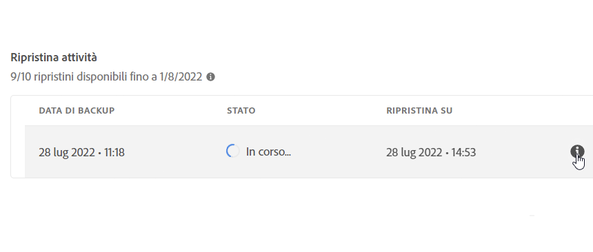

# Ripristina contenuto in AEM come Cloud Service {#content-restore}

Puoi ripristinare i tuoi AEM come contenuto Cloud Service dall backup utilizzando Cloud Manager.

Il processo di ripristino self-service di Cloud Manager copia i dati dai backup del sistema Adobe e li ripristina nell’ambiente originale. Viene eseguito un ripristino per riportare i dati persi, danneggiati o eliminati accidentalmente alle condizioni originali.

Il processo di ripristino influisce solo sul contenuto, lasciando invariati il codice e la versione di AEM. È possibile avviare un’operazione di ripristino dei singoli ambienti in qualsiasi momento.

Se è necessario ripristinare il codice sorgente distribuito in precedenza in modo semplice e veloce, senza la necessità di avviare una nuova esecuzione della pipeline, è possibile utilizzare [Ripristina il Precedente Code distribuito](/help/operations/restore-previous-code-deployed.md).

Cloud Manager fornisce due tipi di backup dai quali è possibile ripristinare il contenuto.

* **Point-In-Time (PIT):** questa opzione ripristina i backup continui acquisiti nelle ultime 24 ore.
* **Ultima settimana:** questo tipo ripristina i backup del sistema degli ultimi sette giorni, escludendo le 24 ore precedenti.

In entrambi i casi, la versione del codice personalizzato e la versione AEM rimangono invariate.

>[!TIP]
>
>È anche possibile ripristinare i [backup utilizzando l&#39;API](https://developer.adobe.com/experience-cloud/cloud-manager/reference/api/) pubblica.

>[!WARNING]
>
>* Questa funzione deve essere utilizzata solo in caso di problemi gravi con il codice o con il contenuto.
>* Il ripristino di una backup elimina tutti i dati aggiunti successivamente alla backup. Anche la fase di staging viene ripristinata alla versione precedente.
>* Prima di avviare un ripristino contenuto, considerare altre opzioni di ripristino selettivo contenuto.

## Opzioni di ripristino selettivo delle contenuto {#selective-options}

Prima di ripristinare un ripristino contenuto completo, considera queste opzioni per ripristinare più facilmente il contenuto.

* Se è disponibile un pacchetto per il percorso eliminato, installarlo di nuovo utilizzando il [Gestione pacchetti](/help/implementing/developing/tools/package-manager.md).
* Se il percorso eliminato era una pagina in Sites, utilizzare la [funzione](/help/sites-cloud/authoring/sites-console/page-versions.md) Ripristina albero.
* Se il percorso eliminato era una cartella risorse e i file originali sono disponibili, ricaricali tramite [la console](/help/assets/add-assets.md) Assets.
* Se le contenuto di eliminazione fossero risorse, è consigliabile [ripristinare le versioni precedenti del risorse](/help/assets/manage-digital-assets.md).

Se nessuna delle opzioni precedenti funziona e il contenuto del percorso eliminato è significativo, eseguire un ripristino contenuto come descritto nelle sezioni seguenti.

## Crea ruolo utente {#user-role}

Per impostazione predefinita, nessun utente è autorizzazione per eseguire ripristini contenuto in ambienti di sviluppo, produzione o staging. Per delegare questo autorizzazione a utenti o gruppi specifici, attenersi alla seguente procedura generale.

1. Crea un profilo di prodotto con un nome espressivo che si riferisce al restauro contenuto.
1. Fornire l&#39;autorizzazione di accesso **al** programma richiesto.
1. Fornire il Crea autorizzazione **di ripristino dell&#39;ambiente nell&#39;ambiente richiesto o in tutti gli ambienti del programma, a seconda del caso d&#39;uso**.
1. Assegna gli utenti a tale profilo.

Per informazioni dettagliate sulla gestione delle autorizzazioni, vedere [Autorizzazioni](/help/implementing/cloud-manager/custom-permissions.md) personalizzate.

## Ripristinare la contenuto di un ambiente {#restoring-content}

>[!NOTE]
>
>Un utente deve disporre [delle autorizzazioni](#user-role) appropriate per avviare un&#39;operazione di ripristino.

**Per ripristinare la contenuto di un ambiente:**

1. Accedi a Cloud Manager all’indirizzo [my.cloudmanager.adobe.com](https://my.cloudmanager.adobe.com/) e seleziona l’organizzazione appropriata.

1. Fare clic sul programma per il quale si desidera avviare un ripristino.

1. Elenca tutti gli ambienti per il programma eseguendo una delle seguenti operazioni:

   * Dal menu a sinistra, sotto **Servizi**, clicca sull&#39;icona**Dati Ambienti**.

     

   * Dal menu a sinistra, sotto **Programma, fai clic su** Panoramica ****, quindi dalla **scheda Ambienti**, fai clic sull&#39;icona **Flusso di lavoro Mostra Tutto.**

     

     >[!NOTE]
     >
     >Nella **scheda Ambienti** sono elencati solo tre ambienti. Fare clic Mostra **Tutti** nella scheda per visualizzare *tutti* gli ambienti del programma.

1. Nella tabella Ambienti, a destra di un ambiente di cui si desidera ripristinare il contenuto, fare clic sull&#39;icona  del menu con i puntini di sospensione, quindi fare clic su **Ripristina contenuto**.

   

1. Nell&#39;elenco a discesa Tempo di ripristino **della** scheda Ripristina contenuto **della pagina** dell&#39;ambiente selezionare l&#39;intervallo di tempo per il ripristino.

   

   * Se si sceglie **Ultime 24 ore**, nel campo Tempo **adiacente** specificare l&#39;ora esatta entro le ultime 24 ore da ripristinare.
   * Se hai scelto **Ultima settimana**, nel campo Giorno **adiacente**, seleziona una data negli ultimi sette giorni, escluse le 24 ore precedenti.

1. Dopo aver selezionato una data o specificato un’ora, la sezione successiva **Backup disponibili** mostra un elenco dei backup che è possibile ripristinare.

1. Fai clic sull&#39;icona  Informazioni accanto a un backup per visualizzarne la versione del codice e la AEM versione, quindi valuta l&#39;impatto del ripristino prima di selezionare un backup (vedi [Scegli il backup](#choosing-backup) giusto).

   

   Il timestamp visualizzato per le opzioni di ripristino si basa sul fuso orario del computer del utente.

1. All&#39;estremità destra della riga che rappresenta il backup che si desidera ripristinare, fare clic su  per avviare il processo di ripristino.

1. Esaminate i dettagli nella finestra di **dialogo Ripristina contenuto** , quindi fate clic su **Ripristina**.

   

Viene avviato il processo backup. È possibile visualizzarne lo stato nell&#39;elenco **[Ripristina attività](#restore-activity)** . Il tempo necessario per il completamento di un’operazione di ripristino dipende dalle dimensioni e dal profilo del contenuto da ripristinare.

Quando il ripristino viene completato correttamente, l&#39;ambiente esegue le operazioni seguenti:

* Esegue lo stesso codice e la stessa versione AEM dell&#39;avvio dell&#39;operazione di ripristino.
* Ha lo stesso contenuto disponibile al timestamp dello snapshot scelto, con gli indici ricostruiti per corrispondere al codice corrente.

## Scegli il backup giusto {#choosing-backup}

Il processo di ripristino self-service di Cloud Manager ripristina solo contenuto su AEM. Per questo motivo, è necessario considerare attentamente le modifiche al codice apportate tra il punto di ripristino desiderato e l&#39;ora corrente. Esamina la cronologia dei commit tra l&#39;ID di commit corrente e quello ripristinato.

Sono possibili diversi scenari.

* Il codice personalizzato dell&#39;ambiente e il ripristino si trovano sullo stesso archivio e sullo stesso ramo.
* Il codice personalizzato dell&#39;ambiente e il ripristino condividono un archivio, utilizzano un ramo separato e hanno origine da un commit comune.
* Il codice personalizzato dell&#39;ambiente e il ripristino si trovano in repository diversi.
   * In questo caso, l&#39;ID di conferma non viene visualizzato.
   * Adobe Systems consiglia vivamente di clonare entrambi i repository e utilizzare un strumento diff per confrontare i rami.

Inoltre, tenere presente che un ripristino potrebbe causare l&#39;interruzione della Sincronizzazione degli ambienti di produzione e di staging. Le conseguenze del ripristino dei contenuti sono di tua responsabilità.

## Attività di ripristino {#restore-activity}

Nell&#39;elenco **Attività di ripristino** viene visualizzato lo stato delle dieci richieste di ripristino più recenti, incluse eventuali operazioni di ripristino attive.

Facendo clic sull&#39;icona  Informazioni relativa a un backup, è possibile scaricare i registri per tale backup e esaminare i dettagli del codice, comprese le differenze tra lo snapshot e i dati al momento dell&#39;avvio del ripristino.

## backup fuori sede {#offsite-backup}

I backup regolari coprono il rischio di eliminazioni accidentali o di errori tecnici in AEM Cloud Services, ma possono verificarsi rischi aggiuntivi in caso di errore di un’area. Oltre alla disponibilità, il rischio maggiore nel caso di interruzioni di area è la perdita di dati.

AEM come Cloud Service riduce questo rischio per tutti gli ambienti di produzione AEM. In altre parole, copia continuamente tutti i contenuto AEM in un area geografica remoto. Questo processo rende il contenuto disponibile per il recupero per tre mesi. Questa funzionalità è nota come backup offsite.

AEM Service Reliability Engineering ripristina gli ambienti di staging e produzione AEM Cloud Service dai backup off-site durante le interruzioni della area geografica dei dati.

## Principi di mappatura dell&#39;area dati {#data-region-mapping-principles}

Adobe Systems segue una serie di linee guida interne per determinare i mapping di dati area geografica per **AEM come Cloud Service**. Queste linee guida sono progettate per supportare l&#39;efficienza operativa, garantire la conformità ai requisiti normativi regionali e fornire una esperienza del cliente coerente in tutti i mercati globali.

### Mappatura delle aree geografiche Trasparenza {#region-mapping-transparency}

Adobe Systems non divulga pubblicamente informazioni dettagliate sulla mappatura da area geografica a area geografica.\
Se i clienti hanno domande specifiche o giustificate riguardanti l&#39;implementazione regionale, la residenza dei dati o le implicazioni di conformità, si consiglia di contattare Adobe Systems direttamente tramite il supporto ufficiale o i canali account.

### Principi fondamentali per la mappatura dell&#39;area dati {#core-principles}

Nel determinare una mappatura area geografica dati adatta, Adobe Systems applica diversi criteri di priorità:

1. **Non uscire dalla area geografica globale**\
   Le implementazioni rimangono all&#39;interno di una delle principali regioni globali: **APAC,****EMEA** e **Americhe**.

2. **Non lasciare il continente**\
   Ove possibile, la replica e il failover dei dati rimangono nello stesso continente.

3. **Non lasciare il paese**\
   Se tecnicamente fattibile, i dati rimangono all&#39;interno degli stessi confini nazionali.

### Gestione delle eccezioni {#handling-exceptions}

Quando i criteri di cui sopra non possono essere soddisfatti a causa di limitazioni tecniche o infrastrutturali, Adobe Systems si applicano ulteriori considerazioni:

* **Orientamenti specifici per l&#39;Europa**\
  Le regioni di backup o secondarie non dovrebbero essere situate in paesi non UE.\
  (Il contrario – usare un paese dell&#39;UE come backup per una primaria non UE – può essere accettabile se non esiste un&#39;opzione migliore per lo stesso paese.)

* **Evitare determinate regioni**\
  Le regioni con criteri restrittivi in materia di dati o con un rischio normativo elevato dovrebbero essere evitate come backup o posizioni di failover.

Se i clienti hanno bisogno di chiarimenti o hanno esigenze basate sulla conformità, Adobe Systems consiglia di contattare l&#39;Adobe Systems account team o l&#39;organizzazione di supporto per ottenere indicazioni su misura per il loro scenario specifico.

## Limitazioni  {#limitations}

L’utilizzo del meccanismo di ripristino self-service è soggetto alle seguenti limitazioni.

* Le operazioni di ripristino sono limitate a sette giorni, pertanto non è possibile ripristinare uno snapshot creato più di sette giorni prima.
* È consentito un massimo di dieci ripristini riusciti in tutti gli ambienti in un programma per ogni mese di calendario.
* Dopo la creazione dell’ambiente, sono necessarie sei ore prima che venga creato il primo snapshot di backup. Fino alla creazione dello snapshot, non è possibile eseguire alcun ripristino sull’ambiente.
* Un&#39;operazione di ripristino non viene avviata se è attualmente in esecuzione per l&#39;ambiente una pipeline di configurazione full stack o di livello Web.
* Un ripristino non può essere avviato se un altro ripristino è già in esecuzione nello stesso ambiente.
* In rari casi, a causa del limite di 24 ore/sette giorni sui backup, il backup selezionato potrebbe non essere disponibile a causa di un ritardo tra la selezione e l’avvio del ripristino.
* I dati provenienti da ambienti eliminati vengono persi in modo permanente e non possono essere recuperati.
