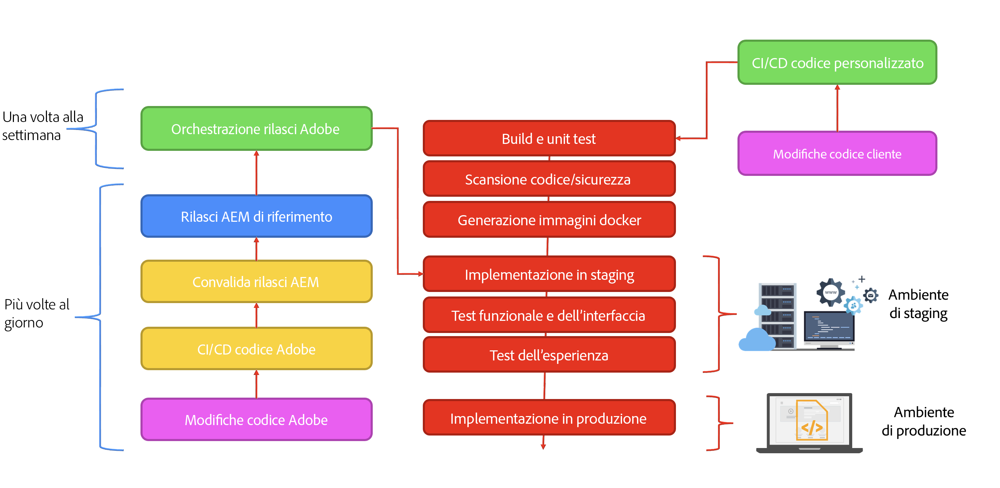

# Introduzione all’architettura di Adobe Experience Manager as a Cloud Service {#an-introduction-to-the-architecture-adobe-experience-manager-as-a-cloud-service}

>[!CONTEXTUALHELP]
>id="intro_aem_cloudservice_architecture"
>title="Introduzione all’architettura di AEM as a Cloud Service"
>abstract="In questa scheda puoi visualizzare la nuova architettura di AEM as a Cloud Service e comprendere le modifiche apportate. Per AEM è stata creata un’architettura dinamica con un numero variabile di immagini, pertanto è importante prendere il tempo necessario per comprenderne l’architettura cloud."
>additional-url="https://video.tv.adobe.com/v/330542/" text="Panoramica dell’architettura"

Adobe Experience Manager (AEM) as a Cloud Service offre una serie di servizi componibili per la creazione e la gestione di esperienze ad alto impatto.

Questa pagina fornisce un’introduzione all’architettura logica, all’architettura dei servizi, all’architettura dei sistemi e all’architettura di sviluppo per AEM as a Cloud Service.

## Architettura logica {#logical-architecture}

AEM as a Cloud Service è costituito da soluzioni di alto livello come AEM Sites, AEM Assets e AEM Forms. Questi servizi sono concessi in licenza singolarmente, ma possono essere utilizzati in collaborazione. Ogni soluzione utilizza una combinazione di servizi componibili forniti da AEM as a Cloud Service, a seconda dei rispettivi casi d’uso.

### Programmi {#programs}

Le domande dell&#39;AEM sono materializzate sotto forma di [Programma](/help/implementing/cloud-manager/getting-access-to-aem-in-cloud/program-types.md) che crei nell’applicazione Cloud Manager, in base alle licenze concesse. Questi programmi consentono di controllare completamente il nome, la configurazione e l&#39;allocazione delle autorizzazioni dell&#39;applicazione AEM associata nel contesto di un determinato progetto.

In qualità di cliente, solitamente sei identificato da Adobe come **tenant**, noto anche come *Organizzazione IMS* (Sistema Identity Management). Un tenant può disporre di tutti i programmi necessari e disporre di una licenza. Ad esempio, è abbastanza comune vedere un programma centrale per AEM Assets, mentre AEM Sites potrebbe essere utilizzato in più programmi corrispondenti a più esperienze online.

>[!NOTE]
>
>I Edge Delivery Services AEM sono esposti come soluzione di livello superiore in Cloud Manager, pur essendo parte delle altre soluzioni principali dal punto di vista delle licenze. Ad esempio, AEM Sites con Edge Delivery Services.

Un programma può essere configurato con qualsiasi combinazione delle soluzioni di alto livello e ogni soluzione può supportare da componenti aggiuntivi uno-a-molti. Ad esempio, Commerce o Screens per AEM Sites, Dynamic Medie o Brand Portal per AEM Assets.

### Ambienti {#environments}

Una volta creato un programma con le soluzioni AEM Sites, AEM Assets o AEM Forms, le istanze AEM associate verranno rappresentate sotto forma di ambienti AEM in questo programma.

Esistono quattro tipi di [ambiente](/help/implementing/cloud-manager/manage-environments.md) disponibile con AEM as a Cloud Service:

* Ambiente di produzione:

   * Un ambiente di produzione ospita le applicazioni per gli utenti business ed esegue le esperienze live.

* Ambiente stage:

   * Un ambiente stage è in genere associato a un ambiente di produzione con una relazione 1:1.
   * L’ambiente stage è progettato principalmente per test automatizzati prima che le modifiche all’applicazione vengano inviate all’ambiente di produzione.
      * Questo è indipendente dalle modifiche avviate da Adobe come parte di un aggiornamento di manutenzione o dalle distribuzioni del codice.
      * Puoi anche eseguire test manuali in caso di distribuzione del codice.
   * Il contenuto dell’ambiente di stage viene in genere mantenuto sincronizzato con il contenuto di produzione utilizzando la funzione di copia self-service dei contenuti.
* Ambiente di sviluppo:
   * Un ambiente di sviluppo consente agli sviluppatori di implementare e testare le applicazioni AEM nelle stesse condizioni di esecuzione degli ambienti di stage e produzione.
   * Le modifiche passano attraverso una pipeline di distribuzione che consente gli stessi gate di qualità del codice e sicurezza delle pipeline di distribuzione di produzione.
* Ambiente di sviluppo rapido (RDE):
   * Un ambiente RDE consente di eseguire rapidamente le iterazioni di sviluppo durante la distribuzione di codice nuovo o esistente nelle istanze RDE, senza passare attraverso una pipeline di distribuzione formale come quella presente negli ambienti di sviluppo regolari.

### Servizi di consegna Edge {#logical-architecture-edge-delivery-services}

Un programma AEM può essere configurato con [Edge Delivery Services](/help/edge/overview.md) anche.

Una volta configurata, l’AEM può fare riferimento agli archivi di codice GitHub utilizzati per creare le esperienze con i Edge Delivery Services. Di conseguenza, diventano disponibili nuove opzioni di configurazione per le esperienze associate. Ad esempio, è possibile configurare la rete CDN gestita dall&#39;Adobe e accedere alle metriche delle licenze o ai rapporti SLA.

## Architettura del servizio {#service-architecture}

L’elenco dei servizi componibili di alto livello in AEM as a Cloud Service può essere rappresentato con due segmenti: Gestione dei contenuti e Distribuzione delle esperienze:

Per la gestione dei contenuti, esistono due set principali di servizi per l’authoring dei contenuti, entrambi rappresentati da *origini di contenuto*:

* Livello di authoring AEM: fornisce un’interfaccia basata su web (con API associate) per la gestione dei contenuti web. Funziona per entrambi gli approcci:
   * Headful: tramite l’editor di pagine e l’editor universale
   * Headless - tramite l’editor di frammenti di contenuto
* Livello di authoring basato su documenti: consente di creare contenuti utilizzando applicazioni standard, ad esempio:
   * Microsoft Word ed Excel tramite SharePoint
   * Documentazione e fogli di Google - tramite Google Drive

Per la distribuzione delle esperienze, quando si utilizza AEM Sites o AEM Forms, sono disponibili anche due set principali di servizi, non reciprocamente esclusivi e che funzionano in una rete CDN (Content Delivery Network) gestita da un Adobe condivisa, come origini diverse:

* Livello di pubblicazione AEM:
   * Esegue una farm di editori e dispatcher AEM standard che consente il rendering dinamico di pagine web e contenuti API (ad esempio, GraphQL) assemblati con contenuti pubblicati.
   * Si basa principalmente sulla logica dell&#39;applicazione lato server.
* Livello di pubblicazione della consegna Edge:
   * Consente il rendering dinamico di pagine web e contenuti API da varie origini di contenuto, come il livello di authoring AEM o il livello di authoring basato su documenti.
   * Si basa sulla logica dell&#39;applicazione lato client ed è progettato per garantire le massime prestazioni.

Ci sono anche i principali servizi adiacenti:

* Livello delle risorse di consegna Edge:
   * Consente la consegna di elementi multimediali approvati e pubblicati da AEM Assets. Ad esempio, immagini e video.
   * Di solito si fa riferimento agli elementi multimediali dalle esperienze in esecuzione sul livello di pubblicazione AEM, sul livello di pubblicazione Edge Delivery o da qualsiasi altra applicazione Adobe Experience Cloud integrata con AEM Assets.
* Livello di anteprima AEM e livello di anteprima Edge Delivery Services:
   * Sono disponibili anche per le esperienze create rispettivamente con il livello di pubblicazione AEM o il livello di pubblicazione Edge Delivery.
   * Consente agli autori di contenuti di visualizzare in anteprima il contenuto nel contesto prima delle operazioni di pubblicazione.

>[!NOTE]
>
>Per impostazione predefinita, i programmi solo Assets non dispongono di un livello di pubblicazione né di un livello di anteprima.

Ci sono altri servizi adiacenti:

* Servizio di replica:
   * Situato tra il livello di gestione dei contenuti e il livello di distribuzione delle esperienze.
   * È responsabile del trattamento del *pubblicare* operazioni emesse dagli autori dei contenuti, quindi fornitura dei contenuti pubblicati ai livelli di pubblicazione (AEM o Consegna Edge).

  >[!NOTE]
  >Il servizio di replica ha subito una riprogettazione completa rispetto alle versioni 6.x di AEM, in quanto il framework di replica delle versioni precedenti di AEM non viene più utilizzato per pubblicare contenuti.
  >
  >L’architettura più recente si basa su un *pubblicare e sottoscrivere* approccio con code di contenuti basate su cloud. Per il livello di pubblicazione dell’AEM, consente a un numero variabile di editori di abbonarsi al contenuto di pubblicazione ed è una parte essenziale per ottenere una scalabilità automatica vera e rapida per gli as a Cloud Service AEM

* Il servizio Content Repository:
   * Viene utilizzato dal livello di authoring AEM.
   * È un’istanza basata su cloud di un archivio di contenuti conforme a JCR, implementato dalla tecnologia Apache Oak.
   * La persistenza dei contenuti si basa principalmente sull’archiviazione cloud basata su BLOB.
* Il servizio CI/CD:
   * Rappresenta il sottoinsieme delle funzionalità di Cloud Manager dedicate alla gestione delle pipeline di distribuzione negli ambienti AEM.
* Il servizio di testing:
   * Rappresenta l’infrastruttura sottostante utilizzata per eseguire:
      * prove funzionali,
      * Test dell’interfaccia utente: ad esempio, basati su script Selenium o Cypress,
      * test di audit dell’esperienza: ad esempio, punteggi di Lighthouse,

     come parte di una pipeline di distribuzione in un ambiente AEM o come parte di una richiesta pull GitHub a un archivio del codice di consegna Edge.
* Il servizio dati:
   * È responsabile dell’esposizione dei dati dei clienti come le metriche delle licenze (ad esempio, Richieste di contenuti, Archiviazione, Utenti) o i rapporti sull’utilizzo (come il numero di caricamenti e download).
   * I dati del cliente possono essere esposti tramite API e all’interno di interfacce utente del prodotto (come Cloud Manager).
* Il servizio Real-User Metric (RUM):
   * È responsabile della raccolta di metriche chiave da un’esperienza del cliente (come visualizzazioni di pagina, elementi vitali web di base, eventi di conversione) e della risposta alle query associate (ad esempio, visualizzazioni di pagina principali per un determinato dominio negli ultimi 7 giorni).
* Il servizio Assets Compute:
   * È responsabile dell’elaborazione di immagini, video e documenti caricati, ad esempio file PDF e Adobe Photoshop. L’elaborazione può utilizzare Adobe Sensei per estrarre metadati di immagini e video (come tag descrittivi o toni di colore primari) e generare rappresentazioni (come dimensioni o formati diversi) con accesso a API come le API di Adobe Photoshop e Adobe Lightroom.
* Il servizio Identity Management (IMS):
   * È la posizione centrale responsabile della gestione e dell’autenticazione di utenti e gruppi di utenti per una determinata applicazione Adobe Experience Cloud (ad esempio, il livello di authoring di Cloud Manager o AEM).
   * È accessibile tramite Adobe Admin Console.

## Architettura del sistema {#system-architecture}

### Livelli di authoring, anteprima e pubblicazione AEM {#aem-author-preview-publish-tiers}

I livelli Author e Publish dell’AEM sono implementati come un set di contenitori Docker, gestiti da un servizio standard di orchestrazione dei contenitori. L’architettura containerizzata risultante è un sistema completamente dinamico con un numero variabile di pod, dipendente dall’attività effettiva (per la gestione dei contenuti) e dal traffico effettivo (per la distribuzione dell’esperienza). Questo consente a AEM as a Cloud Service di adattarsi agli schemi di traffico man mano che cambiano.

Il livello di authoring AEM funziona come un cluster di pod di authoring AEM che condividono un singolo archivio di contenuti. Un minimo di due pod consente la Business Continuity durante l&#39;esecuzione delle attività di manutenzione o durante un processo di distribuzione.

Il livello di pubblicazione AEM funziona come una farm di istanze di pubblicazione AEM, ciascuna con il proprio archivio di contenuti pubblicati. Ogni editore è associato a una singola istanza di Apache dotata del modulo dispatcher dell’AEM per una vista materializzata del contenuto, che funge da origine per la rete CDN gestita dagli Adobi. Un minimo di due pod consente anche la business continuity, ma non è insolito vedere questo numero crescere in periodi di traffico elevato.

Il livello di anteprima AEM è costituito da un singolo nodo AEM. Viene utilizzato per garantire la qualità dei contenuti prima della pubblicazione sul livello di pubblicazione. Sul livello di anteprima possono verificarsi tempi di inattività occasionali, in particolare durante le distribuzioni.

### Servizi di consegna Edge {#system-architecture-edge-delivery-services}

I Edge Delivery Services funzionano su una rete CDN e su un’infrastruttura senza server per assemblare le pagine nel modo più performante. Quando viene richiesta una risorsa, l’infrastruttura senza server è responsabile della conversione del contenuto pubblicato in HTML semantico e funge da origine per la rete CDN.

La conversione in HTML semantico avviene dal contenuto pubblicato distribuito dal livello di authoring dell’AEM o dall’ambiente di authoring basato su documenti.

Il diagramma seguente illustra come modificare il contenuto di Sites in Microsoft Word (authoring basato su documenti) e pubblicarlo in Edge Delivery. Mostra anche il tradizionale metodo di pubblicazione di AEM utilizzando i vari editor.

Poiché i Edge Delivery Services fanno parte di Adobe Experience Manager, Edge Delivery, AEM Sites e AEM Assets possono coesistere sullo stesso dominio. Questo è un caso d’uso comune per i siti Web più grandi. Ad esempio, un cliente potrebbe voler migrare una pagina particolare con traffico elevato in Edge Delivery Services, mentre tutte le altre pagine potrebbero rimanere nel livello di pubblicazione AEM.

## Architettura di sviluppo {#development-architecture}

### Archivi di codice {#code-repositories}

Il codice e la configurazione per i progetti AEM vengono memorizzati in un archivio del codice, da cui vengono rilasciate le pipeline di distribuzione quando vengono apportate modifiche. Esistono diversi tipi di archivi di codice:

* Full stack AEM:
   * Per l’archiviazione del codice Java lato server e le configurazioni OSGI per i livelli di authoring e pubblicazione dell’AEM.
* Front-end AEM:
   * Per memorizzare codice JS, CSS e HTML lato client per i livelli di authoring e pubblicazione dell’AEM.
Per ulteriori dettagli su clientlibs, consulta [Utilizzo delle librerie lato client su AEM as a Cloud Service.](/help/implementing/developing/introduction/clientlibs.md)
* Livello web AEM:
   * Memorizza i file di configurazione del dispatcher per il livello di pubblicazione AEM.
* Configurazione AEM:
   * Consente di memorizzare varie opzioni di configurazione (ad esempio impostazioni CDN o impostazioni delle attività di manutenzione) per il livello di pubblicazione AEM e il livello di pubblicazione Edge Delivery Services.
* Distribuzione edge AEM:
   * Per memorizzare il codice JS, CSS e HTML lato client per i siti generati con i Edge Delivery Services

### Pipeline di distribuzione {#deployment-pipelines}

Sviluppatori e amministratori gestiscono l’applicazione AEM as a Cloud Service tramite Continuous Integration/Continuous Delivery (CI/CD), tramite Cloud Manager. Cloud Manager espone inoltre qualsiasi cosa relativa al monitoraggio, alla manutenzione, alla risoluzione dei problemi (ad esempio, l’accesso ai file di registro) e alle licenze.

Cloud Manager gestisce tutti gli aggiornamenti alle istanze dell’AEM as a Cloud Service. È una scelta obbligatoria, essendo l’unica soluzione per generare, testare e distribuire l’applicazione del cliente ai livelli di authoring, anteprima e pubblicazione. Questi aggiornamenti possono essere attivati per Adobe, quando è pronta una nuova versione dell’AEM Cloud Service, oppure da te stesso, quando è pronta una nuova versione dell’applicazione.

Questa viene implementata da una pipeline di implementazione, associata a ogni ambiente all’interno di un programma. Quando una pipeline di Cloud Manager è in esecuzione, crea una nuova versione dell’applicazione del cliente, sia per il livello di authoring che per quello di pubblicazione. Ciò si ottiene combinando gli ultimi pacchetti cliente con l’immagine di Adobe della linea di base più recente.

La pipeline di distribuzione viene attivata quando i clienti apportano modifiche al codice o quando Adobe distribuisce una nuova versione di manutenzione.

In entrambi i casi viene eseguito lo stesso insieme di test automatizzati. È costituito da test:

* ha contribuito Adobe a garantire l’integrità del prodotto
* test forniti dal cliente
   * Test funzionali: tramite richieste http al livello di authoring o pubblicazione dell’AEM
   * Test dell’interfaccia utente: basati sulla tecnologia Selenium o Cypress

Questi test automatizzati vengono eseguiti nell’ambiente di staging, ed è per questo che è importante mantenere il contenuto dell’ambiente di staging il più vicino possibile al contenuto nell’istanza di produzione.

Una volta superati tutti i test, il nuovo codice viene distribuito nell’ambiente di produzione.

### Aggiornamenti continui {#rolling-updates}

Cloud Manager automatizza completamente il cut-over alla versione più recente dell’applicazione AEM aggiornando tutti i nodi di servizio con un pattern di aggiornamento continuo. Questo significa che c&#39;è **nessun downtime** per il servizio Author o Publish.

## Importanti innovazioni dal AEM 6.x {#major-innovations-since-aem-6x}

L’architettura più recente di AEM as a Cloud Service introduce alcune modifiche e innovazioni fondamentali rispetto alle generazioni precedenti (AEM 6.x e precedenti):

* Tutti i file vengono caricati e serviti direttamente da un archivio dati cloud. Il flusso di bit associato non passa mai attraverso la JVM dei servizi AEM Author e Publish. Di conseguenza, i nodi dei servizi di authoring e pubblicazione dell’AEM possono essere di dimensioni più ridotte e quindi più compatibili con l’aspettativa di una rapida scalabilità automatica. Per gli utenti business, questo consente un’esperienza più rapida durante il caricamento e il download di immagini, video e altre attività.

* Tutte le operazioni che consistono nella pubblicazione di contenuto adesso includono una pipeline che segue uno schema di sottoscrizione. Il contenuto pubblicato viene inviato a varie code della pipeline, alle quali sono abbonati tutti i nodi del servizio di pubblicazione. Di conseguenza, il livello di authoring non deve essere a conoscenza del numero di nodi presenti nel servizio di pubblicazione, il che consente un rapido ridimensionamento automatico del livello di pubblicazione.

* L’architettura separa completamente il contenuto dell’applicazione dal codice e dalla configurazione dell’applicazione. Tutto il codice e la configurazione diventano praticamente immutabili e vengono inseriti nell’immagine linea di base utilizzata per creare i vari nodi dei servizi di authoring e pubblicazione. Di conseguenza, esiste una garanzia assoluta che ogni nodo sia identico e che le modifiche al codice e alla configurazione possano essere apportate solo a livello globale, eseguendo una pipeline di Cloud Manager.

* L’architettura include più microservizi basati su tecnologia senza server, in particolare con il runtime Adobe I/O

## Ulteriori informazioni {#further-information}

Consulta anche:

* Edge Delivery Services:

   * [Panoramica di AEM as a Cloud Service - con Edge Delivery Services](/help/edge/overview.md)
   * [Utilizzo di Edge Delivery Services](/help/edge/using.md)
   * [Esplora l’architettura sottostante e le parti importanti dell’AEM as a Cloud Service ai Edge Delivery Services](https://experienceleague.adobe.com/docs/experience-manager-learn/cloud-service/introduction/architecture.html)
