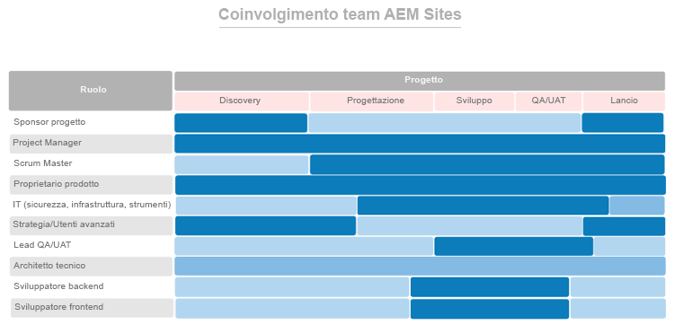

# Per prima cosa, assegna i ruoli giusti alle persone giuste {#get-the-right-people-in-the-right-roles}

>[!CONTEXTUALHELP]
>id="aemcloud_chooseteam"
>title="Scegli il team giusto"
>abstract="Assegna la mansione più adatta a ciascuno per favorire il successo dell’implementazione di Adobe Experience Manager."
>additional-url="https://experienceleague.adobe.com/docs/experience-manager-cloud-service/onboarding/best-practices/aligning-kpis.html?lang=it" text="Allineamento dei KPI"
>additional-url="https://experienceleague.adobe.com/docs/experience-manager-cloud-service/onboarding/best-practices/assessing-kpis.html?lang=it" text="Valutazione dei KPI"

È probabile che nella tua organizzazione diversi dipartimenti possiedano diversi aspetti dell’esperienza digitale. Senza governance, è inevitabile andare incontro a discussioni infinite, lotte interne e confusione.

La governance digitale inizia quando si comprende chi è il responsabile di cosa e chi sta facendo quale lavoro incentrato sulla tecnologia digitale. Può essere necessario fare qualche assunzione strategica per aggiungere le competenze necessarie. Una sfida ancora più grande è promuovere un cambiamento culturale: costruire un ampio supporto per la nuova tecnologia e aiutare le persone ad abituarsi a nuovi modi di fare le cose. Una parte essenziale di questo sforzo è la creazione di una community digitale, che consenta alle persone di imparare le une dalle altre e sostenersi a vicenda.

Per il momento, ci concentreremo su come mettere le persone giuste nei ruoli giusti per agevolare l’implementazione di Adobe Experience Manager. Per ogni prodotto di base, Experience Manager Sites ed Experience Manager Assets, Adobe ha fornito un elenco di ruoli da compilare, insieme alle competenze, ai livelli di esperienza e agli attributi che rendono le persone efficaci nei vari ruoli.

Il tuo compito questa settimana è rivedere entrambi gli elenchi con il team di implementazione e assicurarti di avere persone con qualifiche pertinenti in ogni ruolo.

## **Ruoli chiave per AEM Experience Manager Sites**

Un team vincente ha bisogno di nove persone ai posti giusti, proprio come il tuo team di implementazione. Il tuo successo con Adobe Experience Manager Sites dipende dalla forza dei membri del tuo team e dal fatto che lavorino bene insieme. Assicurati di avere questi nove ruoli assegnati
a persone con le qualifiche suggerite.

| Ruolo | Competenze | Livello di capacità | Qualità |
|--- |--- |--- |--- |
| Project Manager | Certificazione PMP, certificazione Agile, esperienza di gestione dei rischi | Esperto | Equo, coerente, responsabile, organizzato, positivo, avvicinabile, disposto ad accettare il cambiamento |
| Master Scrum | Certificazione ScrumMaster, certificazione Agile, esperienza di facilitazione | Esperto | Coerente, creativo |
| Proprietario del prodotto | Certificazione Agile, profonda comprensione delle esigenze aziendali | Esperto | Equilibrato, sicuro |
| Lead IT per sicurezza, infrastruttura, strumenti | Certificazione CISM, certificazione Adobe Experience Manager Component Developer | Esperto | Orientato ai dettagli |
| Responsabili/utenti | Conoscenza di Adobe Experience Manager Sites | Principiante a esperto | Tenace, curioso, meticoloso, di mentalità aperta, disposto ad abbracciare il cambiamento, collaborativo |
| Lead QA/UAT | Certificazione Agile, comprensione di SDLC | Principiante a intermedio | Orientato ai dettagli, unità di processo, coerente |
| Architetto tecnico | Esperienza nell’infrastruttura IT | Esperto | Orientato ai dettagli, basato su processi, coerente |
| Sviluppatore back-end | Certificazione agile, esperienza nella programmazione e nell’informatica | Principiante a intermedio | Orientato ai dettagli, basato su processi, coerente |
| Sviluppatore front-end | Certificazione agile, comprensione di HTML, CSS e JavaScript | Principiante a intermedio | Orientato ai dettagli, basato su processi, coerente |

Ora che sai quali ruoli sono richiesti, osserva il grafico seguente per vedere quando ogni ruolo entra in gioco nel processo di implementazione.

 

**Rivedi questo elenco con il tuo team di implementazione** e assicurati di avere persone con le qualifiche pertinenti per ogni ruolo. I membri del team che hanno meno familiarità con Adobe Experience Cloud possono utilizzare la risorse di apprendimento [Experience League](https://experienceleague.adobe.com/?lang=it#recommended/solutions/experience-manager) per ottenere la certificazione tramite [Adobe Digital Learning](https://learning.adobe.com/certification.html).

## **Ruoli chiave per AEM Experience Manager Assets**

Da Architetto a ScrumMaster, ogni ruolo di questo team è indispensabile, compresa la libreria DAM.

Potresti avere già la maggior parte delle persone necessarie per eseguire con successo l’implementazione di Adobe Experience Manager Assets. Questo elenco è simile a quello di Adobe Experience Manager Sites, con un’aggiunta importante: ti serve una libreria per garantire che le tue risorse digitali siano organizzate ed etichettate in modi che le rendano facili da trovare.

| Ruolo | Competenze | Livello di capacità | Qualità |
|--- |--- |--- |--- |
| Project Manager | Certificazione PMP, certificazione Agile, esperienza di gestione dei rischi | Esperto | Equo, coerente, responsabile, organizzato, positivo, avvicinabile, disposto ad accettare il cambiamento |
| Master Scrum | Certificazione ScrumMaster, certificazione Agile, esperienza di facilitazione | Esperto | Coerente, creativo |
| Proprietario del prodotto | Certificazione Agile, profonda comprensione delle esigenze aziendali | Esperto | Equilibrato, sicuro |
| Lead IT per sicurezza, infrastruttura, strumenti | Certificazione CISM, certificazione Adobe Experience Manager Component Developer | Esperto | Orientato ai dettagli |
| Responsabili/utenti | Conoscenza di Adobe Experience Manager Sites | Principiante a esperto | Tenace, curioso, meticoloso, di mentalità aperta, disposto ad abbracciare il cambiamento, collaborativo |
| Lead QA/UAT | Certificazione Agile, comprensione di SDLC | Principiante a intermedio | Orientato ai dettagli, unità di processo, coerente |
| Architetto tecnico | Esperienza nell’infrastruttura IT | Esperto | Orientato ai dettagli, basato su processi, coerente |
| Sviluppatore back-end | Certificazione agile, esperienza nella programmazione e nell’informatica | Principiante a intermedio | Orientato ai dettagli, basato su processi, coerente |
| Sviluppatore front-end | Certificazione agile, comprensione di HTML, CSS e JavaScript | Principiante a intermedio | Orientato ai dettagli, basato su processi, coerente |
| Libreria DAM | Formazione e background scientifici della libreria | Esperto | Dettaglio orientato, basato su processi, organizzato |

Ora che sai quali ruoli sono richiesti, osserva il grafico seguente per vedere quando ogni ruolo entra in gioco nel processo di implementazione.

 

.

>[!TIP]
>
> Ulteriori informazioni su Adobe Experience Cloud e sull’utilizzo delle risorse su [Experience League](https://experienceleague.adobe.com/?lang=it#recommended/solutions/experience-manager) per ottenere la certificazione tramite [Adobe Digital Learning](https://learning.adobe.com/certification.html).
