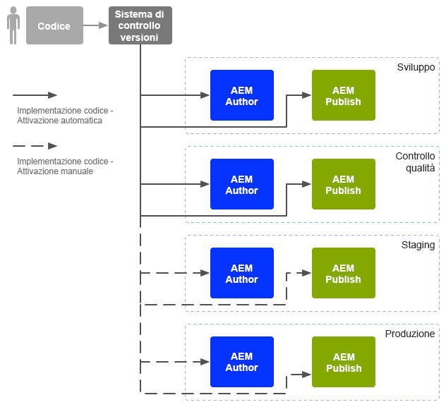
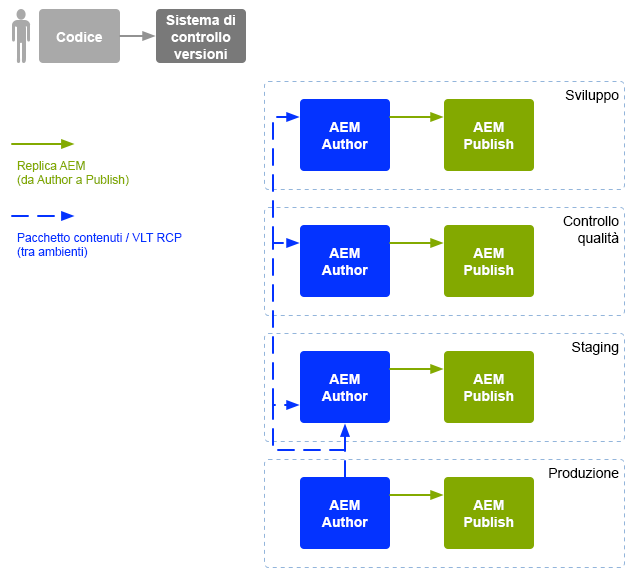

# DevOps aziendale {#enterprise-devops}

La metodologia DevOps tratta i processi, i metodi e la comunicazione necessari per:

* Semplificare l’implementazione del software nei diversi ambienti
* Semplificare la collaborazione tra i team di sviluppo, test e implementazione

DevOps punta a evitare problemi come:

* Errori manuali
* Elementi dimenticati, come file e dettagli di configurazione
* Discrepanze, ad esempio tra l’ambiente locale di uno sviluppatore e altri ambienti

## Ambienti {#environments}

Adobe Experience Manager (AEM) as a Cloud Service in genere è costituito da più ambienti, utilizzati per scopi diversi a diversi livelli:

* [Sviluppo](#development)
* [Controllo qualità](#quality-assurance)
* [Staging](#staging)
* [Produzione](#production-author-and-publish)

>[!NOTE]
>
>L’ambiente di produzione deve avere almeno un ambiente di authoring e uno di pubblicazione.
>
>È consigliabile che anche tutti gli altri ambienti siano composti da un ambiente di authoring e uno di pubblicazione, in modo da riflettere l’ambiente di produzione e consentire di eseguire test in anticipo.

### Sviluppo {#development}

Gli sviluppatori sono responsabili dello sviluppo e della personalizzazione del progetto proposto (che si tratti di un sito web, applicazioni mobili, implementazione DAM, ecc.) con tutte le funzionalità richieste. Si occupano di:

* sviluppare e personalizzare gli elementi necessari, ad esempio modelli, componenti, flussi di lavoro, applicazioni;
* realizzare la progettazione;
* sviluppare i servizi e gli script necessari per implementare le funzionalità richieste.

La configurazione dell’ambiente di [sviluppo](/help/implementing/developing/introduction/development-guidelines.md) può dipendere da vari fattori, anche se in genere è composta dai seguenti elementi:

* Un sistema di sviluppo integrato con controllo della versione per fornire una base di codice integrata. Viene utilizzato per unire e consolidare il codice dei singoli ambienti di sviluppo utilizzati da ogni sviluppatore.
* Un ambiente personale per ogni sviluppatore, di solito residente sulla sua macchina locale. A intervalli appropriati, il codice viene sincronizzato con il sistema di controllo delle versioni.

A seconda delle dimensioni del sistema, nell’ambiente di sviluppo possono essere presenti sia istanze di authoring che di pubblicazione.

### Controllo qualità {#quality-assurance}

Questo ambiente viene utilizzato dal team di controllo qualità per testare in modo approfondito la progettazione e il funzionamento del nuovo sistema. Deve disporre di ambienti di authoring e di pubblicazione con contenuti appropriati e fornire tutti i servizi necessari per abilitare una suite completa di test.

### Staging {#staging}

L’ambiente di staging deve riflettere l’ambiente di produzione, cioè la sua configurazione, il suo codice e il suo contenuto:

* Viene utilizzato per testare gli script impiegati per implementare la distribuzione effettiva.
* Può essere utilizzato per i test finali (progettazione, funzionalità e interfacce) prima dell’implementazione negli ambienti di produzione.
* Anche se non è sempre possibile che l’ambiente di staging sia identico a quello di produzione, dovrebbe essere il più simile possibile per consentire l’esecuzione di test delle prestazioni e del carico.

### Produzione: authoring e pubblicazione {#production-author-and-publish}

L’ambiente di produzione è costituito dagli ambienti necessari per [effettuare l’authoring e pubblicare](/help/sites-cloud/authoring/getting-started/concepts.md) l’implementazione.

Un ambiente di produzione è costituito da almeno un’istanza di authoring e un’istanza di pubblicazione:

* Un’istanza di [authoring](#author) per l’input dei contenuti.
* Un’istanza di [pubblicazione](#publish) per i contenuti resi disponibili ai visitatori o utenti.

A seconda delle dimensioni del progetto, è spesso composto da più istanze di authoring e/o pubblicazione. A un livello inferiore, anche l’archivio può essere raggruppato in più istanze.

#### Autore {#author}

Le istanze di authoring si trovano in genere dietro il firewall interno. Questo è l’ambiente in cui tu e i tuoi colleghi eseguite le attività di authoring, ad esempio:

* amministrare l’intero sistema
* immettere i contenuti
* configurare il layout e la progettazione dei contenuti
* attivare i contenuti nell’ambiente di pubblicazione

I contenuti attivati vengono inseriti in un pacchetto e posizionati nella coda di replica dell’ambiente di authoring. Il processo di replica trasferisce quindi tali contenuti all’ambiente di pubblicazione.

Per effettuare la replica inversa nell’ambiente di authoring dei dati generati in un ambiente di pubblicazione, un listener di replica nell’ambiente di authoring esegue il polling dell’ambiente di pubblicazione e i contenuti dalla casella in uscita della replica inversa dell’ambiente di pubblicazione.

#### Pubblicazione {#publish}

Un ambiente di pubblicazione si trova in genere nella zona demilitarizzata (DMZ). Questo è l’ambiente in cui i visitatori accedono al contenuto (ad esempio tramite un sito web o un’app mobile) e interagiscono con esso, a prescindere che sia pubblico o nella rete Intranet. Un ambiente di pubblicazione:

* ospita i contenuti replicati dall’ambiente di authoring;
* rende tali contenuti disponibili ai visitatori;
* memorizza i dati utente generati dai visitatori, ad esempio commenti o moduli inviati;
* può essere configurato per aggiungere tali dati utente a una casella in uscita per la replica inversa nell’ambiente di authoring.

L’ambiente di pubblicazione genera i contenuti in tempo reale e in modo dinamico e può essere personalizzato per ogni singolo utente.

## Spostamento del codice {#code-movement}

Il codice deve sempre essere propagato dal basso verso l’alto:

* Il codice viene inizialmente sviluppato negli ambienti di sviluppo locali e poi integrati.
* Vengono quindi eseguiti approfonditi test nell’ambiente o negli ambienti di controllo qualità.
* Quindi viene testato nuovamente negli ambienti di gestione temporanea.
* Solo a questo punto il codice può essere distribuito agli ambienti di produzione.

Il codice (ad esempio funzionalità di applicazioni web personalizzate e modelli di progettazione) viene in genere trasferito esportando e importando pacchetti tra i diversi archivi dei contenuti. Se utile, questa replica può essere configurata come processo automatico.

I progetti di AEM as a Cloud Service spesso attivano la distribuzione del codice:

* Automaticamente: per il trasferimento negli ambienti di sviluppo e di controllo qualità.
* Manualmente: le distribuzioni negli ambienti di staging e produzione sono effettuate in modo più controllato, spesso manuale, anche se l’automazione è possibile se necessaria.

## Spostamento dei contenuti {#content-movement}

I contenuti destinati alla produzione devono **sempre** essere creati nell’istanza di authoring di produzione.

I contenuti non devono seguire il codice che si sposta dagli ambienti inferiori a quelli superiori. È bene evitare che i contenuti vengano creati su computer locali o in ambienti inferiori e poi spostati nell’ambiente di produzione. Tale procedura non è infatti una buona prassi, in quanto suscettibile a errori e incoerenze.

I contenuti di produzione devono essere spostati dall’ambiente di produzione all’ambiente di staging per garantire che quest’ultimo fornisca un ambiente di test efficiente e accurato.

>[!NOTE]
>
>Ciò non significa che il contenuto di staging debba essere continuamente sincronizzato con la produzione. Sono sufficienti gli aggiornamenti regolari, da eseguire in particolare prima di testare una nuova iterazione del codice. I contenuti negli ambienti di controllo qualità e di sviluppo non devono essere aggiornati con la stessa frequenza; è sufficiente che siano una buona rappresentazione dei contenuti di produzione.

I contenuti possono essere trasferiti:

* tra i diversi ambienti esportando e importando pacchetti;
* tra istanze diverse tramite la replica diretta (replica di AEM as a Cloud Service) dei contenuti (tramite una connessione HTTP o HTTPS).

