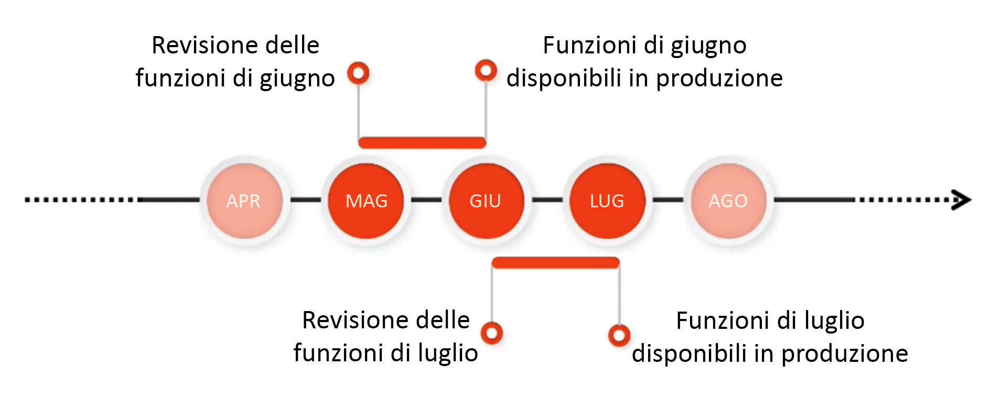

# Informazioni sulla versione {#release-information}

| Prodotto | Adobe Experience Manager as a Cloud Service |
|---|---|
| Versione | 2025.9.0 |
| Tipo | Aggiornamenti continui |
| Data di disponibilità | Aggiornamento continuo |

## Pianificazione del rilascio di AEM {#release-schedule}

Con il modello di versione continua in [!DNL Adobe Experience Manager] as a Cloud Service, l’applicazione viene aggiornata automaticamente su base continuativa. Esistono due tipi di aggiornamenti: versione funzionale e versione di manutenzione.

* **Le versioni di funzioni** vengono rilasciate con frequenza mensile prevedibile e sono incentrate su nuove funzionalità e innovazioni dei prodotti.
   * Consulta le [note sulla versione corrente](/help/release-notes/release-notes-cloud/release-notes-current.md) per informazioni dettagliate sulla versione funzionale più recente.
* **Le versioni di manutenzione** vengono eseguite frequentemente e si concentrano su aggiornamenti di sicurezza, correzioni di bug e miglioramenti delle prestazioni.
   * Questo assicura che [!DNL Adobe Experience Manager] as a Cloud Service sia sempre aggiornato con eventuali correzioni critiche.
   * Consulta le [note sulla versione di manutenzione corrente](/help/release-notes/maintenance/latest.md) per i dettagli sulla versione di manutenzione più recente.

Questo modello garantisce versioni continue senza interruzioni del servizio. Le prossime funzioni in generale verranno annunciate in una versione e quindi rese pubbliche in una versione successiva. In questo modo puoi valutare le funzionalità future e pianificarne una possibile implementazione per i tuoi progetti. Consente di pianificare in anticipo la prossima versione in cui la funzione sarà disponibile.

Ad esempio, se è maggio, puoi valutare le prossime funzioni che diventeranno generalmente disponibili in una versione futura, come quella di giugno.

Questa cadenza offre una finestra temporale per valutare l’impatto di eventuali nuove funzioni sui tuoi progetti e personalizzazioni e di pianificare l’implementazione di tali funzioni, test e formazione per gli utenti.

Per dettagli sulle prossime versioni, consulta la [roadmap delle versioni di Experience Manager](https://experienceleague.adobe.com/docs/experience-manager-release-information/aem-release-updates/update-releases-roadmap.html?lang=it#aem-as-cloud-service).

## Come prepararsi per una versione {#how-to-prepare}

Per prepararsi per una versione:

1. [Contrassegnare i calendari](#mark-calendars)
1. [Consultare le note sulla versione](#release-notes)
1. [Accedere alle nuove funzioni e provarle](#upcoming-features)
1. [Formare gli utenti](#train-users)

## Contrassegnare i calendari {#mark-calendars}

Le versioni funzionali sono pianificate con largo anticipo e le rispettive date di attivazione sono pubblicate su [Adobe Experience League.](https://experienceleague.adobe.com/docs/experience-manager-release-information/aem-release-updates/update-releases-roadmap.html?lang=it#aem-as-cloud-service)

Prendi nota delle date di rilascio per pianificare il tempo necessario per rivedere e testare le prossime funzioni.

## Consultare le note sulla versione {#release-notes}

Una volta che le date di rilascio sono contrassegnate nel calendario, assicurati di controllare [Adobe Experience League](/help/release-notes/release-notes-cloud/release-notes-current.md) il giorno del rilascio per le ultime note sulla versione.

Ciascuna versione è accompagnata da note di rilascio che ne documentano non solo le novità, ma anche le funzioni future disponibili per la valutazione. Acquisisci in tempo utile e pianifica di sfruttare le funzioni più recenti di AEMaaCS!

È inoltre possibile [verificare i problemi noti](/help/release-notes/maintenance/latest.md) che vengono pubblicati insieme a ogni versione, in modo da essere consapevoli di eventuali problemi tecnici che possono rappresentare una sfida per la valutazione o l’eventuale adozione di nuove funzioni.

## Accedere alle nuove funzioni e provarle {#upcoming-features}

Le funzioni future vengono rese generalmente disponibili in uno dei due modi seguenti:

* Come parte di un programma Alpha, Beta o Disponibilità limitata
* Come parte del canale di pre-release

La modalità di disponibilità di una delle prossime funzioni sarà descritta nelle [note sulla versione.](#release-notes)

* Se fa parte di un programma Alpha, Beta o in disponibilità limitata, in genere è necessario contattare Adobe per abilitarlo come descritto nelle note sulla versione.
* Se fa parte del canale prerelease, dovrai [abilitare il canale prerelease in un ambiente di sviluppo o sandbox.](/help/release-notes/prerelease.md)

## Formazione degli utenti {#train-users}

Dopo aver testato le nuove funzioni nel canale prerelease e aver deciso di utilizzarle nei progetti, è necessario formare gli utenti.

Adobe Experience League offre molte risorse per imparare AEMaaCS.

* [Documentazione di AEMaaCS](https://experienceleague.adobe.com/docs/experience-manager-cloud-service.html?lang=it)
* [Esercitazioni](https://experienceleague.adobe.com/docs/experience-manager-learn/aem-tutorials/overview.html?lang=it)
* [Video introduttivo sulle versioni mensili](/help/release-notes/release-notes-cloud/release-notes-current.md#release-video) nelle note sulla versione

## Informazioni principali sulle versioni {#key-articles}

* [Note sulla versione funzionale](/help/release-notes/release-notes-cloud/release-notes-current.md)
* [Note sulla versione di manutenzione](/help/release-notes/maintenance/latest.md)
* [Novità](what-is-new.md)
* [Modifiche di rilievo](aem-cloud-changes.md)
* [Funzioni obsolete e rimosse](deprecated-removed-features.md)
