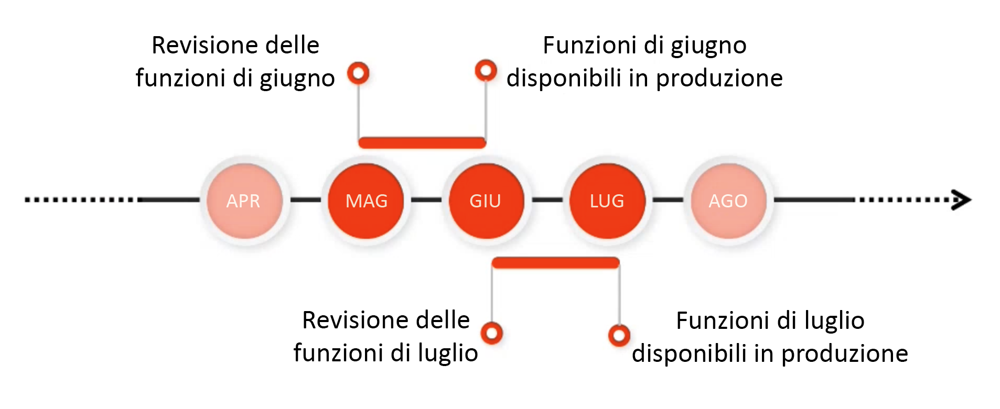

# Canale prerelease Adobe Experience Manager as a Cloud Service {#prerelease-channel}

Scopri come utilizzare il canale prerelease per ottenere un’anteprima delle prossime funzionalità su AEM as a Cloud Service.

## Introduzione {#introduction}

Adobe Experience Manager as a Cloud Service offre nuove funzionalità su cadenza mensile, secondo la [road map di versioni di Experience Manager.](https://experienceleague.adobe.com/docs/experience-manager-release-information/aem-release-updates/update-releases-roadmap.html?lang=it#aem-as-cloud-service)

Per acquisire familiarità con le funzioni programmate per andare in diretta il mese successivo, i clienti possono abbonarsi al canale prerelease, che è accessibile configurando gli ambienti di sviluppo o qualsiasi ambiente sandbox. Puoi visualizzare in anteprima le modifiche accessibili tramite l’interfaccia utente AEM e generare codice rispetto a qualsiasi nuova API prerelease.

L’elenco delle funzioni prerelease per un dato mese è pubblicato all’interno di [note sulla versione mensile.](/help/release-notes/release-notes-cloud/release-notes-current.md)

## Versioni di AEM as a Cloud Service {#releases}

AEM as a Cloud Service dispone di due tipi di versioni.

* Le **versioni mensili** aggiungono funzionalità ad AEM as a Cloud Service
* Gli **Aggiornamenti fondamentali** aggiungono aggiornamenti di sicurezza, miglioramenti delle prestazioni e correzioni di bug e vengono applicati su base giornaliera.

Questo modello garantisce versioni continue senza interruzioni del servizio.

Il canale prerelease consente di visualizzare in anteprima le funzioni pianificate per la prossima versione mensile, al fine di valutare le funzionalità in arrivo e pianificare la sua eventuale implementazione per i progetti. Consente di pianificare in anticipo la prossima versione mensile.

Ad esempio, se è maggio e sei abbonato al canale prerelease, puoi valutare le funzioni della prossima versione di giugno.



Prerelease offre una finestra di un mese sulle prossime funzionalità di AEMaaCS, che ti offre il tempo di valutare l’impatto di eventuali nuove funzioni sui tuoi progetti e personalizzazioni, oltre a pianificare l’implementazione di tali funzioni, test e formazione per gli utenti.

Sfruttare efficacemente il canale prerelease richiede quattro passaggi.

1. [Contrassegnare i calendari](#mark-calendars)
1. [Consultare le note sulla versione](#release-notes)
1. [Accedere e provare le nuove funzioni](#new-features)
1. [Formare gli utenti](#train-users)

## Contrassegnare i calendari {#mark-calendars}

Le versioni mensili sono pianificate con largo anticipo e le date di rilascio sono pubblicate su [Adobe Experience League.](https://experienceleague.adobe.com/docs/experience-manager-release-information/aem-release-updates/update-releases-roadmap.html?lang=it#aem-as-cloud-service)

Prendi nota delle date di rilascio per pianificare il tempo necessario per rivedere e testare le prossime funzioni.

## Consultare le note sulla versione {#release-notes}

Una volta che le date di rilascio sono contrassegnate nel calendario, assicurati di controllare [Adobe Experience League](/help/release-notes/release-notes-cloud/release-notes-current.md) il giorno del rilascio per le ultime note sulla versione.

A ogni versione sono associate note sulla versione che documentano non solo le novità di quella versione, ma anche le funzioni disponibili per la valutazione prerelease. Acquisisci in tempo utile e pianifica di sfruttare le funzioni più recenti di AEMaaCS!

È inoltre possibile [verificare i problemi noti](/help/release-notes/known-issues.md) che vengono pubblicati insieme a ogni versione, in modo da essere consapevoli di eventuali problemi tecnici che possono rappresentare una sfida per la valutazione o l’eventuale adozione di nuove funzioni.

## Abilitare il canale prerelease per accedere e provare nuove funzioni {#new-features}

Il canale prerelease può essere abilitato su qualsiasi ambiente di sviluppo o sandbox. Non è possibile abilitare la versione prerelease negli ambienti di staging o produzione.

Le funzioni prerelease possono essere utilizzate in diversi modi:

* [Ambienti cloud](#cloud-environments)
* [SDK locale](#local-sdk)

### Ambienti cloud {#cloud-environments}

Per aggiornare un ambiente cloud per utilizzare la versione prerelease, devi aggiungere una nuova variabile di ambiente. Puoi eseguire questa operazione utilizzando l’interfaccia utente di Cloud Manager o tramite CLI.

#### Aggiungere una variabile di ambiente utilizzando l’interfaccia utente {#add-with-ui}

1. Accedi a Cloud Manager all’indirizzo [my.cloudmanager.adobe.com](https://my.cloudmanager.adobe.com/) e seleziona l’organizzazione appropriata.

1. Passa al programma in cui desideri abilitare la prerelease.

1. Seleziona l’ambiente in cui desideri abilitare la prerelease e accedi alla relativa configurazione tramite **Programma** > **Ambiente** > **Configurazione dell’ambiente**.

1. Aggiungi una nuova [variabile di ambiente:](../implementing/cloud-manager/environment-variables.md)

   | Nome | Valore | Servizio applicato | Tipo |
   |------|-------|-----------------|------|
   | `AEM_RELEASE_CHANNEL` | `prerelease` | Tutti i bundle  | Variabile |

1. Salva le modifiche; l’ambiente verrà aggiornato con le funzioni prerelease attivate.

   

#### Aggiungi una variabile di ambiente utilizzando CLI {#add-with-cli}

In alternativa puoi utilizzare l’API di Cloud Manager e la CLI per aggiornare le variabili di ambiente.

* Utilizzando l’[Endpoint per le variabili di ambiente dell’API di Cloud Manager, ](https://developer.adobe.com/experience-cloud/cloud-manager/reference/api/#operation/patchEnvironmentVariables)imposta la `AEM_RELEASE_CHANNEL`variabile di ambiente al valore `prerelease`.

   ```text
   PATCH /program/{programId}/environment/{environmentId}/variables
   [
           {
                   "name" : "AEM_RELEASE_CHANNEL",
                   "value" : "prerelease",
                   "type" : "string"
           }
   ]
   ```

* Può essere utilizzato anche [CLI di Cloud Manager](https://github.com/adobe/aio-cli-plugin-cloudmanager#aio-cloudmanagerset-environment-variables-environmentid)

   ```shell
   aio cloudmanager:environment:set-variables <ENVIRONMENT_ID> --programId=<PROGRAM_ID> --variable AEM_RELEASE_CHANNEL “prerelease
   ```

La variabile può essere eliminata o impostata su un valore diverso se desideri che l’ambiente venga ripristinato al comportamento del canale regolare (non prerelease).

### SDK locale {#local-sdk}

Puoi visualizzare le nuove funzioni nella console Sites nell’SDK Quickstart locale e il codice relativo alle nuove API nella versione prerelease facendo riferimento al progetto Maven nella versione prerelease `API Jar` situato in Maven Central. Puoi visualizzare queste funzioni prerelease anche nell&#39;ambiente locale avviando il normale SDK Quickstart in modalità prerelease.

#### Avviare l’SDK di Quickstart in modalità prerelease {#prerelease-mode}

1. Scarica l’SDK dal portale di distribuzione del software e installalo come descritto in [Accesso a SDK AEM as a Cloud Service.](/help/implementing/developing/introduction/aem-as-a-cloud-service-sdk.md)
1. Quando avvii l’SDK Quickstart, includi l’argomento `-r prerelease`.

Il valore è permanente quindi può essere selezionato solo al primo avvio. Reinstalla l’SDK per modificare l’opzione della riga di comando.

Poiché possono esservi più versioni di manutenzione AEM tra le versioni delle rilasci mensili, puoi scaricare questi nuovi SDK e fare riferimento alle nuove versioni SDK Jar nei progetti Maven. Le versioni di manutenzione non aggiungeranno ulteriori funzionalità prerelease, ma potrebbero includere altre modifiche minori, come correzioni di bug, correzioni di sicurezza e miglioramenti delle prestazioni.
Gli Javadoc vengono pubblicati in Maven Central.

#### Generare in base all’SDK della versione prerelease {#build-sdk}

1. Modifica il `pom.xml` del progetto maven per fare riferimento a un jar api sdk prerelease distinto, pubblicato su Maven Central. Contiene eventuali nuove api Java per le funzionalità prerelease e ha una dipendenza dal jar dell’api SDK. Usa la stessa versione.

   Come esempio, di seguito è riportato uno snippet dalla sezione gestione delle dipendenze del pom principale che fa riferimento al Jar API regolare:

   ```
   <dependencyManagement>
    <dependencies>
        <dependency>
            <groupId>com.adobe.aem</groupId>
            <artifactId>aem-sdk-api</artifactId>
            <version>${aem.sdk.api}</version>
            <scope>provided</scope>
        </dependency>
   ```

   E quindi l’utilizzo in un modulo:

   ```
    <dependencies>
     <dependency>
         <groupId>com.adobe.aem</groupId>
         <artifactId>aem-sdk-api</artifactId>
     </dependency>
   ```

   Per passare all’SDK della versione prerelease, è sufficiente modificare la dipendenza da `com.adobe.aem:aem-sdk-api` a `com.adobe.aem:aem-prerelease-sdk-api` come indicato di seguito:

   ```
   <dependencyManagement>
    <dependencies>
      <dependency>
            <groupId>com.adobe.aem</groupId>
            <artifactId>aem-prerelease-sdk-api</artifactId>
            <version>${aem.sdk.api}</version>
            <scope>provided</scope>
      </dependency>
   <dependencies>
      <dependency>
         <groupId>com.adobe.aem</groupId>
         <artifactId>aem-prerelease-sdk-api</artifactId>
      </dependency>
   ```

   Come di consueto, i singoli progetti possono utilizzare la dipendenza.

1. Distribuire sul server locale.

1. Se si è certi che funziona come previsto localmente, invia il codice a un ramo di sviluppo e utilizza una pipeline di non produzione di Cloud Manager per l’implementazione in un ambiente che si abbona al canale prerelease.

>[!CAUTION]
> 
> L’ArtifactId `aem-prerelease-sdk-api` non deve mai essere utilizzato quando si distribuisce in staging o produzione. Utilizza sempre `aem-sdk-api` quando distribuisci tramite la pipeline di produzione. Allo stesso modo, il codice che fa riferimento alle API prerelease non deve essere distribuito tramite la pipeline di produzione.

Il [plug-in maven di AEM CS SDK build Analyzer v1.0 e versioni successive](https://experienceleague.adobe.com/docs/experience-manager-core-components/using/developing/archetype/build-analyzer-maven-plugin.html?lang=it#developing) rileva se l’api prerelease è utilizzata in un progetto controllando le dipendenze. Se l’analizzatore ne trova, utilizza l’API SDK prerelease per analizzare il progetto.

## Formazione degli utenti {#train-users}

Dopo aver testato le nuove funzioni nel canale prerelease e aver deciso di sfruttarle nei progetti, devi formare gli utenti.

Adobe Experience League offre molte risorse per imparare AEMaaCS.

* [Documentazione di AEMaaCS](https://experienceleague.adobe.com/docs/experience-manager-cloud-service.html?lang=it)
* [Esercitazioni](https://experienceleague.adobe.com/docs/experience-manager-learn/aem-tutorials/overview.html?lang=it)
* [Video introduttivo sulle versioni mensili](/help/release-notes/release-notes-cloud/release-notes-current.md#release-video) nelle note sulla versione

## Considerazioni {#considerations}

Ci sono alcuni elementi da notare quando si utilizza il canale prerelease.

* Il canale prerelease non contiene necessariamente tutte le nuove funzioni da distribuire nella versione successiva.
* Le funzioni della versione prerelease sono garantite da una qualità elevata e sono state progettate per essere complete piuttosto che per la qualità beta. Se noti eventuali problemi, segnalali, come faresti se sospettassi bug nelle funzioni in una versione AEM regolare.
* Per determinare se un ambiente è configurato per il canale prerelease, vai alla pagina **Informazioni** della console AEM e controlla se il numero di versione AEM include un suffisso *prerelease* come ```Adobe Experience Manager 2021.4.5226.20210427T070726Z-210429-PRERELEASE```.


