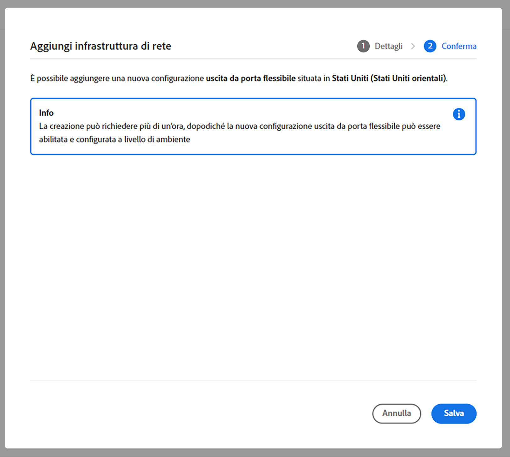

# Configurazione di networking avanzato per AEM as a Cloud Service {#configuring-advanced-networking}

Questo articolo presenta le diverse funzionalità di rete avanzate in AEM as a Cloud Service, tra cui il provisioning self-service e API di VPN, porte non standard e indirizzi IP in uscita dedicati.

>[!TIP]
>
>Oltre alla documentazione, in questa [posizione](https://experienceleague.adobe.com/it/docs/experience-manager-learn/cloud-service/networking/advanced-networking) è disponibile una serie di tutorial progettati per guidarti attraverso ciascuna delle opzioni di rete avanzate.

## Panoramica {#overview}

AEM as a Cloud Service offre le seguenti opzioni di rete avanzate:

* [Uscita con porta flessibile](#flexible-port-egress): configura AEM as a Cloud Service per consentire il traffico in uscita da porte non standard.
* [Indirizzo IP in uscita dedicato](#dedicated-egress-ip-address): configura il traffico da AEM as a Cloud Service con origine da un IP univoco.
* [Virtual Private Network (VPN)](#vpn): traffico sicuro tra la propria infrastruttura e AEM as a Cloud Service, per chi dispone di una VPN.

Questo articolo descrive in dettaglio ciascuna di queste opzioni e il motivo per cui potresti utilizzarle, poi esemplifica le modalità di configurazione tramite l’interfaccia utente di Cloud Manager e l’utilizzo dell’API. L’articolo si conclude con alcuni casi d’uso avanzati.

>[!CAUTION]
>
>Se disponi già della tecnologia di uscita dedicata legacy e desideri configurare una di queste opzioni di rete avanzate, [contatta prima il Servizio Clienti Adobe.](https://experienceleague.adobe.com/?support-solution=Experience+Manager?lang=it#home)
>
>Il tentativo di configurare una rete avanzata con la tecnologia di uscita legacy può influire sulla connettività del sito.

### Requisiti e limitazioni {#requirements}

Durante la configurazione delle funzioni di rete avanzate, si applicano le seguenti restrizioni.

* Un programma può fornire un’unica opzione di rete avanzata (uscita con porta flessibile, indirizzo IP in uscita dedicato o VPN).
* La rete avanzata non è disponibile per i [programmi sandbox.](/help/implementing/cloud-manager/getting-access-to-aem-in-cloud/program-types.md)
* Per aggiungere e configurare l’infrastruttura di rete nel programma un utente deve disporre del ruolo di **Amministratore**.
* È necessario creare l’ambiente di produzione prima di poter aggiungere l’infrastruttura di rete al programma.
* L’infrastruttura di rete deve trovarsi nell’area geografica che corrisponda a quella principale dell’ambiente di produzione.
   * Nel caso in cui l’ambiente di produzione disponga di [ulteriori aree geografiche di pubblicazione,](/help/implementing/cloud-manager/manage-environments.md#multiple-regions) è possibile creare un’infrastruttura di rete aggiuntiva per il mirroring di ogni area geografica.
   * Non è consentito creare un numero di infrastrutture di rete superiore al massimo di aree geografiche configurato nell’ambiente di produzione.
   * Nell’ambiente di produzione è possibile definire tante le infrastrutture di rete quante sono le aree geografiche, ma la nuova infrastruttura deve essere dello stesso tipo di quella creata in precedenza.
   * Quando si creano più infrastrutture, è possibile selezionare solo le aree in cui non è stata creata un’infrastruttura di rete avanzata.

### Configurazione e abilitazione di reti avanzate {#configuring-enabling}

L’utilizzo di funzioni di rete avanzate richiede due passaggi:

1. La configurazione dell’opzione di rete avanzata, [uscita con porta flessibile,](#flexible-port-egress) [indirizzo IP in uscita dedicato,](#dedicated-egress-ip-address) o [VPN,](#vpn) deve essere eseguita prima di tutto a livello di programma.
1. Per poter essere utilizzata, l’opzione di rete avanzata deve quindi essere [abilitata a livello di ambiente.](#enabling)

Entrambi i passaggi possono essere eseguiti utilizzando l’interfaccia utente di Cloud Manager o l’API di Cloud Manager.

* L’utilizzo dell’interfaccia utente di Cloud Manager implica la creazione di configurazioni di rete avanzate tramite una procedura guidata a livello di programma e poi la modifica di ogni ambiente in cui desideri abilitare la configurazione.

* Quando si utilizza l’API di Cloud Manager, l’endpoint API `/networkInfrastructures` viene richiamato a livello di programma per dichiarare il tipo desiderato di rete avanzata. È seguito da una chiamata all’endpoint `/advancedNetworking` per ogni ambiente per abilitare l’infrastruttura e configurare parametri specifici.

## Uscita flessibile della porta {#flexible-port-egress}

Questa funzionalità avanzata di rete ti consente di configurare AEM as a Cloud Service per incrementare il traffico attraverso porte diverse da HTTP (porta 80) e HTTPS (porta 443), che sono aperte per impostazione predefinita.

>[!TIP]
>
>Quando bisogna decidere tra uscita con porta flessibile e indirizzo IP in uscita dedicato, se non è necessario un indirizzo IP specifico si consiglia di scegliere l’uscita con porta flessibile. Il motivo di tale scelta è che Adobe può ottimizzare le prestazioni del traffico in uscita dalla porta flessibile.

>[!NOTE]
>
>Una volta creati, i tipi di infrastruttura di uscita con porta flessibile non possono essere modificati. L’unico modo per modificare i valori di configurazione consiste nell’eliminarli e ricrearli.

### Configurazione interfaccia utente {#configuring-flexible-port-egress-provision-ui}

1. Accedi a Cloud Manager all’indirizzo [my.cloudmanager.adobe.com](https://my.cloudmanager.adobe.com/) e seleziona l’organizzazione appropriata.

1. Nella console **[I miei programmi](/help/implementing/cloud-manager/navigation.md#my-programs)**, seleziona il programma.

1. Dalla pagina **Panoramica del programma**, vai alla scheda **Ambienti** e seleziona **Infrastruttura di rete** nel pannello a sinistra.

   

1. Nella procedura guidata **Aggiungi infrastruttura di rete** che viene avviata, seleziona **Uscita da porta flessibile** e l’area geografica in cui deve essere creata dal menu a discesa **Area geografica** e tocca o fai clic su **Continua**.

   

1. La scheda **Conferma** riepiloga la selezione e i passaggi successivi. Per creare l’infrastruttura, fai clic su **Salva**.

   

Un nuovo record viene visualizzato sotto l’intestazione **Infrastruttura di rete** nel pannello laterale, con dettagli sul tipo di infrastruttura, lo stato, l’area geografica e gli ambienti in cui è stata abilitata.


>[!NOTE]
>
>La creazione dell’infrastruttura di uscita con porta flessibile può richiedere fino a un’ora, dopo di che può essere configurata a livello di ambiente.

### Configurazione API {#configuring-flexible-port-egress-provision-api}

Una volta per programma, l’endpoint POST `/program/<programId>/networkInfrastructures` viene richiamato, passando semplicemente il valore di `flexiblePortEgress` per il parametro `kind` e area geografica. L’endpoint risponde con `network_id`, nonché con altre informazioni, tra cui lo stato.

Una volta effettuata la chiamata, in genere sono necessari circa 15 minuti per il provisioning dell’infrastruttura di rete. Una chiamata all’[endpoint GET per infrastruttura di rete](https://developer.adobe.com/experience-cloud/cloud-manager/reference/api/#operation/getNetworkInfrastructure) di Cloud Manager mostrerebbe uno stato **ready**.

>[!TIP]
>
>L’intero set di parametri e la sintassi esatta, nonché altre informazioni importanti, come quali parametri non possono essere cambiati in un secondo momento, [possono essere consultati nella documentazione API.](https://developer.adobe.com/experience-cloud/cloud-manager/reference/api/#operation/createNetworkInfrastructure)

### Routing del traffico {#flexible-port-egress-traffic-routing}

Per il traffico http o https che accede a porte diverse da 80 o 443, è necessario configurare un proxy utilizzando le seguenti variabili di ambiente host e porte:

* per HTTP: `AEM_PROXY_HOST` / `AEM_HTTP_PROXY_PORT ` (impostazione predefinita `proxy.tunnel:3128` nelle versioni AEM &lt; 6094)
* per HTTPS: `AEM_PROXY_HOST` / `AEM_HTTPS_PROXY_PORT ` (impostazione predefinita `proxy.tunnel:3128` nelle versioni AEM &lt; 6094)

Ad esempio, di seguito è riportato un codice di esempio per inviare una richiesta a `www.example.com:8443`:

```java
String url = "www.example.com:8443"
String proxyHost = System.getenv().getOrDefault("AEM_PROXY_HOST", "proxy.tunnel");
int proxyPort = Integer.parseInt(System.getenv().getOrDefault("AEM_HTTPS_PROXY_PORT", "3128"));
HttpClient client = HttpClient.newBuilder()
      .proxy(ProxySelector.of(new InetSocketAddress(proxyHost, proxyPort)))
      .build();
 
HttpRequest request = HttpRequest.newBuilder().uri(URI.create(url)).build();
HttpResponse<String> response = client.send(request, BodyHandlers.ofString());
```

Se utilizzi librerie di rete Java™ non standard, configura i proxy utilizzando le proprietà riportate sopra per tutto il traffico.

Il traffico non http/s con destinazioni attraverso porte dichiarate nel parametro `portForwards` deve fare riferimento a una proprietà denominata `AEM_PROXY_HOST`, oltre alla porta mappata. Ad esempio:

```java
DriverManager.getConnection("jdbc:mysql://" + System.getenv("AEM_PROXY_HOST") + ":53306/test");
```

La tabella seguente descrive il routing del traffico:

<table>
<thead>
  <tr>
    <th>Traffico</th>
    <th>Condizione di destinazione</th>
    <th>Porta </th>
    <th>Connessione</th>
    <th>Esempio di destinazione esterna</th>
  </tr>
</thead>
<tbody>
  <tr>
    <td><b>Protocollo Http o https</b></td>
    <td>Traffico http/s standard</td>
    <td>80 o 443</td>
    <td>Consentito</td>
    <td></td>
  </tr> 
  <tr>
    <td></td>
    <td>Traffico non standard (su altre porte diverse da 80 o 443) tramite proxy http configurato utilizzando la variabile di ambiente e il numero di porta proxy seguenti. Non dichiarare la porta di destinazione nel parametro portForwards della chiamata API di Cloud Manager:<br><ul>
     <li>AEM_PROXY_HOST (impostazione predefinita ‘proxy.tunnel’ nelle versioni AEM &lt; 6094)</li>
     <li>AEM_HTTPS_PROXY_PORT (impostazione predefinita porta 3128 nelle versioni AEM &lt; 6094)</li>
    </ul>
    <td>Porte esterne 80 o 443</td>
    <td>Consentito</td>
    <td>example.com:8443</td>
  </tr>
  <tr>
    <td></td>
    <td>Traffico non standard (su altre porte diverse dalle porte 80 o 443) che non utilizza il proxy http</td>
    <td>Porte esterne 80 o 443</td>
    <td>Bloccato</td>
    <td></td>
  </tr>
  <tr>
    <td><b>Non http o non https</b></td>
    <td>Il client si connette alla variabile di ambiente <code>AEM_PROXY_HOST</code> utilizzando un <code>portOrig</code> dichiarato nel parametro API <code>portForwards</code>.</td>
    <td>Qualsiasi</td>
    <td>Consentito</td>
    <td><code>mysql.example.com:3306</code></td>
  </tr>
  <tr>
    <td></td>
    <td>Tutto il resto</td>
    <td>Qualsiasi</td>
    <td>Bloccato</td>
    <td><code>db.example.com:5555</code></td>
  </tr>
</tbody>
</table>

#### Configurazione di Apache/Dispatcher {#apache-dispatcher}

La direttiva `mod_proxy` del livello Apache/Dispatcher di AEM Cloud Service può essere configurata utilizzando le proprietà descritte in precedenza.

```
ProxyRemote "http://example.com:8080" "http://${AEM_PROXY_HOST}:3128"
ProxyPass "/somepath" "http://example.com:8080"
ProxyPassReverse "/somepath" "http://example.com:8080"
```

```
SSLProxyEngine on //needed for https backends
 
ProxyRemote "https://example.com:8443" "http://${AEM_PROXY_HOST}:3128"
ProxyPass "/somepath" "https://example.com:8443"
ProxyPassReverse "/somepath" "https://example.com:8443"
```

## Indirizzo IP in uscita dedicato {#dedicated-egress-ip-address}

Un indirizzo IP dedicato può migliorare la sicurezza durante l’integrazione con i fornitori SaaS (ad esempio, un fornitore CRM) o altre integrazioni al di fuori di AEM as a Cloud Service che offrono un elenco Consentiti di indirizzi IP. Aggiungendo l’indirizzo IP dedicato all’elenco Consentiti, si garantisce che solo il traffico proveniente dall’istanza di AEM Cloud Service possa passare al servizio esterno. Verrà aggiunto al traffico proveniente da qualsiasi altro IP consentito.

Lo stesso IP dedicato viene applicato a tutti i programmi di un cliente nella sua organizzazione Adobe e per tutti gli ambienti in ciascuno dei suoi programmi. Si applica ai servizi sia di authoring che di pubblicazione.

Se la funzione di indirizzo IP dedicato non è abilitata, il traffico proveniente da AEM as a Cloud Service passa attraverso una serie di IP condivisi con altri clienti dello stesso servizio.

La configurazione dell’indirizzo IP in uscita dedicato è analoga a quella dell’[uscita con porta flessibile.](#flexible-port-egress) La differenza principale è che, dopo la configurazione, il traffico sarà sempre in uscita da un IP dedicato e univoco. Per trovare tale IP, utilizza un risolutore DNS per identificare l’indirizzo IP associato a `p{PROGRAM_ID}.external.adobeaemcloud.com`. L’indirizzo IP non dovrebbe cambiare, ma se dovesse cambiare, sarà fornita una notifica avanzata.

>[!TIP]
>
>Dovendo decidere tra l’uscita flessibile della porta e l’indirizzo IP in uscita dedicato, conviene scegliere l’uscita flessibile della porta se non è necessario un indirizzo IP specifico. Il motivo di tale scelta è che Adobe può ottimizzare le prestazioni del traffico in uscita dalla porta flessibile.

>[!NOTE]
>
>Se hai effettuato il provisioning con un IP in uscita dedicato prima del 30.09.2021 (cioè prima della versione di settembre 2021), la funzionalità IP in uscita dedicato supporta solo le porte HTTP e HTTPS.
>
>Questo include HTTP/1.1 e HTTP/2 se crittografati. Inoltre, un endpoint di uscita dedicato può comunicare con qualsiasi destinazione solo tramite HTTP/HTTPS rispettivamente sulle porte 80/443.

>[!NOTE]
>
>Una volta creati, i tipi di infrastruttura degli indirizzi IP in uscita dedicati non possono essere modificati. L’unico modo per modificare i valori di configurazione consiste nell’eliminarli e ricrearli.

>[!INFO]
>
>La funzionalità di inoltro Splunk non è possibile da un indirizzo IP in uscita dedicato.

### Configurazione interfaccia utente {#configuring-dedicated-egress-provision-ui}

1. Accedi a Cloud Manager all’indirizzo [my.cloudmanager.adobe.com](https://my.cloudmanager.adobe.com/) e seleziona l’organizzazione appropriata.

1. Nella console **[I miei programmi](/help/implementing/cloud-manager/navigation.md#my-programs)**, seleziona il programma.

1. Dalla pagina **Panoramica del programma**, vai alla scheda **Ambienti** e seleziona **Infrastruttura di rete** nel pannello a sinistra.

   

1. Nella procedura guidata **Aggiungi infrastruttura di rete** che viene avviata, seleziona **Indirizzo IP di uscita dedicato** e l’area geografica in cui deve essere creata dal menu a discesa **Area geografica** e fai clic su **Continua**.

   

1. La scheda **Conferma** riepiloga la selezione e i passaggi successivi. Per creare l’infrastruttura, fai clic su **Salva**.

   

Un nuovo record viene visualizzato sotto l’intestazione **Infrastruttura di rete** nel pannello laterale, con dettagli sul tipo di infrastruttura, lo stato, l’area geografica e gli ambienti in cui è stata abilitata.


>[!NOTE]
>
>La creazione dell’infrastruttura di uscita con porta flessibile può richiedere fino a un’ora, dopo di che può essere configurata a livello di ambiente.

### Configurazione API {#configuring-dedicated-egress-provision-api}

Una volta per programma, l’endpoint POST `/program/<programId>/networkInfrastructures` viene richiamato, passando semplicemente il valore di `dedicatedEgressIp` per il parametro `kind` e area geografica. L’endpoint risponde con `network_id`, nonché con altre informazioni, tra cui lo stato.

Una volta effettuata la chiamata, in genere sono necessari circa 15 minuti per il provisioning dell’infrastruttura di rete. Una chiamata all’[endpoint GET per infrastruttura di rete](https://developer.adobe.com/experience-cloud/cloud-manager/reference/api/#operation/getNetworkInfrastructure) di Cloud Manager mostrerebbe uno stato **ready**.

>[!TIP]
>
>L’intero set di parametri e la sintassi esatta, nonché altre informazioni importanti, come quali parametri non possono essere cambiati in un secondo momento, [possono essere consultati nella documentazione API.](https://developer.adobe.com/experience-cloud/cloud-manager/reference/api/#operation/createNetworkInfrastructure)

### Routing del traffico {#dedicated-egress-ip-traffic-routing}

Il traffico http o https passa attraverso un proxy preconfigurato, a condizione che utilizzi le proprietà standard del sistema Java™ per le configurazioni proxy.

Il traffico non http/s con destinazioni attraverso porte dichiarate nel parametro `portForwards` deve fare riferimento a una proprietà denominata `AEM_PROXY_HOST`, oltre alla porta mappata. Ad esempio:

```java
DriverManager.getConnection("jdbc:mysql://" + System.getenv("AEM_PROXY_HOST") + ":53306/test");
```

<table>
<thead>
  <tr>
    <th>Traffico</th>
    <th>Condizione di destinazione</th>
    <th>Porta </th>
    <th>Connessione</th>
    <th>Esempio di destinazione esterna</th>
  </tr>
</thead>
<tbody>
  <tr>
    <td><b>Protocollo Http o https</b></td>
    <td>Traffico verso Azure o servizi Adobe</td>
    <td>Qualsiasi</td>
    <td>Tramite gli IP del cluster condiviso (non l’IP dedicato)</td>
    <td>adobe.io<br>api.windows.net</td>
  </tr>
  <tr>
    <td></td>
    <td>Host corrispondente al parametro <code>nonProxyHosts</code></td>
    <td>80 o 443</td>
    <td>Tramite gli IP del cluster condiviso</td>
    <td></td>
  </tr>
  <tr>
    <td></td>
    <td>Host corrispondente al parametro <code>nonProxyHosts</code></td>
    <td>Porte esterne 80 o 443</td>
    <td>Bloccato</td>
    <td></td>
  </tr>
  <tr>
    <td></td>
    <td>Tramite la configurazione proxy http, configurata per impostazione predefinita per il traffico http/s utilizzando la libreria client HTTP Java™ standard</td>
    <td>Qualsiasi</td>
    <td>Attraverso l’IP dedicato in uscita</td>
    <td></td>
  </tr>
  <tr>
    <td></td>
    <td>Ignora la configurazione proxy http (ad esempio, se viene rimossa esplicitamente dalla libreria client HTTP Java™ standard o se viene utilizzata una libreria Java™ che ignora la configurazione proxy standard)</td>
    <td>80 o 443</td>
    <td>Tramite gli IP del cluster condiviso</td>
    <td></td>
  </tr>
  <tr>
    <td></td>
    <td>Ignora la configurazione proxy http (ad esempio, se viene rimossa esplicitamente dalla libreria client HTTP Java™ standard o se viene utilizzata una libreria Java™ che ignora la configurazione proxy standard)</td>
    <td>Porte esterne 80 o 443</td>
    <td>Bloccato</td>
    <td></td>
  </tr>
  <tr>
    <td><b>Non http o non https</b></td>
    <td>Il client si connette alla variabile d’ambiente <code>AEM_PROXY_HOST</code> usando un <code>portOrig</code> dichiarato nel parametro API <code>portForwards</code></td>
    <td>Qualsiasi</td>
    <td>Attraverso l’IP dedicato in uscita</td>
    <td><code>mysql.example.com:3306</code></td>
  </tr>
  <tr>
    <td></td>
    <td>Qualsiasi altra</td>
    <td></td>
    <td>Bloccato</td>
    <td></td>
  </tr>
</tbody>
</table>

### Utilizzo della funzione {#feature-usage}

La funzione è compatibile con il codice o le librerie Java™ che generano traffico in uscita, purché utilizzino le proprietà standard del sistema Java™ per le configurazioni proxy. In pratica, dovrebbe essere inclusa la maggior parte delle librerie comuni.

Di seguito è riportato un esempio di codice:

```java
public JSONObject getJsonObject(String relativePath, String queryString) throws IOException, JSONException {
  String relativeUri = queryString.isEmpty() ? relativePath : (relativePath + '?' + queryString);
  URL finalUrl = endpointUri.resolve(relativeUri).toURL();
  URLConnection connection = finalUrl.openConnection();
  connection.addRequestProperty("Accept", "application/json");
  connection.addRequestProperty("X-API-KEY", apiKey);

  try (InputStream responseStream = connection.getInputStream(); Reader responseReader = new BufferedReader(new InputStreamReader(responseStream, Charsets.UTF_8))) {
    return new JSONObject(new JSONTokener(responseReader));
  }
}
```

Alcune librerie richiedono una configurazione esplicita per utilizzare le proprietà standard del sistema Java™ per le configurazioni proxy.

Un esempio che utilizza Apache HttpClient, che richiede chiamate esplicite a
[`HttpClientBuilder.useSystemProperties()`](https://hc.apache.org/httpcomponents-client-4.5.x/current/httpclient/apidocs/org/apache/http/impl/client/HttpClientBuilder.html) o l’uso di
[`HttpClients.createSystem()`](https://hc.apache.org/httpcomponents-client-4.5.x/current/httpclient/apidocs/org/apache/http/impl/client/HttpClients.html#createSystem()):

```java
public JSONObject getJsonObject(String relativePath, String queryString) throws IOException, JSONException {
  String relativeUri = queryString.isEmpty() ? relativePath : (relativePath + '?' + queryString);
  URL finalUrl = endpointUri.resolve(relativeUri).toURL();

  HttpClient httpClient = HttpClientBuilder.create().useSystemProperties().build();
  HttpGet request = new HttpGet(finalUrl.toURI());
  request.setHeader("Accept", "application/json");
  request.setHeader("X-API-KEY", apiKey);
  HttpResponse response = httpClient.execute(request);
  String result = EntityUtils.toString(response.getEntity());
}
```

### Considerazioni sul debug {#debugging-considerations}

Per verificare che il traffico sia effettivamente in uscita all’indirizzo IP dedicato previsto, controlla i registri nel servizio di destinazione, se disponibili. Altrimenti può essere utile richiamare un servizio di debug come [http://ifconfig.me/ip](https://ifconfig.me/ip), che restituirà l’indirizzo IP chiamante.

## Virtual Private Network (VPN) {#vpn}

Una VPN consente la connessione a un’infrastruttura on-premise o a un centro dati dalle istanze di authoring, pubblicazione o anteprima. Ciò può essere utile, ad esempio, per proteggere l’accesso a un database. Consente inoltre di connettersi ai fornitori SaaS, ad esempio un fornitore CRM che supporta la VPN o la connessione da una rete aziendale all’istanza di authoring, anteprima o pubblicazione di AEM as a Cloud Service.

Sono supportati la maggior parte dei dispositivi VPN con tecnologia IPSec. Consulta le informazioni nella colonna **Istruzioni di configurazione Route Based** in [questo elenco di dispositivi.](https://learn.microsoft.com/it-it/azure/vpn-gateway/vpn-gateway-about-vpn-devices#devicetable) Configura il dispositivo come descritto nella tabella.

>[!NOTE]
>
>Di seguito sono riportate le limitazioni di un’infrastruttura VPN:
>
>* Il supporto è limitato a una singola connessione VPN
>* La funzionalità di inoltro Splunk non è possibile tramite una connessione VPN.
>* Per risolvere i nomi host privati, i risolutori DNS devono essere elencati nello spazio degli indirizzi del gateway.

### Configurazione interfaccia utente {#configuring-vpn-ui}

1. Accedi a Cloud Manager all’indirizzo [my.cloudmanager.adobe.com](https://my.cloudmanager.adobe.com/) e seleziona l’organizzazione appropriata.

1. Nella console **[I miei programmi](/help/implementing/cloud-manager/navigation.md#my-programs)**, seleziona il programma.

1. Dalla pagina **Panoramica del programma**, vai alla scheda **Ambienti** e seleziona **Infrastruttura di rete** nel pannello a sinistra.

   

1. Nella procedura guidata **Aggiungi infrastruttura di rete** che viene avviata, seleziona **Rete privata virtuale** e fornisci le informazioni necessarie prima di fare clic su **Continua**.

   * **Area geografica**: questa è l’area geografica in cui dovrebbero essere create le infrastrutture.
   * **Spazio indirizzo**: lo spazio indirizzo può essere un solo CIDR /26 (64 indirizzi IP) o un intervallo IP più ampio nel porprio spazio.
      * Questo valore non può essere cambiato in seguito.
   * **Informazioni DNS**: elenco di risolutori DNS remoti.
      * Premi `Enter` dopo aver inserito un indirizzo di un server DNS per aggiungerne un altro.
      * Fai clic su `X` dopo un indirizzo per rimuoverlo.
   * **Chiave condivisa**: questa è la tua chiave VPN precondivisa.
      * Seleziona **Mostra chiave condivisa** per visualizzare la chiave per ricontrollarne il valore.

   

1. Nella scheda **Connessioni** della procedura guidata, fornisci un **Nome della connessione** per identificare la connessione VPN e tocca o fai clic su **Aggiungi connessione**.

   

1. Nella finestra di dialogo **Aggiungi connessione**, definisci la connessione VPN e fai clic su **Salva**.

   * **Nome della connessione**: nome descrittivo della connessione VPN, fornito nel passaggio precedente e che puoi aggiornare qui.
   * **Indirizzo**: indirizzo IP del dispositivo VPN.
   * **Spazio degli indirizzi**: questi sono gli intervalli degli indirizzi IP da indirizzare attraverso la VPN.
      * Premi `Enter` dopo aver inserito un intervallo per aggiungerne un altro.
      * Fai clic su `X` dopo un intervallo per rimuoverlo.
   * **Criteri di sicurezza IP**: regola dai valori predefiniti come richiesto

   

1. La finestra di dialogo si chiude e ritorna alla scheda **Connessioni** della procedura guidata. Fai clic su **Continua**.

   

1. La scheda **Conferma** riepiloga la selezione e i passaggi successivi. Per creare l’infrastruttura, fai clic su **Salva**.

   

Un nuovo record viene visualizzato sotto l’intestazione **Infrastruttura di rete** nel pannello laterale, con dettagli sul tipo di infrastruttura, lo stato, l’area geografica e gli ambienti in cui è stata abilitata.

### Configurazione API {#configuring-vpn-api}

Viene richiamato l’endpoint POST `/program/<programId>/networkInfrastructures` una volta per programma. Questo trasmette un payload di informazioni di configurazione. Tali informazioni includono il valore di **vpn** per `kind` parametro, area geografica, spazio indirizzi (elenco di CIDR, che non potrà essere modificato in seguito), risolutori DNS (per la risoluzione dei nomi nella rete). Include inoltre informazioni sulla connessione VPN, ad esempio la configurazione del gateway, la chiave VPN condivisa e i criteri di sicurezza IP. L’endpoint risponde con `network_id`, nonché con altre informazioni, tra cui lo stato.

Una volta effettuata la chiamata, in genere sono necessari da 45 a 60 minuti per il provisioning dell’infrastruttura di rete. Il metodo GET nell’API può essere chiamato per restituire lo stato, che alla fine cambia da `creating` a `ready`. Consulta la documentazione dell’API per tutti gli stati.

>[!TIP]
>
>L’intero set di parametri e la sintassi esatta, nonché altre informazioni importanti, come quali parametri non possono essere cambiati in un secondo momento, [possono essere consultati nella documentazione API.](https://developer.adobe.com/experience-cloud/cloud-manager/reference/api/#operation/createNetworkInfrastructure)

### Routing del traffico {#vpn-traffic-routing}

La tabella seguente descrive il routing del traffico.

<table>
<thead>
  <tr>
    <th>Traffico</th>
    <th>Condizione di destinazione</th>
    <th>Porta </th>
    <th>Connessione</th>
    <th>Esempio di destinazione esterna</th>
  </tr>
</thead>
<tbody>
  <tr>
    <td><b>Protocollo Http o https</b></td>
    <td>Traffico verso Azure o servizi Adobe</td>
    <td>Qualsiasi</td>
    <td>Tramite gli IP del cluster condiviso (non l’IP dedicato)</td>
    <td>adobe.io<br>api.windows.net</td>
  </tr>
  <tr>
    <td></td>
    <td>Host corrispondente al parametro <code>nonProxyHosts</code></td>
    <td>80 o 443</td>
    <td>Tramite gli IP del cluster condiviso</td>
    <td></td>
  </tr>
  <tr>
    <td></td>
    <td>Host corrispondente al parametro <code>nonProxyHosts</code></td>
    <td>Porte esterne 80 o 443</td>
    <td>Bloccato</td>
    <td></td>
  </tr>
  <tr>
    <td></td>
    <td>Se l’IP rientra nell’intervallo di spazio <i>Indirizzo gateway VPN</i> e tramite la configurazione proxy http (configurata per impostazione predefinita per il traffico http/s utilizzando la libreria client Java™ HTTP standard)</td>
    <td>Qualsiasi</td>
    <td>Tramite la VPN</td>
    <td><code>10.0.0.1:443</code><br>Può essere anche un nome host.</td>
  </tr>
  <tr>
    <td></td>
    <td>Se l’IP non rientra nell’intervallo <i>Spazio degli indirizzi gateway VPN</i> e attraverso la configurazione proxy http (configurata per impostazione predefinita per il traffico http/s utilizzando la libreria client Java™ HTTP standard)</td>
    <td>Qualsiasi</td>
    <td>Attraverso l’IP dedicato in uscita</td>
    <td></td>
  </tr>
  <tr>
    <td></td>
    <td>Ignora la configurazione proxy http (ad esempio, se viene rimossa esplicitamente dalla libreria client Java™ HTTP standard o se si utilizza una libreria Java™ che ignora la configurazione proxy standard)
</td>
    <td>80 o 443</td>
    <td>Tramite gli IP del cluster condiviso</td>
    <td></td>
  </tr>
  <tr>
    <td></td>
    <td>Ignora la configurazione proxy http (ad esempio, se viene rimossa esplicitamente dalla libreria client Java™ HTTP standard o se si utilizza una libreria Java™ che ignora la configurazione proxy standard)</td>
    <td>Porte esterne 80 o 443</td>
    <td>Bloccato</td>
    <td></td>
  </tr>
  <tr>
    <td><b>Non http o non https</b></td>
    <td>Se l’IP rientra nell’intervallo <i>Spazio degli indirizzi gateway VPN</i> e il client si connette a <code>AEM_PROXY_HOST</code> variabile env che utilizza un <code>portOrig</code> dichiarato nel parametro di API <code>portForwards</code></td>
    <td>Qualsiasi</td>
    <td>Tramite la VPN</td>
    <td><code>10.0.0.1:3306</code><br>Può essere anche un nome host.</td>
  </tr>
  <tr>
    <td></td>
    <td>Se l’IP non rientra nell’intervallo <i>Spazio degli indirizzi gateway VPN</i> e il client si connette alla variabile env <code>AEM_PROXY_HOST</code> che utilizza un <code>portOrig</code> dichiarato nel parametro di API <code>portForwards</code></td>
    <td>Qualsiasi</td>
    <td>Attraverso l’IP dedicato in uscita</td>
    <td></td>
  </tr>
  <tr>
    <td></td>
    <td>Qualsiasi altra</td>
    <td>Qualsiasi</td>
    <td>Bloccato</td>
    <td></td>
  </tr>
</tbody>
</table>

### Domini utili per la configurazione {#vpn-useful-domains-for-configuration}

Il diagramma seguente fornisce una rappresentazione visiva di un insieme di domini e IP associati che sono utili per la configurazione e lo sviluppo. La tabella riportata di seguito descrive tali domini e IP.


<table>
<thead>
  <tr>
    <th>Pattern di dominio</th>
    <th>Significato in uscita (da AEM)</th>
    <th>Significato ingresso (a AEM)</th>
  </tr>
</thead>
<tbody>
  <tr>
    <td><code>p{PROGRAM_ID}.external.adobeaemcloud.com</code></td>
    <td>Indirizzo IP di uscita dedicato per il traffico che va verso Internet anziché attraverso reti private </td>
    <td>Le connessioni dalla VPN verrebbero visualizzate in CDN come provenienti da questo IP. Per consentire solo le connessioni dalla VPN a AEM, configura Cloud Manager per consentire solo questo IP e bloccare tutto il resto. Per ulteriori informazioni, consulta la sezione “Limitare l’ingresso alle connessioni VPN”.</td>
  </tr>
  <tr>
    <td><code>p{PROGRAM_ID}.{REGION}-gateway.external.adobeaemcloud.com</code></td>
    <td>N/D</td>
    <td>IP del gateway VPN sul lato AEM. Il team di progettazione della rete può utilizzarlo per consentire solo le connessioni VPN al proprio gateway VPN da un indirizzo IP specifico. </td>
  </tr>
  <tr>
    <td><code>p{PROGRAM_ID}.{REGION}.inner.adobeaemcloud.net</code></td>
    <td>IP del traffico proveniente dal lato AEM della VPN verso il proprio lato. Questo può essere aggiunto all’elenco Consentiti nella propria configurazione per garantire che le connessioni possano essere effettuate solo da AEM.</td>
    <td>Se desideri consentire l’accesso VPN ad AEM, devi configurare le voci DNS CNAME per mappare il dominio personalizzato e/o <code>author-p{PROGRAM_ID}-e{ENVIRONMENT_ID}.adobeaemcloud.com</code> e/o <code>publish-p{PROGRAM_ID}-e{ENVIRONMENT_ID}.adobeaemcloud.com</code> a questo oggetto.</td>
  </tr>
</tbody>
</table>

### Limitare la VPN alle connessioni in ingresso {#restrict-vpn-to-ingress-connections}

Se vuoi consentire solo l’accesso VPN ad AEM, è possibile configurare gli inserimenti nell’elenco Consentiti dell’ambiente in Cloud Manager in modo che solo l’IP definito da `p{PROGRAM_ID}.external.adobeaemcloud.com` è autorizzato a parlare con l’ambiente. Questa operazione può essere eseguita come qualsiasi altro inserimento nell’elenco Consentiti basato su IP in Cloud Manager.

Se le regole devono essere basate su percorsi, utilizza le direttive http standard a livello di dispatcher per negare o consentire determinati IP. Devono anche garantire che i percorsi desiderati non siano memorizzabili nella cache sulla CDN in modo che la richiesta arrivi sempre all’origine.

#### Esempio di configurazione Httpd {#httpd-example}

```
Order deny,allow
Deny from all
Allow from 192.168.0.1
Header always set Cache-Control private
```

## Abilitazione delle configurazioni di rete avanzate negli ambienti {#enabling}

Dopo aver configurato un’opzione di rete avanzata per un programma, che sia [uscita con porta flessibile,](#flexible-port-egress) [indirizzo IP di uscita dedicato,](#dedicated-egress-ip-address) o [VPN,](#vpn) per utilizzarla, devi abilitarla a livello di ambiente.

Quando abiliti una configurazione di rete avanzata per un ambiente, puoi abilitare anche l’inoltro di porta opzionale e gli host non proxy. I parametri sono configurabili in base all’ambiente per offrire flessibilità.

* **Inoltro porte**: le regole di inoltro porte devono essere dichiarate per tutte le porte di destinazione diverse da 80/443, ma solo se non si utilizza il protocollo HTTP o HTTPS.
   * Le regole di inoltro porte vengono definite specificando il set di host di destinazione (nomi o IP e porte).
   * La connessione client che utilizza la porta 80/443 su http/https deve continuare a utilizzare le impostazioni proxy nella connessione per applicare le proprietà della rete avanzata alla connessione.
   * Per ogni host di destinazione, è necessario mappare la porta di destinazione prevista su una porta da 30000 a 30999.
   * Le regole di inoltro porte sono disponibili per tutti i tipi di rete avanzati.

* **Host non proxy**: gli host non proxy consentono di dichiarare un set di host che vanno instradati attraverso un intervallo di indirizzi IP condivisi anziché l’IP dedicato.
   * Questo può essere utile in quanto il traffico in uscita attraverso gli IP condivisi può essere ulteriormente ottimizzato.
   * Gli host non proxy sono disponibili solo per gli indirizzi IP in uscita dedicati e i tipi di rete VPN avanzati.

>[!NOTE]
>
>Non puoi abilitare una configurazione di rete avanzata per un ambiente se questo si trova in stato di **Aggiornamento**.

### Abilitazione tramite l’interfaccia utente {#enabling-ui}

1. Accedi a Cloud Manager all’indirizzo [my.cloudmanager.adobe.com](https://my.cloudmanager.adobe.com/) e seleziona l’organizzazione appropriata.

1. Nella console **[I miei programmi](/help/implementing/cloud-manager/navigation.md#my-programs)**, seleziona il programma.

1. Dalla pagina **Panoramica del programma**, passa alla scheda **Ambienti** e seleziona l’ambiente in cui desideri abilitare la configurazione di rete avanzata nell’intestazione **Ambienti** nel pannello a sinistra. Quindi seleziona la scheda **Configurazione di rete avanzata** dell’ambiente selezionato e fai clic su **Abilita infrastruttura di rete**.

   

1. Viene visualizzata la finestra di dialogo **Configura rete avanzata**.

1. Nella scheda **Host non proxy**, per gli indirizzi IP in uscita dedicati e le VPN, puoi facoltativamente definire un set di host. Questi host definiti devono essere instradati attraverso un intervallo di indirizzi IP condivisi anziché attraverso l’IP dedicato, fornendo il nome host nel campo **Host non proxy** e facendo clic su **Aggiungi**.

   * L’host viene aggiunto all’elenco degli host nella scheda.
   * Ripeti questo passaggio per aggiungere più host.
   * Se desideri rimuovere un host, fai clic sulla X a destra della riga.
   * Questa scheda non è disponibile per le configurazioni di uscita dalla porta flessibile.

   

1. Nella scheda **Port forwarding**, se non utilizzi HTTP o HTTPS, puoi facoltativamente definire regole di inoltro porte per tutte le porte di destinazione diverse da 80/443. Fornisci **Nome**, **Origine porta** e **Destinazione porta** e fai clic su **Aggiungi**.

   * La regola viene aggiunta al relativo elenco nella scheda.
   * Ripeti questo passaggio per aggiungere più regole.
   * Per rimuovere una regola, fai clic sulla X a destra della riga.

   

1. Fai clic su **Salva** nella finestra di dialogo, in modo da poter applicare la configurazione all’ambiente.

La configurazione di rete avanzata viene applicata all’ambiente selezionato. Tornando alla scheda **Ambienti**, puoi visualizzare i dettagli della configurazione applicata all’ambiente selezionato e il relativo stato.


### Abilitazione tramite API {#enabling-api}

Per abilitare una configurazione di rete avanzata per un ambiente, l’endpoint `PUT /program/<program_id>/environment/<environment_id>/advancedNetworking` deve essere richiamato per ambiente.

L’API dovrebbe rispondere in pochi secondi, indicando lo stato `updating`. Dopo circa 10 minuti, una chiamata all’endpoint GET dell’ambiente di Cloud Manager mostra lo stato `ready`, che indica l’applicazione dell’aggiornamento all’ambiente.

È possibile aggiornare le regole di inoltro delle porte per ambiente richiamando nuovamente l’endpoint `PUT /program/{programId}/environment/{environmentId}/advancedNetworking`, includendo l’intero set di parametri di configurazione, anziché un sottoinsieme.

I tipi di rete avanzata VPN e l’indirizzo IP in uscita dedicato supportano un parametro `nonProxyHosts`. Questo consente di dichiarare un gruppo di host che devono indirizzare attraverso un intervallo di indirizzi IP condivisi anziché l’IP dedicato. Gli URL `nonProxyHost` possono seguire i pattern di `example.com` o `*.example.com`, in cui il carattere jolly è supportato solo all’inizio del dominio.

Anche se non sono presenti regole di routing del traffico dell’ambiente (host o bypass), è comunque necessario chiamare `PUT /program/<program_id>/environment/<environment_id>/advancedNetworking`, solo con un payload vuoto.

>[!TIP]
>
>L’intero set di parametri e la sintassi esatta, nonché altre informazioni importanti, come quali parametri non possono essere cambiati in un secondo momento, [possono essere consultati nella documentazione API.](https://developer.adobe.com/experience-cloud/cloud-manager/reference/api/#operation/createNetworkInfrastructure)

## Modifica ed eliminazione di configurazioni di rete avanzate negli ambienti {#editing-deleting-environments}

Dopo aver [abilitato la configurazione di rete avanzata negli ambienti](#enabling), puoi aggiornare i dettagli di tali configurazioni o eliminarle.

>[!NOTE]
>
>Non è possibile modificare l’infrastruttura di rete se questa è in stato **Creazione**, **Aggiornamento**, o **Eliminazione**.

### Modifica o eliminazione tramite l’interfaccia utente {#editing-ui}

1. Accedi a Cloud Manager all’indirizzo [my.cloudmanager.adobe.com](https://my.cloudmanager.adobe.com/) e seleziona l’organizzazione appropriata.

1. Nella console **[I miei programmi](/help/implementing/cloud-manager/navigation.md#my-programs)**, seleziona il programma.

1. Dalla pagina **Panoramica del programma**, passa alla scheda **Ambienti** e seleziona l’ambiente in cui desideri abilitare la configurazione di rete avanzata nell’intestazione **Ambienti** nel pannello a sinistra. Quindi seleziona la scheda **Configurazione di rete avanzata** dell’ambiente selezionato e fai clic sul pulsante con i puntini di sospensione.

   

1. Nel menu con i puntini di sospensione, seleziona **Modifica** o **Elimina**.

   * Se scegli **Modifica**, aggiorna le informazioni seguendo i passaggi descritti nella sezione precedente [Abilitazione dell’utilizzo dell’interfaccia utente](#enabling-ui) e fai clic su **Salva**.
   * Se scegli **Elimina**, conferma l’eliminazione nella finestra di dialogo **Elimina configurazione di rete** con **Elimina** o interrompi con **Annulla**.

Le modifiche verranno applicate alla scheda **Ambienti**.

### Modifica o eliminazione tramite l’API {#editing-api}

Per eliminare la rete avanzata per un particolare ambiente, richiama `DELETE [/program/{programId}/environment/{environmentId}/advancedNetworking]()`.

>[!TIP]
>
>L’intero set di parametri e la sintassi esatta, nonché altre informazioni importanti, come quali parametri non possono essere cambiati in un secondo momento, [possono essere consultati nella documentazione API.](https://developer.adobe.com/experience-cloud/cloud-manager/reference/api/#operation/createNetworkInfrastructure)

## Modifica ed eliminazione dell’infrastruttura di rete di un programma {#editing-deleting-program}

Una volta creata l’infrastruttura di rete per un programma, è possibile modificare solo proprietà limitate. Se non è più necessario, è possibile eliminare l’infrastruttura di rete avanzata per l’intero programma.

>[!NOTE]
>
>La modifica e la cancellazione dell’infrastruttura di rete sono soggette alle seguenti limitazioni:
>
>* Il comando Elimina elimina l’infrastruttura solo se le reti avanzate di tutti gli ambienti sono disabilitate.
>* Non è possibile modificare l’infrastruttura di rete se questa è in stato **Creazione**, **Aggiornamento**, o **Eliminazione**.
>* È possibile modificare solo il tipo di infrastruttura di rete avanzata VPN dopo la creazione e solo i campi limitati.
>* Per motivi di sicurezza, quando si modifica un’infrastruttura di rete avanzata VPN, è sempre necessario fornire la **Chiave condivisa**, anche se non si modifica la chiave stessa.

### Modifica ed eliminazione tramite l’interfaccia utente {#delete-ui}

1. Accedi a Cloud Manager all’indirizzo [my.cloudmanager.adobe.com](https://my.cloudmanager.adobe.com/) e seleziona l’organizzazione appropriata.

1. Nella console **[I miei programmi](/help/implementing/cloud-manager/navigation.md#my-programs)**, seleziona il programma.

1. Dalla pagina **Panoramica del programma**, passa alla pagina **Ambienti** e seleziona l’intestazione **Infrastruttura di rete** nel pannello a sinistra. Fai clic sul pulsante con i puntini di sospensione accanto all’infrastruttura da eliminare.

   

1. Nel menu con i puntini di sospensione, seleziona **Modifica** o **Elimina**.

1. Se scegli **Modifica**, viene visualizzata la procedura guidata **Modifica infrastruttura di rete**. Apporta le modifiche necessarie seguendo i passaggi descritti durante la creazione dell’infrastruttura.

1. Se scegli **Elimina**, conferma l’eliminazione nella finestra di dialogo **Elimina configurazione di rete** tramite **Elimina** o interrompi con **Annulla**.

Le modifiche si riflettono nella scheda **Ambienti**.

### Modifica ed eliminazione tramite l’API {#delete-api}

Per **eliminare** l’infrastruttura di rete per un programma, richiama `DELETE /program/{program ID}/networkinfrastructure/{networkinfrastructureID}`.

## Modifica del tipo di infrastruttura di rete avanzata di un programma {#changing-program}

Puoi disporre di un solo tipo di infrastruttura di rete avanzata configurata per un programma alla volta, e questa deve essere in uscita con porta flessibile, in uscita con indirizzo IP dedicato o VPN.

Se decidi che è necessario un altro tipo di infrastruttura di rete avanzata rispetto a quella già configurata, devi eliminare quella esistente e crearne una nuova. Effettua le seguenti operazioni:

1. [Elimina la rete avanzata in tutti gli ambienti.](#editing-deleting-environments)
1. [Elimina l’infrastruttura di rete avanzata.](#editing-deleting-program)
1. Crea il tipo di infrastruttura di rete avanzata ora necessario: [uscita con porta flessibile](#flexible-port-egress), [indirizzo IP di uscita dedicato,](#dedicated-egress-ip-address) o [VPN](#vpn).
1. [Riattiva la rete avanzata a livello di ambiente.](#enabling)

>[!WARNING]
>
> Questa procedura comporterà, tra eliminazione e nuova creazione, un downtime dei servizi di rete avanzata.
> Se i tempi di inattività dovessero avere un impatto significativo sulle attività aziendali, contatta l’Assistenza clienti e descrivi cosa è già stato creato e il motivo del cambiamento.

## Configurazione di rete avanzata per aree geografiche di pubblicazione aggiuntive {#advanced-networking-configuration-for-additional-publish-regions}

Quando si aggiunge un’area geografica aggiuntiva a un ambiente in cui è già configurata la rete avanzata, per impostazione predefinita il traffico dell’area di pubblicazione aggiuntiva corrispondente alle regole di rete avanzate passerà attraverso l’area geografica primaria. Tuttavia, se l’area geografica primaria non è più disponibile, il traffico di rete avanzato verrà interrotto se la rete avanzata non è stata abilitata nell’area geografica aggiuntiva. Se desideri ottimizzare la latenza e aumentare la disponibilità nel caso in cui una delle aree geografiche subisca un’interruzione, è necessario abilitare la rete avanzata per le aree geografiche di pubblicazione aggiuntive. Nelle sezioni seguenti sono descritti due scenari diversi.

>[!NOTE]
>
>Tutte le aree geografiche condividono la stessa [configurazione di rete avanzata dell’ambiente](https://developer.adobe.com/experience-cloud/cloud-manager/reference/api/#tag/Environment-Advanced-Networking-Configuration), quindi non è possibile indirizzare il traffico verso destinazioni diverse in base all’area geografica da cui sta uscendo.

### Indirizzo IP in uscita dedicato {#additional-publish-regions-dedicated-egress}

#### La rete avanzata è già abilitata nell’area geografica primaria {#already-enabled}

Se nell’area geografica primaria è già abilitata una configurazione di rete avanzata, segui questi passaggi:

1. Se hai bloccato l’infrastruttura in modo che l’indirizzo IP AEM dedicato sia inserito nell’elenco Consentiti, dovresti disabilitare temporaneamente eventuali regole di rifiuto in tale infrastruttura. In caso contrario, trascorre un breve periodo in cui le richieste provenienti dagli indirizzi IP della nuova area geografica sono rifiutate dall’infrastruttura. Ciò non è necessario se l’infrastruttura è stata bloccata tramite il nome di dominio completo (FQDN), (ad esempio `p1234.external.adobeaemcloud.com`), poiché tutte le uscite da aree geografiche di AEM utilizzano il traffico di rete avanzato dallo stesso FQDN
1. Crea l’infrastruttura di rete con ambito di programma per l’area geografica secondaria tramite una chiamata POST all’API Crea infrastruttura di rete di Cloud Manager, come descritto nella documentazione di rete avanzata. L’unica differenza nella configurazione JSON del payload rispetto all’area geografica primaria è la proprietà dell’area geografica
1. Se l’infrastruttura deve essere bloccata da IP per consentire il traffico AEM, aggiungi gli IP corrispondenti a `p1234.external.adobeaemcloud.com`. Dovrebbe essercene uno per area geografica.

#### Rete avanzata non ancora configurata in alcuna area geografica {#not-yet-configured}

La procedura è in gran parte simile alle istruzioni precedenti. Tuttavia, se l’ambiente di produzione non è ancora stato abilitato per la rete avanzata, è possibile testare la configurazione abilitandola prima in un ambiente di staging:

1. Crea un’infrastruttura di rete per tutte le aree geografiche tramite chiamata POST all’[API Crea infrastruttura di rete di Cloud Manager](https://developer.adobe.com/experience-cloud/cloud-manager/reference/api/#tag/Network-infrastructure/operation/createNetworkInfrastructure). L’unica differenza nella configurazione JSON del payload rispetto all’area geografica primaria è la proprietà dell’area geografica.
1. Per l’ambiente di staging, abilita e configura l’ambiente con ambito di rete avanzato eseguendo il comando `PUT api/program/{programId}/environment/{environmentId}/advancedNetworking`. Per ulteriori informazioni, consulta la documentazione API [qui](https://developer.adobe.com/experience-cloud/cloud-manager/reference/api/#tag/Environment-Advanced-Networking-Configuration/operation/enableEnvironmentAdvancedNetworkingConfiguration)
1. Se necessario, blocca l’infrastruttura esterna, preferibilmente tramite FQDN (ad esempio `p1234.external.adobeaemcloud.com`). In alternativa, puoi farlo per indirizzo IP
1. Se l’ambiente di staging funziona come previsto, abilita e configura la configurazione di rete avanzata con ambito di ambiente per la produzione.

#### VPN {#vpn-regions}

La procedura è quasi identica alle istruzioni degli indirizzi IP in uscita dedicati. L’unica differenza consiste nel fatto che, oltre a configurare la proprietà dell’area geografica in modo diverso rispetto all’area primaria, può essere facoltativamente configurato il campo `connections.gateway`. La configurazione può indirizzare a un endpoint VPN diverso gestito dalla tua organizzazione, geograficamente più vicino alla nuova area.

## Risoluzione dei problemi

I seguenti punti sono forniti come linee guida informative e includono best practice per la risoluzione dei problemi. Queste raccomandazioni hanno lo scopo di aiutare a diagnosticare e risolvere in modo efficace i problemi.

### Pool di connessioni {#connection-pooling-advanced-networking}

Il connection pooling è una tecnica personalizzata per creare e sostenere un archivio di connessioni, pronte per essere utilizzate immediatamente da qualsiasi thread che possa richiederle. Numerose tecniche di connection pooling possono essere trovate su varie piattaforme e risorse online, ciascuna con i suoi meriti e considerazioni univoci. Incoraggiamo i nostri clienti a studiare queste metodologie per identificare quella più compatibile con l&#39;architettura del loro sistema.

L’implementazione di un’adeguata strategia di connection pooling è una misura proattiva per correggere una supervisione comune nella configurazione del sistema, che spesso porta a prestazioni non ottimali. Stabilendo correttamente un connection pool, Adobe Experience Manager (AEM) può migliorare l&#39;efficienza delle chiamate esterne. Questo non solo riduce il consumo di risorse, ma riduce anche il rischio di interruzioni del servizio e diminuisce la probabilità di incontrare richieste non riuscite durante la comunicazione con i server a monte.

Alla luce di queste informazioni, Adobe consiglia di rivalutare la configurazione AEM corrente e considerare l&#39;incorporazione intenzionale del connection pooling insieme alle impostazioni di rete avanzate. Gestendo il numero di connessioni parallele e riducendo al minimo la possibilità di connessioni non aggiornate, queste misure riducono il rischio che i server proxy raggiungano i limiti di connessione. Di conseguenza, questa implementazione strategica è progettata per ridurre la probabilità che le richieste non raggiungano gli endpoint esterni.
