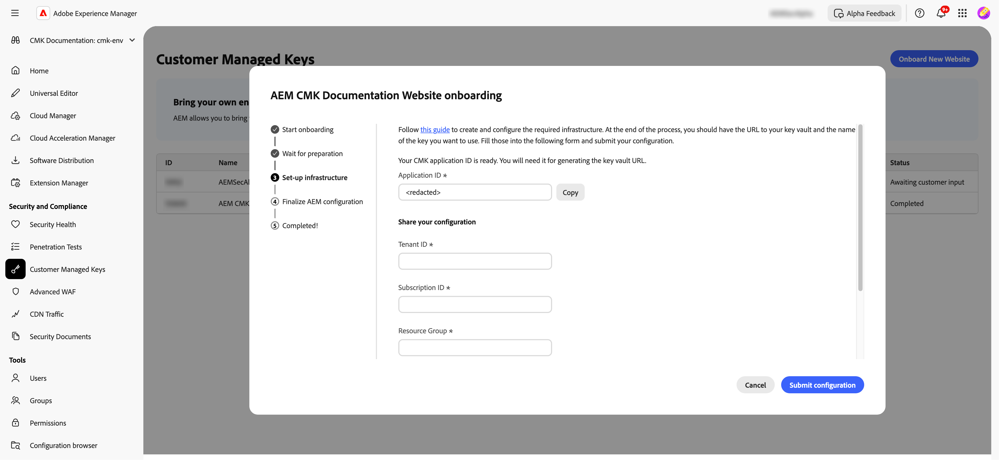

# Impostazione delle chiavi gestite dal cliente per AEM as a Cloud Service {#customer-managed-keys-for-aem-as-a-cloud-service}

AEM as a Cloud Service attualmente memorizza i dati dei clienti nell’archiviazione BLOB di Azure e MongoDB, utilizzando, per impostazione predefinita, le chiavi di crittografia gestite dal provider per proteggere i dati. Sebbene questa configurazione soddisfi le esigenze di sicurezza di molte organizzazioni, le aziende dei settori regolamentati o che necessitano di una sicurezza dei dati avanzata possono richiedere un maggiore controllo sulle proprie pratiche di crittografia. Per le organizzazioni che danno priorità alla sicurezza dei dati, alla conformità e alla capacità di gestire le proprie chiavi di crittografia, la soluzione CMK (Customer-Managed Keys, chiavi gestite dal cliente) offre un miglioramento fondamentale.

## Il problema da risolvere {#the-problem-being-solved}

Le chiavi gestite dal provider possono creare problemi per le aziende che richiedono maggiore privacy e integrità. Senza il controllo sulla gestione principale, le organizzazioni devono risolvere il problema di soddisfare i requisiti di conformità, implementare regole di sicurezza personalizzate e garantire la completa sovranità dei dati.

L’introduzione di CMK (Customer-Managed Keys) risolve questi problemi consentendo ai clienti AEM di avere pieno controllo sulle chiavi di crittografia. Autenticando tramite Microsoft Entra ID (in precedenza Azure Active Directory), AEM CS si connette in modo sicuro all’insieme di credenziali delle chiavi Azure del cliente, consentendogli di gestire il ciclo di vita delle chiavi di crittografia, che comprende la creazione, la rotazione e la revoca.

CMK offre diversi vantaggi:

* **Controlla la crittografia dei dati e delle applicazioni:** aumenta la sicurezza con la governance diretta dell’applicazione AEM e delle chiavi di crittografia dei dati.
* **Aumenta riservatezza e integrità:** riduci la probabilità di accesso e divulgazione involontari di dati sensibili o proprietari con una gestione completa della crittografia.
* **Supporto archiviazione chiave di Azure:** l’utilizzo dell’archiviazione chiave di Azure consente l’archiviazione delle chiavi, l’elaborazione delle operazioni di segretezza e l’esecuzione di rotazioni delle chiavi.

Adottando CMK, la clientela può aumentare il controllo sulle loro pratiche di sicurezza e crittografia dei dati, migliorandone la conformità e riducendone i rischi, il tutto pur continuando a godere della scalabilità e della flessibilità di AEM CS.

AEM as a Cloud Service consente di utilizzare chiavi di crittografia personalizzate per crittografare i dati quando sono inattivi. Questa guida descrive i passaggi per configurare una chiave gestita dal cliente (CMK) nell’insieme di credenziali delle chiavi Azure per AEM as a Cloud Service.

>[!WARNING]
>
>Dopo aver configurato CMK, non è possibile ripristinare le chiavi gestite dal sistema. L’utente è responsabile della gestione sicura delle chiavi e della gestione degli accessi all’insieme di credenziali delle chiavi, alla chiave e all’app CMK in Azure per evitare di perdere l’accesso ai dati.

Verranno inoltre illustrati i seguenti passaggi per la creazione e la configurazione dell’infrastruttura richiesta:

1. Configurare l’ambiente
1. Ottenere un ID applicazione da Adobe
1. Creare un nuovo gruppo di risorse
1. Creare un archivio chiavi
1. Concedere ad Adobe l’accesso all’archivio chiavi
1. Creare una chiave di crittografia

È necessario condividere con Adobe l’URL dell’insieme di credenziali delle chiavi, il nome della chiave di crittografia e le informazioni sull’insieme di credenziali delle chiavi.

## Configurare l’ambiente {#setup-your-environment}

L’interfaccia CLI (Command Line Interface) di Azure è l’unico requisito per questa guida. Se Azure CLI non è già installato, segui le istruzioni di installazione ufficiali [qui](https://learn.microsoft.com/it-it/cli/azure/install-azure-cli).

Prima di procedere con il resto di questa guida, accedere alla CLI con `az login`.

>[!NOTE]
>
>Anche se questa guida utilizza Azure CLI, è possibile eseguire le stesse operazioni tramite la console Azure. Se preferisci utilizzare la console Azure, utilizza i comandi seguenti come riferimento.


## Avviare il processo di configurazione CMK per AEM as a Cloud Service {#request-cmk-for-aem-as-a-cloud-service}

Devi richiedere la configurazione di Customer Managed Keys (CMK) per il tuo ambiente AEM as a Cloud Service tramite l’interfaccia utente. A questo scopo, passa all&#39;interfaccia utente di AEM Home Security, nella sezione **Chiavi gestite dal cliente**.
Puoi quindi avviare il processo di onboarding facendo clic sul pulsante **Avvia onboarding**.


## Ottenere un ID applicazione da Adobe {#obtain-an-application-id-from-adobe}

Dopo aver avviato il processo di onboarding, Adobe fornirà un ID applicazione Entra. Questo ID applicazione è necessario per il resto della guida e verrà utilizzato per creare un’entità servizio che consenta ad Adobe di accedere all’insieme di credenziali delle chiavi. Se non disponi già di un ID applicazione, devi attendere che venga fornito da Adobe.


Al termine della richiesta, potrai visualizzare l’ID applicazione nell’interfaccia utente della CMK.



## Creare un nuovo gruppo di risorse {#create-a-new-resource-group}

Crea un nuovo gruppo di risorse in una posizione a tua scelta.

```powershell
# Choose a location and a name for the resource group.
$location="<AZURE LOCATION>"
$resourceGroup="<RESOURCE GROUP>"

# Create the resource group.
az group create --location $location --resource-group $resourceGroup
```

Se disponi già di un gruppo di risorse, puoi utilizzarlo. Nel resto di questa guida, la posizione del gruppo di risorse e il suo nome sono identificati rispettivamente con `$location` e `$resourceGroup`.

## Creare un insieme di credenziali delle chiavi {#create-a-key-vault}

È necessario creare un insieme di credenziali delle chiavi per contenere la chiave di crittografia. Nell’insieme di credenziali delle chiavi deve essere attivata la protezione da eliminazione. La protezione da eliminazione è necessaria per crittografare i dati a riposo da altri servizi Azure. L’accesso alla rete pubblica deve essere abilitato per garantire che i servizi Adobe possano accedere all’insieme di credenziali delle chiavi.

>[!IMPORTANT]
>La creazione del Key Vault con l’accesso alla rete pubblica disabilitato impone che tutte le operazioni relative ad esso come la creazione o la rotazione, vengano eseguite da un ambiente con accesso di rete al Key Vault, ad esempio una macchina virtuale in grado di accedervi.

```powershell
# Reuse this information from the previous step.
$location="<AZURE LOCATION>"
$resourceGroup="<RESOURCE GROUP>"

# Choose a name for the key vault.
$keyVaultName="<KEY VAULT NAME>"

# Create the key vault.
az keyvault create `
  --location $location `
  --resource-group $resourceGroup `
  --name $keyVaultName `
  --default-action=Allow `
  --enable-purge-protection `
  --enable-rbac-authorization `
  --public-network-access Enabled
```

## Concedere l’accesso al Key Vault ad Adobe {#grant-adobe-access-to-the-key-vault}

In questo passaggio consentirai ad Adobe di accedere al Key Vault tramite un’applicazione Entra. L’ID dell’applicazione Entra è già stato fornito da Adobe.

Innanzitutto, devi creare un&#39;entità servizio collegata all&#39;applicazione Entra e assegnare a essa i ruoli **Key Vault Reader** e **Key Vault Crypto User**. I ruoli sono limitati al Key Vault creato in questa guida.

```powershell
# Reuse this information from the previous steps.
$resourceGroup="<RESOURCE GROUP>"
$keyVaultName="<KEY VAULT NAME>"

# The application ID is provided by Adobe.
$appId="<APPLICATION ID>"

# Retrieve the ID of the key vault.
$keyVaultId=(az keyvault show --resource-group $resourceGroup --name $keyVaultName --query id --output tsv)

# Create a new service principal.
$servicePrincipalId=(az ad sp create --id $appId --query id --out tsv)

# Assign the roles to the service principal.
az role assignment create --assignee $servicePrincipalId --role "Key Vault Reader" --scope $keyVaultId
az role assignment create --assignee $servicePrincipalId --role "Key Vault Crypto User" --scope $keyVaultId
```

## Creare una chiave di crittografia {#create-an-encryption-key}

Infine, puoi creare una chiave di crittografia nel Key Vault. Per completare questo passaggio, è necessario il ruolo di **Responsabile della crittografia di Key Vault**. Se l’utente che ha effettuato l’accesso non dispone di questo ruolo, contatta l’amministratore di sistema per ottenere l’autorizzazione per questo ruolo o chiedere a un utente che dispone già di tale ruolo di completare questo passaggio.

Per creare la chiave di crittografia è necessario l’accesso di rete al Key Vault. Verifica innanzitutto di poter accedere al Key Vault e di procedere con la creazione della chiave:

```powershell
# Reuse this information from the previous steps.
$keyVaultName="<KEY VAULT NAME>"

# Choose a name for your key.
$keyName="<KEY NAME>"

# Create the key.
az keyvault key create --vault-name $keyVaultName --name $keyName
```

## Condividere le informazioni del Key Vault {#share-the-key-vault-information}

A questo punto, è tutto pronto. È sufficiente condividere alcune informazioni richieste tramite l’interfaccia utente di CMK, che avvierà il processo di configurazione dell’ambiente.

```powershell
# Reuse this information from the previous steps.
$resourceGroup="<RESOURCE GROUP>"
$keyVaultName="<KEY VAULT NAME>"

# Retrieve the URL of your key vault.
$keyVaultUri=(az keyvault show --name $keyVaultName `
    --resource-group $resourceGroup `
    --query properties.vaultUri `
    --output tsv)

# In addition we would need the tenantId and the subscriptionId in order to setup the connection.
$tenantId=(az keyvault show --name $keyVaultName `
    --resource-group $resourceGroup `
    --query properties.tenantId `
    --output tsv)
$subscriptionId="<Subscription ID>"
```
Fornisci queste informazioni nell’interfaccia utente della CMK:


## Implicazioni della revoca dell’accesso alla chiave {#implications-of-revoking-key-access}

La revoca o la disabilitazione dell’accesso alla chiave del Key Vault o all’app CMK può causare interruzioni significative, tra cui l’interruzione delle modifiche alle operazioni di Platform. Una volta che queste chiavi sono disattivate, i dati in Platform potrebbero diventare inaccessibili e tutte le operazioni a valle che si basano su tali dati cesseranno di funzionare. È fondamentale comprendere appieno gli impatti a valle prima di apportare qualsiasi modifica alle configurazioni chiave.

Se decidi di revocare l’accesso di Platform ai tuoi dati, puoi farlo rimuovendo il ruolo utente associato all’applicazione dal Key Vault in Azure.

## Passaggi successivi {#next-steps}

Dopo aver fornito le informazioni richieste nell’interfaccia utente di CMK, Adobe avvierà il processo di configurazione per l’ambiente AEM as a Cloud Service. Questo processo può richiedere un po’ di tempo e riceverai una notifica una volta completato.


## Completare la configurazione della CMK {#complete-the-cmk-setup}

Una volta completato il processo di configurazione, potrai vedere lo stato della configurazione della CMK nell’interfaccia utente. È inoltre possibile visualizzare l&#39;insieme di credenziali delle chiavi e la chiave di crittografia.


## Domande e supporto {#questions-and-support}

Contattaci in caso di domande, richieste o assistenza sulla configurazione di Customer Managed Keys per AEM as a Cloud Service. Il supporto Adobe può aiutarti con qualsiasi domanda.
