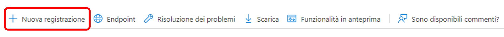

# Supporto OAuth2 per il servizio di posta {#oauth2-support-for-the-mail-service}

AEM as a Cloud Service offre il supporto OAuth2 per il servizio di posta integrato, al fine di consentire alle organizzazioni di rispettare i requisiti e-mail sicuri.

Puoi configurare OAuth per più provider di posta elettronica. Di seguito sono riportate le istruzioni dettagliate per configurare il servizio di posta AEM per l’autenticazione tramite OAuth2 con Microsoft Office 365 Outlook. Altri fornitori possono essere configurati in modo simile.

Per ulteriori informazioni sul servizio di posta AEM as a Cloud Service, consulta [Invio di e-mail](/help/implementing/developing/introduction/development-guidelines.md#sending-email).

## Microsoft® Outlook {#microsoft-outlook}

1. Vai a [https://portal.azure.com/](https://portal.azure.com/) e accedi.
1. Cerca **Azure Active Directory** nella barra di ricerca e fai clic sul risultato. In alternativa, è possibile passare direttamente a [https://portal.azure.com/#blade/Microsoft_AAD_IAM/ActiveDirectoryMenuBlade/Overview](https://portal.azure.com/#blade/Microsoft_AAD_IAM/ActiveDirectoryMenuBlade/Overview)
1. Fai clic su **Registrazione app** > **Nuova registrazione**.

   

1. Compila le informazioni in base alle tue esigenze, quindi fai clic su **Registra**.
1. Passa all’app creata e seleziona **Autorizzazioni API**.
<!-- Alexandru: removing as a result of CQDOC-20609 
1. Click **Add Permission** > **Graph Permission** > **Delegated Permissions**. -->
1. Seleziona le seguenti autorizzazioni per la tua app, quindi fai clic su **Aggiungi autorizzazione**:

   >[!NOTE]
   >
   >La configurazione delle autorizzazioni può evolvere nel tempo. Se non funzionano come previsto, contatta Microsoft®.

   * `https://outlook.office.com/SMTP.Send`
   * `openid`
   * `offline_access`
   * `email`
   * `profile`
1. Passa a **Autenticazione** > **Aggiungi una piattaforma** > **Web** e nella sezione **URL di reindirizzamento** aggiungi i seguenti URL - uno con e uno senza una barra:
   * `http://localhost/`
   * `http://localhost`
1. Premi **Configura** dopo aver aggiunto ogni URL e configurato le impostazioni in base alle tue esigenze.
1. Quindi, passa a **Certificati e segreti**, fai clic su **Nuovo segreto client** e segui i passaggi sullo schermo per creare un segreto. Assicurati di prendere nota di questo segreto per utilizzarlo in seguito.
1. Premi **Panoramica** nel riquadro a sinistra e copia i valori per **ID applicazione (client)** e **ID directory (tenant)** per utilizzarlo in seguito.

Per ricapitolare, utilizza le seguenti informazioni per configurare OAuth2 per il servizio di posta sul lato AEM:

* L’URL di autenticazione, che verrà costruito con l’ID tenant. Ha il seguente modulo: `https://login.microsoftonline.com/<tenantID>/oauth2/v2.0/authorize`
* L’URL del token, che verrà costruito con l’ID tenant. Ha il seguente modulo: `https://login.microsoftonline.com/<tenantID>/oauth2/v2.0/token`
* L’URL di aggiornamento, che verrà costruito con l’ID tenant. Ha il seguente modulo: `https://login.microsoftonline.com/<tenantID>/oauth2/v2.0/token`
* ID client
* Segreto client

### Generazione del token di aggiornamento {#generating-the-refresh-token}

Quindi, genera il token di aggiornamento, che fa parte della configurazione OSGi in un passaggio successivo, effettuando le seguenti operazioni:

1. Apri il seguente URL nel browser dopo la sostituzione di `clientID` e `tenantID` con i valori specifici del tuo account:

   ```
   https://login.microsoftonline.com/%3ctenantID%3e/oauth2/v2.0/authorize?client_id=%3cclientId%3e&response_type=code&redirect_uri=http://localhost&response_mode=query&scope=https://outlook.office.com/SMTP.Send%20email%20openid%20profile%20offline_access&state=12345`
   ```

1. Quando richiesto, concedi l’autorizzazione.
1. L’URL verrà reindirizzato a una nuova posizione, in questo formato:

   ```
   http://localhost/?code=<code>&state=12345&session_state=4f984c6b-cc1f-47b9-81b2-66522ea83f81#`
   ```

1. Copia il valore di `<code>` nell’esempio precedente.
1. Usa il seguente comando cURL per ottenere il refreshToken. Sostituisci tenantID, clientID e clientSecret con i valori per il tuo account e il valore per `<code>`:

   ```
   curl --location --request POST 'https://login.microsoftonline.com/<tenantId>/oauth2/v2.0/token' \
   --header 'Content-Type: application/x-www-form-urlencoded' \
   --header 'Cookie: buid=0.ARgAep0nU49DzUGmoP2wnvyIkcQjsx26HEpOnvHS0akqXQgYAAA.AQABAAEAAAD--DLA3VO7QrddgJg7Wevry9XPJSKbGVlPt5NWYxLtTl3K1W0LwHXelrffApUo_K02kFrkvmGm94rfBT94t25Zq4bCd5IM3yFOjWb3V22yDM7-rl112sLzbBQBRCL3QAAgAA; esctx=AQABAAAAAAD--DLA3VO7QrddgJg7Wevr4a8wBjYcNbBXRievdTOd15caaeAsQdXeBAQA3tjVQaxmrOXFGkKaE7HBzsJrzA-ci4RRpor-opoo5gpGLh3pj_iMZuqegQPEb1V5sUVQV8_DUEbBv5YFV2eczS5EAhLBAwAd1mHx6jYOL8LwZNDFvd2-MhVXwPd6iKPigSuBxMogAA; x-ms-gateway-slice=estsfd; stsservicecookie=estsfd; fpc=Auv6lTuyAP1FuOOCfj9w0U_5vR5dAQAAALDXP9gOAAAAwIpkkQEAAACT2T_YDgAAAA' \
   --data-urlencode 'client_id=<clientID>' \
   --data-urlencode 'redirect_uri=http://localhost' \
   --data-urlencode 'grant_type=authorization_code' \
   --data-urlencode 'client_secret=<clientSecret>' \
   --data-urlencode 'code=<code>'
   ```

1. Prendi nota di refreshToken e accessToken.

### Convalida dei token {#validating-the-tokens}

Prima di procedere alla configurazione di OAuth sul lato AEM, assicurati di convalidare sia accessToken che refreshToken con la procedura seguente:

1. Genera l’accessToken utilizzando il refreshToken creato nella procedura precedente utilizzando il seguente cURL, sostituendo i valori per `<client_id>`,`<client_secret>`, e `<refreshToken>`:

   ```
   curl --location --request POST 'https://login.microsoftonline.com/<tenetId>/oauth2/v2.0/token' \
   --header 'Content-Type: application/x-www-form-urlencoded' \
   --header 'Cookie: buid=0.ARgAep0nU49DzUGmoP2wnvyIkcQjsx26HEpOnvHS0akqXQgYAAA.AQABAAEAAAD--DLA3VO7QrddgJg7Wevry9XPJSKbGVlPt5NWYxLtTl3K1W0LwHXelrffApUo_K02kFrkvmGm94rfBT94t25Zq4bCd5IM3yFOjWb3V22yDM7-rl112sLzbBQBRCL3QAAgAA; esctx=AQABAAAAAAD--DLA3VO7QrddgJg7Wevr4a8wBjYcNbBXRievdTOd15caaeAsQdXeBAQA3tjVQaxmrOXFGkKaE7HBzsJrzA-ci4RRpor-opoo5gpGLh3pj_iMZuqegQPEb1V5sUVQV8_DUEbBv5YFV2eczS5EAhLBAwAd1mHx6jYOL8LwZNDFvd2-MhVXwPd6iKPigSuBxMogAA; x-ms-gateway-slice=estsfd; stsservicecookie=estsfd; fpc=Auv6lTuyAP1FuOOCfj9w0U_IezHLAQAAAPeNSdgOAAAA' \
   --data-urlencode 'client_id=<client_id>' \
   --data-urlencode 'scope=https://outlook.office.com/SMTP.Send https://graph.microsoft.com/Mail.Read https://graph.microsoft.com/Mail.Send https://graph.microsoft.com/User.Read email openid profile offline_access' \
   --data-urlencode 'redirect_uri=http://localhost' \
   --data-urlencode 'grant_type=refresh_token' \
   --data-urlencode 'client_secret=<client_secret>' \
   --data-urlencode 'refresh_token=<refreshToken>'
   ```

1. Invia una e-mail utilizzando accessToken, in modo da poter vedere se funziona correttamente.

>[!NOTE]
>
> Puoi ottenere la raccolta API Postman da [questa posizione](https://learn.microsoft.com/it-it/entra/identity-platform/v2-oauth2-auth-code-flow).
>
> Per ulteriori dettagli, consulta la [documentazione di MSFT OAuth](https://learn.microsoft.com/it-it/exchange/client-developer/legacy-protocols/how-to-authenticate-an-imap-pop-smtp-application-by-using-oauth).

### Integrazione con AEM as a Cloud Service {#integration-with-aem-as-a-cloud-service}

1. Crea un file di proprietà OSGI denominato `com.day.cq.mailer.oauth.impl.OAuthConfigurationProviderImpl.cfg.json` sotto `/apps/<my-project>/osgiconfig/config` con la seguente sintassi:

   ```
   {
       authUrl: "<Authorization Url>",
       tokenUrl: "<Token Url>",
       clientId: "<clientID>",
       clientSecret: "$[secret:SECRET_SMTP_OAUTH_CLIENT_SECRET]",
       scopes: [
          "scope1",
          "scope2"
       ],
       authCodeRedirectUrl: "http://localhost",
       refreshUrl: "<Refresh token Url>",
       refreshToken: "$[secret:SECRET_SMTP_OAUTH_REFRESH_TOKEN]"
   }
   ```

1. Compila il `authUrl`, `tokenUrl`, e `refreshURL` costruendoli come descritto nella sezione precedente.
1. Aggiungi i seguenti ambiti alla configurazione:

   >[!NOTE]
   >
   >Gli ambiti possono evolvere nel tempo. Se non funzionano come previsto, contatta Microsoft®.

   * `https://outlook.office.com/SMTP.Send`
   * `openid`
   * `offline_access`
   * `email`
   * `profile`
1. Crea un file di proprietà OSGI denominato `called com.day.cq.mailer.DefaultMailService.cfg.json`
nella sezione `/apps/<my-project>/osgiconfig/config` con la seguente sintassi: I valori `smtp.host` e `smtp.port` riflettono la configurazione di rete avanzata, come descritto nel [Tutorial sul servizio e-mail](https://experienceleague.adobe.com/it/docs/experience-manager-learn/cloud-service/networking/examples/email-service).

   ```
   {
    "smtp.host": "$[env:AEM_PROXY_HOST;default=proxy.tunnel]",
    "smtp.user": "<user account that logged into get the oauth tokens>",
    "smtp.password": "value not used",
    "smtp.port": 30465,
    "from.address": "<from address used for sending>",
    "smtp.ssl": false,
    "smtp.starttls": true,
    "smtp.requiretls": true,
    "debug.email": false,
    "oauth.flow": true
   }
   ```

1. Per Outlook, il `smtp.host` valore di configurazione è `smtp.office365.com`
1. In fase di runtime, passa i segreti `refreshToken values` e `clientSecret` che utilizzano l’[API delle variabili di Cloud Manager](/help/implementing/deploying/configuring-osgi.md#setting-values-via-api) oppure utilizza [Cloud Manager per aggiungere variabili](/help/implementing/cloud-manager/environment-variables.md). I valori delle variabili `SECRET_SMTP_OAUTH_REFRESH_TOKEN` e `SECRET_SMTP_OAUTH_CLIENT_SECRET` devono essere definiti.

### Risoluzione dei problemi {#troubleshooting}

Se il servizio di posta non funziona correttamente, nella maggior parte dei casi sarà necessario rigenerare il `refreshToken` come descritto in precedenza, passando il nuovo valore tramite l’API di Cloud Manager. L’implementazione del nuovo valore richiede alcuni minuti.
