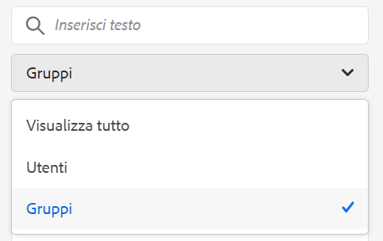
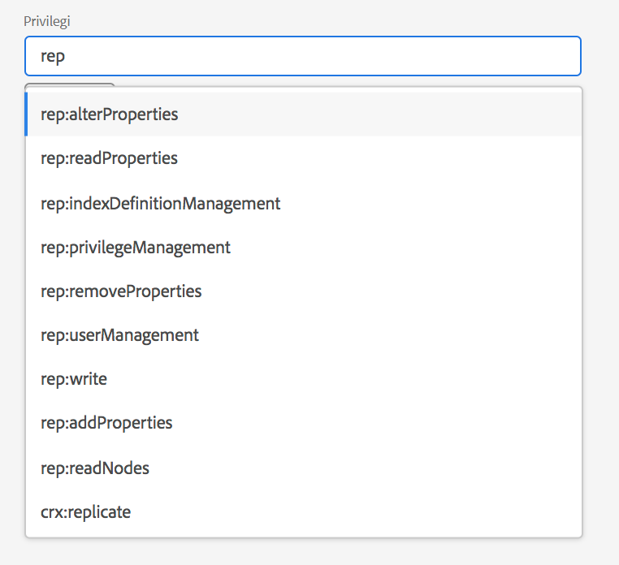
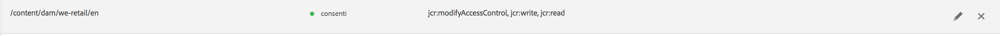

# Visualizzazione principale per la gestione delle autorizzazioni {#principal-view-for-permissions-management}

## Panoramica {#overview}

AEM introduce la gestione delle autorizzazioni per utenti e gruppi. La funzionalità principale rimane la stessa dell’interfaccia classica, ma è più semplice ed efficiente.

## Accesso all’interfaccia utente {#accessing-the-ui}

La nuova gestione delle autorizzazioni basata sull’interfaccia utente è accessibile tramite la scheda Autorizzazioni in Sicurezza, come illustrato di seguito:

La nuova visualizzazione consente di esaminare più facilmente l’intero insieme di privilegi e restrizioni per una determinata entità principale in tutti i percorsi in cui sono state concesse esplicitamente le autorizzazioni. Questa interfaccia elimina la necessità di passare a

CRXDE per gestire privilegi e restrizioni avanzati. È stato consolidato nella stessa visualizzazione.

È disponibile un filtro che consente all’utente di selezionare il tipo di entità principali da esaminare: **Utenti**, **Gruppi** o **Tutti** e cercare qualunque entità&#x200B;**.**

## Visualizzazione delle autorizzazioni per un’entità principale {#viewing-permissions-for-a-principal}

Il riquadro a sinistra consente agli utenti di scorrere verso il basso per trovare un’entità principale o cercare un gruppo o un utente in base al filtro selezionato, come illustrato di seguito:

Facendo clic sul nome, a destra vengono visualizzate le autorizzazioni assegnate. Il riquadro delle autorizzazioni mostra l’elenco delle voci di controllo degli accessi in percorsi specifici con le restrizioni configurate.

## Aggiunta di una nuova voce di controllo degli accessi per un’entità principale {#adding-new-access-control-entry-for-a-principal}

È possibile aggiungere nuove autorizzazioni aggiungendo una voce di controllo degli accessi. È sufficiente fare clic sul pulsante Aggiungi ACE.

Questo fa apparire la finestra mostrata di seguito. Il passaggio successivo consiste nello scegliere un percorso in cui configurare l’autorizzazione.

In questo caso, viene selezionato un percorso in cui è possibile configurare un’autorizzazione per **dam-users**:

Dopo aver selezionato il percorso, il flusso di lavoro torna a questa schermata, in cui l’utente può selezionare uno o più privilegi dagli spazi dei nomi disponibili (ad esempio `jcr`, `rep` o `crx`) come mostrato di seguito.

I privilegi possono essere aggiunti effettuando una ricerca dal campo di testo e selezionando dall’elenco.

>[!NOTE]
>
>Per un elenco completo dei privilegi e delle descrizioni, consulta [Gestione di utenti, gruppi e dei diritti di accesso](https://experienceleague.adobe.com/it/docs/experience-manager-65/content/security/user-group-ac-admin#access-right-management).

 

Dopo aver selezionato l’elenco dei privilegi, l’utente può scegliere il tipo di autorizzazione: Nega o Consenti, come mostrato di seguito.

 

## Utilizzo delle restrizioni {#using-restrictions}

Oltre all’elenco dei privilegi e al tipo di autorizzazione su un determinato percorso, questa schermata consente di aggiungere restrizioni per il controllo degli accessi in dettaglio, come mostrato di seguito:

>[!NOTE]
>
>Per ulteriori informazioni sul significato di ciascuna restrizione, consulta [la documentazione Jackrabbit Oak](https://jackrabbit.apache.org/oak/docs/security/authorization/restriction.html).

Le restrizioni possono essere aggiunte, come mostrato di seguito, scegliendo il tipo, immettendo il valore e premendo l’icona **+**.

 

La nuova ACE viene riflessa nell’elenco di controllo degli accessi, come illustrato di seguito. Tieni presente che `jcr:write` è un privilegio aggregato che include `jcr:removeNode` aggiunto in precedenza ma non è mostrato di seguito poiché viene trattato in `jcr:write`.

## Modifica delle ACE {#editing-aces}

Le voci di controllo degli accessi (ACE) possono essere modificate selezionando un’entità principale e scegliendo l’ACE che si desidera modificare.

Ad esempio, facendo clic sull’icona a forma di matita a destra puoi modificare la voce seguente per **dam-users**:

Viene visualizzata la schermata di modifica con preselezionate le ACE configurate. Per eliminarle, fai clic sull’icona a forma di croce accanto ad esse oppure puoi aggiungere nuovi privilegi per il percorso specificato, come mostrato di seguito.

Qui viene aggiunto il privilegio `addChildNodes` per **dam-users** sul percorso specificato.

Le modifiche possono essere salvate facendo clic sul pulsante **Salva** in alto a destra e queste vengono riflesse nelle nuove autorizzazioni per **dam-users**, come mostrato di seguito:

## Eliminazione delle ACE {#deleting-aces}

È possibile eliminare le voci di controllo degli accessi per rimuovere tutte le autorizzazioni concesse a un’entità principale in un percorso specifico. L’icona X accanto all’ACE può essere utilizzata per eliminarla come illustrato di seguito:

 

## Visualizzazione autorizzazione {#permissions-view}

### Visualizzazione autorizzazioni nell’interfaccia utente touch {#touch-ui-permisions-view}

Gli amministratori hanno bisogno di maggiore controllo granulare e visibilità sulle assegnazioni delle autorizzazioni a livello di nodo per migliorare la sicurezza e la gestione in AEM. In precedenza, era disponibile solo una visualizzazione delle autorizzazioni basata sull’entità principale, che limitava la possibilità di vedere come le ACL vengono applicate a nodi specifici o viste filtrate. Il nuovo nodo e la vista filtrata forniscono una prospettiva dettagliata e contestuale delle assegnazioni delle autorizzazioni, consentendo una migliore gestione e l’audit delle configurazioni di sicurezza. Questa funzione ottimizza la supervisione amministrativa e semplifica la gestione delle autorizzazioni, migliora la sicurezza, riduce le configurazioni errate e semplifica i controlli degli accessi degli utenti in AEM.

Puoi accedere alla vista dell’interfaccia utente touch Autorizzazioni facendo clic su **Strumenti - Sicurezza - Autorizzazioni**, come mostrato di seguito:

Dopo aver avviato la vista Autorizzazioni, puoi fare clic su **Visualizzazione nodo** o **Visualizzazione filtrata** nell’angolo superiore a destra dello schermo, a seconda delle tue preferenze.

#### Visualizzazione nodo

In questa visualizzazione, le ACL vengono presentate per ogni singolo nodo (percorso). Fornisce informazioni su:

ACL locali per il nodo selezionato.
ACL effettive, che includono ACL applicate a ciascun nodo principale fino alla radice (“/”).
Gli utenti possono aggiungere, rimuovere o aggiornare le ACL. Facendo clic su un percorso, nel riquadro a sinistra vengono visualizzati i relativi elementi secondari, mentre sul lato destro viene visualizzata una tabella di tutte le ACL associate al percorso.

#### Visualizzazione filtrata

Questa visualizzazione consente agli utenti di cercare in modo efficiente le autorizzazioni sul percorso e sulle entità specificati. In questa visualizzazione, gli utenti possono determinare facilmente il tipo di autorizzazioni concesse a un gruppo di entità principali per il percorso selezionato.
Inoltre, la Visualizzazione filtrata fornisce informazioni approfondite sulle ACL effettive. Le ACL vengono mostrate in associazione al nodo principale del percorso selezionato, tenendo in considerazione l’entità principale selezionata e tutte le entità comuni.

### Visualizzazione delle autorizzazioni del browser dell’archivio {#the-repository-browser-permissions-view}

È possibile accedere alla visualizzazione autorizzazioni tramite il [Browser dell’archivio](/help/implementing/developing/tools/repository-browser.md).

Puoi accedere:

1. Aprendo la Developer Console facendo clic sulla scheda **Browser dell’archivio** e quindi su **apri Browser dell’archivio**

   

1. Dal Browser dell’archivio, fai clic sulla scheda **Autorizzazioni**

   

**Nota**: per visualizzare le autorizzazioni sono necessari i diritti di amministratore. Segui i passaggi indicati [qui](/help/implementing/developing/tools/repository-browser.md#navigate-the-hierarchy-navigate-the-hierarchy) per accedere alle autorizzazioni.

## Combinazioni di privilegi dell’interfaccia classica {#classic-ui-privilege-combinations}

La nuova interfaccia utente delle autorizzazioni utilizza esplicitamente il set di privilegi di base invece di combinazioni predefinite che non riflettono realmente la precisione dei privilegi sottostanti concessi.

Si trattava di un sistema che causava confusione su ciò che veniva esattamente configurato. Nella tabella seguente viene elencata la mappatura tra le combinazioni di privilegi dell’interfaccia classica e i privilegi effettivi che le costituiscono:

<table>
 <tbody>
  <tr>
   <th>Combinazioni di privilegi dell’interfaccia classica</th>
   <th>Privilegio nell’interfaccia utente Autorizzazioni</th>
  </tr>
  <tr>
   <td>Lettura</td>
   <td><code>jcr:read</code></td>
  </tr>
  <tr>
   <td>Modificare</td>
   <td>
<code>jcr:modifyProperties</code>
 
<code>jcr:lockManagement</code>
 
<code>jcr:versionManagement</code>
 </td>
  </tr>
  <tr>
   <td>Creare</td>
   <td>
<code>jcr:addChildNodes</code>
 
<code>jcr:nodeTypeManagement</code>
 </td>
  </tr>
  <tr>
   <td>Eliminare</td>
   <td>
<code>jcr:removeNode</code>
 
<code>jcr:removeChildNodes</code>
 </td>
  </tr>
  <tr>
   <td>Leggere le ACL</td>
   <td><code>jcr:readAccessControl</code></td>
  </tr>
  <tr>
   <td>Modificare le ACL</td>
   <td><code>jcr:modifyAccessControl</code></td>
  </tr>
  <tr>
   <td>Replicare</td>
   <td><code>crx:replicate</code></td>
  </tr>
 </tbody>
</table>
