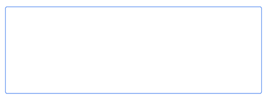

# Authoring dei frammenti di contenuto {#authoring-content-fragments}

L’authoring dei frammenti di contenuto si concentra sia sulla distribuzione headless che sull’authoring delle pagine.

Sono disponibili due editor per i frammenti di contenuto. L’editor descritto in questa sezione:

* è stato sviluppato per la distribuzione di contenuti headless (anche se può essere utilizzato per tutti gli scenari)
* è disponibile dalla console **Frammenti di contenuto**

Questo editor fornisce:

* [Salvataggio automatico](#saving-autosaving), per evitare la perdita accidentale di modifiche.
* [Caricamento in linea delle risorse come riferimenti di contenuto](#reference-images), senza doverle caricare prima in Asset DAM.
* [Genera varianti](#generate-variations-ai) per utilizzare l&#39;intelligenza artificiale generativa per accelerare la creazione dei contenuti in base alle richieste.
* [Anteprima](#preview-content-fragment) dell&#39;esperienza con rendering distribuita dal frammento di contenuto.
* Possibilità di [pubblicare](#publish-content-fragment) e [annullare la pubblicazione](#unpublish-content-fragment) dall&#39;editor.
* Possibilità di [visualizzare e aprire le copie per lingua associate](#view-language-copies) nell&#39;editor.
* Possibilità di [visualizzare i dettagli della versione](#view-version-history) nell&#39;editor. Puoi anche ripristinare una versione selezionata.
* Possibilità di [visualizzare e aprire i riferimenti principali](#view-parent-references).
* Una visualizzazione gerarchica del frammento di contenuto e dei relativi riferimenti, utilizzando la [struttura ad albero](#structure-tree).

>[!WARNING]
>
>L&#39;editor descritto in questa sezione è *only* disponibile in [Unified Shell](/help/overview/aem-cloud-service-on-unified-shell.md); quindi *online* Adobe Experience Manager (AEM) as a Cloud Service, non un&#39;istanza locale.

## Editor frammento di contenuto {#content-fragment-editor}

La prima volta che apri l’Editor frammento di contenuto vengono visualizzate quattro aree principali:

* Barra degli strumenti superiore: per informazioni chiave e azioni
   * Collegamento alla Console Frammenti di contenuto (icona Home)
   * Informazioni sul modello e sulla cartella
   * collegamenti a [Anteprima (se per il modello è configurato il modello URL di anteprima predefinito)](/help/sites-cloud/administering/content-fragments/managing-content-fragment-models.md#model-properties)
   * [Pubblica](#publish-content-fragment) e [Annulla pubblicazione](#unpublish-content-fragment) azioni
   * Opzione per mostrare tutti i **Riferimenti padre** (icona collegamento)
   * **[Stato](/help/sites-cloud/administering/content-fragments/managing.md#statuses-content-fragments)** del frammento e le ultime informazioni salvate
   * Pulsante di attivazione per passare all’editor originale (basato su Assets)

     >[!WARNING]
     >
     >L’editor originale viene aperto nella stessa scheda. Si sconsiglia di aprire entrambi gli editor contemporaneamente.

* Pannello a sinistra: presenta le **[Varianti](#variations)** del frammento di contenuto e i relativi **Campi**:
   * questi collegamenti possono essere utilizzati per [esplorare la struttura dei frammenti di contenuto](#navigate-structure)
* pannello a destra: presenta le schede [che mostrano le proprietà (metadati) e i tag](#view-properties-tags), informazioni sulla [cronologia delle versioni](#view-version-history) e informazioni relative a [copie per lingua](#view-language-copies)
   * Scheda **Proprietà**, in cui puoi aggiornare il **Titolo** e la **Descrizione** del frammento, oppure la **Variante**
   * Nella scheda **Commenti** puoi aggiungere e leggere commenti per collaborare con altri autori
* Pannello centrale: presenta i campi e il contenuto effettivi della variante selezionata
   * Consente di modificare il contenuto
      * se configurati (come più) nel modello, vari tipi di dati ti consentono di **Aggiungere** istanze del campo pertinente
   * Se i campi **Segnaposto scheda** sono definiti nel modello, vengono visualizzati qui e:
      * può essere utilizzato per la navigazione
      * verrà visualizzato orizzontalmente o come elenco a discesa

  >[!NOTE]
  >
  >A seconda delle definizioni nel modello sottostante, i campi possono essere soggetti a determinati tipi di [convalida](/help/assets/content-fragments/content-fragments-models.md#validation).

## Navigare nella struttura dei frammenti di contenuto {#navigate-structure}

Un singolo frammento di contenuto;

* È costituito da due livelli:

   * **[Varianti](#variations)** del frammento di contenuto
   * **Campi** - definiti dal modello per frammenti di contenuto e utilizzati da ogni variante

* Può contenere diversi riferimenti.

### Varianti e campi {#variations-and-fields}

Nel pannello a sinistra puoi vedere:

* l&#39;elenco di **[Varianti](#variations)** create per questo frammento:
   * **Principale** è la variante presente al momento della creazione del frammento di contenuto. Puoi aggiungerne altre in un secondo momento
   * puoi utilizzare Genera varianti (#generate-variations) per utilizzare un modello basato su prompt creato da Adobe per un caso d’uso specifico.
   * puoi anche [creare una variante](#create-variation)
* **Campi** all&#39;interno del frammento e relative varianti:
   * l&#39;icona indica il [Tipo di dati](/help/sites-cloud/administering/content-fragments/content-fragment-models.md#data-types)
   * il testo è il nome del campo
   * insieme, forniscono un collegamento diretto al contenuto del campo nel pannello centrale (per la variante corrente)

### Segui collegamenti {#follow-links}

In varie parti dell’editor è possibile visualizzare l’icona del collegamento. Questa icona può essere utilizzata per aprire l’elemento visualizzato, ad esempio un modello per frammenti di contenuto, un riferimento principale o un frammento a cui si fa riferimento:

### Albero struttura {#structure-tree}

Apri la scheda **Struttura** dalla barra degli strumenti dell&#39;editor per visualizzare la struttura gerarchica del frammento di contenuto e i relativi riferimenti. Utilizza le icone dei collegamenti per passare ai riferimenti.

>[!NOTE]
>
>Per ulteriori dettagli, vedere [Analisi della struttura dei frammenti di contenuto - Struttura](/help/sites-cloud/administering/content-fragments/analysis.md#structure-tree).

## Salvataggio e salvataggio automatico {#saving-autosaving}

<!-- CHECK: cannot be saved, no undo, redo -->

Con ogni aggiornamento effettuato, il frammento di contenuto viene salvato automaticamente. L’ultimo salvataggio viene visualizzato nella barra degli strumenti superiore.

## Varianti {#variations}

[Le varianti](/help/sites-cloud/administering/content-fragments/overview.md#main-and-variations) sono una caratteristica significativa dei frammenti di contenuto di AEM. Consentono di creare e modificare copie del contenuto **Principale** da utilizzare su canali e scenari specifici, rendendo ancora più flessibile la distribuzione di contenuti headless e l&#39;authoring delle pagine.

Dall’editor è possibile:

* [Crea varianti](#create-variation) del contenuto **Principale**

* [Utilizza Generate Variations AI](#generate-variations-ai) per utilizzare Generative AI per un modello basato su prompt creato da Adobe per un caso d&#39;uso specifico.

* Seleziona la variante richiesta per la modifica del contenuto

* [Rinomina la variante](#rename-variation)

* [Eliminare una variante](#delete-variation)

### Crea una variante {#create-variation}

Per creare una variante del frammento di contenuto:

1. Nel pannello a sinistra, seleziona il **segno più** (**Crea variante**) a destra di **Varianti**.

   >[!NOTE]
   >
   >Dopo aver creato la prima variante, le varianti esistenti vengono elencate nello stesso pannello.

   

1. Nella finestra di dialogo, immetti un **Titolo** per la variante e una **Descrizione** se necessario:

   

1. **Crea** la variante. Viene visualizzato nell&#39;elenco.

### Rinominare una variante {#rename-variation}

Per rinominare una **variante**:

1. Seleziona la variante desiderata.

1. Apri la scheda **Proprietà** nel pannello di destra.

1. Aggiorna la variante **Titolo**.

1. Premi **Invio** o passa a un altro campo per salvare automaticamente la modifica. Il titolo viene aggiornato nel pannello **Varianti** a sinistra.

### Creare varianti utilizzando GenAI con Genera varianti {#generate-variations-ai}

Utilizza le varianti generative per sfruttare l’intelligenza artificiale generativa per accelerare la creazione dei contenuti.

Apri l’Editor frammento di contenuto per trovare il punto di ingresso per Generare varianti.

Per ulteriori informazioni, consulta [Generate Variations - Integrated in AEM Editors](/help/generative-ai/generate-variations-integrated-editor.md).

### Eliminare una variante {#delete-variation}

Per eliminare una variante del frammento di contenuto:

    >[!NOTE]
    >
    >Impossibile eliminare **Main**.

1. Seleziona la Variante.

1. Nel pannello **Variante**, seleziona l&#39;icona Elimina (Cestino):

   

1. Viene visualizzata una finestra di dialogo. Seleziona **Elimina** per confermare l&#39;azione.

## Modifica campi di testo su più righe - Testo normale o Markdown {#edit-multi-line-text-fields-plaintext-markdown}

**[I campi di testo su più righe](/help/sites-cloud/administering/content-fragments/content-fragment-models.md#data-types)** possono avere uno dei tre formati seguenti:

* Testo normale
* [Markdown](/help/sites-cloud/administering/content-fragments/markdown.md)
* [Testo formattato](#edit-multi-line-text-fields-rich-text)

I campi definiti come Testo normale o Markdown hanno una casella di testo semplice, senza opzioni di formattazione (su schermo):

## Modifica campi di testo su più righe - Testo formattato {#edit-multi-line-text-fields-rich-text}

Per i campi **[Testo su più righe](/help/sites-cloud/administering/content-fragments/content-fragment-models.md#data-types)** definiti come **Testo formattato**, sono disponibili diverse funzionalità:

* Modifica il contenuto:
   * Annullare/Ripetere
   * Incolla/Incolla come testo
   * Copia
   * Seleziona formato paragrafo
   * Crea/gestisci tabella
   * Formato testo; grassetto, corsivo, sottolineato, colore
   * Imposta allineamento paragrafo
   * Crea/gestisci elenchi; puntati, numerati
   * Rientro testo; riduzione, aumento
   * Cancella formattazione corrente
   * Inserisci collegamenti
   * Selezionare e inserire riferimenti a risorse immagine
   * Aggiungi caratteri speciali
* [Editor a schermo intero](#full-screen-editor-rich-text) - passaggio da schermo intero a flusso interno
* [Statistiche](#statistics-rich-text)
* [Confronta e sincronizza](#compare-and-synchronize-rich-text)

Ad esempio:

>[!NOTE]
>
>I campi di testo su più righe sono inoltre indicati dall&#39;[icona](#fields-datatypes-icons) appropriata nel pannello **Campi**.

### Editor a schermo intero - Rich Text {#full-screen-editor-rich-text}

L’editor a schermo intero offre le stesse opzioni di modifica disponibili durante il flusso, ma offre più spazio per il testo.

Ad esempio:

### Statistiche - Rich Text {#statistics-rich-text}

L&#39;azione **Statistiche** visualizza un intervallo di informazioni sul testo in un campo Multiriga.

Ad esempio:

### Confronta e sincronizza - Testo formattato {#compare-and-synchronize-rich-text}

L&#39;azione **Confronta** è disponibile per i campi con più righe quando è aperta una **variante**.

Questo apre il campo Multiriga a schermo intero e:

* visualizza in parallelo il contenuto per **Principale** e la **Variante** corrente, evidenziando le eventuali differenze

* le differenze sono indicate dal colore:

   * Il contenuto aggiunto alla variante è indicato in verde
   * II contenuto rimosso dalla variante è indicato in rosso
   * Il testo sostituito è indicato in blu.

* fornisce l&#39;azione **Sincronizza**, che sincronizza il contenuto da **Principale** alla variante corrente

   * se **Principale** è stato aggiornato, queste modifiche verranno trasferite nella variante
   * se la variante è stata aggiornata, queste modifiche verranno sovrascritte dal contenuto di **Main**

  >[!CAUTION]
  >
  >La sincronizzazione è disponibile solo per copiare le modifiche *da **Principale**alla variante*.
  >
  >Il trasferimento delle modifiche *da una variante a **Principale*** non è disponibile come opzione.

Ad esempio, uno scenario in cui il contenuto della variante è stato completamente riscritto, in modo che una sincronizzazione sostituisca il nuovo contenuto con il contenuto di **Main**:

## Gestisci riferimenti {#manage-references}

### Riferimenti ai frammenti {#fragment-references}

[I riferimenti ai frammenti](/help/sites-cloud/administering/content-fragments/content-fragment-models.md#fragment-reference-nested-fragments) possono essere utilizzati per:

* [creare un riferimento a un frammento di contenuto esistente](#create-reference-existing-content-fragment)
* [creare un frammento di contenuto e quindi farvi riferimento](#create-reference-content-fragment)

#### Creare un riferimento a un frammento di contenuto esistente {#create-reference-existing-content-fragment}

Per creare un riferimento a un frammento di contenuto esistente:

1. Seleziona il campo.
1. Seleziona **Aggiungi frammento esistente**.
1. Seleziona il frammento richiesto dal selettore di frammenti.

   >[!NOTE]
   >
   >È possibile selezionare un solo frammento alla volta.

#### Creare un frammento di contenuto e un riferimento {#create-reference-content-fragment}

In alternativa, è possibile [selezionare **Crea nuovo frammento** per aprire la finestra di dialogo **Crea**](/help/sites-cloud/administering/content-fragments/managing.md#creating-a-content-fragment). Una volta creato, viene fatto riferimento a questo frammento.

### Riferimenti al contenuto {#content-references}

[I riferimenti ai contenuti](/help/sites-cloud/administering/content-fragments/content-fragment-models.md#content-reference) vengono utilizzati per fare riferimento ad altri tipi di contenuti AEM, come immagini, pagine e frammenti di esperienza.

#### Immagini di riferimento {#reference-images}

Nei campi **Riferimento contenuto** puoi:

* risorse di riferimento già esistenti nell’archivio locale
* fare riferimento alle risorse che risiedono in un archivio remoto
* carica le risorse direttamente nel campo; questo evita la necessità di utilizzare la console **Assets** per caricare

  >[!NOTE]
  >
  >Per caricare direttamente un&#39;immagine nel campo **Riferimento contenuto**, **deve**:
  >
  >* hanno un **Percorso principale** definito (nel [Modello per frammenti di contenuto](/help/sites-cloud/administering/content-fragments/content-fragment-models.md#content-reference)). Specifica dove verrà memorizzata l&#39;immagine.
  >* includi **Immagine** nell&#39;elenco dei tipi di contenuto accettati

##### Assets locale di riferimento {#reference-local-assets}

Per fare riferimento a una risorsa locale, puoi effettuare le seguenti operazioni:

* trascina e rilascia il nuovo file di risorse direttamente (ad esempio, dal file system) nel campo **Riferimento contenuto**
* utilizza l&#39;azione **Aggiungi risorsa**, quindi seleziona **Sfoglia Assets** o **Carica** per aprire il selettore appropriato da utilizzare:

  

##### Riferimento ad Assets remoto {#reference-remote-assets}

Per fare riferimento a risorse remote:

1. Specifica l&#39;**archivio** remoto durante la ricerca delle risorse:

   

2. Dopo la selezione, la posizione può essere visualizzata nelle informazioni sulla risorsa:

   

###### Assets remoto - Limitazioni {#remote-assets-limitations}

Esistono alcune limitazioni quando si fa riferimento a risorse remote:

* Solo [risorse approvate](/help/assets/approve-assets.md) sono disponibili per riferimento da un archivio risorse remoto.

* Se una risorsa a cui si fa riferimento viene rimossa dall’archivio remoto, si verifica un errore in Riferimento al contenuto.

* Tutti gli archivi di risorse di consegna a cui l’utente ha accesso sono disponibili per la selezione, l’elenco disponibile non può essere limitato.

* L’istanza di AEM e l’istanza remota del repository di risorse devono avere la stessa versione.

* Nessun metadati di risorse viene esposto tramite l’API di gestione o l’API di consegna. Per recuperare i dettagli dei metadati della risorsa, devi utilizzare l’API Asset Metadata:

   * i metadati delle singole risorse: [https://developer.adobe.com/experience-cloud/experience-manager-apis/api/stable/assets/delivery/#operation/getAssetMetadata](https://developer.adobe.com/experience-cloud/experience-manager-apis/api/stable/assets/delivery/#operation/getAssetMetadata)

   * ottenere informazioni in blocco sui metadati utilizzando l&#39;API di ricerca (sperimentale): [https://developer.adobe.com/experience-cloud/experience-manager-apis/api/stable/assets/delivery/#operation/search](https://developer.adobe.com/experience-cloud/experience-manager-apis/api/stable/assets/delivery/#operation/search)

>[!NOTE]
>
>Vedi anche [API GraphQL di AEM per l&#39;utilizzo con Frammenti di contenuto - Dynamic Media per il supporto di risorse OpenAPI (Assets remoto)](/help/headless/graphql-api/content-fragments.md#dynamic-media-for-openapi-asset-support)

#### Pagine di riferimento {#reference-pages}

Per aggiungere riferimenti a pagine AEM, frammenti di esperienza o altri tipi di contenuto di questo tipo:

1. Selezionare **Aggiungi percorso contenuto**.

1. Aggiungi il percorso richiesto nel campo di input.

1. Conferma con **Aggiungi**.

>[!NOTE]
>
>Questo non deve essere utilizzato per riferimenti a:
>
>* Frammenti di contenuto - Utilizzare un [Riferimento frammento](#fragment-references)
>* Immagini - Usa [Immagini di riferimento](#reference-images)

### Visualizza riferimenti padre {#view-parent-references}

Selezionando l’icona del collegamento nella barra degli strumenti superiore si apre un elenco di tutti i riferimenti principali.

Ad esempio:

Viene visualizzata una finestra in cui sono elencati tutti i riferimenti correlati. Per aprire un riferimento, selezionate il nome o il titolo o l&#39;icona del collegamento.

Ad esempio:

## Visualizza proprietà e tag {#view-properties-tags}

Nella scheda delle proprietà del pannello di destra, è possibile visualizzare le proprietà (metadati) e i tag. Le proprietà possono essere:

* per **Frammento di contenuto** - se **Principale** è attualmente selezionato
* per una **variante** specifica

### Modifica proprietà e tag {#edit-properties-tags}

Nella scheda delle proprietà (pannello a destra) puoi anche modificare:

* **Titolo**
* **Descrizione**
* **Tag**: utilizzo dell&#39;elenco a discesa o della finestra di dialogo di selezione

  

### Aprire il modello per frammenti di contenuto {#open-content-fragment-model}

Quando hai selezionato **Principale**, il nome del modello per frammenti di contenuto sottostante viene visualizzato nella sezione delle proprietà. Selezionando l’icona del collegamento, apre il modello in una scheda separata.

Ad esempio:

## Visualizzare la cronologia delle versioni {#view-version-history}

Nella scheda **Cronologia versioni** del pannello di destra vengono visualizzati i dettagli delle versioni corrente e precedente:

>[!NOTE]
>
>Al momento della pubblicazione del frammento di contenuto viene creata una nuova versione.

### Confronta versione {#compare-version}

Per un frammento di contenuto è possibile confrontare una versione precedente con la versione corrente.

Per confrontare una versione precedente con la versione corrente:

1. Seleziona l’icona dei tre punti accanto alla versione.

1. Seleziona **Confronta**.

Viene aperta una visualizzazione in cui sono visualizzate le differenze tra la versione corrente del contenuto e la versione precedente selezionata del frammento di contenuto. Dal menu a discesa **Varianti con modifiche**, puoi selezionare di visualizzare le differenze rispetto al contenuto principale e/o al contenuto di una variante.

Le differenze sono indicate dal colore:

* Verde: indica il contenuto aggiunto (alla versione corrente)
* Rosso: indica il contenuto rimosso (dalla versione corrente)

### Ripristina una versione {#revert-version}

Puoi ripristinare qualsiasi versione.

Per ripristinare una versione specifica:

1. Seleziona l’icona dei tre punti accanto alla versione.

1. Seleziona **Ripristina**.

## Visualizzare le copie per lingua {#view-language-copies}

Nella scheda **Proprietà lingua** vengono visualizzati i dettagli di tutte le copie delle lingue correlate. Selezionando un’icona di collegamento, apre la copia in una scheda separata.

Ad esempio:

>[!NOTE]
>
>Per ulteriori dettagli sulla traduzione di un frammento di contenuto e sulla creazione di copie per lingua, consulta [Percorso di traduzione AEM headless](/help/journey-headless/translation/overview.md).

## Commento sul frammento {#commenting-on-your-fragment}

Per consentire la collaborazione all&#39;interno del prodotto e nel contesto, la scheda **Commenti** nel pannello di destra offre le seguenti funzionalità:

* Aggiungi un nuovo commento
* Assegnare tag a utenti specifici in un commento
   * Riceveranno una notifica, con un collegamento per aprire direttamente il frammento
* Metti Mi piace a un commento esistente
* Rispondi a un commento
* Formattare i commenti; è disponibile la formattazione di base
* Eseguire una ricerca di testo tra i commenti esistenti
* Modifica un commento esistente
* Elimina commenti

>[!NOTE]
>
>Questi commenti non sono visibili come [Annotazioni nell&#39;editor originale](/help/assets/content-fragments/content-fragments-managing.md#annotating-a-content-fragment) né nella [Timeline della console Assets](/help/assets/content-fragments/content-fragments-managing.md#timeline-for-content-fragments).

## Visualizzare l’anteprima del frammento {#preview-content-fragment}

L’editor dei frammenti di contenuto offre agli autori la possibilità di visualizzare in anteprima le modifiche apportate in un’applicazione front-end esterna.

Per utilizzare questa funzione, devi innanzitutto:

* Collabora con il tuo team IT per configurare l’applicazione front-end esterna che eseguirà il rendering del frammento di contenuto consumando il relativo output JSON.
* Quando l&#39;applicazione front-end esterna è configurata, il **Pattern URL di anteprima predefinito** deve essere definito come [proprietà del modello per frammenti di contenuto appropriato](/help/sites-cloud/administering/content-fragments/managing-content-fragment-models.md#model-properties).

Una volta definito l&#39;URL, il pulsante **Anteprima** è attivo. Puoi selezionare questo pulsante per avviare l’applicazione esterna (in una scheda separata) per eseguire il rendering del frammento di contenuto.

## Pubblicare il frammento {#publish-content-fragment}

Puoi **pubblicare** il frammento in:

* Anteprima istanza
* Pubblica istanza

Puoi pubblicare il frammento dall’editor o dalla console. Per informazioni dettagliate, consulta [Pubblicazione e anteprima di un frammento](/help/sites-cloud/administering/content-fragments/managing.md#publishing-and-previewing-a-fragment).

## Annullare la pubblicazione del frammento {#unpublish-content-fragment}

Puoi anche **Annullare la pubblicazione** del frammento da:

* Anteprima istanza
* Pubblica istanza

Puoi annullare la pubblicazione del frammento dall’editor o dalla console. Per informazioni dettagliate, vedere [Annullamento della pubblicazione di un frammento](/help/sites-cloud/administering/content-fragments/managing.md#unpublishing-a-fragment).

## Campi, tipi di dati e icone {#fields-datatypes-icons}

Nel pannello **Campi** sono elencati tutti i campi all&#39;interno del frammento di contenuto. L&#39;icona indica il **[tipo di dati](/help/sites-cloud/administering/content-fragments/content-fragment-models.md#data-types)**:

<table style="table-layout:auto">
 <tbody>
  <tr>
   <td>
<b>Testo su riga singola</b>
 </td>
   <td>
  
</td>
  </tr>
  <tr>
   <td>
<b>Testo su più righe</b>
 </td>
   <td>
  
</td>
  </tr>
  <tr>
   <td>
<b>Numero</b>
 </td>
   <td>
  
</td>
  </tr>
  <tr>
   <td>
<b>Booleano</b>
 </td>
   <td>
  
</td>
  </tr>
  <tr>
   <td>
<b>Data e ora</b>
 </td>
   <td>
  
</td>
  </tr>
  <tr>
   <td>
<b>Enumerazione</b>
 </td>
   <td>
  
</td>
  </tr>
  <tr>
   <td>
<b>Tag</b>
 </td>
   <td>
  
</td>
  </tr>
  <tr>
   <td>
<b>Riferimento contenuto</b>
 </td>
   <td>
  
</td>
  </tr>
  <tr>
   <td>
<b>Riferimento frammento</b>
 </td>
   <td>
  
</td>
  </tr>
  <tr>
   <td>
<b>Oggetto JSON</b>
 </td>
   <td>
  
</td>
  </tr>
  <tr>
   <td>
<b>Segnaposto scheda</b>

Sebbene non rappresentato da un'icona effettiva, nel pannello sinistro è rappresentato un segnaposto <b>scheda</b>.  È rappresentato anche nel pannello centrale, orizzontalmente come mostrato, o in un elenco a discesa (quando ce ne sono troppi da mostrare orizzontalmente).
 </td>
   <td>
  
</td>
  </tr>
 </tbody>
</table>

## Buono a sapersi {#good-to-know}

* Per modificare un frammento di contenuto sono necessarie [le autorizzazioni appropriate](/help/implementing/developing/extending/content-fragments-customizing.md#asset-permissions). Se riscontri problemi, contatta l’amministratore del sistema.

  Ad esempio, se non disponi delle autorizzazioni `edit`, l&#39;editor sarà di sola lettura.

* Un modello per frammenti di contenuto può spesso definire campi di dati denominati **Titolo** e **Descrizione**. Se questi campi esistono, sono definiti dall&#39;utente e possono essere aggiornati nel *pannello centrale* durante la modifica del frammento.

  Il frammento di contenuto e le relative varianti dispongono anche di campi di metadati (proprietà variante) denominati **Titolo** e **Descrizione**. Questi campi sono parte integrante di qualsiasi frammento di contenuto e sono stati inizialmente definiti durante la creazione del frammento. Possono essere aggiornati nel *pannello di destra* durante la modifica del frammento.

* Consulta la documentazione di Assets per informazioni complete sull&#39;[editor originale per frammenti di contenuto](/help/assets/content-fragments/content-fragments-variations.md), disponibile sia nella console **Assets** che nella console **Frammenti di contenuto**.

* Se necessario, il team del progetto può personalizzare l’editor. Per ulteriori dettagli, consulta [Personalizzazione della console e dell&#39;editor dei frammenti di contenuto](/help/implementing/developing/extending/content-fragments-console-and-editor.md).
