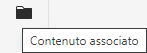
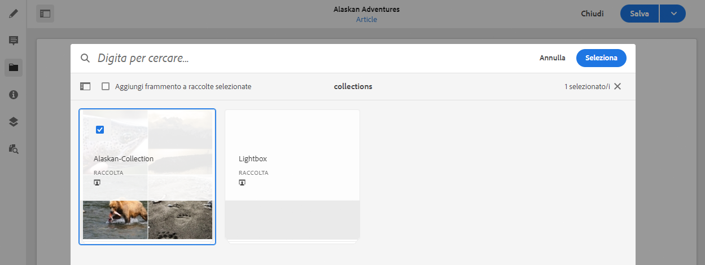
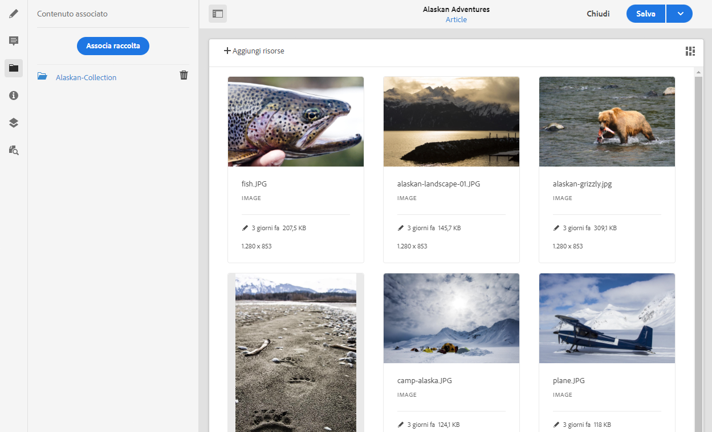

# Contenuto associato{#associated-content}

<!--
hide: yes
index: no
hidefromtoc: yes
-->

La funzione di contenuto associato AEM fornisce la connessione in modo che le risorse possano essere facoltativamente utilizzate con il frammento quando viene aggiunto a una pagina di contenuto, [facendo in modo che una serie di risorse siano accessibili quando si utilizza il frammento di contenuto su una pagina,](/help/sites-cloud/authoring/fundamentals/content-fragments.md#using-associated-content) contribuendo anche a ridurre il tempo necessario per cercare la risorsa appropriata. Questo offre anche flessibilità per la distribuzione headless dei contenuti.

## Aggiunta di contenuto associato {#adding-associated-content}

>[!NOTE]
>
>Esistono diversi metodi per aggiungere [risorse visive (ad esempio immagini)](/help/sites-cloud/administering/content-fragments/content-fragments.md#fragments-with-visual-assets) al frammento e/o alla pagina.

Per creare l’associazione, devi prima [aggiungere le risorse multimediali a una raccolta](/help/assets/manage-collections.md). Una volta fatto questo è possibile:

1. Apri il frammento e seleziona **Contenuto associato** dal pannello laterale.

   

1. A seconda che siano già state associate o meno delle raccolte, seleziona una delle seguenti opzioni:

   * **Associa contenuto**: la prima raccolta associata
   * **Associa raccolta**: le raccolte associate già configurate

1. Seleziona la raccolta richiesta.

   Facoltativamente, è possibile aggiungere il frammento stesso alla raccolta selezionata, in modo da favorire il tracciamento.

   

1. Conferma (con **Seleziona**). La raccolta viene elencata come associata.

   

## Modifica del contenuto associato {#editing-associated-content}

Una volta associata una raccolta puoi:

* **Rimuovere** l’associazione.
* **Aggiungere risorse** a una raccolta.
* Selezionare una risorsa per ulteriori azioni.
* Modificare la risorsa.
