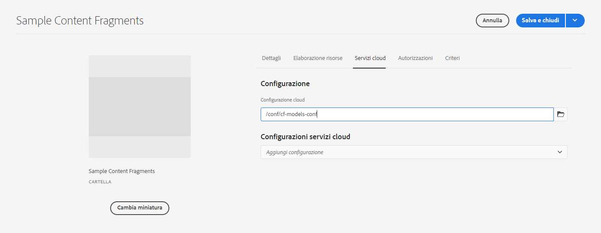

# Frammenti di contenuto - Browser configurazioni {#content-fragments-configuration-browser}

Scopri come abilitare funzionalità specifiche per i frammenti di contenuto nel browser configurazioni.

## Abilita funzionalità frammento di contenuto per la tua istanza {#enable-content-fragment-functionality-instance}

Prima di utilizzare i frammenti di contenuto, è necessario utilizzare **Browser configurazioni** per abilitare:

* **Modelli per frammenti di contenuto**: obbligatorio
* **Query GraphQL persistenti**: facoltativo

>[!CAUTION]
>
>Se non si abilita **Modelli per frammenti di contenuto**:
>
>* il **Crea** non è disponibile per la creazione di modelli.
>* non puoi [seleziona la configurazione Sites per creare il punto finale correlato](/help/headless/graphql-api/graphql-endpoint.md).

Per abilitare la funzionalità dei frammenti di contenuto, è necessario effettuare le seguenti operazioni:

* Abilitare l’utilizzo della funzionalità dei frammenti di contenuto tramite il browser configurazioni
* Applicare la configurazione alla cartella Risorse

### Abilitare la funzionalità dei frammenti di contenuto nel browser configurazioni {#enable-content-fragment-functionality-in-configuration-browser}

Per utilizzare alcuni [Funzionalità Frammento di contenuto](#creating-a-content-fragment-model), tu **deve** prima attivarli tramite **Browser configurazioni**:

>[!NOTE]
>
>Per maggiori dettagli, vedi [Browser configurazioni](/help/implementing/developing/introduction/configurations.md#using-configuration-browser).

>[!NOTE]
>
>[Subconfigurazioni](/help/implementing/developing/introduction/configurations.md#configuration-resolution) (configurazione nidificata all’interno di un’altra configurazione) sono completamente supportate per l’utilizzo con Frammenti di contenuto, Modelli di frammenti di contenuto e query GraphQL.
>
>Fai attenzione che:
>
>
>* Dopo aver creato i modelli in una sottoconfigurazione, NON è possibile spostare o copiare il modello in un’altra sottoconfigurazione.
>
>* Un endpoint GraphQL è (ancora) basato su una configurazione principale (root).
>
>* Le query persistenti vengono (ancora) salvate in base alla configurazione principale (root).

1. Accedi a **Strumenti**, **Generali**, quindi apri **Browser configurazioni**.

1. Utilizza **Crea** per aprire la finestra di dialogo, in cui:

   1. Specificare un **Titolo**.
   1. Il **Nome** diventa il nome del nodo nell’archivio.
      * Viene generato automaticamente in base al titolo e regolato secondo [Convenzioni di denominazione AEM](/help/implementing/developing/introduction/naming-conventions.md).
      * Se necessario è possibile regolarlo.
   1. Per attivarne l’uso, seleziona
      * **Modelli per frammenti di contenuto**
      * **Query persistenti GraphQL**

      

1. Seleziona **Crea** per salvare la definizione.

<!-- 1. Select the location appropriate to your website. -->

### Applicare la configurazione alla cartella {#apply-the-configuration-to-your-folder}

Quando la configurazione **globale** è abilitato per la funzionalità frammento di contenuto, si applica a qualsiasi cartella Risorse accessibile tramite **Risorse** console.

Per utilizzare altre configurazioni (ovvero escludendo quelle globali) con una cartella Risorse simile, è necessario definire la connessione. Questa connessione viene eseguita selezionando l&#39;opzione **Configurazione** nel **Cloud Services** scheda di **Proprietà cartella** della cartella appropriata.

