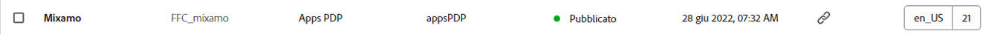

# Console Frammenti di contenuto  {#content-fragments-console}

Scopri in che modo la console Frammenti di contenuto può ottimizzare l’accesso ai frammenti di contenuto, consentendoti di creare, cercare e gestire i frammenti eseguendo azioni amministrative quali pubblicare, annullare le pubblicazioni e copiare.

La console Frammenti di contenuto è dedicata a gestione, ricerca e creazione di frammenti di contenuto. È stata ottimizzata per l’utilizzo in un contesto headless, ma anche durante la creazione di frammenti di contenuto da usare nell’authoring delle pagine.

>[!NOTE]
>
>In questa console vengono visualizzati solo i frammenti di contenuto. Non visualizza altri tipi di risorse, come immagini e video.

>[!NOTE]
>
>L’accesso ai frammenti di contenuto attualmente è possibile tramite:
>
>* la presente console di **Frammenti di contenuto**;
>* la console **Assets** - vedi [Gestione dei frammenti di contenuto](/help/assets/content-fragments/content-fragments-managing.md).

>[!NOTE]
>
>Una selezione di [scelte rapide da tastiera è disponibile per questa console](/help/sites-cloud/administering/content-fragments/content-fragments-console-keyboard-shortcuts.md).

>[!NOTE]
>
>Se necessario, il team del progetto può personalizzare la console. Per ulteriori dettagli, consulta [Personalizzazione della console Frammenti di contenuto](/help/implementing/developing/extending/content-fragment-console-customizing.md).

È possibile accedere direttamente alla console Frammenti di contenuto dal livello superiore della navigazione globale:

## Struttura e gestione di base della console {#basic-structure-handling-content-fragments-console}

Selezionando **Frammenti di contenuto** verrà aperta la console in una nuova scheda.

Nella console puoi osservare tre aree principali:

* Barra degli strumenti superiore
   * Fornisce le funzionalità standard di AEM
   * Mostra anche la tua organizzazione IMS
* Pannello a sinistra
   * Qui puoi nascondere o visualizzare la struttura delle cartelle
   * Puoi selezionare un ramo specifico della struttura
* Pannello principale/destro; da qui puoi:
   * Visualizzare l’elenco di tutti i frammenti di contenuto nel ramo selezionato della struttura:
      * La posizione è indicata dalle breadcrumb; puoi utilizzarle anche per modificare la posizione
      * Verranno visualizzati i frammenti di contenuto della cartella selezionata e tutte le cartelle secondarie:
         * [Vari campi di informazioni](#selectuse-available-columns) su un frammento di contenuto forniscono collegamenti con cui, a seconda del campo, è possibile:
            * Aprire il frammento appropriato nell’editor
            * Mostrare informazioni sui riferimenti
            * Mostrare informazioni sulle versioni linguistiche del frammento
         * È possibile [selezionare uno o più frammenti di contenuto per visualizzare le azioni disponibili](#actions-selected-content-fragment).
      * Puoi selezionare un’intestazione di colonna per ordinare la tabella in base a tale colonna; selezionala ancora per passare da ordine crescente a decrescente. Attualmente, l’ordinamento è supportato sulla **Titolo**, **Modificato**, e **Modificato da** colonne.
   * **[Creare](#creating-new-content-fragment)** un nuovo frammento di contenuto
   * [Filtrare](#filtering-fragments) i frammenti di contenuto in base a una selezione di predicati e salvare il filtro per utilizzi futuri
   * [Ricercare](#searching-fragments) i frammenti di contenuto
   * [Personalizzare la vista tabella per mostrare le colonne di informazioni selezionate](#selectuse-available-columns)
   * Utilizzare **Apri in Assets** per aprire direttamente la posizione corrente nella console **Assets**

      >[!NOTE]
      >
      >La console **Assets** viene utilizzata per accedere alle risorse, ad esempio immagini, video e così via.  È possibile accedere a questa console:
      >
      >* utilizzando il collegamento **Apri in Assets** (nella console Frammenti di contenuto);
      >* direttamente dal riquadro di navigazione globale.

## Azioni per un frammento di contenuto (selezionato) {#actions-selected-content-fragment}

Quando si seleziona un frammento specifico, viene aperta una barra degli strumenti incentrata sulle azioni disponibili per tale frammento. Puoi inoltre selezionare più frammenti; la selezione delle azioni verrà regolata di conseguenza.

* **Apri**
* **Pubblica** (e **Annulla pubblicazione**)
* **Copia**
* **Sposta**
* **Rinomina**
* **Elimina**

>[!NOTE]
>
>Azioni come Pubblica, Annulla pubblicazione, Elimina, Sposta, Rinomina, Copia, attivano un processo asincrono. L’avanzamento di tale processo può essere monitorato tramite l’interfaccia dei processi asincroni di AEM.

## Informazioni fornite sui frammenti di contenuto {#information-content-fragments}

Il pannello principale (vista tabella) della console, a destra, fornisce una serie di informazioni sui frammenti di contenuto. Alcuni elementi forniscono anche collegamenti diretti a ulteriori azioni e/o informazioni:

* **Nome**
   * Fornisce un collegamento per aprire il frammento nell’editor.
* **Modello**
   * Fornisce un collegamento per aprire il frammento nell’editor.
* **Cartella**
   * Fornisce un collegamento per aprire la cartella nella console.
Passando il puntatore del mouse sul nome della cartella verrà visualizzato il percorso JCR.
* **Stato**
   * Solo informazioni
* **Modificato**
   * Solo informazioni
* **Modificato da**
   * Solo informazioni
* **Pubblicazione**
   * Solo informazioni
* **Pubblicato da**
   * Solo informazioni
* **Con riferimento da**

   * Fornisce un collegamento che apre una finestra di dialogo in cui sono elencati tutti i riferimenti principali di quel frammento, compresi i frammenti di contenuto, frammenti di esperienza e pagine. Per aprire un riferimento specifico, fai clic sul **Titolo** nella finestra di dialogo.

      

* **Lingua**

   * Indica la lingua del frammento di contenuto e il numero totale di copie per lingua associate al frammento di contenuto.

      

      * Tocca o fai clic sul numero per aprire una finestra di dialogo in cui sono visualizzate tutte le copie per altre lingue. Per aprire una copia di una specifica lingua, fai clic sul **Titolo** nella finestra di dialogo.

         

## Selezionare le colonne disponibili {#select-available-columns}

Come per altre console, puoi configurare le colonne visibili e disponibili da utilizzare:

Presenta un elenco di colonne che puoi nascondere o mostrare:

## Creazione di un nuovo frammento di contenuto {#creating-new-content-fragment}

Selezionando **Crea** consente di aprire la compatta finestra di dialogo **Nuovo frammento di contenuto**:

## Filtrare i frammenti {#filtering-fragments}

Il pannello Filtro offre:

* una selezione di predicati che possono essere selezionati e combinati;
* l’opportunità di salvare la configurazione mediante il comando **Salva**.
* l’opzione di recuperare un filtro di ricerca salvato per il riutilizzo.

## Ricerca di frammenti {#searching-fragments}

La casella di ricerca supporta la ricerca full-text. Immetti i termini di ricerca nella casella di ricerca:

Fornirà i risultati selezionati:

La casella di ricerca consente inoltre di accedere rapidamente a **Frammenti di contenuto recenti** e **Ricerche salvate**:

