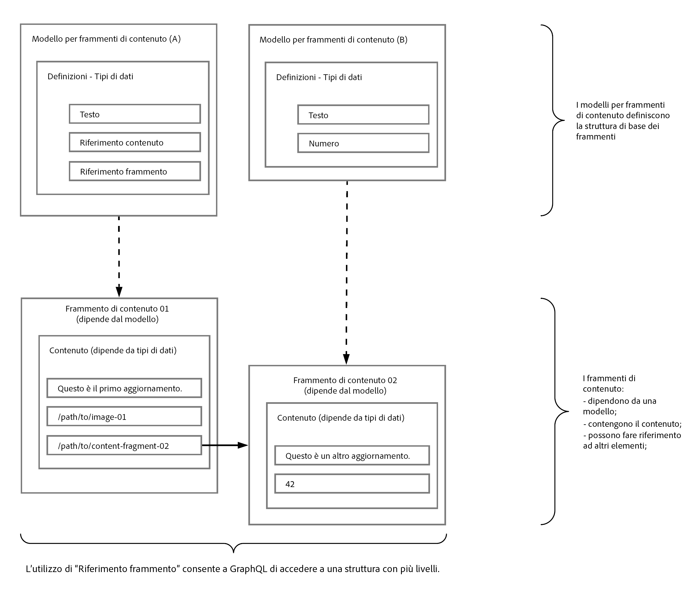

# Distribuzione di contenuti headless tramite frammenti di contenuto con GraphQL {#headless-content-delivery-using-content-fragments-with-graphQL}

Con i frammenti di contenuto e l’API GraphQL puoi utilizzare Adobe Experience Manager (AEM) as a Cloud Service come sistema di gestione dei contenuti headless (CMS).

Questo risultato si ottiene utilizzando Frammenti di contenuto, insieme all’API GraphQL AEM (un’implementazione personalizzata, basata sullo standard GraphQL), per fornire contenuti strutturati headless da utilizzare nelle applicazioni. La possibilità di personalizzare un’unica query API ti consente di recuperare e fornire il contenuto specifico di cui desideri eseguire il rendering (come risposta alla singola query API).

>[!NOTE]
>
>Consulta anche:
>
>* [Cos&#39;è Headless?](/help/headless/what-is-headless.md) introduzione ai concetti e alla terminologia headless.
>
>* [Senza testa e AEM](/help/headless/introduction.md) per un’introduzione a Headless Development per AEM Sites as a Cloud Service.

>[!NOTE]
>
>GraphQL è attualmente utilizzato in due scenari (separati) in Adobe Experience Manager (AEM) as a Cloud Service:
>
>* [AEM Commerce consuma dati da una piattaforma commerce tramite GraphQL](/help/commerce-cloud/integrating/magento.md).
>* [I Frammenti di contenuto AEM collaborano con l’API GraphQL di AEM (un’implementazione personalizzata, basata su GraphQL standard) per fornire contenuti strutturati da utilizzare nelle applicazioni](/help/headless/graphql-api/content-fragments.md).

## CMS headless {#headless-cms}

Un sistema di gestione dei contenuti headless (CMS) è un sistema di gestione dei contenuti back-end, progettato e creato esplicitamente come archivio di contenuti che rende i contenuti accessibili tramite un’API, per la visualizzazione su qualsiasi dispositivo.

In termini di authoring di frammenti di contenuto in AEM ciò significa che:

* È possibile utilizzare Frammenti di contenuto per creare contenuti che non sono destinati principalmente alla pubblicazione diretta (1:1) su pagine formattate.

* Il contenuto dei frammenti di contenuto sarà strutturato in modo predeterminato in base ai modelli di frammento di contenuto . Questo semplifica l&#39;accesso alle applicazioni, che elaboreranno ulteriormente i contenuti.

## GraphQL - Panoramica {#graphql-overview}

GraphQL è:

* &quot;*...un linguaggio di query per le API e un runtime per l’esecuzione di tali query con i dati esistenti.*&quot;.

   Vedi [GraphQL.org](https://graphql.org)

La [AEM API GraphQL](#aem-graphql-api) consente di eseguire query (complesse) sul [Frammenti di contenuto](/help/sites-cloud/administering/content-fragments/content-fragments.md); con ogni query in base a un tipo di modello specifico. Il contenuto restituito può quindi essere utilizzato dalle applicazioni.

## AEM API GraphQL {#aem-graphql-api}

Per Adobe Experience as a Cloud Experience è stata sviluppata un’implementazione personalizzata dell’API GraphQL standard. Vedi [AEM API GraphQL per l’utilizzo con frammenti di contenuto](/help/headless/graphql-api/content-fragments.md) per i dettagli.

L’implementazione AEM dell’API GraphQL si basa sul [Librerie Java GraphQL](https://graphql.org/code/#java).

## Frammenti di contenuto da utilizzare con l’API GraphQL AEM {#content-fragments-use-with-aem-graphql-api}

[Frammenti di contenuto](#content-fragments) può essere utilizzato come base per GraphQL per query AEM come:

* Consentono di progettare, creare, curare e pubblicare contenuti indipendenti dalla pagina.
* La [Modelli per frammenti di contenuto](#content-fragments-models) fornire la struttura richiesta per mezzo di tipi di dati definiti.
* La [Riferimento frammento](#fragment-references), disponibile quando si definisce un modello, può essere utilizzato per definire livelli di struttura aggiuntivi.

### Frammenti di contenuto {#content-fragments}

Frammenti di contenuto:

* Contenere contenuti strutturati.

* Sono basati su un [Modello per frammento di contenuto](#content-fragments-models), che predefinisce la struttura del frammento risultante.

### Modelli per frammenti di contenuto {#content-fragments-models}

Tali [Modelli per frammenti di contenuto](/help/sites-cloud/administering/content-fragments/content-fragments-models.md):

* Sono utilizzati per generare il [Schemi](https://graphql.org/learn/schema/)una volta **Abilitato**.

* Fornisci i tipi di dati e i campi richiesti per GraphQL. Assicurano che la tua applicazione richieda solo ciò che è possibile e riceva ciò che è previsto.

* Tipo di dati **[Riferimenti ai frammenti](#fragment-references)** può essere utilizzato nel modello per fare riferimento a un altro frammento di contenuto e quindi introdurre ulteriori livelli di struttura.

### Riferimenti ai frammenti {#fragment-references}

La **[Riferimento frammento](/help/sites-cloud/administering/content-fragments/content-fragments-models.md#fragment-reference-nested-fragments)**:

* È di particolare interesse in combinazione con GraphQL.

* È un tipo di dati specifico che può essere utilizzato durante la definizione di un modello di frammento di contenuto.

* Fa riferimento a un altro frammento, a seconda di un modello di frammento di contenuto specifico.

* Consente di recuperare dati strutturati.

   * Quando è definito come **multifeed**, è possibile fare riferimento a più frammenti secondari (recuperati) dal frammento principale.

### Anteprima JSON {#json-preview}

Per semplificare la progettazione e lo sviluppo dei modelli di frammenti di contenuto, puoi visualizzare un’anteprima [Output JSON](/help/sites-cloud/administering/content-fragments/content-fragments-json-preview.md).

## Imparare a utilizzare GraphQL con AEM: contenuto di esempio e query {#learn-graphql-with-aem-sample-content-queries}

Vedi [Imparare a utilizzare GraphQL con AEM - Contenuto di esempio e query](/help/headless/graphql-api/sample-queries.md) per un’introduzione all’utilizzo dell’API GraphQL di AEM.

## Tutorial: guida introduttiva ad AEM headless e GraphQL

Cerchi un pratico tutorial? Dai un&#39;occhiata al tutorial [Guida introduttiva di headless AEM e GraphQL](https://experienceleague.adobe.com/docs/experience-manager-learn/getting-started-with-aem-headless/graphql/overview.html?lang=it) che illustra come creare ed esporre contenuti, utilizzati da un’app esterna, mediante le API GraphQL di AEM in uno scenario CMS headless.
