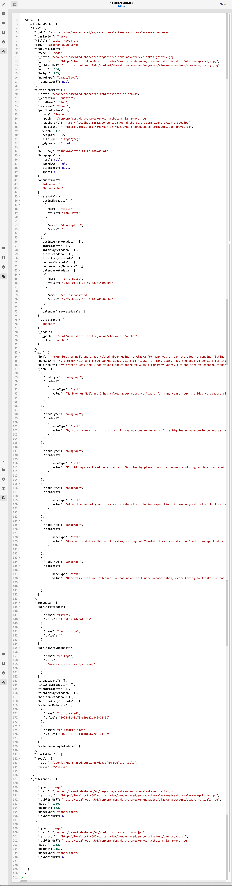

# Anteprima - Rappresentazione JSON {#preview-json-representation}

<!--
hide: yes
index: no
hidefromtoc: yes
-->

Durante lo sviluppo di modelli per frammenti di contenuto come parte dell’implementazione AEM headless, potrebbe essere utile visualizzare un output JSON di esempio per un frammento di contenuto, in base a un modello. Ad esempio, per avere un’idea dell’aspetto dell’output finale. Questo potrebbe essere utile durante la convalida della struttura JSON del modello, con contenuto di esempio predefinito per tipo di dati.

Utilizzo dell’icona **Anteprima**:

Puoi visualizzare la rappresentazione JSON del frammento corrente. Esempio:

<!--
**Copy URL** lets you copy to clipboard the URL for either author or publish.
-->
