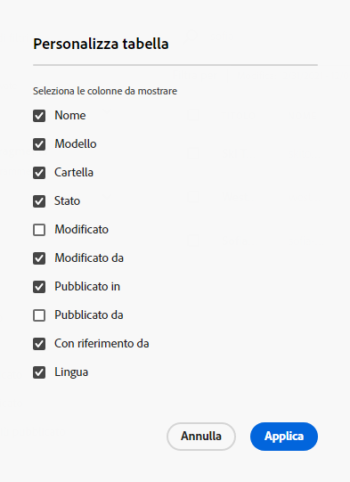

# Gestione dei frammenti di contenuto {#managing-content-fragments}

Scopri come utilizzare il **Frammenti di contenuto** per gestire i frammenti di contenuto AEM. Questi possono essere utilizzati per l’authoring delle pagine o come base per il contenuto headless.

Dopo aver definito le [Modelli per frammenti di contenuto](#creating-a-content-model) è possibile utilizzare questi [creare i frammenti di contenuto](#creating-a-content-fragment).

La [Editor frammento di contenuto](#opening-the-fragment-editor) fornisce vari [modalità](#modes-in-the-content-fragment-editor) per abilitare:

* [Modificare il contenuto](#editing-the-content-of-your-fragment) e [gestione varianti](#creating-and-managing-variations-within-your-fragment)
* [Annotare il frammento](/help/sites-cloud/administering/content-fragments/content-fragments-variations.md#annotating-a-content-fragment)
* [Associa contenuto al frammento](#associating-content-with-your-fragment)
* [Configurare i metadati](#viewing-and-editing-the-metadata-properties-of-your-fragment)
* [Visualizza albero struttura](/help/sites-cloud/administering/content-fragments/content-fragments-structure-tree.md)
* [Anteprima della rappresentazione JSON](/help/sites-cloud/administering/content-fragments/content-fragments-json-preview.md)

>[!NOTE]
>
>I frammenti di contenuto possono essere utilizzati:
>
>* quando si creano pagine; vedere [Authoring delle pagine con frammenti di contenuto](/help/sites-cloud/authoring/fundamentals/content-fragments.md).
>* per [Distribuzione di contenuti headless tramite frammenti di contenuto con GraphQL](/help/sites-cloud/administering/content-fragments/content-fragments-graphql.md).

>[!NOTE]
>
>I frammenti di contenuto sono memorizzati come **Risorse**. Sono principalmente gestite dal **Frammenti di contenuto** , ma può anche essere gestito dalla **Risorse** console.

## Creazione di frammenti di contenuto {#creating-content-fragments}

### Creazione di un modello di contenuto {#creating-a-content-model}

[Modelli per frammenti di contenuto](/help/sites-cloud/administering/content-fragments/content-fragments-models.md) possono essere abilitate e create prima di creare frammenti di contenuto con contenuto strutturato.

### Creazione di un frammento di contenuto {#creating-a-content-fragment}

Per creare un frammento di contenuto:

1. Da **Frammenti di contenuto** console, seleziona **Crea** (in alto a destra).

   >[!NOTE]
   >
   >Per impostare come predefinita la posizione del nuovo frammento, passare alla cartella in cui si desidera creare il frammento oppure specificare la posizione durante il processo di creazione.

1. La **Nuovo frammento di contenuto** si aprirà la finestra di dialogo, da qui è possibile specificare:

   * **Posizione** : verrà completato automaticamente con la posizione corrente, ma puoi selezionare una posizione diversa se necessario
   * **Modello per frammento di contenuto** - selezionare il modello da utilizzare come base del frammento dall’elenco a discesa
   * **Titolo**
   * **Nome** - verrà completato automaticamente in base al **Titolo**, ma puoi modificarlo se necessario
   * **Descrizione**

   

1. Seleziona **Crea** oppure **Crea e apri** per mantenere la definizione.

## Azioni per un frammento di contenuto nella console Frammenti di contenuto {#actions-content-fragment-console}

In **Frammenti di contenuto** dalla barra degli strumenti sono disponibili diverse azioni per i frammenti di contenuto:

* **Apri in Assets**
* **Creare**
* La **A cui fa riferimento** la colonna fornisce inoltre un collegamento diretto per visualizzare tutti i riferimenti principali di tale frammento; , compresi i riferimenti a frammenti di contenuto, frammenti esperienza e pagine.
* Passando il puntatore del mouse sul nome della cartella verrà visualizzato il percorso JCR.

Dopo aver selezionato il frammento sono disponibili tutte le azioni appropriate:

* **Apri**
* **Pubblica** e **Annulla pubblicazione**)
* **Copia**
* **Spostare**
* **Rinomina**
* **Elimina**

>[!NOTE]
>
>Azioni come Pubblica, Annulla pubblicazione, Elimina, Sposta, Rinomina, Copia, attivano un processo asincrono. L’avanzamento di quel processo può essere monitorato tramite l’interfaccia utente AEM processi asincroni .

## Personalizzazione della visualizzazione nella console Frammenti di contenuto {#viewing-content-fragment-console}

La console mostra informazioni sui frammenti di contenuto presenti nella cartella corrente e in tutte le cartelle secondarie.

Puoi personalizzare le informazioni visualizzate utilizzando **Personalizzare la tabella** icona:

Verrà aperto il **Personalizzare la tabella** in cui è possibile selezionare o deselezionare le colonne disponibili:

## Cercare e filtrare nella console Frammenti di contenuto {#search-filter-content-fragment-console}

Puoi cercare e/o filtrare i frammenti di contenuto da visualizzare nella console.

Operazioni disponibili:

* seleziona la cartella richiesta
* seleziona i filtri con il **Mostra filtri** e utilizza la casella di ricerca in parallelo:

È disponibile una selezione di filtri:

I filtri e la combinazione di ricerca possono essere salvati anche per riferimento successivo.

## Apertura dell’Editor frammento {#opening-the-fragment-editor}

Per aprire il frammento per la modifica:

>[!CAUTION]
>
>Per modificare un frammento di contenuto è necessario [le autorizzazioni appropriate](/help/implementing/developing/extending/content-fragments-customizing.md#asset-permissions). In caso di problemi, contatta l’amministratore di sistema.

1. Utilizza la **Frammenti di contenuto** per passare alla posizione del frammento di contenuto.
1. Apri il frammento per la modifica, selezionando il frammento e quindi **Apri** dalla barra degli strumenti.

1. Viene aperto l’editor frammenti. Apporta le modifiche necessarie:

   

1. Dopo aver apportato le modifiche, utilizza **Salva**, **Salva e chiudi** o **Chiudi** se necessario.

   >[!NOTE]
   >
   >**Salva e chiudi** è disponibile tramite **Salva** a discesa.

   >[!NOTE]
   >
   >Entrambi **Salva e chiudi** e **Chiudi** uscirà dall’editor; vedi [Salva, chiudi e versioni](#save-close-and-versions) per informazioni complete sul funzionamento delle varie opzioni per i frammenti di contenuto.

## Modalità e azioni nell’Editor frammento di contenuto {#modes-actions-content-fragment-editor}

Sono disponibili varie modalità e azioni dall’Editor frammento di contenuto.

### Modalità nell’Editor frammento di contenuto {#modes-in-the-content-fragment-editor}

Naviga tra le varie modalità utilizzando le icone nel pannello laterale:

* Variazioni: [Modifica del contenuto](#editing-the-content-of-your-fragment) e [Gestione delle varianti](#creating-and-managing-variations-within-your-fragment)

* [Annotazioni](/help/sites-cloud/administering/content-fragments/content-fragments-variations.md#annotating-a-content-fragment)
* [Contenuto associato](#associating-content-with-your-fragment)
* [Metadati](#viewing-and-editing-the-metadata-properties-of-your-fragment)
* [Albero struttura](/help/sites-cloud/administering/content-fragments/content-fragments-structure-tree.md)
* [Anteprima](/help/sites-cloud/administering/content-fragments/content-fragments-json-preview.md)

### Azioni barra degli strumenti nell’Editor frammento di contenuto {#toolbar-actions-in-the-content-fragment-editor}

Alcune funzioni nella barra degli strumenti superiore sono disponibili in diverse modalità:

* Se in una pagina di contenuto è già presente un riferimento al frammento, viene visualizzato un messaggio. È possibile **Chiudi** il messaggio.

* Il pannello laterale può essere nascosto o visualizzato utilizzando **Attiva/Disattiva pannello laterale** icona.

* Sotto il nome del frammento è possibile visualizzare il nome dell’ [Modello per frammento di contenuto](/help/sites-cloud/administering/content-fragments/content-fragments-models.md) utilizzato per creare il frammento corrente:

   * Il nome è anche un collegamento che aprirà l&#39;editor modelli.

* Vedere lo stato del frammento; ad esempio, informazioni su quando è stato creato, modificato o pubblicato. Lo stato viene inoltre codificato in base al colore:

   * **Nuovo**: grigio
   * **Bozza**: blu
   * **Pubblicato**: verde
   * **Modificato**: arancia
   * **Disattivato**: rosso

* **Salva** fornisce accesso al **Salva e chiudi** opzione .

* I tre punti (**...**) fornisce accesso alle azioni aggiuntive:
   * **Aggiorna i riferimenti pagina**
      * Questo aggiorna tutti i riferimenti di pagina.
   * **[Pubblicazione rapida](#publishing-and-referencing-a-fragment)**
   * **[Gestisci pubblicazione](#publishing-and-referencing-a-fragment)**

<!--
This updates any page references and ensures that the Dispatcher is flushed as required. -->

## Salva, chiudi e versioni {#save-close-and-versions}

>[!NOTE]
>
>Le versioni possono anche essere [creati, confrontati e ripristinati dalla timeline](/help/sites-cloud/administering/content-fragments/content-fragments-managing.md#timeline-for-content-fragments).

L’editor dispone di diverse opzioni:

* **Salva** e **Salva e chiudi**

   * **Salva** salverà le modifiche più recenti e rimarrà nell’editor.
   * **Salva e chiudi** salverà le modifiche più recenti e chiuderà l’editor.

   >[!CAUTION]
   >
   >Per modificare un frammento di contenuto è necessario [le autorizzazioni appropriate](/help/implementing/developing/extending/content-fragments-customizing.md#asset-permissions). In caso di problemi, contatta l’amministratore di sistema.

   >[!NOTE]
   >
   >È possibile rimanere nell&#39;editor, apportando una serie di modifiche, prima di salvare.

   >[!CAUTION]
   >
   >Oltre a salvare semplicemente le modifiche, le azioni aggiornano anche i riferimenti e garantiscono che Dispatcher venga scaricato come necessario. L’elaborazione di queste modifiche può richiedere del tempo. Per questo motivo, può esserci un impatto sulle prestazioni su un sistema di grandi dimensioni/complesso/pesantemente caricato.
   >
   >Tieni presente questo aspetto quando utilizzi **Salva e chiudi** quindi è possibile reimmettere rapidamente l’editor frammenti per apportare e salvare ulteriori modifiche.

* **Chiudi**

   Uscirà dall’editor senza salvare le modifiche più recenti (ovvero apportate dall’ultimo **Salva**).

Durante la modifica del frammento di contenuto AEM crea automaticamente delle versioni per garantire che il contenuto precedente possa essere ripristinato se si annullano le modifiche (utilizzando **Chiudi** senza risparmio):

1. Quando un frammento di contenuto viene aperto per la modifica AEM verifica l’esistenza del token basato su cookie che indica se un *sessione di modifica* esiste:

   1. Se viene trovato il token, il frammento viene considerato parte della sessione di modifica esistente.
   2. Se il token è *not* disponibile e l’utente inizia a modificare il contenuto, viene creata una versione e viene inviato un token per questa nuova sessione di modifica al client, dove viene salvato in un cookie.

2. Mentre c&#39;è un *attivo* il contenuto in fase di modifica viene salvato automaticamente ogni 600 secondi (impostazione predefinita).

   >[!NOTE]
   >
   >L&#39;intervallo di salvataggio automatico è configurabile utilizzando `/conf` meccanismo.
   >
   >Valore predefinito, vedi:
   >  `/libs/settings/dam/cfm/jcr:content/autoSaveInterval`

3. Se l’utente annulla la modifica, la versione creata all’inizio della sessione di modifica viene ripristinata e il token viene rimosso per terminare la sessione di modifica.
4. Se l’utente seleziona **Salva** le modifiche, gli elementi/varianti aggiornati vengono mantenuti e il token viene rimosso per terminare la sessione di modifica.

## Modifica del contenuto del frammento {#editing-the-content-of-your-fragment}

Dopo aver aperto il frammento, è possibile utilizzare [Variazioni](/help/sites-cloud/administering/content-fragments/content-fragments-variations.md) per creare i contenuti.

## Creazione e gestione di varianti all’interno del frammento {#creating-and-managing-variations-within-your-fragment}

Dopo aver creato il contenuto principale, puoi creare e gestire: [Variazioni](/help/sites-cloud/administering/content-fragments/content-fragments-variations.md) di quel contenuto.

## Associazione di contenuto al frammento {#associating-content-with-your-fragment}

È inoltre possibile [associare il contenuto](/help/sites-cloud/administering/content-fragments/content-fragments-assoc-content.md) con un frammento. Questa funzione consente di collegare in modo che le risorse (ad esempio le immagini) possano essere (facoltativamente) utilizzate con il frammento quando viene aggiunto a una pagina di contenuto.

## Visualizzazione e modifica dei metadati (proprietà) del frammento {#viewing-and-editing-the-metadata-properties-of-your-fragment}

È possibile visualizzare e modificare le proprietà di un frammento utilizzando [Metadati](/help/sites-cloud/administering/content-fragments/content-fragments-metadata.md) scheda .

## Pubblicazione e riferimento a un frammento {#publishing-and-referencing-a-fragment}

>[!CAUTION]
Se il frammento è basato su un modello, assicurati che la [modello pubblicato](/help/sites-cloud/administering/content-fragments/content-fragments-models.md#publishing-a-content-fragment-model).
Se pubblichi un frammento di contenuto per il quale il modello non è ancora stato pubblicato, un elenco di selezione lo indicherà e il modello verrà pubblicato con il frammento.

I frammenti di contenuto devono essere pubblicati per l’utilizzo nell’ambiente di pubblicazione. Questa operazione viene eseguita utilizzando la funzionalità Risorse standard

* Da **Pubblica** nella barra degli strumenti di [Console Frammenti di contenuto](#actions-content-fragment-console)
   * **Ora** - dopo la conferma, il frammento viene pubblicato immediatamente
   * **Pianificazione** - puoi selezionare la data e l’ora in cui verrà pubblicato il frammento

   Se necessario, è necessario specificare il **Data di attivazione** e che fa riferimento alla pubblicazione. Esempio:
   

* Da [Editor frammento di contenuto](#toolbar-actions-in-the-content-fragment-editor)
   * [**Pubblicazione rapida**](/help/assets/manage-publication.md#quick-publish)
   * [**Gestisci pubblicazione**](/help/assets/manage-publication.md#manage-publication)

Inoltre, quando [pubblicare una pagina che utilizza il frammento](/help/sites-cloud/authoring/fundamentals/content-fragments.md#publishing); il frammento viene elencato nei riferimenti di pagina.

>[!CAUTION]
Dopo la pubblicazione e/o il riferimento a un frammento, AEM un avviso quando un autore riapre il frammento per la modifica. In questo modo si avverte che le modifiche al frammento avranno effetto anche sulle pagine a cui si fa riferimento.

## Annullamento della pubblicazione di un frammento {#unpublishing-a-fragment}

Per annullare la pubblicazione dei frammenti di contenuto, seleziona uno o più frammenti, quindi **Annulla pubblicazione**.

>[!NOTE]
La **Annulla pubblicazione** quando sono disponibili frammenti pubblicati, l’azione sarà visibile.

>[!CAUTION]
Se al frammento è già stato fatto riferimento da un altro frammento o da una pagina, verrà visualizzato un messaggio di avviso e sarà necessario confermare che si desidera procedere.

## Eliminazione di un frammento {#deleting-a-fragment}

Per eliminare un frammento:

1. In **Frammenti di contenuto** passa alla posizione del frammento di contenuto.
2. Selezionare il frammento.

   >[!NOTE]
   La **Elimina** azione non disponibile come azione rapida.

3. Seleziona **Elimina** dalla barra degli strumenti.
4. Conferma la **Elimina** azione.

   >[!CAUTION]
   Se al frammento è già stato fatto riferimento da un altro frammento o da una pagina, verrà visualizzato un messaggio di avviso e sarà necessario confermare che si desidera procedere con un **Forza eliminazione**. Il frammento, insieme al relativo componente di frammento di contenuto, verrà eliminato da tutte le pagine di contenuto.

## Timeline per i frammenti di contenuto {#timeline-for-content-fragments}

>[!NOTE]
Questa funzionalità è disponibile solo nel **Risorse** console

Oltre alle opzioni standard, [Timeline](/help/assets/manage-digital-assets.md#timeline) fornisce sia informazioni che azioni specifiche per i frammenti di contenuto:

* Visualizza informazioni su versioni, commenti e annotazioni
* Azioni per le versioni

   * **[Ripristina questa versione](#reverting-to-a-version)** (selezionare un frammento esistente, quindi una versione specifica)

   * **[Confronta con corrente](#comparing-fragment-versions)** (selezionare un frammento esistente, quindi una versione specifica)

   * Aggiungi un **Etichetta** e/o **Commento** (selezionare un frammento esistente, quindi una versione specifica)

   * **Salva come versione** (selezionare un frammento esistente, quindi la freccia su nella parte inferiore della timeline)

* Azioni per le annotazioni

   * **Eliminare**

>[!NOTE]
I commenti sono:
* Funzionalità standard per tutte le risorse
* Made in Timeline
* Correlato alla risorsa frammento
>
Le annotazioni (per i frammenti di contenuto) sono:
* Inserito nell’editor frammenti
* Specifica per un segmento di testo selezionato all’interno del frammento
>

Esempio:

## Confronto delle versioni dei frammenti {#comparing-fragment-versions}

>[!NOTE]
Questa funzionalità è disponibile solo nel **Risorse** console

La **Confronta con corrente** è disponibile nella sezione [Timeline](/help/sites-cloud/administering/content-fragments/content-fragments-managing.md#timeline-for-content-fragments) dopo aver selezionato una versione specifica.

Verrà aperto:

* la **Corrente** (ultima versione) (a sinistra)

* la versione selezionata **v&lt;*x.y*>** (a destra)

Vengono visualizzati affiancati, dove:

* Eventuali differenze sono evidenziate

   * Testo eliminato - rosso
   * Testo inserito - verde
   * Testo sostituito - blu

* L’icona a schermo intero consente di aprire una delle due versioni da sola; quindi torna alla vista parallela
* È possibile **Ripristina** alla versione specifica
* **Fine** tornerai alla console

>[!NOTE]
Non è possibile modificare il contenuto del frammento quando si confrontano i frammenti.

## Ripristino di una versione  {#reverting-to-a-version}

>[!NOTE]
Questa funzionalità è disponibile solo nel **Risorse** console

È possibile ripristinare una versione specifica del frammento:

* Direttamente dal [Timeline](/help/sites-cloud/administering/content-fragments/content-fragments-managing.md#timeline-for-content-fragments).

   Seleziona la versione richiesta, quindi la **Ripristina questa versione** azione.

* Quando [confronto di una versione con la versione corrente](/help/sites-cloud/administering/content-fragments/content-fragments-managing.md#comparing-fragment-versions) è possibile **Ripristina** alla versione selezionata.

