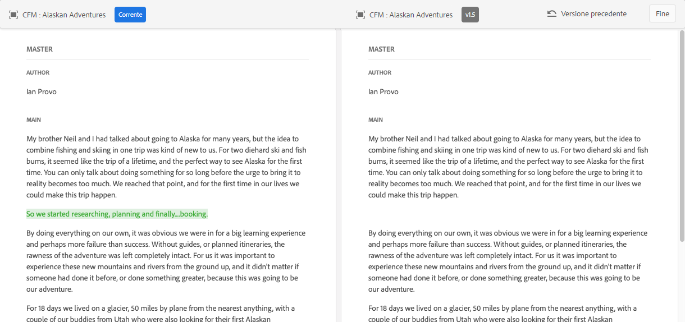

# Gestione dei frammenti di contenuto {#managing-content-fragments}

<!--
hide: yes
index: no
hidefromtoc: yes
-->

Scopri come utilizzare la console **Frammenti di contenuto** per gestire i frammenti di contenuto AEM. È possibile utilizzarli per l’authoring delle pagine o come base per i contenuti headless.

Dopo aver definito i [Modelli per frammenti di contenuto](#creating-a-content-model) puoi utilizzarli per [creare i tuoi frammenti di contenuto](#creating-a-content-fragment).

L’[Editor frammento di contenuto](#opening-the-fragment-editor) prevede svariate [modalità](#modes-in-the-content-fragment-editor) per consentirti di:

* [Modificare il contenuto](#editing-the-content-of-your-fragment) e [gestire le varianti](#creating-and-managing-variations-within-your-fragment)
* [Annotare il frammento](/help/sites-cloud/administering/content-fragments/content-fragments-variations.md#annotating-a-content-fragment)
* [Associare contenuto al frammento](#associating-content-with-your-fragment)
* [Configurare i metadati](#viewing-and-editing-the-metadata-properties-of-your-fragment)
* [Visualizzare la struttura](/help/sites-cloud/administering/content-fragments/content-fragments-structure-tree.md)
* [Visualizzare un’anteprima della rappresentazione JSON](/help/sites-cloud/administering/content-fragments/content-fragments-json-preview.md)

>[!NOTE]
>
>I frammenti di contenuto possono essere utilizzati:
>
>* quando si esegue l’authoring delle pagine; consulta [Authoring delle pagine con frammenti di contenuto](/help/sites-cloud/authoring/fundamentals/content-fragments.md).
>* per la [distribuzione di contenuti headless tramite frammenti di contenuto con GraphQL](/help/sites-cloud/administering/content-fragments/content-fragments-graphql.md).

>[!NOTE]
>
>I frammenti di contenuto sono memorizzati come **Risorse**. Sono gestite principalmente dalla console **Frammenti di contenuto**, ma la gestione è possibile anche dalla console [Assets](/help/assets/content-fragments/content-fragments-managing.md).

## Console Frammenti di contenuto {#content-fragments-console}

La console Frammenti di contenuto consente di accedere direttamente ai frammenti e alle attività correlate. Per ulteriori informazioni consulta:

* [Struttura e gestione di base della console Frammenti di contenuto](/help/sites-cloud/administering/content-fragments/content-fragments-console.md#basic-structure-handling-content-fragments-console)

* [Informazioni fornite sui frammenti di contenuto](/help/sites-cloud/administering/content-fragments/content-fragments-console.md#information-content-fragments)

* [Azioni relative a un frammento di contenuto nella console Frammenti di contenuto](/help/sites-cloud/administering/content-fragments/content-fragments-console.md#actions-selected-content-fragment)

* [Personalizzazione delle colonne disponibili nella console Frammenti di contenuto](/help/sites-cloud/administering/content-fragments/content-fragments-console.md#select-available-columns)

* [Cercare e filtrare nella console Frammenti di contenuto](/help/sites-cloud/administering/content-fragments/content-fragments-console.md#filtering-fragments)

## Creazione di frammenti di contenuto {#creating-content-fragments}

### Creazione di un modello di contenuto {#creating-a-content-model}

È possibile abilitare e creare i [modelli per frammenti di contenuto](/help/sites-cloud/administering/content-fragments/content-fragments-models.md) prima della creazione dei frammenti di contenuto con una struttura.

### Creazione di un frammento di contenuto {#creating-a-content-fragment}

Per creare un frammento di contenuto:

1. Dalla console **Frammenti di contenuto**, seleziona **Crea** (in alto a destra).

   >[!NOTE]
   >
   >Per impostare come predefinita la posizione del nuovo frammento, passa alla cartella in cui desideri creare il frammento oppure specifica la posizione durante il processo di creazione.

1. Viene aperta la finestra di dialogo **Nuovo frammento di contenuto** da dove puoi specificare:

   * **Posizione**: il campo verrà compilato automaticamente con la posizione corrente, ma se necessario puoi selezionare una posizione diversa
   * **Modello per frammento di contenuto**: dall’elenco a discesa seleziona il modello da utilizzare come base per il frammento
   * **Titolo**
   * **Nome** : verrà completato automaticamente in base al **Titolo**, ma puoi modificarlo se necessario
   * **Descrizione**

   

1. Seleziona **Crea** oppure **Crea e apri** per confermare la definizione.

## Stati dei frammenti di contenuto {#statuses-content-fragments}

Durante la sua esistenza, un frammento di contenuto può avere diversi stati, come mostrato nella [Console Frammenti di contenuto](/help/sites-cloud/administering/content-fragments/content-fragments-console.md):

* **Nuovo**
Nell’Editor frammenti di contenuto è stato creato un nuovo frammento di contenuto, che non è mai stato modificato né aperto.
* **Bozza**
Un utente ha modificato o aperto nell’Editor frammenti di contenuto il (nuovo) frammento di contenuto, che non è ancora stato pubblicato.
* **Pubblicato**
Il frammento di contenuto è stato pubblicato.
* **Modificato**
Il frammento di contenuto è stato modificato dopo la pubblicazione (ma prima della pubblicazione della modifica).
* **Non pubblicato**
Il frammento di contenuto non è stato pubblicato.

## Apertura dell’Editor frammento {#opening-the-fragment-editor}

Per aprire la pagina per la modifica:

>[!CAUTION]
>
>Per modificare un frammento di contenuto sono necessarie [le autorizzazioni appropriate](/help/implementing/developing/extending/content-fragments-customizing.md#asset-permissions). Se riscontri problemi, contatta l’amministratore del sistema.

1. Utilizza la console **Frammenti di contenuto** per passare alla posizione del frammento di contenuto.
1. Apri il frammento per la modifica selezionandolo e quindi scegli **Apri** dalla barra degli strumenti.

1. Viene aperto l’editor frammenti. Apporta le modifiche necessarie:

   

1. Dopo aver apportato le modifiche, utilizza **Salva**, **Salva e chiudi** o **Chiudi** secondo la necessità.

   >[!NOTE]
   >
   >**Salva e chiudi** è disponibile tramite il menu a discesa **Salva**.

   >[!NOTE]
   >
   >Le azioni **Salva e chiudi** e **Chiudi** determinano l’uscita dall’editor. Per informazioni complete sul funzionamento delle varie opzioni dei frammenti di contenuto, consulta la sezione [Salva, chiudi e versioni](#save-close-and-versions).

## Modalità e azioni nell’Editor frammento di contenuto {#modes-actions-content-fragment-editor}

Nell’Editor frammento di contenuto sono disponibili varie modalità e azioni.

### Modalità nell’Editor frammento di contenuto {#modes-in-the-content-fragment-editor}

Naviga tra le varie modalità utilizzando le icone nel pannello laterale:

* Varianti: [Modifica del contenuto](#editing-the-content-of-your-fragment) e [Gestione delle varianti](#creating-and-managing-variations-within-your-fragment)

* [Annotazioni](/help/sites-cloud/administering/content-fragments/content-fragments-variations.md#annotating-a-content-fragment)
* [Contenuto associato](#associating-content-with-your-fragment)
* [Metadati](#viewing-and-editing-the-metadata-properties-of-your-fragment)
* [Albero struttura](/help/sites-cloud/administering/content-fragments/content-fragments-structure-tree.md)
* [Anteprima](/help/sites-cloud/administering/content-fragments/content-fragments-json-preview.md)

### Azioni barra degli strumenti nell’Editor frammento di contenuto {#toolbar-actions-in-the-content-fragment-editor}

Alcune funzioni nella barra degli strumenti superiore sono disponibili in diverse modalità:

* Se in una pagina di contenuto è già presente un riferimento al frammento, viene visualizzato un messaggio. È possibile **chiudere** il messaggio.

* Il pannello laterale può essere nascosto o visualizzato utilizzando l’icona **Attiva/Disattiva pannello laterale**.

* Sotto il nome del frammento è possibile visualizzare il nome del [Modello per frammento di contenuto](/help/sites-cloud/administering/content-fragments/content-fragments-models.md) utilizzato per creare il frammento corrente:

   * Il nome funge anche da collegamento per aprire l’editor modelli.

* Consulta lo stato del frammento; ad esempio, per informazioni su quando è stato creato, modificato o pubblicato. Lo stato viene inoltre codificato con un colore:

   * **Nuovo**: grigio
   * **Bozza**: blu
   * **Pubblicato**: verde
   * **Modificato**: arancione
   * **Disattivato**: rosso

* **Salva** fornisce accesso all’opzione **Salva e chiudi**.

* Il menu a discesa tre punti (**...**) fornisce accesso alle azioni aggiuntive:
   * **Aggiorna i riferimenti di pagina**
      * Questo aggiorna tutti i riferimenti di pagina.
   * **[Pubblicazione rapida](/help/assets/manage-publication.md#quick-publish)**
   * **[Gestisci pubblicazione](/help/assets/manage-publication.md#manage-publication)**

<!--
This updates any page references and ensures that the Dispatcher is flushed as required. -->

## Salva, chiudi e versioni {#save-close-and-versions}

>[!NOTE]
>
>Le versioni possono anche essere [create, confrontate e ripristinate dalla timeline](/help/sites-cloud/administering/content-fragments/content-fragments-managing.md#timeline-for-content-fragments).

L’editor dispone di diverse opzioni:

* **Salva** e **Salva e chiudi**

   * **Salva** salva le modifiche più recenti e rimane nell’editor.
   * **Salva e chiudi** salva le modifiche più recenti e chiude l’editor.

  >[!CAUTION]
  >
  >Per modificare un frammento di contenuto sono necessarie [le autorizzazioni appropriate](/help/implementing/developing/extending/content-fragments-customizing.md#asset-permissions). Se riscontri problemi, contatta l’amministratore del sistema.

  >[!NOTE]
  >
  >È possibile rimanere nell’editor, apportando una serie di modifiche, prima di salvare.

  >[!CAUTION]
  >
  >Oltre al semplice salvataggio delle modifiche, le azioni aggiornano anche i riferimenti e garantiscono che il Dispatcher venga svuotato come richiesto. L’elaborazione di queste modifiche può richiedere del tempo. Per questo motivo, può esserci un impatto sulle prestazioni su un sistema di grandi dimensioni, complesso o con un carico elevato.
  >
  >Tieni presente questo processo se utilizzi **Salva e chiudi** per poi riaprire immediatamente l’editor frammento per apportare e salvare ulteriori modifiche.

* **Chiudi**

  Chiude l’editor senza salvare le modifiche più recenti, ovvero apportate dall’ultimo comando **Salva**.

Durante la modifica del frammento di contenuto, AEM crea automaticamente alcune versioni per garantire che il contenuto precedente possa essere ripristinato se si annullano le modifiche (utilizzando **Chiudi** senza salvare):

1. Quando un frammento di contenuto viene aperto per apportare modiche, AEM verifica l’esistenza del token basato su cookie che indica se esiste una *sessione di modifica*:

   1. Se il token viene trovato, il frammento viene considerato parte della sessione di modifica esistente.
   2. Se il token *non* è disponibile e l’utente inizia a modificare il contenuto, viene creata una versione e inviato al client un token per questa nuova sessione di modifica, che verrà salvato in un cookie.

2. Durante una sessione di modifica *attiva*, il contenuto in fase di modifica viene salvato automaticamente ogni 600 secondi (impostazione predefinita).

   >[!NOTE]
   >
   >L’intervallo di salvataggio automatico è configurabile utilizzando il comando `/conf`.
   >
   >Valore predefinito, vedi:
   >  `/libs/settings/dam/cfm/jcr:content/autoSaveInterval`

3. Se l’utente annulla la modifica, viene ripristinata la versione creata all’inizio della sessione di modifica e il token viene rimosso per terminare tale sessione.
4. Se l’utente **Salva** le modifiche, gli elementi/varianti aggiornate vengono rese permanenti e il token viene rimosso per terminare la sessione di modifica.

## Modifica del contenuto del frammento {#editing-the-content-of-your-fragment}

Dopo aver aperto il frammento, puoi utilizzare la scheda [Varianti](/help/sites-cloud/administering/content-fragments/content-fragments-variations.md) per effettuare l’authoring dei contenuti.

## Creazione e gestione di varianti all’interno del frammento {#creating-and-managing-variations-within-your-fragment}

Dopo aver creato il contenuto primario, puoi creare e gestire le [Varianti](/help/sites-cloud/administering/content-fragments/content-fragments-variations.md) di tale contenuto.

## Associazione di contenuto al frammento {#associating-content-with-your-fragment}

È inoltre possibile [associare il contenuto](/help/sites-cloud/administering/content-fragments/content-fragments-assoc-content.md) a un frammento. In questo modo si fornisce una connessione in modo che le risorse (ad esempio le immagini) possano essere utilizzate (facoltativamente) con il frammento quando viene aggiunto a una pagina di contenuto.

## Visualizzazione e modifica dei metadati (proprietà) del frammento {#viewing-and-editing-the-metadata-properties-of-your-fragment}

Puoi visualizzare e modificare le proprietà di un frammento utilizzando la scheda [Metadati](/help/sites-cloud/administering/content-fragments/content-fragments-metadata.md).

## Pubblicazione e anteprima di un frammento {#publishing-and-previewing-a-fragment}

Puoi pubblicare i frammenti di contenuto in:

* **[Servizio di pubblicazione](/help/overview/architecture.md#runtime-architecture)**: per l’accesso del pubblico completo

* **[Servizio di anteprima](/help/overview/architecture.md#runtime-architecture)**: per visualizzare l’anteprima dei contenuti prima della loro completa disponibilità

  >[!CAUTION]
  >
  La pubblicazione di frammenti di contenuto nel **Servizio di anteprima** è disponibile solo dalla [Console Frammenti di contenuto](/help/sites-cloud/administering/content-fragments/content-fragments-console.md) utilizzando l’azione **Pubblica**.

  >[!NOTE]
  >
  Per ulteriori dettagli sugli ambienti di anteprima, consulta:
  >
  * [Gestire gli ambienti](/help/implementing/cloud-manager/manage-environments.md#access-preview-service)
  * [Configurazione delle impostazioni OSGi per il livello di anteprima](/help/implementing/preview-tier/preview-tier-configuring-osgi.md#configuring-osgi-settings-for-the-preview-tier)
  * [Eseguire il debug dell’ambiente di anteprima tramite Developer Console](/help/implementing/preview-tier/preview-tier-configuring-osgi.md#debugging-preview-using-the-developer-console)

Per pubblicare i frammenti di contenuto utilizzando l’opzione **Pubblica** nella barra degli strumenti della [Console Frammenti di contenuto](/help/sites-cloud/administering/content-fragments/content-fragments-console.md#actions-selected-content-fragment):

>[!CAUTION]
>
Se il frammento è basato su un modello, assicurati che il [modello sia stato pubblicato](/help/sites-cloud/administering/content-fragments/content-fragments-models.md#publishing-a-content-fragment-model).
>
Se pubblichi un frammento di contenuto per il quale il modello non è ancora stato pubblicato, questo viene segnalato in un elenco di selezione e il modello viene pubblicato con il frammento.

1. Seleziona uno o più frammenti dall’elenco.

1. Dalla barra degli strumenti, seleziona **Pubblica** e quindi, per aprire la finestra di dialogo appropriata, una delle seguenti opzioni:

   * **Ora**: seleziona l’opzione **Servizio di pubblicazione** oppure **Servizio di anteprima**; dopo la conferma, il frammento viene pubblicato immediatamente
   * **Pianificazione**: oltre al servizio richiesto, puoi anche selezionare la data e l’ora in cui viene pubblicato il frammento

   Se necessario, ti viene richiesto di specificare i riferimenti da pubblicare. Per impostazione predefinita, i riferimenti vengono pubblicati anche nel Servizio di anteprima per garantire che non vi siano interruzioni nel contenuto.
Ad esempio, per una richiesta di pubblicazione pianificata:
   

1. Conferma l’azione di pubblicazione.

Puoi anche pubblicare nel **Servizio di pubblicazione** dall’[Editor frammento di contenuto](#toolbar-actions-in-the-content-fragment-editor) utilizzando:
* **Pubblicazione rapida**
* **Gestisci pubblicazione**

>[!NOTE]
>
Dopo aver [pubblicato una pagina che utilizza il frammento](/help/sites-cloud/authoring/fundamentals/content-fragments.md#publishing), il frammento verrà elencato nei riferimenti di pagina.

>[!CAUTION]
>
Dopo la pubblicazione e/o il riferimento a un frammento, AEM mostra un avviso quando un autore riapre il frammento per la modifica. L’avviso informa l’autore che le modifiche apportate al frammento avranno effetto anche sulle pagine a cui si fa riferimento.

## Annullamento della pubblicazione di un frammento {#unpublishing-a-fragment}

Per annullare la pubblicazione dei frammenti di contenuto, seleziona uno o più frammenti, quindi **Annulla pubblicazione** nella barra degli strumenti della [Console Frammenti di contenuto](/help/sites-cloud/administering/content-fragments/content-fragments-console.md#actions-selected-content-fragment). Puoi selezionare **Ora** oppure **Pianificato**.

Quando viene visualizzata la relativa finestra di dialogo, è possibile selezionare il servizio appropriato:

>[!NOTE]
>
L’azione **Annulla pubblicazione** sarà visibile quando sono disponibili i frammenti pubblicati.

>[!CAUTION]
>
Se il frammento è già oggetto di riferimento da un altro frammento o da una pagina, verrà visualizzato un messaggio di avviso e sarà necessario confermare che si desidera continuare.

## Eliminazione di un frammento {#deleting-a-fragment}

Per eliminare un frammento:

1. Nella console **Frammenti di contenuto** passa alla posizione del frammento di contenuto.
2. Seleziona il frammento.

   >[!NOTE]
   >
   L’azione **Elimina** non è disponibile come azione rapida.

3. Seleziona **Elimina** dalla barra degli strumenti.
4. Conferma l’azione **Elimina**.

   >[!CAUTION]
   >
   Se il frammento è già oggetto di riferimento da un altro frammento o da una pagina, verrà visualizzato un messaggio di avviso e sarà necessario confermare che si desidera procedere con il comando **Forza eliminazione**. Il frammento, insieme al relativo componente di frammento di contenuto, viene eliminato da tutte le pagine di contenuto.

## Individuare i riferimenti principali di un frammento {#parent-references-fragment}

È possibile accedere ai dettagli dei riferimenti pricipali dalla colonna **Riferimenti** della [console Frammenti di contenuto](/help/sites-cloud/administering/content-fragments/content-fragments-console.md#information-content-fragments).

## Individuare le copie per lingua di un frammento {#language-copies-fragment}

I dettagli delle copie per lingua sono accessibili dalla colonna **Lingua** della [console Frammenti di contenuto](/help/sites-cloud/administering/content-fragments/content-fragments-console.md#information-content-fragments).

## Timeline per i frammenti di contenuto {#timeline-for-content-fragments}

>[!NOTE]
>
Questa funzionalità è disponibile solo nella console **Assets**

Oltre alle opzioni standard, [Timeline](/help/assets/manage-digital-assets.md#timeline) fornisce sia informazioni che azioni specifiche relative ai frammenti di contenuto:

* Visualizza informazioni su versioni, commenti e annotazioni
* Azioni per le versioni

   * **[Ripristina questa versione](#reverting-to-a-version)** (seleziona un frammento esistente, quindi una versione specifica)

   * **[Confronta con corrente](#comparing-fragment-versions)** (seleziona un frammento esistente, quindi una versione specifica)

   * Aggiungi un’**Etichetta** e/o un **Commento** (seleziona un frammento esistente, quindi una versione specifica)

   * **Salva come versione** (seleziona un frammento esistente, quindi la freccia su nella parte inferiore della timeline)

* Azioni per le annotazioni

   * **Eliminare**

>[!NOTE]
>
I commenti sono:
>
* Funzionalità standard per tutte le risorse
* Effettuati nella timeline
* Correlati alla risorsa frammento
>
Le annotazioni (per i frammenti di contenuto) sono:
>
* Inserite nell’editor frammenti
* Specifiche per un segmento di testo selezionato all’interno del frammento
>

Esempio:

## Confronto delle versioni dei frammenti {#comparing-fragment-versions}

>[!NOTE]
>
Questa funzionalità è disponibile solo nella console **Risorse**

L’azione **Confronta con corrente** è disponibile nella [Timeline](/help/sites-cloud/administering/content-fragments/content-fragments-managing.md#timeline-for-content-fragments) dopo aver selezionato una versione specifica.

Si aprirà:

* la versione **Corrente** (più recente) (a sinistra)

* la versione selezionata **v&lt;*x.y*>** (a destra)

Le versioni vengono visualizzate affiancate e:

* Eventuali differenze sono evidenziate

   * Testo eliminato: rosso
   * Testo inserito: verde
   * Testo sostituito: blu

* L’icona a schermo intero consente di aprire una versione da sola, quindi di tornare alla vista parallela
* È possibile **ritornare** alla versione specifica
* **Fine** riporta alla console

>[!NOTE]
>
Non è possibile modificare il contenuto del frammento nella modalità di confronto.

## Ripristino di una versione  {#reverting-to-a-version}

>[!NOTE]
>
Questa funzionalità è disponibile solo nella console **Risorse**

È possibile ripristinare una versione specifica del frammento:

* Direttamente dalla [timeline](/help/sites-cloud/administering/content-fragments/content-fragments-managing.md#timeline-for-content-fragments).

  Seleziona la versione richiesta, quindi l’azione **Ripristina questa versione**.

* Durante il [confronto di una versione con la versione corrente](/help/sites-cloud/administering/content-fragments/content-fragments-managing.md#comparing-fragment-versions) è possibile **ritornare** alla versione selezionata.
