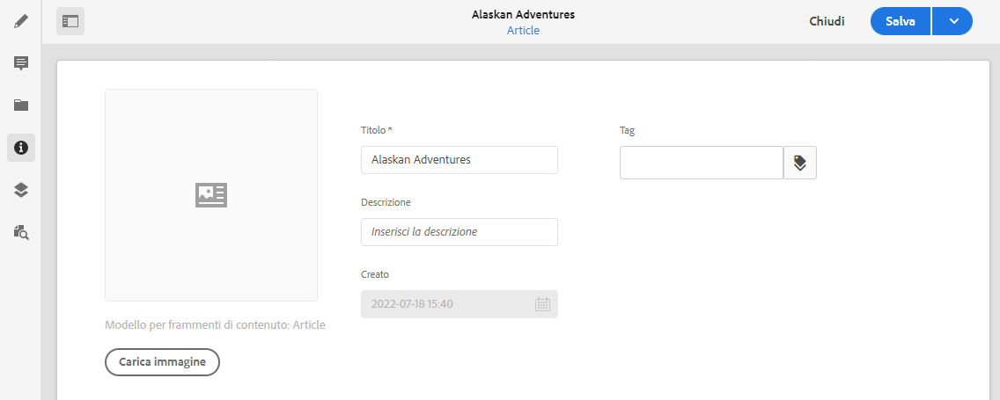

# Metadati - Proprietà dei frammenti {#metadata-fragment-properties}

<!--
hide: yes
index: no
hidefromtoc: yes
-->

Scopri come visualizzare e modificare le proprietà dei metadati per i frammenti di contenuto AEM.

## Modifica di proprietà o metadati {#editing-properties-meta-data}

Puoi visualizzare e modificare i metadati (proprietà) dei frammenti di contenuto:

1. Nella console **Risorse** passa alla posizione del frammento di contenuto.
2. Effettua una delle seguenti operazioni:

   * Seleziona [**Visualizza proprietà** per aprire le finestre di dialogo](/help/assets/manage-digital-assets.md#editing-properties). Una volta aperte e visualizzate le proprietà, puoi anche modificarle.
   * Apri il frammento di contenuto per la modifica, quindi seleziona **Metadati** dal pannello laterale.

   

3. La scheda **Base** fornisce alcune opzioni che è possibile visualizzare o modificare:

   * Miniatura, per la quale è possibile **Caricare un’immagine**
   * **Modello per frammento di contenuto** indica il modello utilizzato per creare il frammento corrente
   * **Titolo**
   * **Descrizione**
   * **Tag**
      * I [tag](/help/sites-cloud/authoring/features/tags.md) sono particolarmente utili per organizzare i frammenti, in quanto possono essere utilizzati per la classificazione e la tassonomia dei contenuti. I tag possono essere utilizzati per trovare il contenuto (per tag) e applicare operazioni in blocco.
Ad esempio, puoi assegnare ai frammenti rilevanti il tag “Lancio di Natale” in modo da poter viualizzare solo tale sottoinsieme di frammenti, oppure per copiarli in una nuova cartella e utilizzarli per un altro lancio futuro.

        >[!NOTE]
        >
        >**Tag** possono essere aggiunti anche durante l’[authoring dei contenuti della variante](/help/assets/content-fragments/content-fragments-variations.md#authoring-your-content) e quando [vengono create varianti](/help/assets/content-fragments/content-fragments-variations.md#creating-a-variation).

   * **Creato** (solo visualizzazione)

   Ad esempio:
   
