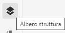
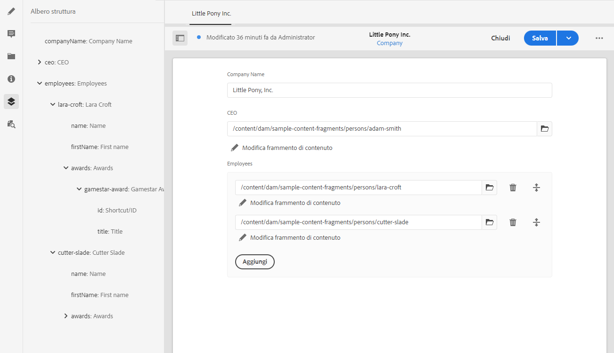

# Struttura dei frammenti di contenuto {#content-fragment-structure-tree}

<!--
hide: yes
index: no
hidefromtoc: yes
-->

Utilizza la funzione Struttura dell’Editor frammenti di contenuto in AEM per comprendere meglio i contenuti headless.

Nell’Editor frammenti di contenuto è possibile selezionare l’icona Struttura:

Verrà visualizzata una rappresentazione della struttura del frammento nel riquadro a sinistra. Questa consente di navigare tra i frammenti a cui si fa riferimento. Quando si seleziona un riferimento, il frammento viene aperto per la modifica.

>[!NOTE]
>
>Utilizzando le breadcrumb nel pannello principale, puoi tornare al punto iniziale.

