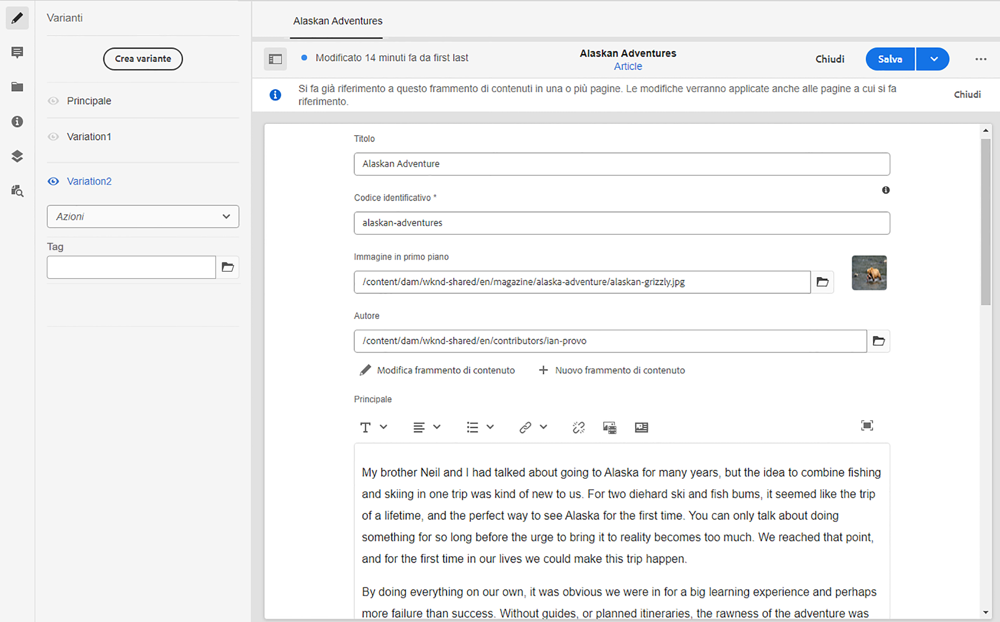

# Varianti - Authoring dei contenuti di frammenti{#variations-authoring-fragment-content}

[Variazioni](/help/sites-cloud/administering/content-fragments/content-fragments.md#constituent-parts-of-a-content-fragment) sono una caratteristica significativa dei frammenti di contenuto AEM, in quanto consentono di creare e modificare copie del contenuto principale da utilizzare su canali e/o scenari specifici, rendendo ancora più flessibile sia l’authoring delle pagine che la distribuzione di contenuti headless.

Da **Variazioni** è possibile:

* [Inserisci il contenuto](#authoring-your-content) per il frammento,
* [Creare e gestire le varianti](#managing-variations) del **Master** contenuto,

Eseguire una serie di altre azioni a seconda del tipo di dati in corso di modifica; ad esempio:

* [Inserire risorse visive nel frammento](#inserting-assets-into-your-fragment) (immagini)

* Seleziona tra [Rich Text](#rich-text), [Testo normale](#plain-text) e [Markdown](#markdown) per la modifica

* [Carica contenuto](#uploading-content)

* [Visualizzare le statistiche chiave](#viewing-key-statistics) (informazioni sul testo su più righe)

* [Testo riepilogo](#summarizing-text)

* [Sincronizzare le varianti con il contenuto principale](#synchronizing-with-master)

>[!CAUTION]
>
>Dopo la pubblicazione e/o il riferimento a un frammento, AEM un avviso quando un autore riapre il frammento per la modifica. In questo modo si avverte che le modifiche al frammento avranno effetto anche sulle pagine a cui si fa riferimento.

## Authoring dei contenuti {#authoring-your-content}

Quando apri il frammento di contenuto per la modifica, la **Variazioni** per impostazione predefinita viene aperta la scheda . Qui puoi creare il contenuto, per Master o qualsiasi variante disponibile. Il frammento strutturato contiene vari campi, di vari tipi di dati, definiti nel modello di contenuto.

Esempio:

Puoi:

* apportare modifiche direttamente nel **Variazioni** scheda

   * ogni tipo di dati offre diverse opzioni di modifica

* per **Testo a più righe** è inoltre possibile aprire i campi [editor a schermo intero](#full-screen-editor) a:

   * seleziona la [Formato](#formats)
   * ulteriori opzioni di modifica (per [Rich Text](#rich-text) formato)
   * accedere a una serie di [azioni](#actions)

* Per **Riferimento frammento** campi **[Modifica frammento di contenuto](#fragment-references-edit-content-fragment)** a seconda della definizione del modello, può essere disponibile l&#39;opzione .

### Editor a schermo intero {#full-screen-editor}

Quando modifichi un campo di testo su più righe puoi aprire l’editor a schermo intero; tocca o fai clic all’interno del testo effettivo, quindi seleziona la seguente icona di azione:

Verrà aperto l’editor di testo a schermo intero:

L’editor di testo a schermo intero fornisce:

* Accesso a vari [azioni](#actions)
* A seconda del [format](#formats), opzioni di formattazione aggiuntive ([Rich Text](#rich-text))

### Azioni {#actions}

Sono disponibili anche le seguenti azioni (per tutte le [formati](#formats)) quando l’editor a schermo intero (ad esempio testo su più righe) è aperto:

* Seleziona la [format](#formats) ([Rich Text](#rich-text), [Testo normale,](#plain-text) [Markdown](#markdown))

* [Caricare contenuto](#uploading-content)

* [Mostra statistiche testo](#viewing-key-statistics)

* [Sincronizza con principale](#synchronizing-with-master) (durante la modifica di una variante)

* [Testo riepilogo](#summarizing-text)

### Formati {#formats}

Le opzioni per la modifica del testo su più righe dipendono dal formato selezionato:

* [Formato RTF](#rich-text)
* [Testo normale](#plain-text)
* [Markdown](#markdown)

Il formato può essere selezionato quando si utilizza l’editor a schermo intero.

### Formato RTF {#rich-text}

La modifica Rich Text consente di formattare:

* Grassetto
* Corsivo
* Sottolineato
* Allineamento: sinistra, centro, destra
* Elenco puntato
* Elenco numerato
* Rientro: aumento, diminuzione
* Creare/interrompere collegamenti ipertestuali
* Incolla testo/da Word
* Inserire una tabella
* Stile paragrafo: Paragrafo, Titolo 1/2/3
* [Inserisci risorsa](#inserting-assets-into-your-fragment)
* Apri l’editor a schermo intero, in cui sono disponibili le seguenti opzioni di formattazione:
   * Ricerca
   * Trova/Sostituisci
   * Controllo ortografia
   * [Annotazioni](/help/sites-cloud/administering/content-fragments/content-fragments-variations.md#annotating-a-content-fragment)
* [Inserisci frammento di contenuto](#inserting-content-fragment-into-your-fragment); disponibile quando **Testo a più righe** è configurato con **Consenti riferimento frammento**.

La [azioni](#actions) sono accessibili anche dall’editor a schermo intero.

### Testo normale {#plain-text}

Testo normale consente di inserire rapidamente i contenuti senza formattazione o informazioni di markdown. Puoi anche aprire l’editor a schermo intero per ulteriori informazioni [azioni](#actions).

>[!CAUTION]
>
>Se selezioni **Testo normale**, potresti perdere la formattazione, le marcature e/o le risorse inserite in **Rich Text** o **Markdown**.

### Markdown {#markdown}

>[!NOTE]
>
>Per informazioni complete vedi [Markdown](/help/sites-cloud/administering/content-fragments/content-fragments-markdown.md) documentazione.

Questo consente di formattare il testo utilizzando markdown. Puoi definire:

* Intestazioni
* Paragrafi e interruzioni di riga
* Collegamenti
* Immagini
* Virgolette a blocchi
* Elenchi
* Enfasi
* Blocchi di codice
* Espressioni barra rovesciata

Puoi anche aprire l’editor a schermo intero per ulteriori informazioni [azioni](#actions).

>[!CAUTION]
>
>Se passi da **Rich Text** a **Markdown**, potresti riscontrare effetti imprevisti con Block Quotes (Citazioni) e Code Blocks (Blocchi di codice), in quanto questi due formati possono presentare differenze nelle modalità di gestione.

### Riferimenti ai frammenti {#fragment-references}

Se il modello per frammenti di contenuto contiene riferimenti a frammento, gli autori dei frammenti potrebbero disporre di opzioni aggiuntive:

* [Modifica frammento di contenuto](#fragment-references-edit-content-fragment)
* [Nuovo frammento di contenuto](#fragment-references-new-content-fragment)

#### Modifica frammento di contenuto {#fragment-references-edit-content-fragment}

Opzione **Modifica frammento di contenuto** apre il frammento in una nuova scheda dell’editor (nella stessa scheda del browser).

Seleziona nuovamente la scheda originale (ad esempio, **Little Pony Inc.**), chiuderà questa scheda secondaria (in questo caso, **Adam Smith**).

#### Nuovo frammento di contenuto {#fragment-references-new-content-fragment}

Opzione **Nuovo frammento di contenuto** consente di creare un frammento completamente nuovo. A questo scopo, nell’editor si aprirà una variante della procedura guidata crea frammento di contenuto .

Potrai quindi creare un nuovo frammento:

1. Individuazione e selezione della cartella desiderata.
1. Selezione **Successivo**.
1. Specificare le proprietà; per esempio **Titolo**.
1. Selezione **Crea**.
1. Infine:
   1. **Fine** restituirà (al frammento originale) e farà riferimento al nuovo frammento.
   1. **Apri** farà riferimento al nuovo frammento e aprirà il nuovo frammento, per modificarlo, in una nuova scheda del browser.

### Visualizzazione delle statistiche chiave {#viewing-key-statistics}

Quando l’editor a schermo intero è aperto, l’azione **Statistiche testo** visualizzerà una serie di informazioni sul testo.

Esempio:

### Caricamento del contenuto {#uploading-content}

Per facilitare il processo di creazione dei frammenti di contenuto, puoi caricare il testo, prepararlo in un editor esterno e aggiungerlo direttamente al frammento.

### Testo riepilogo {#summarizing-text}

Il testo di riepilogo è progettato per aiutare gli utenti a ridurre la lunghezza del testo a un numero predefinito di parole, mantenendo al tempo stesso i punti chiave e il significato generale.

>[!NOTE]
>
>A livello più tecnico, il sistema mantiene le frasi che ritiene fornire *miglior rapporto tra densità e unicità delle informazioni* secondo specifici algoritmi.

>[!CAUTION]
>
>Il frammento di contenuto deve avere come predecessore una cartella di lingua valida (codice ISO); viene utilizzato per determinare il modello di lingua da utilizzare.
>
>Ad esempio: `en/` come nel seguente percorso:
>
>  `/content/dam/my-brand/en/path-down/my-content-fragment`

>[!CAUTION]
L&#39;inglese è disponibile come standard.
Altre lingue sono disponibili come Pacchetti modello lingua da Distribuzione software:
* [Francese (fr)](https://experience.adobe.com/#/downloads/content/software-distribution/en/aem.html?package=/content/software-distribution/en/details.html/content/dam/aem/public/adobe/packages/cq630/product/smartcontent-model-fr)
* [Tedesco (de)](https://experience.adobe.com/#/downloads/content/software-distribution/en/aem.html?package=/content/software-distribution/en/details.html/content/dam/aem/public/adobe/packages/cq630/product/smartcontent-model-de)
* [Italiano (it)](https://experience.adobe.com/#/downloads/content/software-distribution/en/aem.html?package=/content/software-distribution/en/details.html/content/dam/aem/public/adobe/packages/cq630/product/smartcontent-model-it)
* [Spagnolo (es)](https://experience.adobe.com/#/downloads/content/software-distribution/en/aem.html?package=/content/software-distribution/en/details.html/content/dam/aem/public/adobe/packages/cq630/product/smartcontent-model-es)
>

1. Seleziona **Master** o la variazione richiesta.
1. Apri l’editor a schermo intero.

1. Seleziona **Testo di riepilogo** dalla barra degli strumenti.

   

1. Specifica il numero di parole desiderato e seleziona **Inizio**:
1. Il testo originale viene visualizzato affiancato al riepilogo proposto:

   * Tutte le frasi da eliminare sono evidenziate in rosso, con un click-through.
   * Fai clic su una frase evidenziata per mantenerla nel contenuto riepilogato.
   * Fai clic su una frase non evidenziata per eliminarla.

1. Seleziona **Riepiloga** per confermare le modifiche.

1. Il testo originale viene visualizzato affiancato al riepilogo proposto:

   * Tutte le frasi da eliminare sono evidenziate in rosso, con un click-through.
   * Fai clic su una frase evidenziata per mantenerla nel contenuto riepilogato.
   * Fai clic su una frase non evidenziata per eliminarla.
   * Vengono visualizzate le statistiche di riepilogo: **Effettivo** e **Target**-
   * È possibile **Anteprima** le modifiche.

   

### Aggiunta di annotazioni a un frammento di contenuto {#annotating-a-content-fragment}

Per annotare un frammento:

1. Seleziona **Master** o la variazione richiesta.

1. Apri l’editor a schermo intero.

1. La **Annota** l’icona è disponibile nella barra degli strumenti superiore. Se necessario, è possibile selezionare parte del testo.

   

1. Viene aperta una finestra di dialogo. Consente di inserire l’annotazione.

   

1. Seleziona **Applica** nella finestra di dialogo.

   

   Se l’annotazione è stata applicata al testo selezionato, il testo rimane evidenziato.

   

1. Se chiudi l’editor a schermo intero, le annotazioni vengono comunque evidenziate. Se questa opzione è selezionata, verrà visualizzata una finestra di dialogo che consente di modificare ulteriormente l’annotazione.

1. Seleziona **Salva**.

1. Se chiudi l’editor a schermo intero, le annotazioni vengono comunque evidenziate. Se questa opzione è selezionata, verrà visualizzata una finestra di dialogo che consente di modificare ulteriormente l’annotazione.

   

### Visualizzazione, Modifica, Eliminazione Di Annotazioni {#viewing-editing-deleting-annotations}

Annotazioni:

* Sono evidenziati dal testo, sia in modalità a schermo intero che in modalità normale dell’editor. Per visualizzare, modificare e/o eliminare tutti i dettagli di un’annotazione, fate clic sul testo evidenziato per riaprire la finestra di dialogo.

   >[!NOTE]
   Se a un testo sono state applicate più annotazioni, viene fornito un selettore a discesa.

* Quando si elimina l’intero testo a cui è stata applicata l’annotazione, viene eliminata anche l’annotazione.

* Può essere elencato ed eliminato selezionando **Annotazioni** nell’editor frammenti.

   

* Può essere visualizzato ed eliminato in [Timeline](/help/sites-cloud/administering/content-fragments/content-fragments-managing.md#timeline-for-content-fragments) per il frammento selezionato.

### Inserimento di risorse nel frammento {#inserting-assets-into-your-fragment}

Per semplificare il processo di creazione dei frammenti di contenuto, puoi aggiungere [Risorse](/help/assets/manage-digital-assets.md) (immagini) direttamente al frammento.

Vengono aggiunti alla sequenza di paragrafi del frammento senza formattazione; la formattazione può essere eseguita quando [frammento utilizzato/a cui si fa riferimento in una pagina](/help/sites-cloud/authoring/fundamentals/content-fragments.md).

>[!CAUTION]
Queste risorse non possono essere spostate o eliminate in una pagina di riferimento, ma devono essere eseguite nell’editor frammenti.
Tuttavia, la formattazione della risorsa (ad es. dimensione) deve essere eseguita nel [editor di pagine](/help/sites-cloud/authoring/fundamentals/content-fragments.md). La rappresentazione della risorsa nell’editor frammenti è puramente per la creazione del flusso di contenuto.

>[!NOTE]
Sono disponibili diversi metodi di aggiunta [immagini](/help/sites-cloud/administering/content-fragments/content-fragments.md#fragments-with-visual-assets) al frammento e/o alla pagina.

1. Posiziona il cursore nel punto in cui vuoi aggiungere l’immagine.
1. Per aprire la finestra di dialogo di ricerca, utilizza l’icona **Inserisci risorsa**.

   

1. Nella finestra di dialogo puoi effettuare le seguenti operazioni:

   * Passa alla risorsa richiesta in DAM
   * cerca la risorsa in DAM

   Una volta individuata la risorsa desiderata, fai clic sulla miniatura.

1. Utilizza **Seleziona** per aggiungere la risorsa al sistema paragrafo del frammento di contenuto nella posizione corrente.

   >[!CAUTION]
   Se, dopo aver aggiunto una risorsa, ne cambi il formato in:
   * **Testo normale**: la risorsa verrà persa completamente dal frammento.
   * **Markdown**: la risorsa non sarà visibile, ma lo tornerà a essere quando tornerai a **Rich Text**.

### Inserimento di un frammento di contenuto nel frammento {#inserting-content-fragment-into-your-fragment}

Per semplificare il processo di creazione dei frammenti di contenuto, puoi anche aggiungere al frammento un altro frammento di contenuto.

Saranno aggiunti come riferimento nella posizione corrente nel frammento.

>[!NOTE]
Questa opzione è disponibile quando **Testo a più righe** è configurato con **Consenti riferimento frammento**.

>[!CAUTION]
Queste risorse non possono essere spostate o eliminate in una pagina di riferimento, ma devono essere eseguite nell’editor frammenti.
Tuttavia, la formattazione della risorsa (ad es. dimensione) deve essere eseguita nel [editor di pagine](/help/sites-cloud/authoring/fundamentals/content-fragments.md). La rappresentazione della risorsa nell’editor frammenti è puramente per la creazione del flusso di contenuto.

>[!NOTE]
Sono disponibili diversi metodi di aggiunta [immagini](/help/sites-cloud/administering/content-fragments/content-fragments.md#fragments-with-visual-assets) al frammento e/o alla pagina.

1. Posizionare il cursore nella posizione in cui si desidera aggiungere il frammento.
1. Utilizza la **Inserisci frammento di contenuto** per aprire la finestra di dialogo di ricerca.

   

1. Nella finestra di dialogo puoi effettuare le seguenti operazioni:

   * Passa al frammento richiesto nella cartella Risorse
   * ricerca del frammento

   Una volta individuato, seleziona il frammento desiderato facendo clic sulla miniatura.

1. Utilizzo **Seleziona** per aggiungere un riferimento al frammento di contenuto selezionato al frammento di contenuto corrente (nella posizione corrente).

   >[!CAUTION]
   Se, dopo aver aggiunto un riferimento a un altro frammento, si modifica il formato in:
   * **Testo normale**: il riferimento verrà completamente perso dal frammento.
   * **Markdown**: il riferimento rimarrà.

## Gestione delle varianti {#managing-variations}

### Creazione di una variante {#creating-a-variation}

Le varianti consentono di utilizzare **Master** e modificarlo in base allo scopo (se necessario).

Per creare una nuova variante:

1. Apri il frammento e accertati che il pannello laterale sia visibile.
1. Seleziona **Variazioni** dalla barra delle icone nel pannello laterale.
1. Seleziona **Crea variante**.
1. Viene aperta una finestra di dialogo in cui vengono specificati **Titolo** e **Descrizione** per la nuova variante.
1. Seleziona **Aggiungi**, il frammento **Master** verrà copiato nella nuova variante, che è ora aperta per la [modifica](#editing-a-variation).

   >[!NOTE]
   Quando crei una nuova variante, viene sempre **Master** che viene copiato, non la variante attualmente aperta.

### Modifica di una variante {#editing-a-variation}

Puoi apportare modifiche al contenuto della variante dopo:

* [Creazione della variante](#creating-a-variation).
* Aprite un frammento esistente, quindi selezionate la variante desiderata dal pannello laterale.

### Ridenominazione di una variante {#renaming-a-variation}

Per rinominare una variante esistente:

1. Apri il frammento e seleziona **Variazioni** dal pannello laterale.
1. Seleziona la variante desiderata.
1. Seleziona **Rinomina** dal **Azioni** a discesa.

1. Immetti il nuovo **Titolo** e/o **Descrizione** nella finestra di dialogo in questione.

1. Conferma la **Rinomina** azione.

>[!NOTE]
Questo influisce solo sulla variazione **Titolo**.

### Eliminazione di una variante {#deleting-a-variation}

Per eliminare una variante esistente:

1. Apri il frammento e seleziona **Variazioni** dal pannello laterale.
1. Seleziona la variante desiderata.
1. Seleziona **Elimina** dal **Azioni** a discesa.

1. Conferma la **Elimina** nella finestra di dialogo.

>[!NOTE]
Non è possibile eliminare **Master**.

### Sincronizzazione con Master {#synchronizing-with-master}

**Master** è parte integrante di un frammento di contenuto e, per definizione, contiene la copia master del contenuto, mentre le varianti contengono le singole versioni aggiornate e personalizzate di tale contenuto. Quando Master viene aggiornato, è possibile che queste modifiche siano pertinenti anche alle varianti e, pertanto, devono essere propagate a esse.

Quando modifichi una variante hai accesso all’azione per sincronizzare l’elemento corrente della variante con Master. Questo consente di copiare automaticamente le modifiche apportate a Master nella variante desiderata.

>[!CAUTION]
La sincronizzazione è disponibile solo per copiare le modifiche *da **Master**alla variante*.
Viene sincronizzato solo l’elemento corrente della variante.
La sincronizzazione funziona solo sul tipo di dati **Testo su più righe**.
Il trasferimento delle modifiche *da una variante a **Master*** non è disponibile come opzione.

1. Apri il frammento di contenuto nell’editor frammenti. Assicurati che **Master** è stato modificato.

1. Seleziona una variante specifica, quindi l’azione di sincronizzazione appropriata da:

   * la **Azioni** selettore a discesa - **Sincronizza l&#39;elemento corrente con il master**

      

   * la barra degli strumenti dell’editor a schermo intero - **Sincronizza con master**

      

1. Master e la variante saranno mostrati uno accanto all’altro:

   * verde indica il contenuto aggiunto (alla variante)
   * il rosso indica il contenuto rimosso (dalla variante)
   * blu indica il testo sostituito

   

1. Seleziona **Sincronizza**, la variante viene aggiornata e visualizzata.
