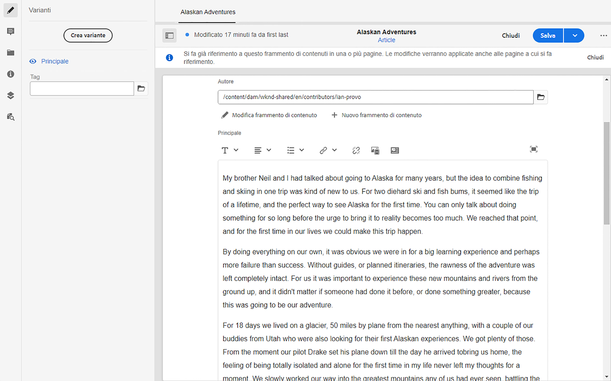

# Varianti - Authoring dei contenuti di frammenti{#variations-authoring-fragment-content}

<!--
hide: yes
index: no
hidefromtoc: yes
-->

[Varianti](/help/sites-cloud/administering/content-fragments/content-fragments.md#constituent-parts-of-a-content-fragment) sono una funzione significativa dei frammenti di contenuto di Adobe Experience Manager (AEM). Consentono di creare e modificare copie del contenuto principale da utilizzare su canali e scenari specifici, rendendo ancora più flessibile sia l’authoring delle pagine che la distribuzione di contenuti headless.

Dalla sezione **Varianti** scheda è possibile effettuare le seguenti operazioni:

* [Inserire il contenuto](#authoring-your-content) del frammento
* [Creare e gestire le varianti](#managing-variations) del contenuto **principale**

Puoi eseguire una serie di altre azioni a seconda del tipo di dati in corso di modifica, ad esempio:

* [Inserire risorse visive nel frammento](#inserting-assets-into-your-fragment) (immagini)

* Seleziona tra [Rich Text](#rich-text), [Testo normale](#plain-text), e [Markdown](#markdown) per la modifica

* [Caricare contenuti](#uploading-content)

* [Visualizzare le statistiche chiave](#viewing-key-statistics) (informazioni sul testo su più righe)

* [Ottenere un riepilogo del testo](#summarizing-text)

* [Sincronizzare le varianti con il contenuto principale](#synchronizing-with-master)

>[!CAUTION]
>
>Dopo la pubblicazione e/o il riferimento a un frammento, l’AEM visualizza un avviso quando un autore riapre il frammento per la modifica. Questo messaggio notifica circa l’effetto delle modifiche apportate al frammento anche sulle pagine a cui si fa riferimento.

## Authoring dei contenuti {#authoring-your-content}

Quando apri il frammento di contenuto per la modifica, la scheda **Varianti** viene aperta per impostazione predefinita. Qui puoi creare il contenuto per l’elemento Principale o per una delle varianti disponibili. Il frammento strutturato contiene campi di vari tipi di dati definiti nel modello di contenuto.

Ad esempio:

Operazioni disponibili:

* Apporta modifiche al contenuto direttamente nella scheda **Varianti**; ogni tipo di dati fornisce diverse opzioni di modifica, ad esempio:

   * per **Testo su più righe** , è inoltre possibile aprire [editor a schermo intero](#full-screen-editor) a:

      * Selezionare il [Formato](#formats)
      * Accedere a ulteriori opzioni di modifica (per il formato [Testo formattato](#rich-text))
      * Accedere a una serie di [azioni](#actions)

   * Per **Riferimento frammento** campi, il [Modifica frammento di contenuto](#fragment-references-edit-content-fragment) a seconda della definizione del modello.

* Assegna **Tag** alla variante corrente; i tag possono essere aggiunti, aggiornati e rimossi.

   * [Tag](/help/sites-cloud/authoring/features/tags.md) sono utili per organizzare i frammenti in quanto possono essere utilizzati per la classificazione e la tassonomia dei contenuti. I tag possono essere utilizzati per trovare il contenuto (per tag) e applicare operazioni in blocco.

      * La ricerca di un tag restituisce il frammento, con la variante tag evidenziata.
      * I tag delle varianti possono essere utilizzati anche per raggruppare le varianti per un profilo Content Delivery Network (CDN) specifico (per la memorizzazione in cache di CDN), invece di utilizzare il nome della variante.

     Ad esempio, puoi assegnare ai frammenti rilevanti il tag “Lancio di Natale” in modo da poter visualizzare solo tale sottoinsieme di frammenti, oppure per copiarli in una nuova cartella e utilizzarli per un altro lancio futuro.

  >[!NOTE]
  >
  >I **Tag** possono essere aggiunti (alla variante **Principale**) come parte dei [Metadati](/help/sites-cloud/administering/content-fragments/content-fragments-metadata.md)

* [Creare e gestire le varianti](#managing-variations) del contenuto **principale**.

### Editor a schermo intero {#full-screen-editor}

Quando modifichi un campo di testo su più righe puoi aprire l’editor a schermo intero; tocca o fai clic all’interno del testo effettivo, quindi seleziona la seguente icona di azione:

Viene aperto l’editor di testo a schermo intero:

L’editor di testo a schermo intero fornisce:

* accesso a varie [azioni](#actions);
* a seconda del [formato](#formats), opzioni di formattazione aggiuntive ([Testo formattato](#rich-text))

### Azioni {#actions}

Quando l’editor a schermo intero (ovvero testo su più righe) è aperto, sono disponibili anche le seguenti azioni (per tutti i [formati](#formats)):

* Selezionare il [formato](#formats) ([Testo formattato](#rich-text), [Testo normale,](#plain-text) [Markdown](#markdown))

* [Caricare contenuti](#uploading-content)

* [Mostrare statistiche sul testo](#viewing-key-statistics)

* [Sincronizzare con il contenuto principale](#synchronizing-with-master) (se si modifica una variante)

* [Ottenere un riepilogo del testo](#summarizing-text)

### Formati {#formats}

Le opzioni per la modifica del testo su più righe dipendono dal formato selezionato:

* [Testo formattato](#rich-text)
* [Testo normale](#plain-text)
* [Markdown](#markdown)

Il formato può essere selezionato quando si utilizza l’editor a schermo intero.

### Testo formattato {#rich-text}

La modifica in formato RTF consente di formattare:

* Grassetto
* Corsivo
* Sottolineato
* Allineamento: sinistra, centro, destra
* Elenco puntato
* Elenco numerato
* Rientro: aumento, riduzione
* Creare/interrompere collegamenti ipertestuali
* Incolla testo/da Word
* Inserisci tabella
* Stile paragrafo: Paragrafo, Titolo 1/2/3
* [Inserisci risorsa](#inserting-assets-into-your-fragment)
* Aprire l’editor a schermo intero, in cui sono disponibili le seguenti opzioni di formattazione:
   * Ricerca
   * Trova/Sostituisci
   * Controllo ortografia
   * [Annotazioni](/help/sites-cloud/administering/content-fragments/content-fragments-variations.md#annotating-a-content-fragment)
* [Inserisci frammento di contenuto](#inserting-content-fragment-into-your-fragment); disponibile quando **Testo su più righe** il campo è configurato con **Consenti riferimento frammento**.

Dall’editor a schermo intero sono accessibili anche le [azioni](#actions).

### Testo normale {#plain-text}

Testo normale consente di inserire rapidamente contenuti senza formattazione o informazioni di markdown. Puoi anche aprire l’editor a schermo intero per ulteriori [azioni](#actions).

>[!CAUTION]
>
>Se si seleziona **Testo normale**, potresti perdere la formattazione, elementi di markdown e/o risorse inserite in **Rich Text** o **Markdown**.

### Markdown {#markdown}

>[!NOTE]
>
>Per informazioni complete, vedi [Markdown](/help/sites-cloud/administering/content-fragments/content-fragments-markdown.md).

Questo consente di formattare il testo utilizzando il markdown. Puoi definire:

* Titoli
* Paragrafi e interruzioni di riga
* Collegamenti
* Immagini
* Citazioni
* Elenchi
* Enfasi
* Blocchi di codice
* Escape barra rovesciata

Puoi anche aprire l’editor a schermo intero per ulteriori [azioni](#actions).

>[!CAUTION]
>
>Se passi da **Testo formattatot** a **Markdown**, potresti riscontrare effetti imprevisti con Citazioni e Blocchi di codice, in quanto questi due formati possono presentare differenze nelle modalità di gestione.

### Riferimenti frammento {#fragment-references}

Se il modello per frammenti di contenuto contiene riferimenti frammento, gli autori dei frammenti potrebbero disporre di opzioni aggiuntive:

* [Modifica frammento di contenuto](#fragment-references-edit-content-fragment)
* [Nuovo frammento di contenuto](#fragment-references-new-content-fragment)

#### Modifica frammento di contenuto {#fragment-references-edit-content-fragment}

Opzione **Modifica frammento di contenuto** apre il frammento in una nuova scheda dell’editor (nella stessa scheda del browser).

Selezionando di nuovo la scheda originale (ad esempio, **Little Pony Inc.**), chiude questa scheda secondaria (in questo caso, **Adam Smith**).

#### Nuovo frammento di contenuto {#fragment-references-new-content-fragment}

Opzione **Nuovo frammento di contenuto** consente di creare un frammento. A questo scopo, nell’editor viene visualizzata una variante della procedura guidata per creare un frammento di contenuto.

**Per creare un frammento di contenuto:**

1. Individua e seleziona la cartella desiderata.
1. Seleziona **Avanti**.
1. Specifica delle proprietà; ad esempio, **Titolo**.
1. Seleziona **Crea**.
1. Infine:
   1. **Fine**:
      * restituisce (al frammento originale)
      * fa riferimento al nuovo frammento
   1. **Apri**:
      * fa riferimento al nuovo frammento
      * apre il nuovo frammento per la modifica in una nuova scheda del browser

### Visualizzazione delle statistiche chiave {#viewing-key-statistics}

Quando l’editor a schermo intero è aperto, l’azione **Statistiche testo** visualizza una serie di informazioni sul testo.

Esempio:

### Caricamento del contenuto {#uploading-content}

Per semplificare il processo di creazione dei frammenti di contenuto, puoi caricare il testo, prepararlo in un editor esterno e aggiungerlo direttamente al frammento.

### Ottenere un riepilogo del testo {#summarizing-text}

La funzione di riepilogo del testo è progettata per aiutare gli utenti a ridurre la lunghezza del testo a un numero predefinito di parole, mantenendo i punti chiave e il significato generale.

>[!NOTE]
>
>A livello più tecnico, il sistema mantiene le frasi che ritiene forniscano *miglior rapporto tra densità e unicità delle informazioni* secondo algoritmi specifici.

>[!CAUTION]
>
>Il frammento di contenuto deve avere come predecessore una cartella di lingua valida (codice ISO), che viene utilizzata per determinare il modello della lingua.
>
>Ad esempio: `en/` nel seguente percorso:
>
>  `/content/dam/my-brand/en/path-down/my-content-fragment`

>[!CAUTION]
>
L’inglese è disponibile in modo predefinito.
>
Altre lingue sono disponibili come Pacchetti modello di lingua da Software Distribution:
>
* [Francese (fr)](https://experience.adobe.com/#/downloads/content/software-distribution/en/aem.html?package=/content/software-distribution/en/details.html/content/dam/aem/public/adobe/packages/cq630/product/smartcontent-model-fr)
* [Tedesco (de)](https://experience.adobe.com/#/downloads/content/software-distribution/en/aem.html?package=/content/software-distribution/en/details.html/content/dam/aem/public/adobe/packages/cq630/product/smartcontent-model-de)
* [Italiano (it)](https://experience.adobe.com/#/downloads/content/software-distribution/en/aem.html?package=/content/software-distribution/en/details.html/content/dam/aem/public/adobe/packages/cq630/product/smartcontent-model-it)
* [Spagnolo (es)](https://experience.adobe.com/#/downloads/content/software-distribution/en/aem.html?package=/content/software-distribution/en/details.html/content/dam/aem/public/adobe/packages/cq630/product/smartcontent-model-es)
>

1. Seleziona **Principale** o la variante richiesta.
1. Apri l’editor a schermo intero.

1. Seleziona **Riepiloga testo** nella barra degli strumenti.

   

1. Specifica il numero di parole desiderato e seleziona **Inizia**:
1. Il testo originale viene visualizzato affiancato al riepilogo proposto:

   * Tutte le frasi da eliminare sono evidenziate in rosso e barrate.
   * Fai clic su una frase evidenziata in modo da mantenerla nel contenuto del riepilogo.
   * Fai clic su una frase non evidenziata in modo da poterla eliminare.

1. Seleziona **Riepiloga**.

1. Il testo originale viene visualizzato affiancato al riepilogo proposto:

   * Tutte le frasi da eliminare sono evidenziate in rosso e barrate.
   * Fai clic su una frase evidenziata in modo da mantenerla nel contenuto del riepilogo.
   * Fai clic su una frase non evidenziata in modo da poterla eliminare.
   * Vengono visualizzate le statistiche di riepilogo: **Effettivo** e **Destinazione**
   * È possibile **visualizzare in nteprima** le modifiche.

   

### Annotazione di un frammento di contenuto {#annotating-a-content-fragment}

1. Seleziona **Principale** o la variante richiesta.

1. Apri l’editor a schermo intero.

1. L’icona **Annota** è disponibile nella barra degli strumenti superiore. Se necessario, è possibile selezionare del testo.

   

1. Viene visualizzata una finestra di dialogo. Consente di inserire l’annotazione.

   

1. Seleziona **Applica** nella finestra di dialogo.

   

   Se l’annotazione è stata applicata al testo selezionato, il testo rimane evidenziato.

   

1. Se chiudi l’editor a schermo intero, le annotazioni restano evidenziate. Se selezionata, viene visualizzata una finestra di dialogo che consente di modificare ulteriormente l’annotazione.

1. Seleziona **Salva**.

1. Se chiudi l’editor a schermo intero, le annotazioni restano evidenziate. Se selezionata, viene visualizzata una finestra di dialogo che consente di modificare ulteriormente l’annotazione.

   

### Visualizzazione, modifica ed eliminazione delle annotazioni {#viewing-editing-deleting-annotations}

Caratteristiche delle annotazioni:

* Indicato dall’evidenziazione sul testo, sia nella modalità a schermo intero che nella modalità normale dell’editor. Per visualizzare, modificare o eliminare tutti i dettagli di un&#39;annotazione, fare clic sul testo evidenziato per riaprire la finestra di dialogo.

  >[!NOTE]
  >
  Se a un testo sono state applicate più annotazioni, viene fornito un selettore a discesa.

* Quando si elimina l’intero testo a cui è stata applicata l’annotazione, viene eliminata anche l’annotazione.

* Possono essere elencate ed eliminate selezionando la **Annotazioni** nell’editor frammenti.

  

* Possono essere visualizzate ed eliminate nella [Timeline](/help/sites-cloud/administering/content-fragments/content-fragments-managing.md#timeline-for-content-fragments) per il frammento selezionato.

### Inserimento di risorse nel frammento {#inserting-assets-into-your-fragment}

Per semplificare il processo di creazione dei frammenti di contenuto, puoi aggiungere [Risorse](/help/assets/manage-digital-assets.md) (immagini) direttamente nel frammento.

Vengono aggiunte alla sequenza di paragrafi del frammento senza formattazione; la formattazione può essere impostata quando il [frammento viene utilizzato o inserito come riferimento in una pagina](/help/sites-cloud/authoring/fundamentals/content-fragments.md).

>[!CAUTION]
>
Non è possibile spostare o eliminare le risorse in una pagina di riferimento; tali azioni devono essere eseguite nell’editor frammenti.
>
La formattazione della risorsa (ad esempio, dimensione) deve invece essere eseguita nell’[editor pagina](/help/sites-cloud/authoring/fundamentals/content-fragments.md). La rappresentazione della risorsa nell’editor frammenti è puramente a scopo di creazione del flusso di contenuto.

>[!NOTE]
>
Esistono diversi metodi per aggiungere [immagini](/help/sites-cloud/administering/content-fragments/content-fragments.md#fragments-with-visual-assets) al frammento e/o alla pagina.

1. Posizionare il cursore nel punto in cui si desidera aggiungere l&#39;immagine.
1. Utilizza il **Inserisci risorsa** per aprire la finestra di dialogo di ricerca.

   

1. Nella finestra di dialogo, puoi passare alla risorsa richiesta in DAM oppure cercare la risorsa in DAM.

   Una volta individuata, seleziona la risorsa desiderata facendo clic sulla miniatura.

1. Utilizza **Seleziona** per aggiungere la risorsa al sistema paragrafo del frammento di contenuto nella posizione corrente.

   >[!CAUTION]
   >
   Dopo aver aggiunto una risorsa, se modifichi il formato in:
   >
   * **Testo normale**: la risorsa viene persa dal frammento.
   * **Markdown**: la risorsa non è visibile, ma lo tornerà a essere quando torni a **Rich Text**.

### Inserimento di un frammento di contenuto nel frammento {#inserting-content-fragment-into-your-fragment}

Per semplificare il processo di creazione dei frammenti di contenuto, puoi anche aggiungere al frammento un altro frammento di contenuto.

Vengono aggiunti come riferimento nella posizione corrente all’interno del frammento.

>[!NOTE]
>
Questa opzione è disponibile quando **Testo su più righe** è configurato con **Consenti riferimento frammento**.

>[!CAUTION]
>
Non è possibile spostare o eliminare le risorse in una pagina di riferimento; tali azioni devono essere eseguite nell’editor frammenti.
>
La formattazione della risorsa (ad esempio, dimensione) deve invece essere eseguita nell’[editor pagina](/help/sites-cloud/authoring/fundamentals/content-fragments.md). La rappresentazione della risorsa nell’editor frammenti è puramente a scopo di creazione del flusso di contenuto.

>[!NOTE]
>
Esistono diversi metodi per aggiungere [immagini](/help/sites-cloud/administering/content-fragments/content-fragments.md#fragments-with-visual-assets) al frammento e/o alla pagina.

1. Posiziona il cursore nel punto in cui desideri aggiungere il frammento.
1. Utilizza il **Inserisci frammento di contenuto** per aprire la finestra di dialogo di ricerca.

   

1. Nella finestra di dialogo, puoi passare al frammento richiesto nella cartella Risorse oppure cercare il frammento.

   Una volta individuato, seleziona il frammento desiderato facendo clic sulla miniatura.

1. Utilizza **Seleziona** per aggiungere al frammento corrente (nella posizione corrente) un riferimento al frammento di contenuto selezionato.

   >[!CAUTION]
   >
   Dopo aver aggiunto un riferimento a un altro frammento, se modifichi il formato in:
   >
   * **Testo normale**: il riferimento viene perso dal frammento.
   * **Markdown**: il riferimento rimane.

## Gestione delle varianti {#managing-variations}

[!CONTEXTUALHELP]
id="aemcloud_sites_contentfragments_variations"
title="Varianti - Authoring dei contenuti di frammenti"
abstract="Scopri come creare varianti di contenuto da utilizzare con canali specifici."
additional-url="https://video.tv.adobe.com/v/333295/?captions=ita" text="Varianti dei frammenti di contenuto"

### Creazione di una variante {#creating-a-variation}

Le varianti consentono di utilizzare **Principale** e modificarlo in base allo scopo (se necessario).

Per creare una variante:

1. Apri il frammento e accertati che il pannello laterale sia visibile.
1. Seleziona **Varianti** dalla barra delle icone nel pannello laterale.
1. Seleziona **Crea variante**.
1. Viene visualizzata una finestra di dialogo in cui è possibile specificare **Titolo** e **Descrizione** per la nuova variante.
1. Seleziona **Aggiungi**, il frammento **Principale** viene copiato nella nuova variante, che è ora aperta per la [modifica](#editing-a-variation).

   >[!NOTE]
   >
   Quando crei una variante, è sempre il **Principale** viene copiata, non la variante aperta.

   >[!NOTE]
   >
   Quando crei una variante, tutti **Tag** attualmente assegnato al **Principale** La variante viene copiata nella nuova variante.

### Modifica di una variante {#editing-a-variation}

Puoi modificare il contenuto della variante dopo:

* la [creazione della variante](#creating-a-variation);
* l’apertura di un frammento esistente e la selezione della variante desiderata dal pannello laterale.

### Modifica del nome di una variante {#renaming-a-variation}

Per modificare il nome di una variante esistente:

1. Apri il frammento e seleziona **Varianti** nel pannello laterale.
1. Seleziona la variante desiderata.
1. Seleziona **Rinomina** dal menu a discesa **Azioni**.

1. Nella finestra di dialogo che si apre, immetti il nuovo **Titolo** e/o la nuova **Descrizione**.

1. Conferma l’azione **Rinomina**.

>[!NOTE]
>
Questo influisce solo sul **Titolo** della variante.

### Eliminazione di una variante {#deleting-a-variation}

Per eliminare una variante esistente:

1. Apri il frammento e seleziona **Varianti** nel pannello laterale.
1. Seleziona la variante desiderata.
1. Seleziona **Elimina** dal menu a discesa **Azioni**.

1. Conferma la **Elimina** nella finestra di dialogo.

>[!NOTE]
>
Non è possibile eliminare l’elemento **Principale**.

### Sincronizzazione con l’elemento Principale {#synchronizing-with-master}

**Principale** fa parte di un frammento di contenuto e, per definizione, contiene la copia principale del contenuto, mentre le varianti ne contengono le singole versioni aggiornate e personalizzate. Quando l’elemento Principale viene aggiornato, è possibile che queste modifiche siano rilevanti anche per le varianti e, pertanto, devono essere propagate ad esse.

Quando modifichi una variante, hai accesso all’azione per sincronizzare l’elemento corrente della variante con l’elemento Principale. Questo consente di copiare automaticamente le modifiche apportate all’elemento Principale nella variante richiesta.

>[!CAUTION]
>
La sincronizzazione è disponibile solo per copiare le modifiche *dall’elemento **Principale** alla variante*.
>
Viene sincronizzato solo l’elemento corrente della variante.
>
La sincronizzazione funziona solo sul **Testo su più righe** tipo di dati.
>
Il trasferimento delle modifiche *da una variante all’elemento **Principale*** non è disponibile come opzione.

1. Apri il frammento di contenuto nell’editor frammenti. Assicurati che l’elemento **Principale** sia stato modificato.

1. Seleziona una variante specifica, quindi seleziona l’azione di sincronizzazione appropriata da una delle seguenti aree:

   * Selettore a discesa **Azioni**: **sincronizza l’elemento corrente con l’elemento principale**

     

   * Barra degli strumenti dell’editor a schermo intero: **Sincronizza con elemento principale**

     

1. L’elemento Principale e la variante vengono visualizzati affiancati:

   * Il contenuto aggiunto alla variante è indicato in verde
   * Il rosso indica che il contenuto è stato rimosso (dalla variante)
   * Il testo sostituito è indicato in blu.

   

1. Seleziona **Sincronizza**, la variante viene aggiornata e visualizzata.
