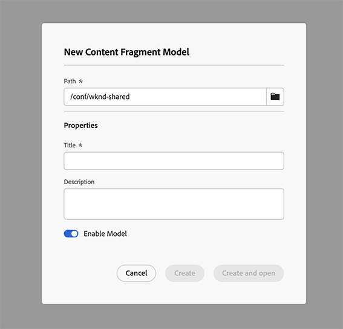

# Gestione dei modelli per frammenti di contenuto {#managing-content-fragment-models}

Dalla console Frammenti di contenuto puoi gestire i tuoi modelli di frammenti di contenuto, quindi [apri l&#39;editor](/help/sites-cloud/administering/content-fragments/content-fragment-models.md) per definire la struttura.

I modelli per frammenti di contenuto in Adobe Experience Manager (AEM) as a Cloud Service definiscono la struttura per il contenuto dei [frammenti di contenuto](/help/sites-cloud/administering/content-fragments/overview.md). Questi frammenti possono quindi essere utilizzati come base per i contenuti headless o per l’authoring delle pagine.

>[!NOTE]
>
>Tieni presente le [best practice](/help/sites-cloud/administering/content-fragments/overview.md#best-practices) quando utilizzi i modelli per frammenti di contenuto e i frammenti di contenuto.

>[!NOTE]
>
>Questa pagina descrive la sezione della console che visualizza (solo) Modelli per frammenti di contenuto. Per gli altri pannelli, vedi:
>
>* [Gestione dei frammenti di contenuto](/help/sites-cloud/administering/content-fragments/managing.md)
>* [Visualizzazione e gestione di Assets nella console Frammenti di contenuto](/help/sites-cloud/administering/content-fragments/assets-content-fragments-console.md)

>[!NOTE]
>
>I frammenti di contenuto sono memorizzati come **Risorse**. I modelli per frammenti di contenuto sono gestiti principalmente dalla console **Frammenti di contenuto**, ma possono anche essere gestiti dalla console [Assets](/help/assets/content-fragments/content-fragments-managing.md) e dall&#39;opzione [Modelli per frammenti di contenuto](/help/assets/content-fragments/content-fragments-models.md) disponibile da **Strumenti** - **Generale**.

## Come utilizzare i modelli per frammenti di contenuto {#how-to-work-with-content-fragment-models}

Come panoramica molto rapida, per lavorare con i modelli per frammenti di contenuto:

1. [Abilita la funzionalità modello Frammento di contenuto per un’istanza](/help/sites-cloud/administering/content-fragments/setup.md)
1. [Crea](#creating-a-content-fragment-model) il tuo modello per frammenti di contenuto.
   * A questo punto puoi anche **abilitare** il modello (da utilizzare per la creazione di frammenti di contenuto).
1. [Definisci](/help/sites-cloud/administering/content-fragments/content-fragment-models.md#defining-your-content-fragment-model) la struttura del modello.
1. [Abilita il modello per frammenti di contenuto](#enabling-a-content-fragment-model), se non lo hai già fatto.
1. [Consenti modelli di frammento di contenuto nelle cartelle Risorse richieste](#allowing-content-fragment-models-assets-folder) configurando i **Criteri**.

## Struttura e gestione di base dei modelli per frammenti di contenuto nella console {#basic-structure-handling-content-fragment-models-console}

Puoi utilizzare il pannello all&#39;estrema sinistra della [console Frammenti di contenuto](/help/sites-cloud/administering/content-fragments/overview.md#content-fragments-console) per selezionare **Modelli per frammenti di contenuto** come tipo di risorsa per visualizzare, sfogliare e gestire:

Verrà aperta la visualizzazione per i modelli per frammenti di contenuto:

Nella console puoi osservare tre aree principali:

* Barra degli strumenti superiore
   * Fornisce le funzionalità standard di AEM
   * Mostra la tua organizzazione IMS
   * Fornisce varie [azioni](#actions-unselected), che possono [cambiare quando si selezionano uno o più modelli](#actions-selected-content-fragment-models)
* Pannello a sinistra
   * Mostra i [percorsi per tutte le configurazioni](/help/sites-cloud/administering/content-fragments/setup.md#enable-content-fragment-functionality-configuration-browser) elencate come cartelle
   * Qui puoi nascondere o visualizzare la struttura delle cartelle
   * Puoi selezionare una cartella specifica della struttura
   * Può essere ridimensionata per mostrare cartelle nidificate (configurazioni secondarie)
   * Oltre ai modelli per frammenti di contenuto, puoi visualizzare [Frammenti di contenuto](/help/sites-cloud/administering/content-fragments/managing.md) o [Assets](/help/sites-cloud/administering/content-fragments/assets-content-fragments-console.md); puoi anche comprimere o espandere i collegamenti ai pannelli
* Pannello principale/destro; da qui puoi:
   * Visualizza l’elenco di tutti i modelli per frammenti di contenuto presenti nella cartella selezionata:
      * Verranno visualizzati i modelli per frammenti di contenuto della cartella selezionata e tutte le sottocartelle:
         * La posizione è indicata dalle breadcrumb; queste possono essere utilizzate anche per modificare la posizione:
      * [Vengono visualizzate informazioni su ciascun modello](#information-content-fragment-models)
         * [È possibile selezionare le colonne da visualizzare](#select-columns-console)
      * [Vari campi di informazioni](#information-content-fragment-models) su un modello per frammenti di contenuto forniscono collegamenti che, a seconda del campo, possono:
         * Apri il modello appropriato nell’editor
         * Mostra informazioni sul percorso della configurazione
         * Mostra informazioni sullo stato del modello
      * [Alcuni altri campi di informazioni](#information-content-fragments) su un modello per frammenti di contenuto possono essere utilizzati per [Filtro rapido](#fast-filtering):
         * Seleziona un valore nella colonna e viene immediatamente applicato come filtro
         * Il filtro rapido è supportato per le colonne **Modificato da**, **Pubblicato da** e **Stato**.
      * Se utilizzi il passaggio del mouse sulle intestazioni della colonna, verranno visualizzati un selettore di azioni a discesa e cursori di larghezza che ti consentono di:
         * Ordinare: selezionando l’azione appropriata per ordine crescente o decrescente. 
In questo modo l’intera tabella viene ordinata in base a tale colonna. L’ordinamento è disponibile solo nelle colonne appropriate.
         * Ridimensiona la colonna: utilizzando i cursori di azione o di larghezza
      * Seleziona uno o più modelli per ulteriori [azioni](#actions-selected-content-fragment-models)
   * Apri il [pannello dei filtri](#filter-content-fragment-models)
   * Una selezione di [scelte rapide da tastiera](/help/sites-cloud/administering/content-fragments/keyboard-shortcuts.md) è disponibile per questa console

## Informazioni fornite sui modelli per frammenti di contenuto {#information-content-fragment-models}

Il pannello principale (vista tabella) della console, a destra, fornisce una serie di informazioni sui modelli per frammenti di contenuto. Alcuni elementi forniscono anche collegamenti diretti a ulteriori azioni e/o informazioni:

* **Nome**
   * Fornisce un collegamento per aprire il modello nell’editor.
* **Bloccato** (icona lucchetto)
   * Quando il modello è bloccato, questo viene indicato da un&#39;icona lucchetto.
* **Percorso**
   * Fornisce il percorso come collegamento per aprire la configurazione nella console.
Passando il puntatore sul nome della cartella verrà visualizzato il percorso JCR.
* **Stato**
   * Solo informativo.
   * Può essere utilizzato per [Filtro rapido](#fast-filtering)
* **Stato replica**
   * Solo informativo.
   * Può essere utilizzato per [Filtro rapido](#fast-filtering).
* **Anteprima**
   * Solo informativo.
* **Modificato Alle**
   * Solo informativo.
   * Può essere utilizzato per [Filtro rapido](#fast-filtering).
* **Modificato da**
   * Solo informativo.
   * Può essere utilizzato per [Filtro rapido](#fast-filtering).
* **Tag**
   * Solo informativo.
   * Apre una finestra di dialogo che mostra tutti i tag correlati al modello.
   * Può essere utilizzato per [Filtro rapido](#fast-filtering).
* **Pubblicazione**
   * Solo informativo.
   * Può essere utilizzato per [Filtro rapido](#fast-filtering).
* **Pubblicato da**
   * Solo informativo.
   * Può essere utilizzato per [Filtro rapido](#fast-filtering).
* **Utilizzato da**
   * Apre una finestra di dialogo in cui sono elencati i frammenti di contenuto basati sul modello. L’elenco contiene collegamenti che consentono di aprire direttamente i frammenti.

## Proprietà modello {#model-properties}

Quando selezioni un modello specifico, vengono visualizzate le proprietà del modello (come definito durante la [creazione del modello](#creating-a-content-fragment-model)). Se il modello non è **Bloccato**, è possibile aggiornare alcuni elementi. Per aprire e chiudere il pannello informazioni, è inoltre possibile utilizzare l&#39;icona delle informazioni (accanto al modello **Titolo**).

* **[Percorso](/help/sites-cloud/administering/content-fragments/setup.md#enable-content-fragment-functionality-configuration-browser)**
* **[Stato](#enabling-a-content-fragment-model)**
* **Titolo**
* **Tag**
* **Descrizione**
* **[Schema URL anteprima](/help/sites-cloud/administering/content-fragments/preview.md#preview-url-pattern)**

<!-- CHECK: currently under FT -->
<!--
* **GraphQL**
  Define names relevant for GraphQL.
  Changing the GraphQL API Name, or Query field names will impact client applications.
  * **API Name**
    Represents the GraphQL type and query field names in the GraphQL schema.
  * **Single Query Field Name**
    Represents the GraphQL single query field name in the GraphQL schema.
  * **Multiple Query Field Name**
    Represents the GraphQL multiple query field name in the GraphQL schema.
-->

## Azioni {#actions}

Dopo aver selezionato una cartella (nel pannello a sinistra) puoi utilizzare una serie di azioni, direttamente o dopo aver selezionato un modello specifico:

* Varie azioni sono [disponibili direttamente dalla console](#actions-unselected)
* Puoi [selezionare uno o più modelli per frammenti di contenuto per visualizzare le azioni appropriate](#actions-selected-content-fragment)

### Azioni (non selezionate) {#actions-unselected}

Alcune azioni sono disponibili dalla console: dopo aver selezionato una cartella, ma senza selezionare un modello per frammenti di contenuto specifico:

* **[Crea](#creating-a-content-fragment-model)** un nuovo modello (vuoto)

### Azioni per un modello per frammenti di contenuto nella console Frammenti di contenuto {#actions-selected-content-fragment-models}

Selezionando un modello specifico si apre una barra degli strumenti incentrata sulle azioni disponibili per tale modello. Puoi anche selezionare più modelli: le azioni disponibili verranno regolate di conseguenza.

* **[Modifica](/help/sites-cloud/administering/content-fragments/content-fragment-models.md)** per definire il modello per frammenti di contenuto.
* **[Pubblica](#publishing-a-content-fragment-model)** e **[Annulla pubblicazione](#unpublishing-a-content-fragment-model)** nei livelli [Pubblica](/help/implementing/cloud-manager/manage-environments.md#environment-types) o [Anteprima](/help/implementing/cloud-manager/manage-environments.md#access-preview-service).
* **Blocca**/**Sblocca** per controllare se un utente è autorizzato a modificare il modello.
* **Copia** il tuo modello.
* **[Abilita](#enabling-a-content-fragment-model)**/**[Disabilita](#disabling-a-content-fragment-model)** per controllare se a un utente è consentito creare frammenti di contenuto basati su questo modello.

La selezione di un singolo modello mostra anche le [proprietà modello](#properties) nel pannello di destra.

## Seleziona le colonne visualizzate nella console {#select-columns-console}

Come per altre console, puoi configurare le colonne visibili e disponibili da utilizzare:

Presenta un elenco di colonne che puoi nascondere o mostrare:

## Filtrare modelli per frammenti di contenuto {#filter-content-fragment-models}

Il pannello Filtro offre:

* una selezione di predicati;
   * tra cui campi di stato, tag, utenti
   * è possibile selezionare e combinare uno o più predicati per creare il filtro

<!--
* the opportunity to **Save** your filter
* the option to retrieve a saved search filter for reuse
-->

Una volta selezionata, vengono visualizzate le opzioni **Filtro in base a** (nella parte superiore del pannello principale). Possono essere deselezionati da lì. Ad esempio:

### Filtro rapido {#fast-filtering}

Puoi anche selezionare un predicato facendo clic su un valore di colonna specifico nell’elenco. Puoi selezionare uno o più valori per combinare i predicati.

Selezionare ad esempio **Abilitato** nella colonna **Stato**. Una volta selezionato, questo verrà visualizzato come predicato di filtro e l’elenco verrà filtrato di conseguenza.

>[!NOTE]
>
>Il filtro rapido è supportato solo per le colonne **Stato**, **Modificato da**, **Tag** e **Pubblicato da**.

>[!NOTE]
>
>Il filtro rapido funziona come per [Frammenti di contenuto](/help/sites-cloud/administering/content-fragments/managing.md#fast-filtering) nella console.

## Creazione di un modello di frammento di contenuto {#creating-a-content-fragment-model}

1. Passa alla cartella appropriata per la configurazione [ o la configurazione secondaria](/help/sites-cloud/administering/content-fragments/setup.md).
1. Utilizza **Crea** per aprire la finestra di dialogo.

   >[!CAUTION]
   >
   >L&#39;opzione **Crea** sarà disponibile solo:
   >
   >* Se l&#39;[utilizzo dei modelli per frammenti di contenuto è stato abilitato](/help/sites-cloud/administering/content-fragments/setup.md)
   >* dopo aver selezionato la cartella in cui desideri creare il modello.

1. Seleziona il **Percorso** per la configurazione e specifica il **Nome**.

   >[!NOTE]
   >
   >La configurazione verrà compilata automaticamente con la configurazione corrente (la cartella in cui ti trovi attualmente).
   >
   >Puoi anche modificare la configurazione facendo clic sull’icona della cartella.

   Puoi anche definire varie proprietà:

   * **Titolo**
Se immetti prima il **Titolo**, **Nome** verrà generato da questo.
   * una **Descrizione**
   * **Abilita modello** per [abilitare il modello](#enabling-disabling-a-content-fragment-model)

   >[!NOTE]
   >
   >Per informazioni dettagliate, consulta [Modello per frammenti di contenuto - Proprietà](#model-properties).

   

1. Utilizza **Crea** per salvare il modello vuoto oppure **Crea e apri**.

### Abilitazione di un modello per frammenti di contenuto {#enabling-a-content-fragment-model}

Una volta creato, il modello deve essere abilitato in modo che:

* Può essere selezionato quando si crea un frammento di contenuto.
* Possibilità di utilizzarlo come riferimento all’interno di un modello per frammento di contenuto
* Possibilità di utilizzarlo in GraphQL, affinché venga generato lo schema

Puoi **abilitare** un modello:

* Durante la creazione di un nuovo modello
   * Nella finestra di dialogo viene visualizzata un’opzione.
* Quando un modello è stato specificamente **Disabilitato**
   * Quando il modello richiesto è selezionato, l&#39;azione **Abilita** è disponibile nella barra degli strumenti superiore.

### Disabilitazione di un modello per frammenti di contenuto {#disabling-a-content-fragment-model}

Un modello può anche essere disabilitato, con i seguenti risultati:

* Il modello non sarà più disponibile come base per la creazione di *nuovi* frammenti di contenuto.
* Tuttavia:
   * Lo schema GraphQL continua a essere generato ed è ancora disponibile a ricevere query (per evitare un impatto sull’API JSON).
   * È comunque possibile eseguire query su qualsiasi frammento di contenuto basato sul modello e restituirlo dall’endpoint GraphQL.
* Non è più possibile fare riferimento al modello, ma i riferimenti esistenti vengono mantenuti intatti e possono ancora essere interrogati e restituiti dall’endpoint GraphQL.

Per disabilitare un modello contrassegnato come **Abilitato**, utilizzare l&#39;opzione **Disabilita** da:

* Dalla barra degli strumenti superiore, quando è selezionato il modello richiesto.

## Consentire modelli per frammenti di contenuto nella cartella delle risorse {#allowing-content-fragment-models-assets-folder}

Per implementare la governance dei contenuti, puoi configurare dei **Criteri** nella cartella Risorse per controllare quali modelli per frammenti di contenuto sono consentiti per la creazione di frammenti in tale cartella.

>[!NOTE]
>
>Il meccanismo è simile a [consentire modelli di pagina](/help/sites-cloud/authoring/page-editor/templates.md#allowing-a-template-author) per una pagina e i relativi elementi secondari, nelle proprietà avanzate di una pagina.

Per configurare i **Criteri** dei **Modelli per frammenti di contenuto consentiti**:

1. Naviga e apri **Proprietà** per la cartella Risorse desiderata.

1. Apri la scheda **Criteri**, dove puoi configurare:

   * **Ereditato da`<folder>`**

     I criteri vengono ereditati automaticamente durante la creazione di nuove cartelle secondarie; il criterio può essere riconfigurato (interrompendo l’ereditarietà) se le sottocartelle devono consentire modelli diversi dalla cartella principale.

   * **Modelli per frammenti di contenuto consentiti per percorso**

     Possono essere consentiti più modelli.

   * **Modelli per frammenti di contenuto consentiti per tag**

     Possono essere consentiti più modelli.

   

1. **Salva** eventuali modifiche.

I modelli per frammenti di contenuto consentiti per una cartella vengono risolti come segue:

* I **Criteri** dei **Modelli per frammenti di contenuto consentiti**.
* Se vuoto, prova a determinare il criterio utilizzando le regole di ereditarietà.
* Se la catena di ereditarietà non fornisce un risultato, consulta la sezione Configurazione di **Servizi cloud** per quella cartella (anche prima direttamente e poi tramite ereditarietà).
* Se nessuno dei risultati di cui sopra fornisce risultati, allora non ci sono modelli consentiti per quella cartella.

## Eliminazione di un modello per frammenti di contenuto {#deleting-a-content-fragment-model}

>[!CAUTION]
>
>L’eliminazione di un modello per frammenti di contenuto può influire sui frammenti dipendenti.

Per eliminare un modello per frammenti di contenuto:

1. Passa a e seleziona il modello per frammenti di contenuto. È possibile selezionare più modelli.

1. Seleziona **Elimina** dalla barra degli strumenti.

   >[!NOTE]
   >
   >Se si fa riferimento al modello, viene visualizzato un avviso che consente di eseguire le azioni appropriate.

## Pubblicazione di un modello per frammenti di contenuto {#publishing-a-content-fragment-model}

I modelli per frammenti di contenuto devono essere pubblicati quando/prima della pubblicazione di qualsiasi frammento di contenuto dipendente.

Per pubblicare un modello per frammenti di contenuto:

1. Passa a e seleziona il modello per frammenti di contenuto. È possibile selezionare più modelli.

1. Seleziona **Pubblica** nella barra degli strumenti.

1. Nella finestra di dialogo Pubblica seleziona la **Destinazione**:

   * **Servizio di pubblicazione**
   * **Servizio di anteprima**

1. Verrà avviato il flusso di lavoro per la pubblicazione dei modelli selezionati e dei relativi riferimenti. Lo stato di pubblicazione viene quindi visualizzato nella console.

## Annullamento della pubblicazione di un modello per frammenti di contenuto {#unpublishing-a-content-fragment-model}

È possibile annullare la pubblicazione dei modelli per frammenti di contenuto se nessun frammento vi fa riferimento.

Per annullare la pubblicazione di un modello per frammenti di contenuto:

1. Passa a e seleziona il modello per frammenti di contenuto.
Lo stato di pubblicazione viene indicato nella console.

1. Seleziona **Annulla pubblicazione** nella barra degli strumenti.

1. Nella finestra di dialogo Annulla pubblicazione seleziona la **destinazione**:

   * **Servizio di pubblicazione**
   * **Servizio di anteprima**

1. Verrà avviato il flusso di lavoro per annullare la pubblicazione dei modelli selezionati e dei relativi riferimenti. Lo stato non pubblicato viene quindi visualizzato nella console.

Se tenti di annullare la pubblicazione di un modello attualmente utilizzato da uno o più frammenti, viene visualizzato un avviso di errore. Il messaggio suggerisce di controllare il pannello [Riferimenti](/help/sites-cloud/authoring/basic-handling.md#references) per approfondire l&#39;analisi:

## Modelli per frammenti di contenuto bloccati {#locked-content-fragment-models}

Questa funzione consente di controllare se un modello può essere aggiornato, ma offre anche funzioni di governance per i modelli per frammenti di contenuto pubblicati.

### La sfida {#the-challenge}

* I modelli per frammenti di contenuto determinano lo schema per le query GraphQL in AEM.

   * Gli schemi GraphQL AEM vengono creati non appena viene creato un modello per frammenti di contenuto e possono esistere sia nell’ambiente di creazione che in quello di pubblicazione.

   * Gli schemi in fase di pubblicazione sono i più critici in quanto forniscono le basi per la consegna live di contenuti di frammenti di contenuto in formato JSON.

* Possono verificarsi problemi quando i modelli per frammenti di contenuto vengono modificati o in altre parole modificate. Ciò significa che lo schema cambia, e questo può di conseguenza influenzare le query GraphQL esistenti.

* L’aggiunta di nuovi campi a un modello per frammenti di contenuto non dovrebbe avere effetti negativi, in genere. Tuttavia, la modifica dei campi dati esistenti (ad esempio il nome) o l’eliminazione delle definizioni dei campi interromperà le query GraphQL esistenti quando richiedono questi campi.

### Requisiti {#the-requirements}

* Per sensibilizzare gli utenti sui rischi derivanti dalla modifica di modelli già utilizzati per la distribuzione di contenuti live, in altre parole, di modelli pubblicati.

* Inoltre, per evitare modifiche non desiderate.

Uno di questi criteri potrebbe interrompere le query se i modelli modificati vengono ripubblicati.

### Soluzione {#the-solution}

Per risolvere questi problemi, i modelli di frammento di contenuto sono *bloccati* in modalità di SOLA LETTURA su autore, non appena sono stati pubblicati. Questo stato è indicato da **Bloccato**.

Quando il modello è **Bloccato** (in modalità di SOLA LETTURA), è possibile visualizzare il contenuto e la struttura dei modelli, ma non è possibile modificarli.

Puoi gestire i modelli **Bloccati** dalla console o dall’editor modelli:

* Console

  Dalla console puoi gestire la modalità SOLA LETTURA con le azioni **Sblocca** e **Blocca** nella barra degli strumenti.

   * È possibile **Sbloccare** un modello per abilitare le modifiche.

     Se selezioni **Sblocca** viene visualizzato un avviso ed è necessario confermare l&#39;azione **Sblocca**.

     Puoi quindi aprire il modello per la modifica.

   * Puoi anche **Bloccare** successivamente il modello.
   * La ripubblicazione del modello lo riporta immediatamente in modalità **Bloccato** (SOLA LETTURA).

* Editor modelli

   * Quando apri un modello bloccato, riceverai un avviso e verranno presentate tre azioni: **Annulla**, **Visualizza sola lettura**, **Modifica**.

   * Se si seleziona **Visualizza sola lettura**, è possibile visualizzare il contenuto e la struttura del modello.

   * Se selezioni **Modifica**, puoi modificare e salvare gli aggiornamenti:

     

     >[!NOTE]
     >
     >Potrebbe ancora essere presente un avviso nella parte superiore, ma si verifica quando il modello è già utilizzato da frammenti di contenuto esistenti.

   * **Annulla** ti riporta alla console.
