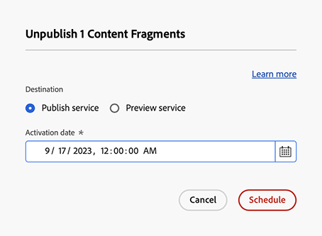

# Gestione dei frammenti di contenuto {#managing-content-fragments}

Scopri come gestire i **Frammenti di contenuto** in Adobe Experience Manager (AEM) in as a Cloud Service, dalla console dedicata [Frammenti di contenuto](#content-fragments-console) e dall&#39;[Editor frammenti di contenuto](/help/sites-cloud/administering/content-fragments/authoring.md#content-fragment-editor). Questi frammenti di contenuto possono essere utilizzati come base per i contenuti headless o per l’authoring delle pagine.

>[!NOTE]
>
>Se necessario, il team del progetto può personalizzare la console e l’editor. Per ulteriori dettagli, consulta [Personalizzazione della console e dell&#39;editor dei frammenti di contenuto](/help/implementing/developing/extending/content-fragments-console-and-editor.md).

Dopo aver definito i [modelli per frammenti di contenuto](#creating-a-content-model) puoi utilizzarli per:

* [Crea frammenti di contenuto](#creating-a-content-fragment).
* Quindi apri [Editor frammento di contenuto](#opening-the-fragment-editor) per [creare i contenuti e gestire le varianti](#editing-the-content-of-your-fragment).
* [Gestisci tag](#manage-tags)
* [Visualizzare e modificare le proprietà (metadati)](#viewing-and-editing-properties)
* [Visualizzare la struttura](/help/sites-cloud/administering/content-fragments/authoring.md#structure-tree)

>[!NOTE]
>
>I frammenti di contenuto possono essere utilizzati:
>
>* per [Distribuzione di contenuti headless tramite frammenti di contenuto con GraphQL](/help/sites-cloud/administering/content-fragments/content-delivery-with-graphql.md),
>* quando si esegue l’authoring delle pagine; consulta [Authoring delle pagine con frammenti di contenuto](/help/sites-cloud/authoring/fragments/content-fragments.md).

>[!NOTE]
>
>I frammenti di contenuto sono memorizzati come **Risorse**. Sono gestite principalmente dalla console **Frammenti di contenuto**, ma la gestione è possibile anche dalla console [Assets](/help/assets/content-fragments/content-fragments-managing.md).

## Console Frammenti di contenuto {#content-fragments-console}

La console Frammenti di contenuto è dedicata a gestione, ricerca e creazione di frammenti di contenuto. È stata ottimizzata per l’utilizzo in un contesto headless, ma anche durante la creazione di frammenti di contenuto da usare nell’authoring delle pagine.

La console Frammenti di contenuto consente di accedere direttamente ai frammenti e alle attività correlate. È possibile accedere direttamente alla console dal livello superiore della navigazione globale.

Per ulteriori informazioni consulta:

* [Struttura e gestione di base della console Frammenti di contenuto](#basic-structure-handling-content-fragments-console)

* [Informazioni fornite sui frammenti di contenuto](#information-content-fragments)

* [Azioni relative a un frammento di contenuto nella console Frammenti di contenuto](#actions-selected-content-fragment)

* [Seleziona le colonne visualizzate nella console](#select-columns-console)

* [Cercare e filtrare nella console Frammenti di contenuto](#filtering-fragments)

* Una selezione di [scelte rapide da tastiera](/help/sites-cloud/administering/content-fragments/keyboard-shortcuts.md) è disponibile per questa console

>[!NOTE]
>
>In questa console vengono visualizzati solo i frammenti di contenuto. Non visualizza altri tipi di risorse, come immagini e video.

>[!CAUTION]
>
>Questa console è *only* disponibile nell&#39;as a Cloud Service di Adobe Experience Manager (AEM) online.

### Struttura e gestione di base della console {#basic-structure-handling-content-fragments-console}

Selezionando **Frammenti di contenuto** si apre la console in una nuova scheda.

<!-- CQDOC-21349: screenshot -->

Nella console puoi osservare tre aree principali:

* Barra degli strumenti superiore
   * Fornisce le funzionalità standard di AEM
   * Mostra anche la tua organizzazione IMS
   * Fornisce varie [azioni](#actions-unselected)
* Pannello a sinistra
   * Qui puoi nascondere o visualizzare la struttura delle cartelle
   * Puoi selezionare un ramo specifico della struttura
   * Può essere ridimensionato per mostrare le cartelle nidificate
   * Puoi scegliere se visualizzare i frammenti di contenuto o [Assets](/help/sites-cloud/administering/content-fragments/assets-content-fragments-console.md)
* Pannello principale/destro; da qui puoi:
   * Visualizza l’elenco di tutti i frammenti di contenuto nel ramo selezionato della struttura:
      * Verranno visualizzati i frammenti di contenuto della cartella selezionata e tutte le cartelle secondarie:
         * La posizione è indicata dalle breadcrumb; queste possono essere utilizzate anche per modificare la posizione:
      * [Vengono visualizzate informazioni su ciascun frammento](#information-content-fragments)
         * [È possibile selezionare le colonne da visualizzare](#select-columns-console)
      * [Vari campi di informazioni](#information-content-fragments) su un frammento di contenuto forniscono collegamenti con cui, a seconda del campo, è possibile:
         * Aprire il frammento appropriato nell’editor
         * Mostrare informazioni sui riferimenti
         * Mostrare informazioni sulle versioni linguistiche del frammento
      * [Alcuni altri campi di informazioni](#information-content-fragments) su un frammento di contenuto possono essere utilizzati per [Filtro rapido](#fast-filtering):
         * Seleziona un valore nella colonna e viene immediatamente applicato come filtro
         * Il filtro rapido è supportato per le colonne **Modello**, **Stato**, **Modificato da**, **Tag** e **Pubblicato da**.
      * Se utilizzi il passaggio del mouse sulle intestazioni della colonna, verranno visualizzati un selettore di azioni a discesa e cursori di larghezza che ti consentono di:
         * Ordinare: selezionando l’azione appropriata per ordine crescente o decrescente. 
In questo modo l’intera tabella viene ordinata in base a tale colonna. L’ordinamento è disponibile solo nelle colonne appropriate.
         * Ridimensiona la colonna: utilizzando i cursori di azione o di larghezza
      * Seleziona uno o più frammenti per ulteriori [azioni](#actions-selected-content-fragment)
   * Utilizza la casella [Ricerca](#searching-fragments)
   * Apri il [pannello dei filtri](#filtering-fragments)

### Azioni {#actions}

Nella console sono disponibili diverse azioni utilizzabili direttamente o dopo aver selezionato un frammento specifico:

* Varie azioni sono [disponibili direttamente dalla console](#actions-unselected)
* È possibile [selezionare uno o più frammenti di contenuto per visualizzare le azioni disponibili](#actions-selected-content-fragment)

#### Azioni (non selezionate) {#actions-unselected}

Alcune azioni sono disponibili dalla console senza selezionare un frammento di contenuto specifico:

* **[Creare](#creating-a-content-fragment)** un nuovo frammento di contenuto
* [Filtrare](#filtering-fragments) i frammenti di contenuto in base a una selezione di predicati e salvare il filtro per utilizzi futuri
* [Ricercare](#searching-fragments) i frammenti di contenuto
* [Personalizzare la vista tabella per mostrare le colonne di informazioni selezionate](#select-columns-console)
* Utilizzare **Apri in Assets** per aprire direttamente la posizione corrente nella console **Assets**

  >[!NOTE]
  >
  >La console **Assets** viene utilizzata per accedere alle risorse, ad esempio immagini, video e così via.  È possibile accedere a questa console:
  >
  >* utilizzando il collegamento **Apri in Assets** (nella console Frammenti di contenuto);
  >* direttamente dal riquadro **Navigazione** globale

#### Azioni per un frammento di contenuto (selezionato) {#actions-selected-content-fragment}

Selezionando un frammento specifico si apre una barra degli strumenti incentrata sulle azioni disponibili per tale frammento. Puoi inoltre selezionare più frammenti; la selezione delle azioni verrà regolata di conseguenza.

<!-- CQDOC-21349: screenshot -->

* **[Apri in un nuovo editor](#editing-the-content-of-your-fragment)**
* **[Apri](/help/assets/content-fragments/content-fragments-variations.md)** (nell&#39;editor originale)
* **[Pubblica](#publishing-and-previewing-a-fragment)** (e **[Annulla pubblicazione](#unpublishing-a-fragment)**)
* **[Gestisci tag](#manage-tags)**
* **[Copia](/help/assets/manage-digital-assets.md)**
* **[Sposta](/help/assets/manage-digital-assets.md)**
* **[Rinomina](/help/assets/manage-digital-assets.md)**
* **[Elimina](#deleting-a-fragment)**
* **[Sostituisci](#find-and-replace)**

>[!NOTE]
>
>Utilizza **Apri** per aprire il frammento selezionato nell&#39;editor *originale*.

>[!NOTE]
>
>Azioni quali Publish, Annulla pubblicazione, Elimina, Sposta, Rinomina e Copia attivano ogni processo asincrono. L’avanzamento di tale processo può essere monitorato tramite l’interfaccia dei processi asincroni di AEM.

### Informazioni fornite sui frammenti di contenuto {#information-content-fragments}

Il pannello principale (vista tabella) della console, a destra, fornisce una serie di informazioni sui frammenti di contenuto. Alcuni elementi forniscono anche collegamenti diretti a ulteriori azioni e/o informazioni:

* **Nome**
   * Fornisce un collegamento per aprire il frammento nell’editor.
* **Modello**
   * Solo informativo.
   * Può essere utilizzato per [Filtro rapido](#fast-filtering)
* **Cartella**
   * Fornisce un collegamento per aprire la cartella nella console.
Passando il puntatore del mouse sul nome della cartella verrà visualizzato il percorso JCR.
* **Stato**
   * Solo informativo.
   * Può essere utilizzato per [Filtro rapido](#fast-filtering)
* **Anteprima**
   * Solo informazioni:
      * **In sincronizzazione**: il frammento di contenuto è in sincronizzazione nei servizi di **authoring** e **anteprima**.
      * **Fuori sincronizzazione**: il frammento di contenuto è fuori sincronizzazione nei servizi di **authoring** e **anteprima**. È necessario **Pubblica** in **Anteprima** per garantire che le due istanze tornino ad essere sincronizzate.
      * vuoto: il frammento di contenuto non esiste nel servizio di **Anteprima**.
* **Modificato**
   * Solo informativo.
* **Modificato da**
   * Solo informativo.
   * Può essere utilizzato per [Filtro rapido](#fast-filtering).
* **Tag**
   * Solo informativo.
   * Mostra tutti i tag relativi al frammento di contenuto, sia Principale che eventuali varianti.
   * Può essere utilizzato per [Filtro rapido](#fast-filtering).
* **Pubblicazione**
   * Solo informativo.
* **Pubblicato da**
   * Solo informativo.
   * Può essere utilizzato per [Filtro rapido](#fast-filtering).
* **Con Riferimento Da**:
   * Fornisce un collegamento che apre una finestra di dialogo in cui sono elencati tutti i [riferimenti principali](#parent-references-fragment) di tale frammento, inclusi i frammenti di contenuto, frammenti di esperienza e pagine. Per aprire un riferimento specifico, fare clic sul **Titolo** nella finestra di dialogo.

     

* **Lingua**: indicare eventuali copie di [Lingua](#language-copies-fragment)

   * Indica le impostazioni locali del frammento di contenuto e il numero totale di copie locali/[per lingua](#language-copies-fragment) associate al frammento di contenuto.

     

   * Seleziona il conteggio per aprire una finestra di dialogo in cui vengono visualizzate tutte le copie per lingua. Per aprire una copia di una lingua specifica, fai clic sul **Titolo** nella finestra di dialogo.

     

## Creare frammenti di contenuto {#creating-content-fragments}

Prima di creare un frammento di contenuto, è necessario creare il modello per frammenti di contenuto sottostante.

### Creazione di un modello di contenuto {#creating-a-content-model}

È necessario abilitare e creare i [modelli per frammenti di contenuto](/help/sites-cloud/administering/content-fragments/content-fragment-models.md) prima di creare frammenti di contenuto con struttura.

### Creazione di un frammento di contenuto {#creating-a-content-fragment}

Per creare un frammento di contenuto:

1. Dalla console **Frammenti di contenuto**, seleziona **Crea** (in alto a destra).

   >[!NOTE]
   >
   >Per impostare come predefinita la posizione del nuovo frammento, passa alla cartella in cui desideri creare il frammento oppure specifica la posizione durante il processo di creazione.

1. Viene visualizzata la finestra di dialogo **Nuovo frammento di contenuto** da cui puoi specificare:

   * **Posizione** - Completato automaticamente con la posizione corrente, ma se necessario puoi selezionare una posizione diversa.
   * **Modello per frammenti di contenuto** - Selezionare il modello da utilizzare come base per il frammento dall&#39;elenco a discesa.
   * **Titolo**
   * **Nome** - Completato automaticamente in base al **Titolo**, ma puoi modificarlo, se necessario.
   * **Descrizione**

   

1. Seleziona **Crea** oppure **Crea e apri** per confermare la definizione.

## Stati dei frammenti di contenuto {#statuses-content-fragments}

Durante la sua esistenza, un frammento di contenuto può avere diversi stati, come mostrato nella [Console Frammenti di contenuto](/help/sites-cloud/administering/content-fragments/managing.md#content-fragments-console) e nell&#39;[Editor frammenti di contenuto](/help/sites-cloud/administering/content-fragments/authoring.md):

* **Nuovo** (grigio)
Nell’editor dei frammenti di contenuto è stato creato un nuovo frammento di contenuto, che tuttavia non ha contenuto in quanto non è mai stato modificato né aperto.
* **Bozza** (blu)
Nell’Editor frammenti di contenuto qualcuno ha modificato o aperto il (nuovo) frammento di contenuto, che non è ancora stato pubblicato.
* **Pubblicato** (verde)
Il frammento di contenuto è stato pubblicato.
* **Modificato** (arancione)
Il frammento di contenuto è stato modificato dopo la pubblicazione (ma prima della pubblicazione della modifica).
* **Non pubblicato** (rosso)
La pubblicazione del frammento di contenuto è stata annullata.

## Modifica del contenuto del frammento (e delle varianti) {#editing-the-content-of-your-fragment}

>[!IMPORTANT]
>
>Per informazioni complete, [consulta Creazione di frammenti di contenuto](/help/sites-cloud/administering/content-fragments/authoring.md)

Per aprire la pagina per la modifica:

1. Utilizza la console **Frammenti di contenuto** per passare alla posizione del frammento di contenuto.
1. Apri il frammento per la modifica selezionandolo e quindi **Apri in un nuovo editor** dalla barra degli strumenti.

1. Viene aperto l’editor frammenti. Seleziona la **variante** richiesta e apporta le modifiche necessarie (verranno salvate automaticamente):

   

## Visualizzare e gestire i tag {#manage-tags}

Dalla console Frammenti di contenuto puoi visualizzare tutti i tag applicati nella colonna **Tag**; dopo aver verificato che [la colonna sia visualizzata](#select-columns-console).

### Gestione tag (console) {#manage-tags-console}

Per gestire i tag:

1. Passa alla console Frammenti di contenuto.
1. Seleziona un frammento di contenuto.
1. Seleziona **Gestisci tag** nella barra degli strumenti.
1. Utilizza il selettore Tag per selezionare i tag da applicare o rimuovere:

   

1. **Salva** aggiornamenti. Ti riporterà alla console.

### Visualizzazione e modifica di tag (editor) {#viewing-and-editing-tags}

Puoi anche visualizzare e modificare i tag applicati a un frammento utilizzando la scheda [Proprietà](/help/sites-cloud/administering/content-fragments/authoring.md) dell&#39;editor. Le informazioni visualizzate sono diverse tra **Principale** e qualsiasi **Variante**.

## Visualizzazione e modifica delle proprietà (editor) {#viewing-and-editing-properties}

Puoi visualizzare e modificare le proprietà (metadati) di un frammento utilizzando la scheda [Proprietà](/help/sites-cloud/administering/content-fragments/authoring.md) dell&#39;editor. Le informazioni visualizzate sono diverse tra **Principale** e qualsiasi **Variante**.

## Pubblicazione e anteprima di un frammento {#publishing-and-previewing-a-fragment}

Puoi pubblicare i frammenti di contenuto in:

* **[Servizio di pubblicazione](/help/headless/deployment/architecture.md)**: per l’accesso del pubblico completo

* **[Servizio di anteprima](/help/headless/deployment/architecture.md)**: per visualizzare l’anteprima dei contenuti prima della loro completa disponibilità

  >[!CAUTION]
  >
  >La pubblicazione di frammenti di contenuto nel servizio **Anteprima** è disponibile solo nella console Frammenti di contenuto utilizzando l&#39;azione **Publish**.

  >[!NOTE]
  >
  >Per ulteriori dettagli sugli ambienti di anteprima, vedi [Gestisci ambienti](/help/implementing/cloud-manager/manage-environments.md#access-preview-service).

>[!CAUTION]
>
>Se il frammento è basato su un modello, assicurati che il [modello sia stato pubblicato](/help/sites-cloud/administering/content-fragments/content-fragment-models.md#publishing-a-content-fragment-model).
>
>Se pubblichi un frammento di contenuto per il quale il modello non è ancora stato pubblicato, questo sarà segnalato in un elenco di selezione e il modello verrà pubblicato con il frammento.

### Pubblicazione {#publishing}

Puoi pubblicare i frammenti di contenuto utilizzando l&#39;opzione **Publish** da:

* la barra degli strumenti della [console Frammenti di contenuto](#actions-selected-content-fragment)

   * Seleziona uno o più frammenti dall’elenco.

* barra degli strumenti dell&#39;[Editor frammenti di contenuto](/help/sites-cloud/administering/content-fragments/authoring.md#content-fragment-editor)

Dopo aver selezionato l&#39;azione **Publish**:

1. Seleziona una delle seguenti opzioni per aprire la finestra di dialogo appropriata:

   * **Ora**: seleziona l’opzione **Servizio di pubblicazione** oppure **Servizio di anteprima**; dopo la conferma, il frammento sarà pubblicato immediatamente
   * **Pianificazione**: oltre al servizio richiesto, puoi anche selezionare la data e l’ora in cui verrà pubblicato il frammento

1. Fornisci tutti i dettagli nella finestra di dialogo. Ad esempio, per una richiesta di pubblicazione pianificata:

   

   >[!NOTE]
   >
   >Se necessario, ti verrà richiesto di specificare i riferimenti da pubblicare. Per impostazione predefinita, i riferimenti vengono pubblicati anche nel servizio di anteprima per garantire che non vi siano interruzioni nel contenuto.

1. Conferma l’azione di pubblicazione.

Dopo la pubblicazione, lo stato del frammento viene aggiornato e visualizzato nell’editor e nella console. Se è stata specificata una pubblicazione pianificata, verranno visualizzate informazioni.

>[!NOTE]
>
>Inoltre, quando [pubblichi una pagina che utilizza il frammento](/help/sites-cloud/authoring/fragments/content-fragments.md#publishing), il frammento verrà elencato nei riferimenti di pagina.

## Annullamento della pubblicazione di un frammento {#unpublishing-a-fragment}

Puoi annullare la pubblicazione dei frammenti di contenuto:

* la barra degli strumenti della [console Frammenti di contenuto](#actions-selected-content-fragment)

   * Seleziona uno o più frammenti dall’elenco.

* barra degli strumenti dell&#39;[Editor frammenti di contenuto](/help/sites-cloud/administering/content-fragments/authoring.md#content-fragment-editor)

In entrambi i casi, seleziona **Annulla pubblicazione** dalla barra degli strumenti, seguito da **Ora** o **Pianificato**.

Quando viene visualizzata la relativa finestra di dialogo, è possibile selezionare il servizio appropriato:

>[!NOTE]
>
>L’azione **Annulla pubblicazione** sarà visibile quando sono disponibili i frammenti pubblicati.

>[!CAUTION]
>
>Se il frammento è già oggetto di riferimento da un altro frammento o da una pagina, verrà visualizzato un messaggio di avviso e sarà necessario confermare che si desidera continuare.

## Trova e sostituisci {#find-and-replace}

<!-- CQDOC-21349: screenshot -->

L&#39;azione **Sostituisci** è disponibile nella barra degli strumenti superiore per trovare e sostituire il testo specificato nei frammenti di contenuto selezionati.

Prima della sostituzione, vengono controllati i criteri di convalida e l’utente viene informato di eventuali conflitti, che consentono di modificare la stringa di sostituzione o di sostituire solo le istanze convalidate.

>[!NOTE]
>
>L’azione Trova e sostituisci può essere eseguita solo su un massimo di 20 frammenti di contenuto selezionati (alla volta).
>
>Se selezioni più di 20 frammenti di contenuto, verrà visualizzato il messaggio **Impossibile trovare e sostituire**.

<!-- CQDOC-21349: screenshot -->

## Eliminazione di un frammento {#deleting-a-fragment}

Per eliminare un frammento:

1. Nella console **Frammenti di contenuto** passa alla posizione del frammento di contenuto.
1. Seleziona il frammento.
1. Seleziona **Elimina** dalla barra degli strumenti.
1. Conferma l’azione **Elimina**.

>[!NOTE]
>
>**Elimina** non è disponibile per i frammenti attualmente pubblicati. È necessario prima annullarne la pubblicazione.

## Individuare i riferimenti principali di un frammento {#parent-references-fragment}

I dettagli dei riferimenti principali sono accessibili dalla sezione

* **Riferimenti** colonna della console Frammenti di contenuto
* il collegamento [riferimenti principali nella barra degli strumenti superiore dell&#39;editor frammenti di contenuto](/help/sites-cloud/administering/content-fragments/authoring.md#view-parent-references)

Entrambi forniscono un collegamento che apre una finestra di dialogo in cui sono elencati tutti i riferimenti principali di quel frammento, inclusi i frammenti di contenuto, frammenti di esperienza e pagine. Per aprire un riferimento specifico, fare clic sul **Titolo** o sull&#39;icona del collegamento nella finestra di dialogo.

Ad esempio:

## Individuare le copie per lingua di un frammento {#language-copies-fragment}

I dettagli delle copie per lingua sono accessibili da:

* la colonna **Lingua** della [Console Frammenti di contenuto](#information-content-fragments)
* la scheda [Copie per lingua dell&#39;editor frammenti di contenuto](/help/sites-cloud/administering/content-fragments/authoring.md#view-language-copies)

L’icona indica le impostazioni locali del frammento di contenuto e il numero totale di copie per lingua associate al frammento di contenuto. Ad esempio, dalla console:

Seleziona il conteggio per aprire una finestra di dialogo in cui vengono visualizzate tutte le copie per lingua. Per aprire una copia di una lingua specifica, fai clic sul **Titolo** nella finestra di dialogo.

## Seleziona le colonne visualizzate nella console {#select-columns-console}

Come per altre console, puoi configurare le colonne visibili e disponibili da utilizzare:

Presenta un elenco di colonne che puoi nascondere o mostrare:

## Filtrare i frammenti {#filtering-fragments}

Il pannello Filtro offre:

* una selezione di predicati;
   * tra cui modelli per frammenti di contenuto, localizzazione, tag, campi di stato
   * è possibile selezionare e combinare uno o più predicati per creare il filtro
* **Escludi elementi sottocartelle**, con la possibilità di escludere frammenti di contenuto archiviati in sottocartelle
* l’opportunità di salvare la configurazione mediante il comando **Salva**
* l’opzione di recuperare un filtro di ricerca salvato per il riutilizzo

Una volta selezionata, vengono visualizzate le opzioni **Filtro in base a** (nella casella di ricerca). Possono essere deselezionati da lì. Ad esempio:

<!-- CQDOC-21349: screenshot -->

### Filtro rapido {#fast-filtering}

Puoi anche selezionare un predicato facendo clic su un valore di colonna specifico nell’elenco. Puoi selezionare uno o più valori per combinare i predicati.

Ad esempio, seleziona **Pubblicato** nella colonna **Stato**:

>[!NOTE]
>
>Il filtro rapido è supportato solo per le colonne **Modello**, **Stato**, **Modificato da**, **Tag** e **Pubblicato da**.

Una volta selezionato, questo verrà visualizzato come un predicato del filtro e l’elenco verrà filtrato di conseguenza:

## Ricerca di frammenti {#searching-fragments}

La casella di ricerca supporta la ricerca full-text. Immetti i termini di ricerca nella casella di ricerca:

<!-- CQDOC-21349: screenshot -->

Fornirà i risultati selezionati:

<!-- CQDOC-21349: screenshot -->

La casella di ricerca consente inoltre di accedere rapidamente a **Frammenti di contenuto recenti** e **Ricerche salvate**:

