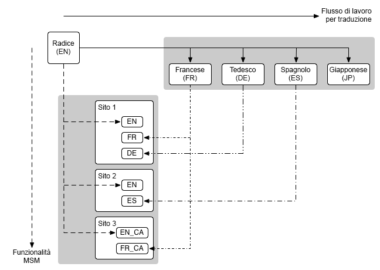

# Multi Site Manager e traduzione {#msm-and-translation}

Gli strumenti di traduzione e gestione multisito integrati di Adobe Experience Manager semplificano la localizzazione dei contenuti.

* Multi Site Manager (MSM) e le sue funzioni Live Copy consentono di utilizzare lo stesso contenuto del sito in più posizioni, consentendo al contempo l’utilizzo di varianti:
   * [Riutilizzo del contenuto: Multi-Site Manager e Live Copy](msm/overview.md)
* La traduzione consente di automatizzare la traduzione dei contenuti della pagina per creare e gestire siti web multilingue:
   * [Traduzione di contenuti per siti multilingue](translation/overview.md)

Queste due funzioni possono essere combinate per gestire siti web che sono sia [multinazionali che multilingue](#multinational-and-multilingual-sites).

## Siti multinazionali e multilingue {#multinational-and-multilingual-sites}

È possibile creare in modo efficiente contenuti per siti multinazionali e multilingue tramite l’utilizzo combinato di Multi Site Manager e del flusso di lavoro di traduzione.

In genere si crea un sito principale in una lingua e per un paese specifico, quindi si utilizza tale contenuto come base per gli altri siti, utilizzando la traduzione, se necessario.

1.  Tradurre il sito master in lingue diverse.
1. Utilizza [Multi Site Manager](msm/overview.md) per:
   1. Riutilizza i contenuti del sito principale e delle sue traduzioni per creare siti per altri paesi e culture.
   1. Se necessario, scollega gli elementi delle Live Copy per aggiungere i dettagli di localizzazione.

>[!TIP]
>
>Limita l’utilizzo di Multi Site Manager ai contenuti in una sola lingua.
>
>Ad esempio, utilizza il master inglese per creare la versione inglese delle pagine per gli Stati Uniti, il Canada, il Regno Unito, ecc. pagine e utilizzare il master francese per creare la versione francese delle pagine per Francia, Svizzera, Canada, ecc.

Il diagramma seguente illustra l’intersezione dei concetti principali (ma non tutti i livelli/elementi coinvolti):

In questo, e confrontabili, scenari MSM non gestisce le diverse versioni linguistiche in quanto tali.

*  MSM gestisce la distribuzione di contenuti tradotti da un blueprint (cioè un master globale) alle Live Copy (cioè i siti locali), entro i limiti di una lingua.
* Le funzionalità di integrazione di [translation](translation/overview.md) di AEM, in combinazione con servizi di gestione della traduzione di terze parti, gestiscono le lingue e traducono i contenuti in queste diverse lingue.

Per casi di utilizzo più avanzati, MSM può essere utilizzato anche tra i master di lingua.

>[!TIP]
>
>Per tutti i casi d’uso si consiglia di leggere le seguenti best practice:
>
>* [Best practice per MSM](msm/best-practices.md)
>* [Best practice per la traduzione](translation/best-practices.md)

