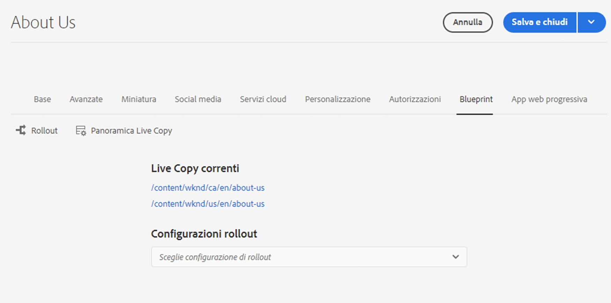
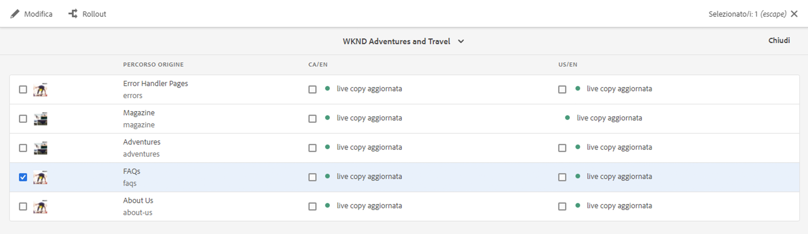

# Creazione e sincronizzazione di Live Copy {#creating-and-synchronizing-live-copies}

Puoi creare una Live Copy da una configurazione di pagina o blueprint, per riutilizzare tale contenuto all’interno del sito. Gestisci l’ereditarietà e la sincronizzazione, puoi controllare il modo in cui vengono propagate le modifiche al contenuto.

## Gestione delle configurazioni blueprint {#managing-blueprint-configurations}

Una configurazione blueprint identifica un sito web esistente che desideri utilizzare come origine per una o più pagine Live Copy.

>[!TIP]
>
>Le configurazioni blueprint ti consentono di inviare le modifiche al contenuto in Live Copy. Vedi [Live Copy: sorgente, blueprint e configurazioni blueprint](overview.md#source-blueprints-and-blueprint-configurations).

Quando crei una configurazione blueprint, seleziona un modello che definisce la struttura interna della blueprint. Il modello di blueprint predefinito presuppone che il sito web di origine abbia le seguenti caratteristiche:

* Il sito web ha una pagina principale.
* Le pagine secondarie immediate della principale sono rami linguistici del sito web. Quando crei una Live Copy, le lingue vengono presentate come contenuto facoltativo da includere nella copia.
* La pagina principale di ciascun ramo lingua ha una o più pagine secondarie. Durante la creazione di una Live Copy, vengono presentate pagine secondarie che possono essere incluse nella Live Copy.

>[!NOTE]
>
>Una struttura diversa richiede un modello di blueprint diverso.

Dopo aver creato la configurazione blueprint, configura le seguenti proprietà:

* **Nome**: nome della configurazione blueprint
* **Percorso origine**: percorso della pagina principale del sito che si sta utilizzando come origine (blueprint)
* **Descrizione**. (Facoltativo) Una descrizione della configurazione blueprint, che appare nell’elenco delle configurazioni blueprint tra cui scegliere durante la creazione di un sito

Quando utilizzi la configurazione blueprint, puoi associarla a una configurazione di rollout che determina la modalità di sincronizzazione delle Live Copy dell’origine/blueprint. Vedi [Specifica delle configurazioni di rollout da utilizzare](live-copy-sync-config.md#specifying-the-rollout-configurations-to-use).

### Creazione e modifica di configurazioni blueprint {#creating-editing-blueprint-configurations}

Le configurazioni blueprint sono considerate dati immutabili e come tali non sono modificabili in fase di runtime. Per questo motivo, qualsiasi modifica alla configurazione deve essere implementata tramite Git utilizzando la pipeline CI/CD.

Ulteriori informazioni sono disponibili nell’articolo [Modifiche di rilievo apportate ad Adobe Experience Manager (AEM) as a Cloud Service](/help/release-notes/aem-cloud-changes.md).

I passaggi seguenti sono disponibili per un amministratore in un’istanza di sviluppo locale solo a scopo di test e sviluppo. Queste opzioni non sono disponibili in alcuna istanza cloud AEMaaCS.

#### Creazione di una configurazione blueprint in locale {#creating-a-blueprint-configuration}

Per creare una configurazione blueprint:

1. [Passa](/help/sites-cloud/authoring/getting-started/basic-handling.md#global-navigation) al menu **Strumenti** quindi seleziona il menu **Sites**.
1. Seleziona **Blueprint** per aprire la console **Configurazioni blueprint**:

   

1. Seleziona **Crea**.
1. Seleziona il modello di blueprint, quindi **Successivo** per continuare.
1. Seleziona la pagina sorgente da utilizzare come blueprint; poi **Successivo** per continuare.
1. Definisci:

   * **Titolo**: titolo obbligatorio per la blueprint.
   * **Descrizione**: una descrizione facoltativa per fornire ulteriori dettagli.

1. **Crea** creerà la configurazione blueprint in base alle tue specifiche.

### Modifica o eliminazione di una configurazione Blueprint in locale{#editing-or-deleting-a-blueprint-configuration}

Puoi modificare o eliminare una configurazione blueprint esistente:

1. [Passa](/help/sites-cloud/authoring/getting-started/basic-handling.md#global-navigation) al menu **Strumenti** quindi seleziona il menu **Sites**.
1. Seleziona **Blueprint** per aprire la console **Configurazioni blueprint**:

   

1. Seleziona la configurazione blueprint richiesta; le azioni appropriate sono disponibili nella barra degli strumenti:

   * **Proprietà**; da qui puoi visualizzare e quindi modificare le proprietà della configurazione.
   * **Eliminare**

## Creazione della Live Copy {#creating-a-live-copy}

Esistono diversi modi per creare una Live Copy.

### Creazione di una Live Copy di una pagina {#creating-a-live-copy-of-a-page}

Puoi creare una Live Copy di qualsiasi pagina o ramo. Quando crei la Live Copy, puoi specificare le configurazioni di rollout da utilizzare per la sincronizzazione del contenuto:

* Le configurazioni di rollout selezionate si applicano alla pagina Live Copy e alle relative pagine secondarie.
* Se non specifichi configurazioni di rollout, MSM determina quali configurazioni utilizzare. Vedi [Specifica della configurazione di rollout da utilizzare](live-copy-sync-config.md#specifying-the-rollout-configurations-to-use).

Puoi creare una Live Copy di qualsiasi pagina:

* Pagine che fanno riferimento a una [configurazione blueprint](#creating-a-blueprint-configuration)
* E pagine prive di connessione a una configurazione
* Live Copy all’interno delle pagine di un’altra Live Copy ([Live Copy nidificate](overview.md#nested-live-copies))

L&#39;unica differenza è che la disponibilità del **Rollout** nelle pagine sorgente/blueprint dipende dal fatto che un modello di configurazione faccia riferimento al sorgente o meno:

* Se crei la Live Copy da una pagina sorgente che **fa** riferimento a una configurazione blueprint, il comando Rollout è disponibile nelle pagine sorgente/blueprint.
* Se crei la Live Copy da una pagina sorgente che **non fa** riferimento a una configurazione blueprint, il comando Rollout non sarà disponibile nelle pagine sorgente/blueprint.

Per creare una Live Copy:

1. Nella console **Sites** seleziona **Crea**, quindi **Live Copy**.

   

1. Seleziona la pagina sorgente e tocca o fai clic su **Successivo**. Esempio:

   

1. Specifica il percorso di destinazione della Live Copy (apri la cartella/pagina genitore della Live Copy), quindi tocca o fai clic su **Successivo**.

   

   >[!NOTE]
   >
   >Il percorso di destinazione non può trovarsi all&#39;interno del percorso sorgente.

1. Inserisci:

   * un **Titolo** per la pagina.
   * un **Nome**, che viene utilizzato nell’URL.

   

1. Utilizza la casella di spunta **Escludi sottopagine**:

   * Selezionato: crea una Live Copy solo della pagina selezionata (Live Copy shallow)
   * Non selezionato: crea una Live Copy che include tutti i discendenti della pagina selezionata (Live Copy deep)

1. (Facoltativo) Per specificare una o più configurazioni di rollout da utilizzare per la Live Copy, utilizza l&#39;elenco a discesa **Configurazioni di rollout** per selezionarli. Le configurazioni selezionate vengono mostrate sotto il menu a discesa.
1. Tocca o fai clic su **Crea**. Verrà visualizzato un messaggio di conferma. Da qui puoi selezionare una delle seguenti opzioni, **Apri** o **Fine**.

   >[!NOTE]
   >
   >Potrebbe essere visualizzata una finestra di dialogo di errore con il messaggio “Impossibile inviare il modulo”. Ciò si verifica a causa di un timeout di rete. Tuttavia, il processo per creare la Live Copy viene eseguito in background. Attendi alcuni minuti e controlla che le pagine della Live Copy siano state create correttamente.

### Creazione di una Live Copy di un sito da una configurazione Blueprint {#creating-a-live-copy-of-a-site-from-a-blueprint-configuration}

Crea una Live Copy utilizzando una configurazione blueprint per creare un sito basato sul contenuto blueprint (sorgente). Quando crei una Live Copy da una configurazione blueprint, selezioni uno o più rami di lingua della sorgente blueprint da copiare, quindi selezioni i capitoli da copiare dai rami di lingua. Vedi [Creazione di una configurazione Blueprint](#creating-a-blueprint-configuration).

Se ometti alcuni rami di lingua dalla Live Copy, puoi aggiungerli in un secondo momento. Vedi [Creazione di una Live Copy all’interno di una Live Copy (configurazione Blueprint)](#creating-a-live-copy-inside-a-live-copy-blueprint-configuration) per i dettagli.

>[!CAUTION]
>
>Quando il sorgente blueprint contiene collegamenti e riferimenti destinati a un paragrafo in un ramo diverso, le destinazioni non vengono aggiornate nelle pagine Live Copy, ma rimangono indirizzate alla destinazione originale.

Quando crei il sito, fornisci valori per le seguenti proprietà:

* **Lingue iniziali**: i rami della lingua della sorgente blueprint da includere nella Live Copy.
* **Capitoli iniziali**: le pagine figlie dei rami di lingua blueprint da includere nella Live Copy.
* **Percorso di Destinazione**: posizione della pagina root del sito Live Copy.
* **Titolo**: titolo della pagina root del sito Live Copy.
* **Nome**: (facoltativo) il nome del nodo JCR che memorizza la pagina root della Live Copy (il valore predefinito è basato sul titolo).
* **Proprietario sito**: (facoltativo) informazioni sul responsabile della Live Copy.
* **Live Copy**: seleziona questa opzione per stabilire una relazione live con il sito sorgente. Se non selezioni questa opzione, viene creata una copia della blueprint ma non viene successivamente sincronizzata con il sorgente.
* **Configurazioni di rollout**: (facoltativo) seleziona una o più configurazioni di rollout da utilizzare per la sincronizzazione della Live Copy. Per impostazione predefinita, le configurazioni di rollout vengono ereditate dalla blueprint. Vedi [Specifica delle configurazioni di rollout da utilizzare](live-copy-sync-config.md#specifying-the-rollout-configurations-to-use) per ulteriori dettagli.

Per creare una Live Copy di un sito da una configurazione blueprint:

1. Nella console **Sites**, seleziona **Crea**, quindi **Sito** dal menu a discesa.
1. Seleziona la configurazione blueprint da utilizzare come sorgente della Live Copy e procedi con **Successivo**:

   

1. Utilizza il selettore **Lingue iniziali** per specificare la lingua o le lingue del sito blueprint da utilizzare per la Live Copy.

   Tutte le lingue disponibili sono selezionate per impostazione predefinita. Per rimuovere una lingua, tocca o fai clic sul pulsante **X** accanto alla lingua.

   Esempio:

   

1. Utilizza il menu a discesa **Capitoli iniziali** per selezionare le sezioni della blueprint da includere nella Live Copy. Tutti i capitoli disponibili sono inclusi per impostazione predefinita, ma possono essere rimossi.
1. Immetti i valori per le proprietà rimanenti, quindi seleziona **Crea**. Nella finestra di dialogo di conferma, seleziona **Fine** per tornare alla console **Sites**, oppure **Apri sito** per aprire la pagina root del sito.

### Creazione di una Live Copy all’interno di una Live Copy (configurazione Blueprint) {#creating-a-live-copy-inside-a-live-copy-blueprint-configuration}

Quando crei una Live Copy all’interno della Live Copy esistente (creata utilizzando una configurazione di blueprint), puoi inserire qualsiasi copia o capitolo in lingua non inclusi al momento della creazione della Live Copy.

## Monitoraggio della Live Copy {#monitoring-your-live-copy}

### Visualizzazione dello stato di una Live Copy {#seeing-the-status-of-a-live-copy}

Le proprietà di una pagina Live Copy mostrano le seguenti informazioni:

* **Sorgente**: la pagina sorgente della pagina Live Copy
* **Stato**: lo stato di sincronizzazione della Live Copy, compreso se la Live Copy è aggiornata rispetto alla sorgente, quando si è verificata l’ultima sincronizzazione e chi la ha eseguita
* **Configurazione**:

   * Se la pagina è ancora soggetta all’ereditarietà della Live Copy
   * Se la configurazione viene ereditata dalla pagina genitore
   * Tutte le configurazioni di rollout utilizzate dalla Live Copy

Per visualizzare le proprietà:

1. Nella console **Sites**, seleziona la pagina Live Copy e apri le proprietà.
1. Apri la scheda **Live Copy**.

   Esempio:

   

   Vedi la sezione [Utilizzo della panoramica Live Copy](live-copy-overview.md#using-the-live-copy-overview) nell’articolo Console panoramica Live Copy per ulteriori dettagli.

### Visualizzazione delle Live Copy di una pagina blueprint {#seeing-the-live-copies-of-a-blueprint-page}

Le pagine blueprint (a cui si fa riferimento in una configurazione blueprint) ti forniscono un elenco delle pagine Live Copy che utilizzano la pagina corrente (blueprint) come sorgente. Utilizza questo elenco per tenere traccia delle Live Copy. L&#39;elenco viene visualizzato sulla scheda **Blueprint** nelle [proprietà della pagina](/help/sites-cloud/authoring/fundamentals/page-properties.md).

## Sincronizzazione della Live Copy {#synchronizing-your-live-copy}

Esistono diversi modi per sincronizzare la tua Live Copy.

### Rollout di una blueprint {#rolling-out-a-blueprint}

Effettua il roll out di una pagina blueprint per inviare le modifiche al contenuto in Live Copy. Un **Rollout** esegue le configurazioni di rollout che utilizzano il trigger [durante il rollout](live-copy-sync-config.md#rollout-triggers).

>[!NOTE]
>
>Se le nuove pagine con lo stesso nome di pagina vengono create sia nel ramo blueprint che in un ramo della Live Copy dipendente, possono verificarsi conflitti.
>
>Tali [conflitti devono essere gestiti e risolti al momento del rollout](rollout-conflicts.md).

#### Rollout di una blueprint dalle proprietà della pagina {#rolling-out-a-blueprint-from-page-properties}

1. Nella console **Sites**, seleziona la pagina nella blueprint e apri le proprietà.
1. Apri la scheda **Blueprint.**
1. Seleziona **Rollout**.

   

1. Specifica le pagine e le eventuali sottopagine, quindi conferma con il segno di spunta:

   

1. Specifica se il processo di rollout deve essere eseguito immediatamente (**Ora**) o in un&#39;altra data/ora (**Più tardi**).

   

I rollout vengono elaborati come processi asincroni e possono essere controllati sulla pagina [***Stato dei processi asincroni**.](/help/operations/asynchronous-jobs.md#monitor-the-status-of-asynchronous-operations)

#### Effettuare il roll out di una blueprint dalla barra dei riferimenti {#roll-out-a-blueprint-from-the-reference-rail}

1. Nella console **Sites** seleziona la pagina nella Live Copy e apri il pannello **[Riferimenti](/help/sites-cloud/authoring/getting-started/basic-handling.md#references)** (dalla barra degli strumenti).
1. Seleziona l&#39;opzione **Blueprint** dall’elenco, per visualizzare le blueprint associate a questa pagina.
1. Seleziona la blueprint desiderata dall’elenco.
1. Tocca o fai clic su **Rollout**.

   

1. Ti viene chiesto di confermare i dettagli del rollout:

   * **Ambito rollout**:

     Specifica se l’ambito è solo per la pagina selezionata o deve includere pagine secondarie.

   * **Pianificazione**:

     Specifica se il processo di rollout deve essere eseguito immediatamente (**Ora**) o in una data/ora successiva (**Più tardi**).

     

1. Dopo aver confermato questi dettagli, seleziona **Rollout** per eseguire l’azione.

I rollout vengono elaborati come processi asincroni e possono essere verificati sulla pagina [**Stato dei processi asincroni**.](/help/operations/asynchronous-jobs.md#monitor-the-status-of-asynchronous-operations)

#### Eseguire il rollout di una blueprint dalla panoramica della Live Copy {#roll-out-a-blueprint-from-the-live-copy-overview}

Quando viene selezionata una pagina Blueprint, l’azione [**Rollout** è disponibile anche nella panoramica della Live Copy](live-copy-overview.md#using-the-live-copy-overview).

1. Apri [Panoramica della Live Copy](live-copy-overview.md#using-the-live-copy-overview) e seleziona una pagina blueprint.
1. Seleziona **Rollout** nella barra degli strumenti.

   

1. Specifica le pagine e le eventuali sottopagine, quindi conferma con il segno di spunta:

   

1. Specifica se il processo di rollout deve essere eseguito immediatamente (**Ora**) o in un’altra data/ora (**Più tardi**).

   

I rollout vengono elaborati come processi asincroni e possono essere verificati sulla pagina [**Stato dei processi asincroni**.](/help/operations/asynchronous-jobs.md#monitor-the-status-of-asynchronous-operations)

### Sincronizzazione di una Live Copy {#synchronizing-a-live-copy}

Sincronizzare una pagina Live Copy per richiamare le modifiche dal contenuto dall’origine alla Live Copy.

#### Sincronizzazione di una Live Copy dalle proprietà della pagina {#synchronize-a-live-copy-from-page-properties}

Sincronizza una Live Copy per richiamare le modifiche dall’origine alla Live Copy.

>[!NOTE]
>
>La sincronizzazione esegue le configurazioni di rollout che utilizzano l’attivatore [Al momento del rollout](live-copy-sync-config.md#rollout-triggers).

1. Nella console **Sites**, seleziona la pagina Live Copy e apri le proprietà.
1. Apri la scheda **Live Copy.**
1. Tocca o fai clic su **Sincronizza**.

   

   Viene richiesta la conferma. Per procedere fai clic su **Sincronizza**.

#### Sincronizzazione di una Live Copy dalla panoramica della Live Copy {#synchronize-a-live-copy-from-the-live-copy-overview}

Quando viene selezionata una pagina Live Copy, l’azione [Sincronizza è disponibile anche nella panoramica della Live Copy](live-copy-overview.md#using-the-live-copy-overview).

1. Apri [Panoramica della Live Copy](live-copy-overview.md#using-the-live-copy-overview) e seleziona una pagina Live Copy.
1. Seleziona **Sincronizza** nella barra degli strumenti.
1. Conferma l’azione **Rollout** nella finestra di dialogo dopo aver specificato se includere:

   * **Pagina e sottopagine**
   * **Solo pagina**

   

## Modifica del contenuto della Live Copy {#changing-live-copy-content}

Per modificare il contenuto della Live Copy, puoi:

* Aggiungere paragrafi alla pagina.
* Aggiornare il contenuto esistente interrompendo l’ereditarietà della Live Copy per qualsiasi pagina o componente.

>[!TIP]
>
>Se crei manualmente una pagina nella Live Copy, la nuova pagina è locale rispetto alla Live Copy, ovvero non dispone di una pagina sorgente corrispondente alla quale è associata.
>
>Per poter creare una pagina locale che fa parte della relazione, è consigliabile creare la pagina locale nell’origine ed eseguire un rollout profondo. La pagina verrà creata localmente come Live Copy.

>[!NOTE]
>
>Se le nuove pagine con lo stesso nome di pagina vengono create sia nel ramo blueprint che in un ramo della Live Copy dipendente, possono verificarsi conflitti.
>
>Tali [conflitti devono essere gestiti e risolti al momento del rollout](rollout-conflicts.md).

### Aggiunta di componenti a una pagina Live Copy {#adding-components-to-a-live-copy-page}

Puoi aggiungere componenti a una pagina Live Copy in qualsiasi momento. Lo stato di ereditarietà della Live Copy e del relativo sistema paragrafo non controlla la possibilità di aggiungere componenti.

Quando la pagina Live Copy viene sincronizzata con la pagina di origine, i componenti aggiunti rimangono invariati. Consulta anche [Modifica dell’ordine dei componenti in una pagina Live Copy.](#changing-the-order-of-components-on-a-live-copy-page)

>[!TIP]
>
>Le modifiche apportate localmente a un componente contrassegnato come contenitore non verranno sovrascritte dal contenuto della blueprint su un rollout. Per ulteriori informazioni, consulta la sezione sulle [Best practice per MSM](best-practices.md#components-and-container-synchronization).

### Sospensione dell’ereditarietà per una pagina {#suspending-inheritance-for-a-page}

Quando crei una Live Copy, la configurazione della Live Copy viene salvata nella pagina principale delle pagine copiate. Tutte le pagine figlie della pagina principale ereditano le configurazioni della Live Copy. Anche i componenti nelle pagine Live Copy ereditano la configurazione della Live Copy.

Puoi sospendere l’ereditarietà della Live Copy per una pagina Live Copy in modo da poter modificare le proprietà e i componenti della pagina. Quando sospendi l’ereditarietà, le proprietà e i componenti della pagina non vengono più sincronizzati con il sorgente.

>[!TIP]
>
>È inoltre possibile [scollegare una Live Copy](#detaching-a-live-copy) dalla blueprint per rimuovere tutte le connessioni. A differenza della sospensione dell’ereditarietà, l’azione di scollegamento è permanente e non reversibile.

#### Sospensione dell’ereditarietà dalle proprietà della pagina {#suspending-inheritance-from-page-properties}

Per sospendere l’ereditarietà su una pagina:

1. Apri le proprietà della pagina Live Copy utilizzando il comando **Visualizza proprietà** della console **Sites** oppure utilizzando **Informazioni pagina** sulla barra degli strumenti della pagina.
1. Tocca o fai clic sulla scheda **Live Copy**.
1. Seleziona **Sospendi** nella barra degli strumenti. Puoi quindi selezionare:

   * **Sospendi**: per sospendere solo la pagina corrente.
   * **Sospendi con elementi figlio**: per sospendere la pagina corrente insieme a eventuali pagine figlie.

1. Nella finestra di dialogo di conferma, seleziona **Sospendi**.

#### Sospensione dell’ereditarietà dalla panoramica della Live Copy {#suspending-inheritance-from-the-live-copy-overview}

Quando viene selezionata una pagina Live Copy, l’azione [Sospendi è disponibile anche nella panoramica della Live Copy](live-copy-overview.md#using-the-live-copy-overview).

1. Apri [Panoramica della Live Copy](live-copy-overview.md#using-the-live-copy-overview) e seleziona una pagina Live Copy.
1. Seleziona **Sospendi** nella barra degli strumenti.
1. Seleziona l’opzione appropriata da:

   * **Sospendi**
   * **Sospendi con figli**

   

1. Conferma l’azione **Sospendi** nella finestra di dialogo **Sospendi Live Copy**:

   

### Riprendere l’ereditarietà per una pagina {#resuming-inheritance-for-a-page}

Sospendere l’ereditarietà della Live Copy per una pagina è un’azione temporanea. Una volta sospesa, l’azione **Riprendi** diventa disponibile e consente di ripristinare la relazione live.

Quando riattivi l’ereditarietà, la pagina non viene sincronizzata automaticamente con l’origine. Se necessario, puoi richiedere una sincronizzazione:

* Nella finestra di dialogo **Riprendi**/**Ripristina**; ad esempio:

  

* In una fase successiva, selezionando manualmente l’azione di sincronizzazione.

>[!NOTE]
>
>Quando riattivi l’ereditarietà, la pagina non viene sincronizzata automaticamente con l’origine. Se necessario, è possibile richiedere manualmente una sincronizzazione al momento della ripresa o in un secondo momento.

#### Ripresa dell’ereditarietà dalle proprietà della pagina {#resuming-inheritance-from-page-properties}

Una volta [sospesa](#suspending-inheritance-from-page-properties), l’azione **Riprendi** viene visualizzata nella barra degli strumenti delle proprietà della pagina:

Quando viene selezionata, viene visualizzata la finestra di dialogo. Se necessario, puoi selezionare una sincronizzazione e quindi confermare l’azione.

#### Riprendere una pagina Live Copy dalla panoramica della Live Copy {#resume-a-live-copy-page-from-the-live-copy-overview}

Quando viene selezionata una pagina Live Copy, l’azione [Riprendi è disponibile anche nella panoramica della Live Copy](live-copy-overview.md#using-the-live-copy-overview).

1. Apri [Panoramica di Live Copy](live-copy-overview.md#using-the-live-copy-overview) e seleziona una pagina Live Copy sospesa. La pagina viene mostrata come **EREDITARIETÀ ANNULLATA**.
1. Seleziona **Riprendi** nella barra degli strumenti.
1. Indica se desideri sincronizzare la pagina dopo aver ripristinato l’ereditarietà, quindi conferma l’azione **Riprendi** nella finestra di dialogo **Riprendi Live Copy**.

### Modifica della profondità dell’ereditarietà (superficiale/profonda) {#changing-inheritance-depth-shallow-deep}

Su una Live Copy esistente è possibile modificare la profondità di una pagina, ovvero se le pagine secondarie sono incluse.

* Passaggio a una Live Copy superficiale:

   * Avrà effetto immediato ed è non reversibile.

   * Scollega esplicitamente le pagine figlie dalla Live Copy. Ulteriori modifiche sugli elementi figlio non potranno essere mantenute se annullate.

   * Rimuove eventuali discendenti `LiveRelationships` anche se sono nidificati `LiveCopies`.

* Passaggio a una Live Copy profonda:

   * Lascia inalterate le pagine figlie.
   * Per vedere l’effetto del passaggio, puoi effettuare un rollout in cui tutte le modifiche di contenuto vengono applicate in base alla configurazione del rollout.

* Passa a una Live Copy shallow e quindi torna a una deep:

   * Tratta tutti i figli della Live Copy shallow (precedentemente) come se fossero stati creati manualmente e vengono quindi spostati utilizzando `[oldname]_msm_moved name`.

Per specificare o modificare la profondità:

1. Apri le proprietà della pagina Live Copy utilizzando il comando **Visualizza proprietà** della console **Sites** o utilizzando **Informazioni pagina** sulla barra degli strumenti.
1. Tocca o fai clic sulla scheda **Live Copy**.
1. Nella sezione **Configurazione** imposta o cancella l&#39;opzione **Ereditarietà Live Copy** a seconda che le pagine figlie siano incluse o meno:

   * Spunta: una Live Copy deep (le pagine figlie sono incluse)
   * Senza spunta: una Live Copy shallow (le pagine figlie sono escluse)

   >[!CAUTION]
   >
   >Il passaggio a una Live Copy shallow avrà effetto immediato e non sarà reversibile.
   >
   >Vedi [Live Copy - Composizione](overview.md#live-copies-composition) per ulteriori informazioni.

1. Tocca o fai clic su **Salva** per mantenere gli aggiornamenti.

### Annullamento dell’ereditarietà di un componente {#cancelling-inheritance-for-a-component}

Annulla l’ereditarietà Live Copy per un componente in modo che non venga più sincronizzato con il componente sorgente. Se necessario, puoi abilitare l’ereditarietà in un momento successivo.

>[!NOTE]
>
>Quando riabiliti l’ereditarietà, il componente non viene sincronizzato automaticamente con il sorgente. Se necessario, è possibile richiedere manualmente una sincronizzazione.

Annulla l&#39;ereditarietà per modificare il contenuto o eliminare il componente:

1. Tocca o fai clic il componente per il quale desideri annullare l&#39;ereditarietà.

   

1. Nella barra degli strumenti del componente, tocca o fai clic sull&#39;icona **Annulla ereditarietà**.

   

1. Nella finestra di dialogo Annulla ereditarietà, conferma l’azione con **Sì**.

   La barra degli strumenti del componente viene aggiornata per includere tutti i comandi di modifica (appropriati).

### Riabilitazione dell’ereditarietà per un componente {#re-enabling-inheritance-for-a-component}

Per abilitare l’ereditarietà di un componente, tocca o fai clic sull&#39;icona **Riabilita ereditarietà** sulla barra degli strumenti del componente.

### Modifica dell’ordine dei componenti in una pagina Live Copy {#changing-the-order-of-components-on-a-live-copy-page}

Se una Live Copy contiene componenti che fanno parte di un sistema di paragrafi, l’ereditarietà di tale sistema osserva le regole seguenti:

* L’ordine dei componenti in un sistema dei paragrafi ereditato può essere modificato anche con l’ereditarietà stabilita.
* Al momento del rollout, l’ordine dei componenti verrà ripristinato dalla blueprint. Se sono stati aggiunti nuovi componenti alla Live Copy prima del rollout, questi verranno riordinati insieme ai componenti sopra i quali sono stati aggiunti.
* Se l’ereditarietà del sistema dei paragrafi viene annullata, l’ordine dei componenti non verrà ripristinato al momento del rollout e rimarrà invariato nella Live Copy.

>[!NOTE]
>
>Quando si ripristina un’ereditarietà annullata in un sistema dei paragrafi, l’ordine dei componenti **non viene ripristinato automaticamente** dalla blueprint. Se necessario, è possibile richiedere manualmente una sincronizzazione.

Per annullare l’ereditarietà del sistema dei paragrafi, segui la procedura descritta di seguito.

1. Apri la pagina Live Copy.
1. Trascina un componente esistente in una nuova posizione sulla pagina.
1. Nella finestra di dialogo **Annulla ereditarietà** conferma l’azione tramite **Sì**.

### Sovrascrittura delle proprietà di una pagina Live Copy {#overriding-properties-of-a-live-copy-page}

Le proprietà di una pagina Live Copy vengono ereditate dalla pagina sorgente per impostazione predefinita e non sono modificabili.

Puoi annullare l’ereditarietà di una proprietà quando devi modificarne il valore per la Live Copy. Un’icona di collegamento indica che l’ereditarietà è abilitata per la proprietà.

Quando annulli l’ereditarietà, puoi modificare il valore della proprietà. Un’icona di collegamento interrotto indica che l’ereditarietà è annullata.

In seguito puoi riabilitare l’ereditarietà per una proprietà, se necessario.

>[!NOTE]
>
>Quando riabiliti l’ereditarietà, la proprietà della pagina Live Copy non viene sincronizzata automaticamente con la proprietà sorgente. Se necessario, è possibile richiedere manualmente una sincronizzazione.

1. Apri le proprietà della pagina Live Copy utilizzando l&#39;opzione **Visualizza proprietà** nella console **Sites** o **Informazioni pagina** sulla barra degli strumenti.
1. Per annullare l’ereditarietà di una proprietà, tocca o fai clic sull’icona di collegamento visualizzata a destra della proprietà.

   

1. Nella finestra di dialogo di conferma **Annulla ereditarietà**, fai clic o tocca **Sì**.

### Ripristinare le proprietà di una pagina Live Copy {#revert-properties-of-a-live-copy-page}

Per abilitare l’ereditarietà di una proprietà, tocca o fai clic sull’icona **Ripristina ereditarietà** visualizzata accanto alla proprietà.

### Reimpostare una pagina Live Copy {#resetting-a-live-copy-page}

Puoi reimpostare una pagina Live Copy per effettuare le seguenti operazioni:

* Rimuovere tutte le ereditarietà annullate e
* Restituire alla pagina lo stesso stato della pagina sorgente.

La reimpostazione influisce sulle modifiche apportate alle proprietà della pagina, al sistema paragrafo e ai componenti.

#### Reimpostare una pagina Live Copy dalle proprietà della pagina {#reset-a-live-copy-page-from-the-page-properties}

1. Nella console **Sites**, seleziona la pagina Live Copy e seleziona **Visualizza proprietà**.
1. Apri la scheda **Live Copy.**
1. Seleziona **Reimposta** nella barra degli strumenti.

   

1. Nella finestra di dialogo **Ripristina Live Copy**, conferma con **Reimposta**.

#### Reimpostare una pagina Live Copy dalla panoramica della Live Copy {#reset-a-live-copy-page-from-the-live-copy-overview}

Quando viene selezionata una pagina Live Copy, l’azione [**Reimposta** è disponibile anche nella panoramica della Live Copy](live-copy-overview.md#using-the-live-copy-overview).

1. Apri [Panoramica di Live Copy](live-copy-overview.md#using-the-live-copy-overview) e seleziona una pagina Live Copy.
1. Seleziona **Reimposta** nella barra degli strumenti.
1. Conferma l’azione **Reimposta** nella finestra di dialogo **Reimposta Live Copy**:

   

## Confrontare una pagina Live Copy con una pagina blueprint {#comparing-a-live-copy-page-with-a-blueprint-page}

Per tenere traccia delle modifiche apportate, puoi visualizzare la pagina blueprint in **Riferimenti** e confrontarla con la relativa pagina Live Copy:

1. Nella console **Sites**, [passa a una pagina blueprint o Live Copy e selezionala](/help/sites-cloud/authoring/getting-started/basic-handling.md#viewing-and-selecting-resources).
1. Apri il pannello **[Riferimenti](/help/sites-cloud/authoring/getting-started/basic-handling.md#references)** e, a seconda del contesto, seleziona una delle seguenti opzioni:

   * **Blueprint**
   * **Live Copy**

1. Seleziona la tua Live Copy specifica e, a seconda del contesto, seleziona una delle seguenti opzioni:

   * **Confronta con blueprint**
   * **Confronta con Live Copy**

   Esempio:

   

1. Le pagine Live Copy e blueprint vengono aperte una accanto all’altra.

   Per informazioni complete sull’utilizzo di questa funzionalità, consulta [Differenze tra pagine](/help/sites-cloud/authoring/features/page-diff.md).

## Scollegare una Live Copy {#detaching-a-live-copy}

L’azione di scollegamento rimuove definitivamente la relazione live tra una Live Copy e la relativa pagina di origine/blueprint. Tutte le proprietà relative a MSM vengono rimosse dalla Live Copy e le pagine Live Copy diventano una copia autonoma.

>[!CAUTION]
>
>Dopo aver scollegato la Live Copy, non puoi ripristinare la relazione live.
>
>Per rimuovere la relazione live con l’opzione di ripristinarla in un secondo momento, puoi [annullare l’ereditarietà di Live Copy](#suspending-inheritance-for-a-page) per la pagina.

Ci sono implicazioni relative a dove utilizzi **Scollega** all’interno dell’albero:

* **Scollega su una pagina principale di una Live Copy**

  Quando questa operazione viene eseguita sulla pagina principale di una Live Copy, rimuove la relazione live tra tutte le pagine della blueprint e le relative Live Copy.

  Ulteriori modifiche alle pagine della blueprint **non** influiscono sulla Live Copy.

* **Scollega su una sottopagina di una Live Copy**

  Quando questa operazione viene eseguita su una sottopagina (o ramo) all’interno di una Live Copy:

   * La relazione live viene rimossa per quella sottopagina (o ramo) e
   * Le (sotto) pagine nel ramo della Live Copy vengono trattate come se fossero state create manualmente.

  Tuttavia, le sottopagine sono ancora soggette alla relazione live del ramo principale, quindi un ulteriore rollout delle pagine blueprint consentirà a entrambi di:

   1. Rinominare le pagine scollegate:

      * Questo perché MSM le considera come pagine create manualmente che causano un conflitto in quanto hanno lo stesso nome delle pagine Live Copy che sta tentando di creare.

   1. Creare una nuova pagina Live Copy con il nome originale, contenente le modifiche dal rollout.

  >[!NOTE]
  >
  >Per informazioni dettagliate su tali situazioni, consulta [Conflitti di rollout MSM](rollout-conflicts.md).

### Scollegare una pagina Live Copy dalle proprietà della pagina {#detach-a-live-copy-page-from-the-page-properties}

Per scollegare una Live Copy:

1. Nella console **Sites**, seleziona la pagina Live Copy e tocca, o fai clic, su **Visualizza proprietà**.
1. Apri la scheda **Live Copy.**
1. Sulla barra degli strumenti, seleziona **Scollega**.

   

1. Viene visualizzata una finestra di dialogo di conferma. Seleziona **Scollega** per completare l’azione.

### Scollega una pagina Live Copy dalla panoramica Live Copy {#detach-a-live-copy-page-from-the-live-copy-overview}

L&#39;[azione Stacca è disponibile anche nella panoramica Live Copy](live-copy-overview.md#using-the-live-copy-overview), quando viene selezionata una pagina Live Copy.

1. Apri la [Panoramica di Live Copy](live-copy-overview.md#using-the-live-copy-overview) e seleziona una pagina Live Copy.
1. Seleziona **Scollega** nella barra degli strumenti.
1. Conferma l&#39;azione **Scollega** nella finestra di dialogo **Scollega Live Copy**:

   
