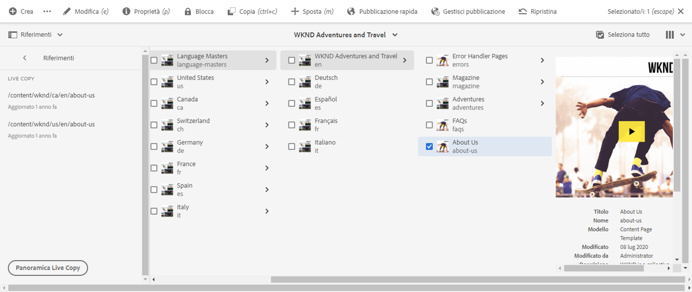
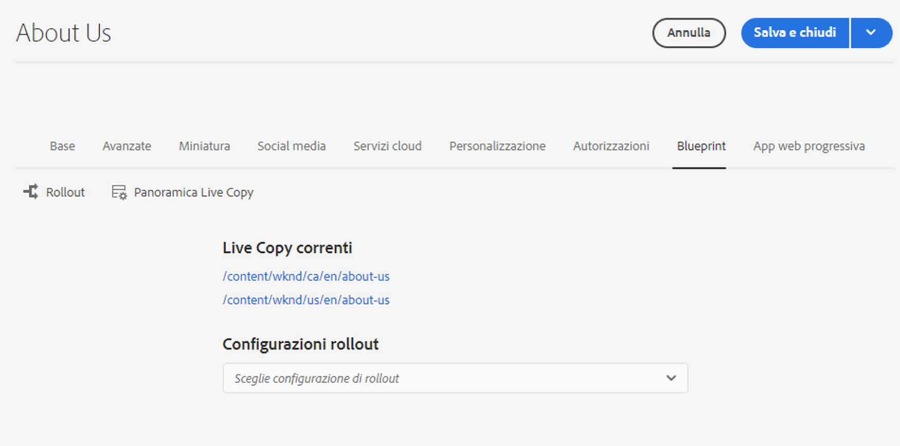
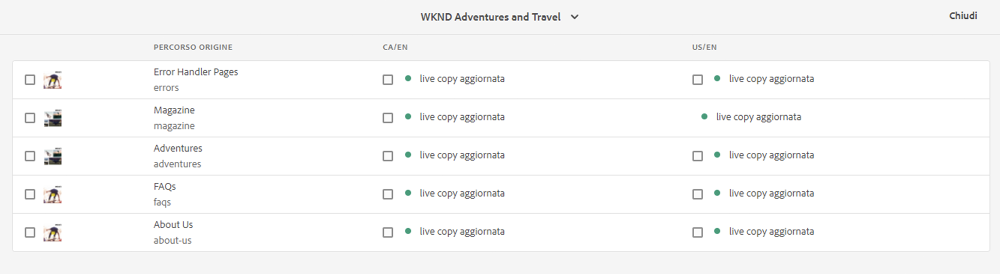
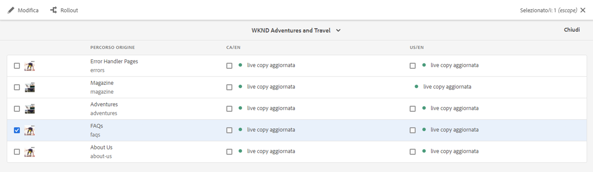
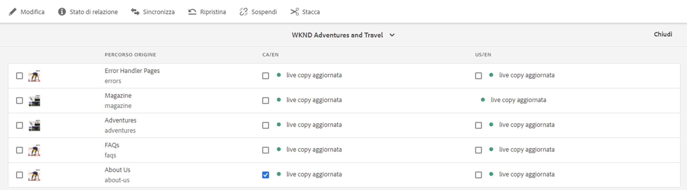
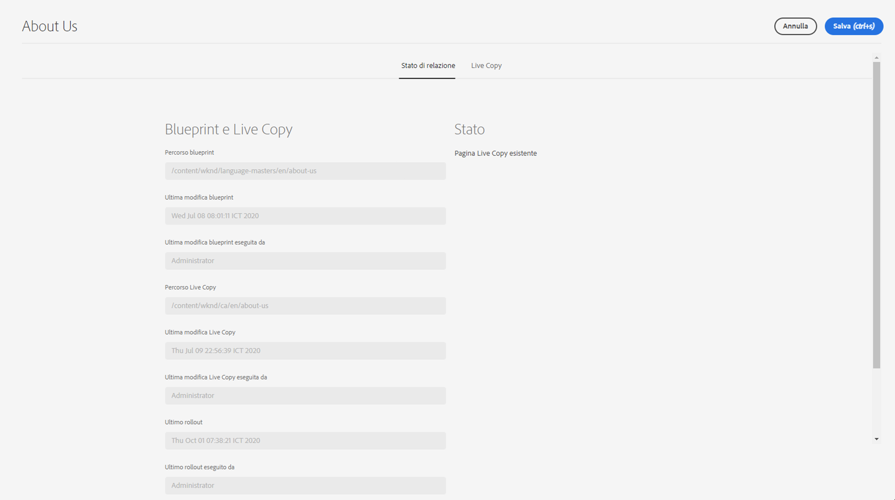
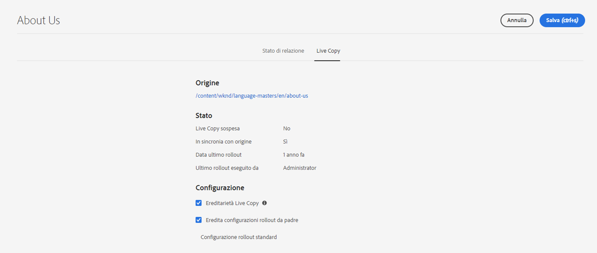

# Panoramica Live Copy {#live-copy-overview-console}

La console **Panoramica Live Copy** consente di:

* Visualizzare/gestire l’ereditarietà in un sito.
   * Visualizzare la struttura della blueprint e della Live Copy corrispondente, insieme al relativo stato di ereditarietà
   * Modificare lo stato di ereditarietà, ad esempio sospendere e riprendere
   * Visualizzare le proprietà di blueprint e Live Copy
* Eseguire azioni di rollout.

## Apertura della Panoramica Live Copy {#opening-the-live-copy-overview}

Puoi aprire la Panoramica Live Copy da:

* [Pannello laterale Riferimenti di una pagina blueprint (console Sites)](#opening-live-copy-overview-references-for-a-blueprint-page)
* [Proprietà di una pagina blueprint](#opening-live-copy-overview-properties-of-a-blueprint-page)

### Riferimenti a una pagina blueprint {#references-to-a-blueprint-page}

La **Panoramica Live Copy** può essere aperto dal pannello laterale **Riferimenti** nella console **Sites**:

1. Nella console **Sites**, [passa alla pagina blueprint e selezionala](/help/sites-cloud/authoring/basic-handling.md#viewing-and-selecting-resources).
1. Apri la barra **[Riferimenti](/help/sites-cloud/authoring/basic-handling.md#references)** e seleziona **Live Copy**.

   

   >[!TIP]
   >
   >È inoltre possibile aprire prima i riferimenti e quindi selezionare la blueprint.

1. Seleziona **Panoramica Live Copy** per mostrare e utilizzare la panoramica di tutte le Live Copy relative alla blueprint selezionata.
1. Utilizza **Chiudi** per uscire e tornare alla console **Sites**.

### Proprietà di una pagina blueprint {#properties-of-a-blueprint-page}

La **Panoramica Live Copy** può essere aperta quando si visualizzano le proprietà di una pagina blueprint:

1. Apri **Proprietà** per la pagina blueprint appropriata.
1. Apri la scheda **Blueprint**: l’opzione **Panoramica Live Copy** viene visualizzata nella barra degli strumenti superiore:

   

1. Seleziona **Panoramica Live Copy** per mostrare e utilizzare la panoramica di tutte le Live Copy relative alla blueprint corrente.

1. Utilizza **Chiudi** per uscire e tornare alla console **Sites**.

## Utilizzo della Panoramica Live Copy {#using-the-live-copy-overview}

La finestra **Panoramica Live Copy** fornisce una panoramica dello stato delle Live Copy relative alla pagina selezionata.

Un rollout dipende dalle azioni di sincronizzazione definite nella specifica configurazione di rollout. Alcune azioni dipendono dalle modifiche al contenuto. Tuttavia, esistono anche molte azioni che non dipendono da modifiche al contenuto, ma dipendono da eventi come l’attivazione della pagina. Tali eventi non modificano il contenuto, ma modificano le proprietà interne ad esso correlate.

I campi di stato dipendono anche dalle azioni di sincronizzazione definite nella specifica configurazione di rollout e indicano se dall’ultimo rollout riuscito sono state eseguite tali azioni alla blueprint o alla Live Copy. Un campo di stato riflette solo le azioni nella specifica configurazione di rollout. Se non è mai stato eseguito un rollout di successo su una Live Copy, lo stato viene sempre visualizzato aggiornato.

Ad esempio, una configurazione di rollout è definita come `targetActivate`. Pertanto, un rollout dipenderà solo dagli eventi di attivazione. Il campo di stato indica solo se si sono verificati eventi di attivazione dall’ultimo rollout riuscito.

La **Panoramica Live Copy** può essere utilizzata anche per eseguire azioni sulla Live Copy:

1. Apri **Panoramica Live Copy**.
1. Seleziona la pagina blueprint o Live Copy richiesta e la barra degli strumenti verrà aggiornata per mostrare le azioni disponibili. La [azioni](overview.md#terms-used) disponibile a seconda che sia stata selezionata una pagina [blueprint](#actions-for-a-blueprint-page) o [Live Copy](#actions-for-a-live-copy-page).

### Azioni per una pagina blueprint {#actions-for-a-blueprint-page}

Quando selezioni una pagina blueprint, sono disponibili le seguenti azioni:

* **Modifica**: apri la pagina blueprint per la modifica.
* **[Rollout](overview.md#rollout-and-synchronize)**: esegui un rollout per inviare le modifiche dalla sorgente alla Live Copy.

### Azioni per una pagina Live Copy {#actions-for-a-live-copy-page}

Quando selezioni una pagina Live Copy, sono disponibili le seguenti azioni:

* **Modifica**: apri la pagina Live Copy per la modifica.
* **[Stato della relazione](#relationship-status)**: visualizza informazioni sullo stato e sull’ereditarietà.
* **[Sincronizza](overview.md#rollout-and-synchronize)**: sincronizza una Live Copy per estrarre le modifiche dalla sorgente alla Live Copy.
* **[Reimposta](creating-live-copies.md#resetting-a-live-copy-page)**: reimposta una pagina Live Copy per rimuovere tutte le cancellazioni di ereditarietà e ripristinare la pagina allo stesso stato della pagina sorgente.
* **[Sospendi](overview.md#suspending-and-cancelling-inheritance-and-synchronization)**: disattiva temporaneamente la relazione in tempo reale tra una Live Copy e la relativa pagina blueprint.
* **[Riprendi](creating-live-copies.md#resuming-inheritance-for-a-page)** - Riprendi consente di ripristinare una relazione sospesa.
* **[Stacca](overview.md#detaching-a-live-copy)**: rimuove definitivamente la relazione live tra una Live Copy e la relativa pagina blueprint.

## Stato di relazione {#relationship-status}

La console **Stato relazione** dispone di due schede che forniscono una serie di funzionalità.

* [Stato di relazione](#relationship-status-tab)
* [Live Copy &#x200B;](#live-copy-tab)

### Stato di relazione {#relationship-status-tab}

Questa scheda fornisce informazioni dettagliate sullo stato della relazione tra blueprint e Live Copy.

### Live Copy  {#live-copy-tab}

Questa scheda ti consente di visualizzare e modificare la configurazione della Live Copy.

