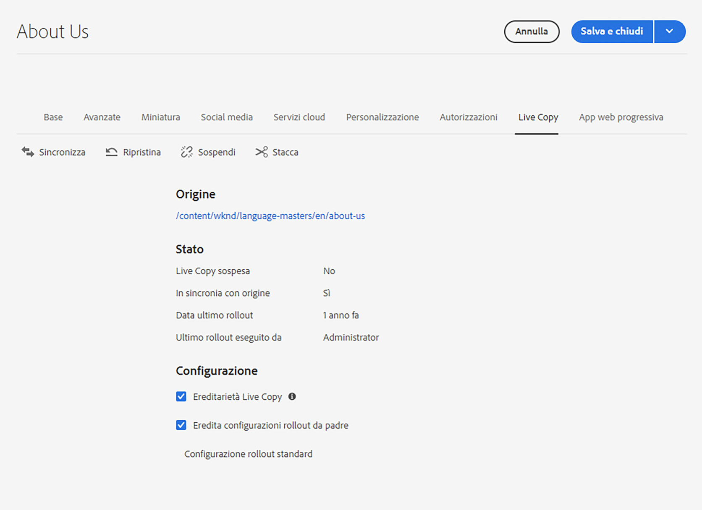
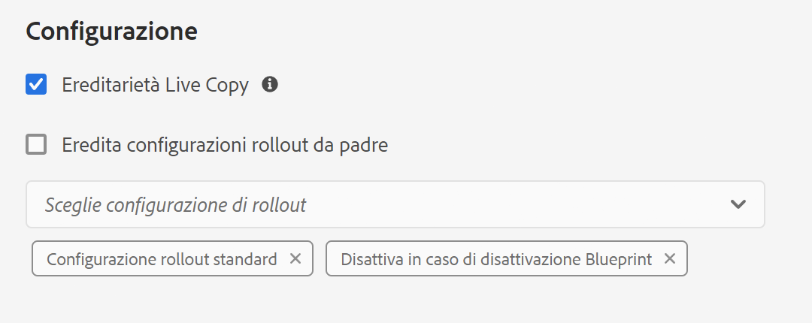

# Configurazione della sincronizzazione di una Live Copy {#configuring-live-copy-synchronization}

Adobe Experience Manager fornisce diverse configurazioni di sincronizzazione pronte all’uso. Prima di utilizzare Live Copy, è necessario considerare quanto segue per definire come e quando le Live Copy vengono sincronizzate con il loro contenuto sorgente.

1. Decidi se le configurazioni di rollout esistenti soddisfano le tue esigenze
1. Se le configurazioni di rollout esistenti non lo fanno, decidi se devi crearne una tua.
1. Specifica le configurazioni di rollout da utilizzare per le Live Copy.

## Configurazioni di rollout installate e personalizzate {#installed-and-custom-rollout-configurations}

Questa sezione fornisce informazioni sulle configurazioni di rollout installate e sulle azioni di sincronizzazione che utilizzano, nonché su come creare configurazioni personalizzate, se richiesto.

>[!CAUTION]
>
>L’aggiornamento o la modifica di una configurazione di rollout preconfigurata è **non** consigliato. Se è necessaria un’azione live personalizzata, questa deve essere aggiunta in una configurazione di rollout personalizzata.

### Attivatori di rollout {#rollout-triggers}

Ogni configurazione di rollout utilizza un attivatore (o trigger) di rollout che determina l’esecuzione dell’implementazione. Le configurazioni di rollout possono utilizzare uno dei seguenti attivatori:

* **Al momento del rollout**: Il comando  **** Rolloutcommand viene utilizzato nella pagina di stampa blu, oppure il comando  **** Sincronizzazione viene utilizzato nella pagina Live Copy.
* **In caso di modifica**: quando la pagina sorgente viene modificata.
* **Al momento dell’attivazione**: quando la pagina sorgente viene attivata.
* **Alla disattivazione**: quando la pagina sorgente viene disattivata.

>[!NOTE]
>
>L&#39;utilizzo del trigger **Alla modifica** può influire sulle prestazioni. Per ulteriori informazioni, consulta la sezione sulle [best practice per MSM](best-practices.md#onmodify).

### Configurazioni rollout {#rollout-configurations}

Nella tabella seguente sono elencate le configurazioni di rollout fornite con AEM. La tabella contiene le azioni di attivazione e sincronizzazione per ciascuna configurazione di rollout.

<!--
If the installed rollout configuration actions do not meet your requirements, you can [create a new rollout configuration](#creating-a-rollout-configuration).
-->

| Nome | Descrizione | Attivatore | [Azioni di sincronizzazione](#synchronization-actions) |
|---|---|---|---|
| Configurazione di rollout standard | Configurazione di rollout standard che consente di avviare il processo di rollout all’attivazione del rollout ed esegue le seguenti azioni: crea, aggiorna, elimina contenuto e ordina nodi figlio | Al momento del rollout | `contentUpdate` `contentCopy` `contentDelete` `referencesUpdate` `productUpdate` `orderChildren` |
| Attiva in caso di attivazione Blueprint | Pubblica la Live Copy quando la sorgente viene pubblicata | Al momento dell’attivazione | `targetActivate` |
| Disattiva in caso di disattivazione Blueprint | Disattiva la Live Copy quando la sorgente viene disattivata | Disattivazione | `targetDeactivate` |
| Invia dopo modifica | Invia il contenuto alla Live Copy quando la sorgente viene modificata Utilizza parsimoniosamente questa configurazione di rollout perché utilizza l&#39;attivatore Al momento della modifica. | In caso di modifica | `contentUpdate` `contentCopy` `contentDelete` `referencesUpdate` `orderChildren` |
| Invia dopo modifica (superficiale) | Invia il contenuto alla Live Copy quando la pagina blueprint viene modificata, senza aggiornare i riferimenti (ad esempio per le copie superficiali) Utilizza con moderazione questa configurazione di rollout in quanto utilizza l&#39;attivatore Al momento della modifica. | In caso di modifica | `contentUpdate` `contentCopy` `contentDelete` `orderChildren` |
| Promuovi lancio | Configurazione rollout standard per la promozione di pagine di lanci. | Al momento del rollout | `contentUpdate` `contentCopy` `contentDelete` `referencesUpdate` `orderChildren` `markLiveRelationship` |

### Azioni di sincronizzazione {#synchronization-actions}

Nella tabella seguente sono elencate le azioni di sincronizzazione fornite con AEM.

<!--If the installed actions do not meet your requirements, you can [Create a New Synchronization Action](/help/sites-developing/extending-msm.md#creating-a-new-synchronization-action).-->

| Nome azione | Descrizione | Proprietà |
|---|---|---|
| `contentCopy` | Quando i nodi della sorgente non esistono nella Live Copy, questa azione copia i nodi nella Live Copy. [Configura l’ **azione Copia contenuto di** ](#excluding-properties-and-node-types-from-synchronization) CQ MSM per specificare i tipi di nodo, gli elementi di paragrafo e le proprietà di pagina da escludere. |  |
| `contentDelete` | Questa azione elimina i nodi della Live Copy che non esistono nell’origine. [Configura l’ **azione Elimina contenuto di** ](#excluding-properties-and-node-types-from-synchronization) CQ MSM per specificare i tipi di nodo, gli elementi di paragrafo e le proprietà di pagina da escludere. |  |
| `contentUpdate` | Questa azione aggiorna il contenuto della Live Copy con le modifiche apportate dalla sorgente. [Configura l’ **azione di aggiornamento del contenuto di** ](#excluding-properties-and-node-types-from-synchronization) CQ MSM per specificare i tipi di nodo, gli elementi di paragrafo e le proprietà di pagina da escludere. |  |
| `editProperties` | Questa azione modifica le proprietà della Live Copy. La proprietà `editMap` determina le proprietà modificate e il relativo valore. Il valore della proprietà `editMap` deve utilizzare il formato seguente: `[property_name_n]#[current_value]#[new_value]` `current_value` e `new_value` sono espressioni regolari e `n` è un numero intero incrementato. Ad esempio, considera il seguente valore per  `editMap`: `sling:resourceType#/(contentpage` `homepage)#/mobilecontentpage,cq:template#/contentpage#/mobilecontentpage` Questo valore modifica le proprietà dei nodi Live Copy come segue:  Le  `sling:resourceType` proprietà impostate su  `contentpage` o su  `homepage` sono impostate su  `mobilecontentpage`. Le  `cq:template` proprietà impostate su  `contentpage` sono impostate su  `mobilecontentpage`. | `editMap: (String)` identifica la proprietà, il valore corrente e il nuovo valore. Per ulteriori informazioni, consulta la descrizione . |
| `notify` | Questa azione invia un evento di pagina per segnalare che la pagina è stata implementata. Per ricevere una notifica, è necessario innanzitutto iscriversi a eventi di rollout. |  |
| `orderChildren` | Questa azione ordina i nodi figlio in base all’ordine della blueprint. |  |
| `referencesUpdate` | Questa azione di sincronizzazione aggiorna i riferimenti sulla Live Copy. Cerca i percorsi nelle pagine Live Copy che puntano a una risorsa all’interno della blueprint. Quando viene trovato, aggiorna il percorso in modo che punti alla relativa risorsa all’interno della Live Copy. I riferimenti che hanno destinazioni esterne alla blueprint non vengono modificati.  [Configura l’ **azione di aggiornamento dei riferimenti di** ](#excluding-properties-and-node-types-from-synchronization) CQ MSM per specificare i tipi di nodo, gli elementi di paragrafo e le proprietà di pagina da escludere. |  |
| `targetVersion` | Questa azione crea una versione della Live Copy. Questa deve essere l’unica azione di sincronizzazione inclusa in una configurazione di rollout. |  |
| `targetActivate` | Questa azione attiva la Live Copy. Questa deve essere l’unica azione di sincronizzazione inclusa in una configurazione di rollout. |  |
| `targetDeactivate` | Questa azione disattiva la Live Copy. Questa deve essere l’unica azione di sincronizzazione inclusa in una configurazione di rollout. |  |
| `workflow` | Questa azione avvia il flusso di lavoro definito dalla proprietà target (solo per le pagine) e considera la Live Copy come payload. Il percorso di destinazione è il percorso del nodo del modello. | `target: (String)` è il percorso del modello di flusso di lavoro. |
| `mandatory` | Questa azione imposta l&#39;autorizzazione di diversi ACL nella pagina Live Copy in sola lettura per un gruppo di utenti specifico. Le seguenti ACL sono configurate: `ActionSet.ACTION_NAME_REMOVE` `ActionSet.ACTION_NAME_SET_PROPERTY` `ActionSet.ACTION_NAME_ACL_MODIFY` Utilizza questa azione solo per le pagine. | `target: (String)` è l&#39;ID del gruppo per il quale stai impostando le autorizzazioni. |
| `mandatoryContent` | Questa azione imposta l&#39;autorizzazione di diversi ACL nella pagina Live Copy in sola lettura per un gruppo di utenti specifico. Le seguenti ACL sono configurate: `ActionSet.ACTION_NAME_SET_PROPERTY` `ActionSet.ACTION_NAME_ACL_MODIFY` Utilizza questa azione solo per le pagine. | `target: (String)` è l&#39;ID del gruppo per il quale stai impostando le autorizzazioni. |
| `mandatoryStructure` | Questa azione imposta l&#39;autorizzazione dell&#39; `ActionSet.ACTION_NAME_REMOVE` ACL sulla pagina Live Copy in sola lettura per un gruppo di utenti specifico. Usa questa azione solo per le pagine. | `target: (String)` è l&#39;ID del gruppo per il quale stai impostando le autorizzazioni. |
| `VersionCopyAction` | Se la pagina blueprint/sorgente è stata pubblicata almeno una volta, questa azione crea una pagina Live Copy utilizzando la versione pubblicata. Nota: questa azione è disponibile solo per la creazione di una pagina Live Copy basata su una pagina sorgente pubblicata e non per l’aggiornamento di una pagina Live Copy esistente. |  |
| `PageMoveAction` | Il valore `PageMoveAction` si applica quando una pagina è stata spostata nella blueprint. L’azione copia invece di spostare la pagina (correlata) Live Copy dalla posizione prima dello spostamento alla posizione successiva. La pagina Live Copy  `PageMoveAction` non viene modificata nella posizione precedente allo spostamento. Pertanto, per configurazioni di rollout consecutive ha lo stato di una relazione live senza blueprint. [**** Configura il servizio Azione di spostamento di pagine di CQ MSM](#excluding-properties-and-node-types-from-synchronization) per specificare i tipi di nodo, gli elementi di paragrafo e le proprietà di pagina da escludere. Questa deve essere l’unica azione di sincronizzazione inclusa in una configurazione di rollout. | Imposta `prop_referenceUpdate: (Boolean)` su true (predefinito) per aggiornare i riferimenti. |
| `markLiveRelationship` | Questa azione Indica una relazione live per il contenuto creato da un lancio. |  |

<!--
### Creating a Rollout Configuration {#creating-a-rollout-configuration}

You can [create a rollout configuration](/help/sites-developing/extending-msm.md#creating-a-new-rollout-configuration) when the installed rollout configurations do not meet your application requirements by performing the following steps.

1. [Create the rollout configuration](/help/sites-developing/extending-msm.md#create-the-rollout-configuration).
1. [Add synchronization actions to the rollout configuration](/help/sites-developing/extending-msm.md#add-synchronization-actions-to-the-rollout-configuration).

The new rollout configuration is then available to you when configuring rollout configurations on a blueprint or Live Copy page.
-->

### Esclusione delle proprietà e dei tipi di nodo dalla sincronizzazione {#excluding-properties-and-node-types-from-synchronization}

Puoi configurare diversi servizi OSGi che supportano le azioni di sincronizzazione corrispondenti in modo che non influiscano su proprietà e tipi di nodo specifici. Ad esempio, molte proprietà e sottonodi relativi al funzionamento interno di AEM non devono essere inclusi in una Live Copy. Deve essere copiato solo il contenuto rilevante per l’utente della pagina.

Quando si lavora con AEM esistono diversi metodi per gestire le impostazioni di configurazione per tali servizi. Per ulteriori informazioni e pratiche consigliate, consulta [Configurazione di OSGi](/help/implementing/deploying/configuring-osgi.md) .

Nella tabella seguente sono elencate le azioni di sincronizzazione per le quali è possibile specificare i nodi da escludere. La tabella fornisce i nomi dei servizi da configurare mediante la Console web e il PID per la configurazione mediante un nodo di archivio.

| Azione di sincronizzazione | Nome del servizio nella console Web | PID di servizio |
|---|---|---|
| `contentCopy` | Azione di copia del contenuto di CQ MSM | `com.day.cq.wcm.msm.impl.actions.ContentCopyActionFactory` |
| `contentDelete` | Azione di eliminazione del contenuto di CQ MSM | `com.day.cq.wcm.msm.impl.actions.ContentDeleteActionFactory` |
| `contentUpdate` | Azione di aggiornamento dei contenuti di CQ MSM | `com.day.cq.wcm.msm.impl.actions.ContentUpdateActionFactory` |
| `PageMoveAction` | Azione di spostamento pagina di CQ MSM | `com.day.cq.wcm.msm.impl.actions.PageMoveActionFactory` |
| `referencesUpdate` | Azione di aggiornamento dei riferimenti di CQ MSM | `com.day.cq.wcm.msm.impl.actions.ReferencesUpdateActionFactory` |

La tabella seguente descrive le proprietà che puoi configurare:

| Proprietà della console Web | OSGi, proprietà | Descrizione |
|---|---|---|
| Tipi di nodo esclusi | `cq.wcm.msm.action.excludednodetypes` | Un&#39;espressione regolare che corrisponde ai tipi di nodo da escludere dall&#39;azione di sincronizzazione |
| Elementi paragrafo esclusi | `cq.wcm.msm.action.excludedparagraphitems` | Espressione regolare che corrisponde agli elementi paragrafo da escludere dall’azione di sincronizzazione |
| Proprietà pagina escluse | `cq.wcm.msm.action.excludedprops` | Un’espressione regolare che corrisponde alle proprietà della pagina da escludere dall’azione di sincronizzazione |
| Tipi di nodo misti ignorati | `cq.wcm.msm.action.ignoredMixin` | Un&#39;espressione regolare che corrisponde ai nomi dei tipi di nodo mixin da escludere dall&#39;azione di sincronizzazione (disponibile solo per l&#39;azione `contentUpdate`) |

#### Azione di aggiornamento dei contenuti di CQ MSM - Esclusioni {#cq-msm-content-update-action-exclusions}

Diverse proprietà e tipi di nodo sono esclusi per impostazione predefinita; essi sono definiti nella configurazione OSGi dell’**Azione di aggiornamento dei contenuti di CQ MSM**, in **Proprietà pagina escluse**.

Per impostazione predefinita, le proprietà che corrispondono alle seguenti espressioni regolari vengono escluse (ovvero non aggiornate) durante il rollout:

Puoi modificare le espressioni che definiscono l’elenco di esclusione secondo le tue esigenze.

Ad esempio, se desideri includere il **Titolo** della pagina nelle modifiche considerate per il rollout, rimuovi `jcr:title` dalle esclusioni. Ad esempio, con il codice regex:

`jcr:(?!(title)$).*`

### Configurazione della sincronizzazione per l’aggiornamento dei riferimenti {#configuring-synchronization-for-updating-references}

Puoi configurare diversi servizi OSGi che supportano le azioni di sincronizzazione corrispondenti, relative all’aggiornamento dei riferimenti.

Quando si lavora con AEM esistono diversi metodi per gestire le impostazioni di configurazione per tali servizi. Per ulteriori informazioni e pratiche consigliate, consulta [Configurazione di OSGi](/help/implementing/deploying/configuring-osgi.md) .

Nella tabella seguente sono elencate le azioni di sincronizzazione per cui è possibile specificare l’aggiornamento dei riferimenti. La tabella fornisce i nomi dei servizi da configurare mediante la Console web e il PID per la configurazione mediante un nodo di archivio.

| Proprietà della console Web | OSGi, proprietà | Descrizione |
|---|---|---|
| Aggiorna riferimento tra LiveCopy nidificate | `cq.wcm.msm.impl.action.referencesupdate.prop_updateNested` | Seleziona questa opzione nella console web o imposta questa proprietà booleana su `true` utilizzando la configurazione dell’archivio per sostituire i riferimenti che riguardano qualsiasi risorsa all’interno del ramo della Live Copy principale. Disponibile solo per l’azione `referencesUpdate`. |
| Aggiorna pagine di riferimento | `cq.wcm.msm.impl.actions.pagemove.prop_referenceUpdate` | Seleziona questa opzione nella console web o imposta questa proprietà booleana su `true` utilizzando la configurazione dell’archivio per aggiornare tutti i riferimenti all’utilizzo della pagina originale per fare riferimento invece alla pagina Live Copy. Disponibile solo per `PageMoveAction`. |

## Specifica delle configurazioni di rollout da utilizzare {#specifying-the-rollout-configurations-to-use}

MSM consente di specificare set di configurazioni di rollout che vengono utilizzate in genere e, quando necessario, è possibile sostituirle per specifiche Live Copy. MSM fornisce diverse posizioni per specificare le configurazioni di rollout da utilizzare. La posizione determina se la configurazione si applica a una Live Copy specifica.

Il seguente elenco di posizioni in cui puoi specificare le configurazioni di rollout da utilizzare descrive come MSM determina quali configurazioni di rollout utilizzare per una Live Copy:

* **[Proprietà pagina Live Copy](live-copy-sync-config.md#setting-the-rollout-configurations-for-a-live-copy-page):** quando una pagina Live Copy è configurata per utilizzare una o più configurazioni di rollout, MSM utilizza tali configurazioni di rollout.
* **[Proprietà pagina blueprint](live-copy-sync-config.md#setting-the-rollout-configuration-for-a-blueprint-page):** quando una Live Copy è basata su una blueprint e la pagina Live Copy non è configurata con una configurazione di rollout, viene utilizzata la configurazione di rollout associata alla pagina sorgente blueprint.
* **Proprietà della pagina padre della Live Copy:** quando né la pagina Live Copy né la pagina sorgente della blueprint sono configurate con una configurazione di rollout, viene utilizzata la configurazione di rollout che si applica alla pagina padre della pagina Live Copy.
* **[Impostazione predefinita del sistema](live-copy-sync-config.md#setting-the-system-default-rollout-configuration):** quando non è possibile determinare la configurazione di rollout della pagina padre di Live Copy, viene utilizzata la configurazione di rollout predefinita del sistema.

Ad esempio, una blueprint utilizza il sito [Esercitazione WKND](/help/implementing/developing/introduction/develop-wknd-tutorial.md) come contenuto sorgente. Un sito viene creato dalla blueprint. Ogni voce dell’elenco seguente descrive uno scenario diverso rispetto all’uso delle configurazioni di rollout:

* Nessuna delle pagine blueprint o Live Copy è configurata per l’utilizzo di una configurazione di rollout. MSM utilizza la configurazione di rollout predefinita del sistema per tutte le pagine Live Copy.
* La pagina principale del sito WKND è configurata con diverse configurazioni di rollout. MSM utilizza queste configurazioni di rollout per tutte le pagine Live Copy.
* La pagina principale del sito WKND è configurata con diverse configurazioni di rollout e la pagina principale del sito Live Copy è configurata con un diverso set di configurazioni di rollout. MSM utilizza le configurazioni di rollout configurate nella pagina principale del sito Live Copy.

### Impostazione delle configurazioni di rollout per una pagina Live Copy {#setting-the-rollout-configurations-for-a-live-copy-page}

Configura una pagina Live Copy con le configurazioni di rollout da utilizzare quando la pagina sorgente viene rollout. Per impostazione predefinita, le pagine secondarie ereditano la configurazione. Quando configuri la configurazione di rollout da utilizzare, sovrascrivi la configurazione che la pagina Live Copy eredita dal suo elemento padre.

Puoi anche configurare le configurazioni di rollout per una pagina Live Copy quando [crei la Live Copy](creating-live-copies.md#creating-a-live-copy-of-a-page).

1. Utilizza la console **Sites** per selezionare la pagina Live Copy.
1. Seleziona **Proprietà** nella barra degli strumenti.
1. Apri la scheda **Live Copy.**

   La sezione **Configurazione** mostra le configurazioni di rollout ereditate dalla pagina.

   

1. Se necessario, regola il flag **Ereditarietà Live Copy**. Se selezionata, la configurazione Live Copy ha effetto su tutti gli elementi figlio.

1. Deseleziona la proprietà **Eredita configurazione rollout da padre**, quindi seleziona una o più configurazioni di rollout dall’elenco.

   Le configurazioni di rollout selezionate vengono visualizzate nell’elenco a discesa.

   

1. Tocca o fai clic su **Salva e chiudi**.

### Impostazione della configurazione di rollout per una pagina blueprint {#setting-the-rollout-configuration-for-a-blueprint-page}

Configura una pagina blueprint con le configurazioni di rollout da utilizzare quando la pagina blueprint è soggetta a rollout.

Considera che le pagine secondarie della pagina blueprint ereditano la configurazione. Quando imposti la configurazione di rollout da utilizzare, potresti sovrascrivere la configurazione che la pagina eredita dal sua pagina padre.

1. Utilizza la console **Sites** per selezionare la pagina principale della blueprint.
1. Seleziona **Proprietà** nella barra degli strumenti.
1. Apri la scheda **Blueprint.**
1. Seleziona una o più **Configurazioni di rollout** con il selettore a discesa.
1. Per confermare gli aggiornamenti, seleziona **Salva**.

### Impostazione della configurazione di rollout predefinita del sistema {#setting-the-system-default-rollout-configuration}

Per specificare una configurazione di rollout da utilizzare come predefinita del sistema, configura il seguente servizio OSGi.

* **Day CQ WCM Live Relationship** Manager con il PID del servizio  `com.day.cq.wcm.msm.impl.LiveRelationshipManagerImpl`

Configura il servizio utilizzando la [console web](/help/implementing/deploying/configuring-osgi.md#osgi-configuration-with-the-web-console) o un [nodo archivio](/help/implementing/deploying/configuring-osgi.md#osgi-configuration-in-the-repository).

* Nella console web, il nome della proprietà da configurare è **Configurazione di rollout predefinita**.
* Utilizzando un nodo di archivio, il nome della proprietà da configurare è `liverelationshipmgr.relationsconfig.default`.

Imposta il valore di questa proprietà sul percorso della configurazione di rollout da utilizzare come impostazione predefinita del sistema. Il valore predefinito è `/libs/msm/wcm/rolloutconfigs/default`, che è la **Configurazione di rollout standard**.
