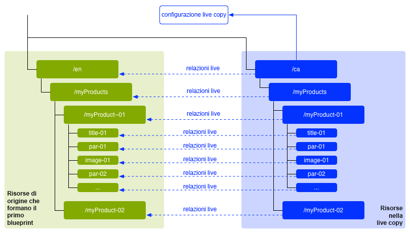
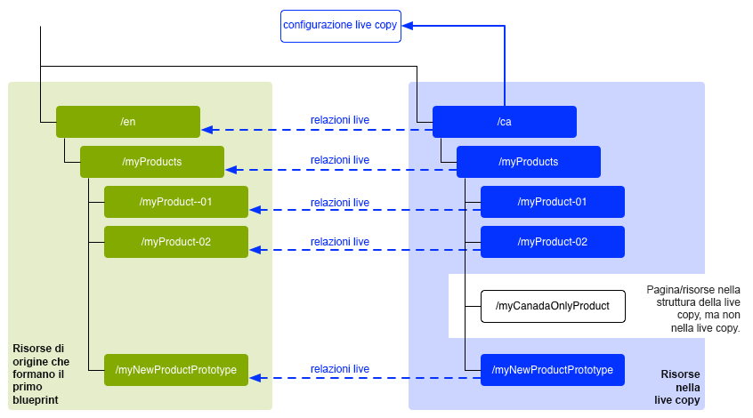
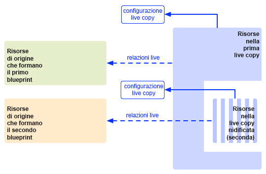
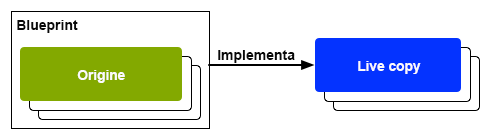
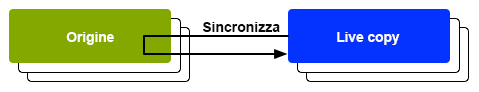

# Riutilizzo del contenuto: Multi-Site Manager e Live Copy {#multi-site-manager-and-live-copy}

Gestore multisito (MSM) consente di utilizzare lo stesso contenuto del sito in più posizioni. Per ottenere questo risultato, MSM utilizza la funzionalità Live Copy.

* Con MSM è possibile:
   * Creare contenuto una volta e poi
   * Riutilizzare questo contenuto in altre aree (tramite [Live Copy](#live-copies)) dello stesso sito o di altri siti.
* MSM mantiene quindi le relazioni in tempo reale tra il contenuto sorgente e le relative Live Copy in modo che:
   * Quando modifichi il contenuto sorgente, la sorgente e le Live Copy vengono sincronizzate.
   * Puoi apportare modifiche solo al contenuto delle Live Copy scollegando la relazione in tempo reale per le singole sottopagine e/o componenti.

Questa pagina fornisce una panoramica del riutilizzo dei contenuti con MSM. Nelle pagine seguenti vengono descritti in dettaglio i problemi correlati.

* [Creazione e sincronizzazione di Live Copy](creating-live-copies.md)
* [Panoramica sulla console Live Copy](live-copy-overview.md)
* [Configurazione della sincronizzazione di una Live Copy](live-copy-sync-config.md)
* [Conflitti di rollout MSM](rollout-conflicts.md)
* [Best practice MSM](best-practices.md)

>[!NOTE]
>
>MSM può essere utilizzato anche per Assets, inclusi i frammenti di contenuto. Vedi [Riutilizzare i frammenti di contenuto utilizzando MSM per Assets](/help/assets/reuse-assets-using-msm.md) (disponibile solo tramite la console Assets).

## Scenari possibili {#possible-scenarios}

Ci sono molti casi d’uso di MSM e Live Copy. Alcuni scenari includono:

* **Multinazionali: dall’azienda globale a quella locale**

  Un caso d’uso tipico supportato da MSM è quello di riutilizzare i contenuti in diversi siti multinazionali nella stessa lingua. Ciò consente di riutilizzare i contenuti principali, consentendo al contempo l’utilizzo di varianti nazionali.

  Ad esempio, per i clienti negli Stati Uniti viene creata la sezione inglese dell’[Esempio di tutorial WKND](/help/implementing/developing/introduction/develop-wknd-tutorial.md). La maggior parte dei contenuti di questo sito può essere utilizzata anche per altri siti WKND che soddisfano clienti di lingua inglese di diversi Paesi e culture. Il contenuto principale rimane lo stesso in tutti i siti, mentre è possibile apportare modifiche regionali.

  La seguente struttura può essere utilizzata per i siti di Stati Uniti e Canada. Nota come il nodo `language-masters` mantiene la copia master non solo dell’inglese, ma anche di altro contenuto in lingua. Questo contenuto può essere utilizzato insieme all’inglese come base per contenuti aggiuntivi in lingua regionale.

  ```xml
  /content
      |- wknd
          |- language-masters
              |- en
              |- es
              |- fr
          |- us
              |- en
              |- es
          |- ca
              |- en
              |- fr
  ```

  >[!NOTE]
  >
  >MSM non traduce il contenuto. Viene utilizzato per creare la struttura richiesta e distribuire il contenuto.
  >
  >
  >Vedi [Traduzione di contenuti per siti multilingue](/help/sites-cloud/administering/translation/overview.md) per un esempio del genere.

* **Nazionale: dalla sede principale alle succursali regionali**

  In alternativa, un’azienda con una rete di rivenditori potrebbe volere siti web separati per i singoli concessionari, ognuno dei quali rappresenta una variazione del sito principale fornito dalla sede centrale. Potrebbe trattarsi di una singola azienda con più uffici regionali o di un sistema di franchising nazionale composto da un franchisor centrale e da più affiliati locali.

  La sede centrale può fornire le informazioni di base, mentre gli enti regionali possono aggiungere informazioni locali, quali i dati di contatto, gli orari di apertura e gli eventi.

  ```xml
  /content
      |- head-office-berlin
      |- branch-hamburg
      |- branch-stuttgart
      |- branch-munich
      |- branch-frankfurt
  ```

* **Più versioni**

  MSM può creare versioni di uno specifico ramo secondario. Ad esempio, un sito secondario di supporto può contenere i dettagli delle diverse versioni di un prodotto specifico, dove le informazioni di base rimangono costanti e devono essere modificate solo le funzioni aggiornate:

  ```xml
  /content
      |- game-support
          |- polybius
              |- v5.0
              |- v4.0
              |- v3.0
              |- v2.0
              |- v1.0
  ```

  >[!TIP]
  >
  >In tale scenario, si tratta di stabilire se effettuare una copia diretta o utilizzare Live Copy, valutando tra:
  >
  >* Quanto contenuto principale deve essere aggiornato su più versioni.
  >
  >Contro:
  >
  >* Quanto delle singole copie deve essere regolato.

## MSM dall’interfaccia utente {#msm-from-the-ui}

MSM è direttamente accessibile nell’interfaccia utente utilizzando diverse opzioni dalla console appropriata.

* **Crea sito** (**Sites**)

   * MSM consente di gestire più siti web che condividono contenuti comuni. Ad esempio, i siti web sono spesso disponibili per il pubblico internazionale in modo che la maggior parte dei contenuti sia comune in tutti i Paesi, con un sottoinsieme di contenuti specifici per il singolo Paese. MSM consente di [creare Live Copy che aggiornano automaticamente uno o più siti in base al sito di origine](creating-live-copies.md#creating-a-live-copy-of-a-site-from-a-blueprint-configuration). Questo consente anche di applicare una struttura di base comune, utilizzare i contenuti comuni tra più siti, mantenere un aspetto comune e ottimizzare gli sforzi per gestire i contenuti che differiscono effettivamente tra i siti. La creazione di un sito in questo modo:
      * Richiede una configurazione blueprint predefinita per specificare la sorgente.
      * Crea una Live Copy della sorgente (predefinita).
      * Fornisce all’utente il pulsante di **Rollout**.

* **Crea Live Copy** (**Sites**)

   * MSM consente di [creare una Live Copy ad hoc (una tantum) di una singola pagina o sottosezione di un sito Web](creating-live-copies.md#creating-a-live-copy-of-a-page). Ad esempio, duplicando un ramo secondario per fornire informazioni su una versione nuova/aggiornata di un prodotto. Creazione di una Live Copy in questo modo:
      * Crea una Live Copy ad-hoc (non è richiesta alcuna configurazione blueprint).
      * Può essere utilizzata per creare (immediatamente) una Live Copy di qualsiasi pagina/ramo.
      * Richiede **Sincronizza** (non fornisce il pulsante di **Rollout**).

* **Visualizza proprietà** (**Sites**)

   * All’occorrenza, questa opzione ti aiuta a: [monitorare la Live Copy](creating-live-copies.md#monitoring-your-live-copy) fornendo informazioni sulle relative **Live Copy** o **Blueprint**.

* **Riferimenti** (**Sites**)

   * La barra [Riferimenti](/help/sites-cloud/authoring/basic-handling.md#references) fornisce informazioni sulle **Live Copy** insieme all’accesso alle azioni appropriate.

* **Panoramica delle Live Copy** (**Sites**)

   * Questa console consente di [visualizzare e gestire la blueprint e le relative Live Copy](live-copy-overview.md).

* **Blueprint** (**Strumenti** - **Sites**)

   * Questa console consente di [creare e gestire le configurazioni blueprint](creating-live-copies.md#creating-a-blueprint-configuration).

>[!NOTE]
>
>MSM può essere utilizzato sia con le pagine che con [Frammenti esperienza](/help/sites-cloud/authoring/fragments/experience-fragments.md) in quanto tali frammenti fanno parte di un&#39;esperienza (pagina).

>[!NOTE]
>
>Aspetti della funzionalità MSM sono utilizzati in diverse altre funzioni AEM come i lanci. In questi casi la Live Copy è gestita da tale funzione.

### Termini utilizzati {#terms-used}

Come introduzione, la tabella seguente fornisce una panoramica dei termini principali utilizzati con MSM. Tali informazioni saranno descritte più dettagliatamente nelle sezioni e nelle pagine successive.

| Termine | Definizione | Maggiori dettagli |
|---|---|---|
| Sorgente | Pagine originali utilizzate come base per le Live Copy | Sinonimo di pagine blueprint e/o blueprint |
| Live Copy  | La copia (della sorgente), gestita dalle azioni di sincronizzazione definite dalle configurazioni di rollout |  |
| Configurazione Live Copy | Definizione dei dettagli di configurazione per una Live Copy |  |
| Relazione Live | Definizione effettiva dell’ereditarietà per una determinata risorsa, ovvero connessioni tra origine e Live Copy | Garantisce che le modifiche all’origine possano essere sincronizzate con la Live Copy |
| Blueprint | Sinonimo di Origine | Può essere definito da una configurazione blueprint |
| Configurazione Blueprint | Configurazione predefinita che specifica un percorso origine | Quando si fa riferimento a una pagina blueprint in una configurazione blueprint, diventa disponibile il comando Rollout |
| Capitolo | Sezioni della blueprint da includere nella Live Copy | Si tratta in genere di sottopagine della radice |
| Sincronizzazione | Termine generico per la sincronizzazione dei contenuti tra l’origine e le Live Copy (per le opzioni **Rollout** e **Sincronizza**) |  |
| Rollout | Sincronizza dall’origine alla Live Copy | Può essere attivato da un autore (in una pagina blueprint) o da un evento di sistema (come definito dalla configurazione di rollout) |
| Configurazione rollout | Regole che determinano quali proprietà sincronizzare, e come e quando sincronizzarle |  |
| Sincronizza | Richiesta manuale di sincronizzazione, effettuata dalle pagine Live Copy |  |
| Ereditarietà | Una pagina/componente Live Copy eredita il contenuto dalla pagina/componente origine quando avviene la sincronizzazione |  |
| Sospendi | Rimuove temporaneamente la relazione live tra una Live Copy e la relativa pagina blueprint |  |
| Stacca | Rimuove definitivamente la relazione live tra una Live Copy e la relativa pagina blueprint |  |
| Ripristina | Reimposta una pagina Live Copy per rimuovere tutte le cancellazioni di ereditarietà e riporta la pagina allo stesso stato della pagina origine | La reimpostazione influisce su tutte le modifiche apportate alle proprietà della pagina, al sistema di paragrafi e ai componenti. |
| Superficiale | Live Copy di una singola pagina |  |
| Profondo | Una Live Copy di una pagina, insieme alle relative pagine secondarie |  |

>[!TIP]
>
>Vedere [Estensione di Multi Site Manager](/help/implementing/developing/extending/msm.md#overview-of-the-java-api) per i nomi degli oggetti.

## Live Copy {#live-copies}

Una Live Copy MSM è una copia di un contenuto specifico del sito per cui viene mantenuta una relazione live con il sorgente originale:

* La Live Copy eredita il contenuto dalla relativa sorgente.
* La sincronizzazione esegue il trasferimento effettivo del contenuto quando vengono apportate modifiche al sorgente.
* Una Live Copy può essere definita
   * Shallow: una singola pagina
   * Deep: la pagina, insieme alle relative pagine secondarie
* Le regole di sincronizzazione, denominate configurazioni di rollout, determinano le proprietà sincronizzate e quando si verifica la sincronizzazione.

Nell&#39;esempio precedente, `/content/wknd/language-masters/en` è il sito master globale in inglese. Per riutilizzare il contenuto di questo sito, vengono create le Live Copy MSM:

* Il contenuto seguente `/content/wknd/language-masters/en` è la sorgente.
* Il contenuto seguente `/content/wknd/language-masters/en` viene copiato sotto i nodi `/content/wknd/us/en/` e `/content/wknd/ca/en`. Queste sono le Live Copy.
* Gli autori modificano le pagine sotto `/content/wknd/language-masters/en`.
* Quando viene attivato, MSM sincronizza queste modifiche con le Live Copy.

### Live Copy - Composizione {#live-copies-composition}

>[!NOTE]
>
>I diagrammi e le descrizioni contenuti in questa sezione rappresentano istantanee di potenziali Live Copy. Non sono complete, ma forniscono una panoramica per evidenziare caratteristiche specifiche.

Quando crei inizialmente una Live Copy, le pagine sorgente selezionate vengono riportate su una base 1:1 nella Live Copy. In seguito, è possibile creare nuove risorse (pagine e/o paragrafi) direttamente all’interno della Live Copy, pertanto è utile essere consapevoli di queste varianti e del loro impatto sulla sincronizzazione. Le possibili composizioni includono:

* [Live Copy con pagine non Live Copy](#live-copy-with-non-live-copy-pages)
* [Live Copy nidificate](#nested-live-copies)

La forma di base di una Live Copy include:

* Pagine Live Copy che riflettono le pagine sorgente selezionate su base 1:1.
* Una definizione di configurazione.
* Una relazione live definita per ogni risorsa:
   * Collega la risorsa Live Copy alla relativa blueprint/sorgente.
   * Sono utilizzate per la realizzazione di ereditarietà e rollout.

Le modifiche possono essere [sincronizzate](creating-live-copies.md#synchronizing-your-live-copy) in base ai requisiti.



#### Live Copy con pagine non Live Copy {#live-copy-with-non-live-copy-pages}

Quando crei una Live Copy in AEM, puoi visualizzare e navigare attraverso il ramo Live Copy e utilizzare le normali funzionalità AEM sul ramo Live Copy. Questo significa che tu o un processo potete creare nuove risorse (pagine e/o paragrafi) all’interno della Live Copy. Ad esempio, un prodotto per una determinata area geografica.

* Tali risorse non hanno alcuna relazione live con le pagine sorgente/blueprint e non sono sincronizzate.
* Si possono verificare scenari che MSM gestisce come casi speciali. Ad esempio, quando crei una pagina con la stessa posizione e lo stesso nome nei rami sorgente/blueprint e Live Copy. Per tali situazioni vedi [Conflitti di rollout MSM](rollout-conflicts.md) per ulteriori informazioni.



#### Live Copy nidificate {#nested-live-copies}

Quando crei una [nuova pagina all’interno di una Live Copy esistente](#live-copy-with-non-live-copy-pages), questa può anche essere impostata come Live Copy di un’altra blueprint. Questa è nota come Live Copy nidificata. Nelle Live Copy nidificate il comportamento della Live Copy secondaria o interna è interessato dalla Live Copy primaria o esterna nei seguenti modi:

* Un rollout deep attivato per la Live Copy di livello superiore può essere proseguito nella Live Copy nidificata.
* Eventuali collegamenti tra le origini verranno riscritti in Live Copy.

Ad esempio, i collegamenti che puntano dal secondo al primo blueprint verranno riscritti come collegamenti che puntano dalla Live Copy nidificata/secondaria alla prima Live Copy.



>[!NOTE]
>
>Se sposti o rinomini una pagina all’interno del ramo Live Copy, questa verrà trattata come una Live Copy nidificata per consentire ad AEM di tenere traccia delle relazioni.

#### Live Copy sovrapposte {#stacked-live-copies}

Una Live Copy è nota come Live Copy sovrapposta quando viene creata come secondaria rispetto a una Live Copy shallow. Si comporta nello stesso modo di una [Live Copy nidificata](#nested-live-copies).

### Sorgente, blueprint e configurazioni di blueprint {#source-blueprints-and-blueprint-configurations}

Qualsiasi pagina o ramo di pagine può essere utilizzata come sorgente di una Live Copy. Tuttavia, MSM ti consente anche di definire una configurazione blueprint che specifica un percorso sorgente. I vantaggi dell’utilizzo di una configurazione blueprint sono i seguenti:

* Consenti all&#39;autore di utilizzare il **Rollout** su una blueprint. ovvero di inviare in modo esplicito modifiche a Live Copy che ereditano da questa blueprint.
* Consenti all&#39;autore di utilizzare **Crea sito**. Questo consente all’utente di selezionare facilmente le lingue e configurare la struttura della Live Copy.
* Definisci una configurazione di rollout predefinita per le Live Copy che hanno una relazione con la blueprint.

La sorgente di una Live Copy può essere costituita da pagine standard o da pagine incluse in una configurazione blueprint. Entrambi sono casi d’uso validi.

La sorgente forma la blueprint per la Live Copy. La blueprint viene definita quando:

* [Crei una configurazione Blueprint](creating-live-copies.md#creating-a-blueprint-configuration); la configurazione definisce in anticipo le pagine da utilizzare per creare la Live Copy.
* [Crei una Live Copy di una pagina](creating-live-copies.md#creating-a-live-copy-of-a-page); le pagine utilizzate per creare la Live Copy (sorgente) sono le pagine blueprint. Una configurazione blueprint potrebbe fare riferimento o meno alla pagina sorgente.

### Rollout e sincronizzazione {#rollout-and-synchronize}

Un rollout è l’azione MSM essenziale che sincronizza le Live Copy con le loro sorgenti. Puoi eseguire i rollout manualmente o in automatico.

* Una [configurazione di rollout](#rollout-configurations) può essere definita in modo che [eventi](live-copy-sync-config.md#rollout-triggers) specifici possano causare un rollout automatico.
* Quando crei una pagina blueprint puoi utilizzare il comando **[Rollout](creating-live-copies.md#rolling-out-a-blueprint)** per inviare le modifiche alla Live Copy.
   * Il comando **Rollout** è disponibile in una pagina blueprint a cui fa riferimento una configurazione blueprint.

  

* Quando crei una pagina Live Copy puoi utilizzare la funzione **[Sincronizza](creating-live-copies.md#synchronizing-a-live-copy)** per richiamare le modifiche dalla sorgente alla Live Copy.
   * La funzione **Sincronizza** è sempre disponibile nella pagina Live Copy indipendentemente dal fatto che la pagina sorgente/blueprint sia inclusa in una configurazione blueprint.

  

### Configurazioni rollout {#rollout-configurations}

Una configurazione di rollout definisce quando e come una Live Copy viene sincronizzata con il contenuto sorgente. Una configurazione di rollout è costituita da un trigger e da una o più azioni di sincronizzazione:

* **Trigger**: un trigger è un evento che causa la sincronizzazione di un’azione live, ad esempio l’attivazione di una pagina sorgente. MSM definisce i trigger utilizzabili.
* **Azioni di sincronizzazione**: le azioni di sincronizzazione vengono eseguite sulla Live Copy per sincronizzarla con la sorgente. Le azioni di esempio sono la copia del contenuto, l’ordine dei nodi secondari e l’attivazione della pagina Live Copy. MSM fornisce diverse azioni di sincronizzazione.

>[!NOTE]
>
>Puoi creare azioni personalizzate per la tua istanza utilizzando l’API Java.

Le configurazioni di rollout possono essere riutilizzate, in modo che una o più Live Copy possano utilizzare la stessa configurazione di rollout. In un&#39;installazione standard sono incluse diverse [configurazioni di rollout](live-copy-sync-config.md#installed-rollout-configurations).

### Conflitti di rollout {#rollout-conflicts}

I rollout possono complicarsi, specialmente quando gli autori modificano il contenuto sia nella sorgente che nella Live Copy. È quindi utile essere a conoscenza di come AEM gestisce qualsiasi [conflitto che potrebbe verificarsi durante il rollout](rollout-conflicts.md).

### Sospensione e annullamento dell’ereditarietà e della sincronizzazione {#suspending-and-cancelling-inheritance-and-synchronization}

Ogni pagina e componente di una Live Copy è associata alla relativa pagina sorgente e al relativo componente tramite una relazione live. La relazione live configura la sincronizzazione del contenuto Live Copy dal sorgente.

È possibile **Sospendere** l’ereditarietà delle Live Copy per una pagina Live Copy in modo da poter modificare le proprietà e i componenti della pagina. Quando sospendi l’ereditarietà, le proprietà e i componenti della pagina non vengono più sincronizzati con il sorgente.

Quando modificano una singola pagina, gli autori possono **Annullare l&#39;ereditarietà** per un componente. Quando l’ereditarietà viene annullata, la relazione live viene sospesa e la sincronizzazione non viene eseguita per quel componente. L’annullamento dell’ereditarietà e della sincronizzazione è utile quando è necessario personalizzare le sottosezioni del contenuto.

### Scollegare una Live Copy {#detaching-a-live-copy}

Puoi anche [scollegare una Live Copy](creating-live-copies.md#detaching-a-live-copy) dalla blueprint per rimuovere tutte le connessioni.

>[!CAUTION]
>
>L&#39;azione Scollega è permanente e non reversibile.

L’azione di scollegamento rimuove definitivamente la relazione live tra una Live Copy e la relativa pagina blueprint. Tutte le proprietà relative a MSM vengono rimosse dalla Live Copy e le pagine Live Copy diventano una copia autonoma.

>[!TIP]
>
>Vedi [Scollegamento di una Live Copy](creating-live-copies.md#detaching-a-live-copy) per informazioni esaustive, compreso l’impatto correlato sulla pagina secondaria e genitore.

## Passaggi standard per l&#39;utilizzo di MSM {#standard-steps-for-using-msm}

I passaggi seguenti descrivono la procedura standard per riutilizzare il contenuto e sincronizzare le modifiche a Live Copy tramite MSM.

1. Sviluppa il contenuto del sito sorgente.
1. Determina la configurazione di rollout da utilizzare.

   1. MSM [installa diverse configurazioni di rollout](live-copy-sync-config.md#installed-rollout-configurations) che possono soddisfare diversi casi d&#39;uso.
   1. Se necessario, puoi [creare una configurazione di rollout](live-copy-sync-config.md#creating-a-rollout-configuration).

1. Determina dove devi [specificare le configurazioni di rollout da utilizzare](live-copy-sync-config.md#specifying-the-rollout-configurations-to-use) e configurale correttamente.
1. Se necessario, [crea una configurazione blueprint](creating-live-copies.md#creating-a-blueprint-configuration) che identifica il contenuto sorgente della Live Copy.
1. [Crea una Live Copy](creating-live-copies.md#creating-a-live-copy).
1. Apporta le modifiche necessarie al contenuto sorgente. Dovresti utilizzare il normale processo di revisione e approvazione del contenuto stabilito dall&#39;organizzazione.
1. [Esegui il roll out](creating-live-copies.md#rolling-out-a-blueprint) del blueprint, oppure [sincronizza la Live Copy](creating-live-copies.md#synchronizing-a-live-copy) con le modifiche.

## Personalizzazione di MSM {#customizing-msm}

MSM fornisce strumenti che consentono all’implementazione di adattarsi alle complessità eccezionali che possono esistere durante la condivisione dei contenuti.

* **Configurazione di rollout personalizzata**: [crea una configurazione di rollout](live-copy-sync-config.md#creating-a-rollout-configuration) quando quelle installate non soddisfano le tue esigenze applicative. Puoi utilizzare qualsiasi azione di trigger di rollout e sincronizzazione disponibile.

<!--
* **Custom Synchronization Actions** - [Create a custom synchronization action](/help/sites-developing/extending-msm.md#creating-a-new-synchronization-action) when the installed actions do not meet your specific application requirements. MSM provides a Java API for creating custom synchronization actions.
-->

## Best practice   {#best-practices}

La pagina [Best practice MSM](best-practices.md) contiene informazioni importanti sull’implementazione.
