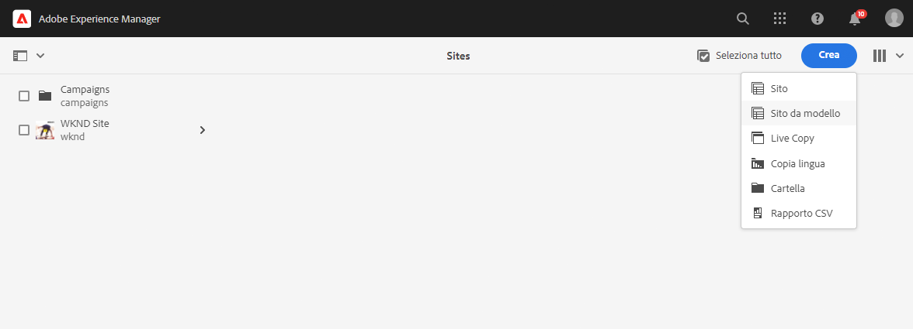
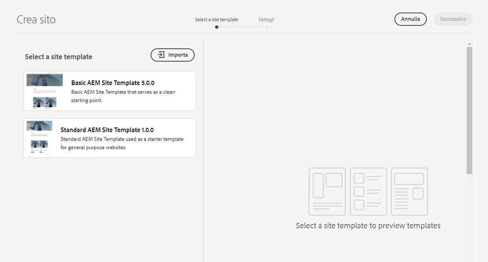
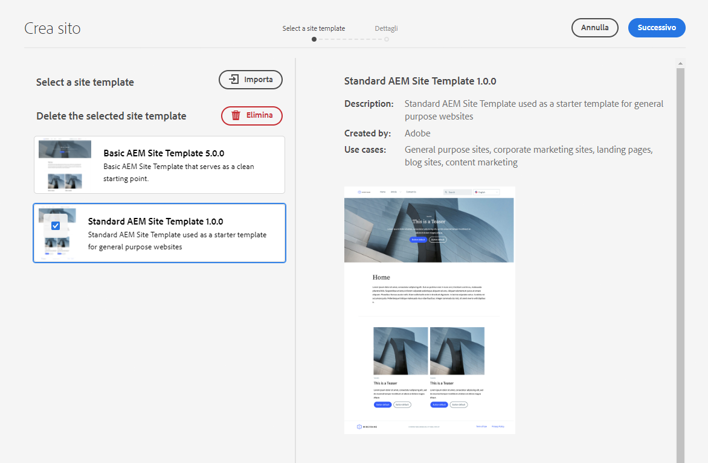
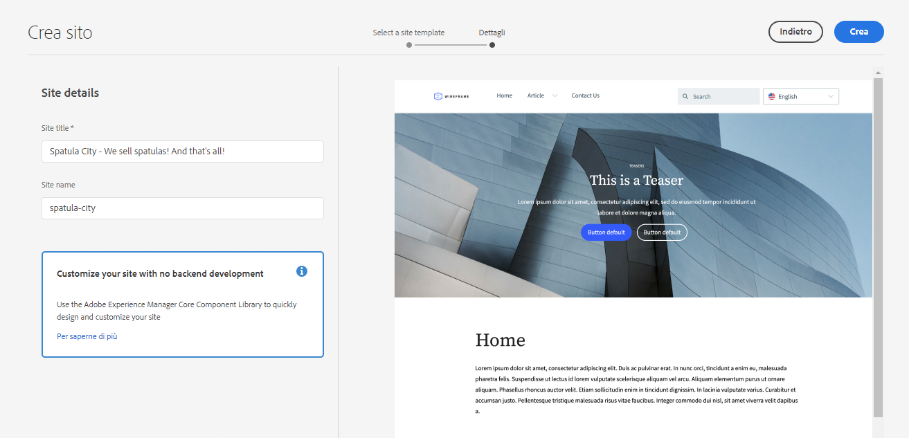
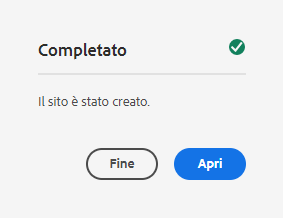
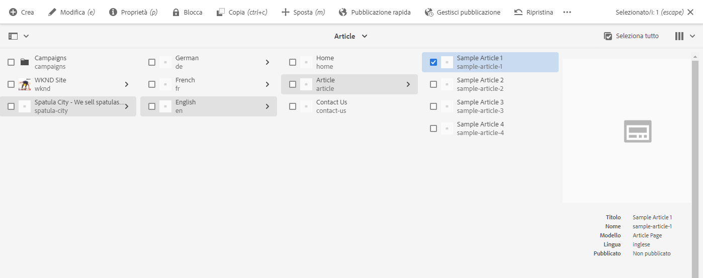

# Creazione di un sito {#creating-site}

Scopri come utilizzare AEM per creare un sito utilizzando i modelli per definire lo stile e la struttura del sito.

## Panoramica {#overview}

Prima che gli autori dei contenuti possano creare pagine con contenuti, è necessario creare il sito. Questo viene generalmente eseguito da un amministratore AEM che definisce la struttura iniziale del sito. L’utilizzo dei modelli di sito rende la creazione del sito veloce e flessibile per i non sviluppatori.

## Struttura di pianificazione del sito {#structure}

Prendi in considerazione lo scopo del tuo sito e i contenuti pianificati con largo anticipo. Questo ti guiderà su come progettare la struttura del sito. Una buona struttura del sito supporta una facile navigazione e l&#39;individuazione dei contenuti per i visitatori del sito e supporta varie funzioni di AEM come la gestione e traduzione multisito [.](/help/sites-cloud/administering/msm-and-translation.md)

## Modelli per siti {#site-templates}

Poiché la struttura del sito è così importante per il successo di un sito, è opportuno disporre di strutture predefinite per distribuire rapidamente un nuovo sito in base a un insieme di standard esistenti. I modelli di sito consentono di combinare i contenuti di base del sito in un pacchetto comodo e riutilizzabile.

Per consentire un rapido avvio del nuovo sito, i modelli di sito generalmente contengono il contenuto e la struttura di base del sito e informazioni sul suo stile. I modelli sono efficaci perché sono riutilizzabili e personalizzabili. Inoltre, poiché è possibile disporre di più modelli durante l’installazione di AEM, è possibile creare siti diversi per soddisfare le varie esigenze aziendali.

>[!TIP]
>
>Per ulteriori dettagli sui modelli di sito, vedere il documento [Modelli di sito.](site-templates.md)

>[!NOTE]
>
>Il modello di sito non deve essere confuso con [&#x200B; modelli di pagina.](/help/sites-cloud/authoring/page-editor/templates.md) I modelli di sito definiscono la struttura complessiva di un sito. Un modello di pagina definisce la struttura e il contenuto iniziale di una singola pagina.

### Modelli di sito forniti da Adobe {#adobe-templates}

{{adobe-templates}}

## Creazione di un sito {#create-site}

L’utilizzo di un modello per creare un sito è semplice.

1. Accedi all’ambiente di authoring di AEM e passa alla console Sites

   * `https://<your-author-environment>.adobeaemcloud.com/sites.html/content`

1. Seleziona **Crea** in alto a destra dello schermo e, dal menu a discesa, seleziona **Sito da modello**.

   

1. Nella procedura guidata Crea sito, seleziona un modello esistente nel pannello a sinistra o in **Importa** nella parte superiore della colonna di sinistra per importare un nuovo modello.

   

   1. Se hai scelto di importare, individua il modello da utilizzare nel browser dei file e seleziona **Carica**.

   1. Una volta caricato, viene visualizzato nell’elenco dei modelli disponibili.

1. Quando si seleziona un modello, vengono visualizzate informazioni sul modello nella colonna di destra. Con il modello desiderato selezionato, seleziona **Avanti**.

   

1. Immetti un titolo per il sito. Puoi specificare un nome per il sito o generarlo dal titolo.

   * Il titolo del sito viene visualizzato nella barra del titolo del browser.
   * Il nome del sito diventa parte dell’URL.
   * Il nome del sito deve rispettare [le convenzioni di denominazione delle pagine di AEM](/help/sites-cloud/authoring/sites-console/organizing-pages.md#page-name-restrictions-and-best-practices).

1. Fornire ulteriori dettagli del sito come richiesto dal modello di sito.

   * Modelli diversi possono richiedere ulteriori dettagli.
   * Ad esempio, i modelli per [progetti Edge Delivery Services](https://www.aem.live/developer/ue-tutorial) richiedono l&#39;archivio GitHub del progetto.

1. Selezionare **Crea** e il sito verrà creato dal modello di sito.

   

1. Nella finestra di dialogo di conferma, seleziona **Fine**.

   

1. Nella console Sites, il nuovo sito è visibile ed è possibile visitarlo per esplorarne la struttura di base definita dal modello.

   

Gli autori dei contenuti possono ora iniziare a creare.

## Personalizzazione del sito {#site-customization}

I modelli sono utili per impostare rapidamente la struttura e lo stile di base di un sito. Tuttavia, la maggior parte dei progetti richiede alcuni stili e personalizzazioni aggiuntivi. I modelli di sito aiutano a separare lo stile del sito, in modo che gli sviluppatori front-end non abbiano bisogno di conoscere AEM per formattare il sito e possano
lavora separatamente e parallelamente ai creatori di contenuti. A seconda del tipo di progetto, questo può assumere due forme.

* Per i progetti con l&#39;authoring delle pagine AEM con Universal Editor e la consegna tramite [Edge delivery](/help/edge/overview.md), tutto lo stile viene eseguito nel progetto GitHub.
   * Per ulteriori informazioni, vedere il documento [Guida introduttiva - Esercitazione per sviluppatori di Universal Editor](https://www.aem.live/developer/ue-tutorial).
* Per i progetti con authoring di pagine AEM tradizionale e consegna tramite [distribuzione pubblicazione](/help/sites-cloud/authoring/author-publish.md), l&#39;amministratore AEM scarica semplicemente il tema del sito e lo fornisce allo sviluppatore front-end che lo personalizza utilizzando i suoi strumenti preferiti e quindi conferma le modifiche nell&#39;archivio del codice AEM, che viene quindi distribuito.
   * Per ulteriori informazioni, consulta il documento [Percorso per la creazione rapida dei siti AEM](/help/journey-sites/quick-site/overview.md).
