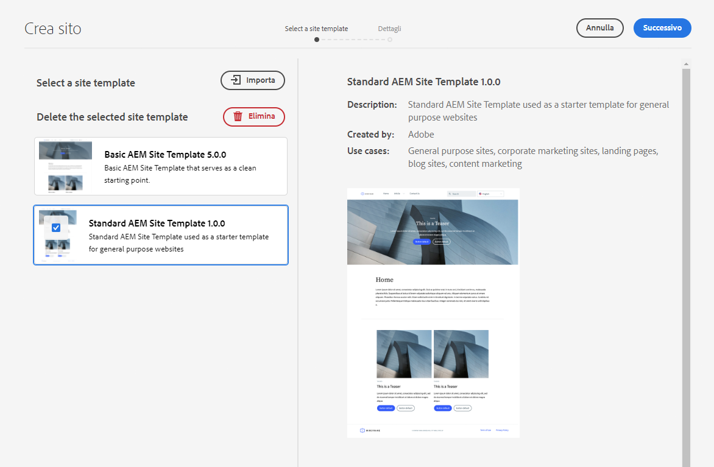

# Modelli per siti {#site-templates}

Scopri come utilizzare i modelli per sito AEM per predefinire la struttura del sito e i contenuti iniziali per poter creare siti in modo rapido.

## Panoramica {#overview}

È opportuno disporre di strutture predefinite per implementare rapidamente un nuovo sito in base a una serie di standard esistenti. I modelli di sito consentono di combinare i contenuti di base del sito in un pacchetto comodo e riutilizzabile.

I modelli di sito generalmente contengono i contenuti e la struttura del sito di base e informazioni sullo stile del sito, note come [tema del sito,](site-themes.md) per creare rapidamente un nuovo sito. Gli amministratori selezionano un modello di sito su cui basare il sito [durante il processo di creazione dello stesso.](create-site.md)

I modelli sono efficaci perché sono riutilizzabili e personalizzabili. Inoltre, poiché è possibile disporre di più modelli durante l’installazione di AEM, è possibile creare siti diversi per soddisfare le varie esigenze aziendali.

>[!NOTE]
>
>I modelli di sito AEM non devono essere confusi con i [modelli di pagina](/help/sites-cloud/authoring/page-editor/templates.md). I modelli di sito definiscono la struttura complessiva di un sito. Un modello di pagina definisce la struttura e il contenuto iniziale di una singola pagina.
>
>I modelli di sito AEM non devono essere confusi con i [temi del sito AEM](site-themes.md). I temi del sito AEM contengono solo le informazioni sullo stile di un sito AEM. I modelli del sito AEM definiscono la struttura del sito e il contenuto iniziale e inoltre contengono un tema del sito AEM per consentire una [creazione rapida del sito](create-site.md).

## Aggiunta di un modello di sito a AEM {#adding}

È possibile aggiungere più modelli a AEM che possono quindi essere utilizzati per [creare siti](create-site.md).

1. Accedi all’ambiente di authoring di AEM e passa alla console Sites

   * `https://<your-author-environment>.adobeaemcloud.com/sites.html/content`

1. Seleziona **Crea** in alto a destra dello schermo e, dal menu a discesa, seleziona **Sito da modello**.

   

1. Nella procedura guidata Crea sito, seleziona **Importa** nella parte superiore della colonna a sinistra.

   

1. Nel browser dei file individuare il modello che si desidera utilizzare e selezionare **Carica**.

1. Una volta caricato, viene visualizzato nell’elenco dei modelli disponibili.

Il modello viene caricato e può essere utilizzato per [creare nuovi siti](create-site.md).

Quando si seleziona un modello esistente, nella colonna di destra vengono visualizzate le informazioni sul modello.

## Struttura del modello del sito {#structure}

I modelli di sito sono semplicemente pacchetti con una struttura logica che riflette chiaramente lo scopo del contenuto del pacchetto. Un modello di sito presenta la seguente struttura.

* `files`: cartella con il kit dell&#39;interfaccia utente, file XD ed eventualmente altri file
* `previews`: cartella con le schermate del modello di sito
* `site`: pacchetto di contenuti del contenuto copiato per ogni sito creato da questo modello, ad esempio i modelli di pagina, le pagine e così via.
* `theme`: origini del [tema del sito](site-themes.md) per modificare l&#39;aspetto del sito, inclusi CSS, JavaScript e così via.

## Modello di sito standard {#standard-site-template}

Adobe fornisce un modello di riferimento sulle best practice da utilizzare come base per la creazione di modelli personalizzati. [Il modello di sito standard è disponibile su GitHub.](https://github.com/adobe/aem-site-template-standard)

[L’ultima versione del modello di sito standard](https://github.com/adobe/aem-site-template-standard/releases) può essere scaricata e utilizzata direttamente per la [creazione di nuovi siti](create-site.md).

## Sviluppo di modelli di sito {#developing-templates}

Adobe fornisce AEM Site Template Builder come set di script per la creazione di nuovi modelli di sito.

[Il generatore di modelli del sito AEM è disponibile su GitHub insieme alla documentazione di utilizzo](https://github.com/adobe/aem-site-template-builder). Per personalizzare il [tema del sito](site-themes.md) è necessaria l’esperienza di sviluppatore front-end e per la struttura e il contenuto del sito è necessaria la conoscenze di AEM per gli sviluppatori.
