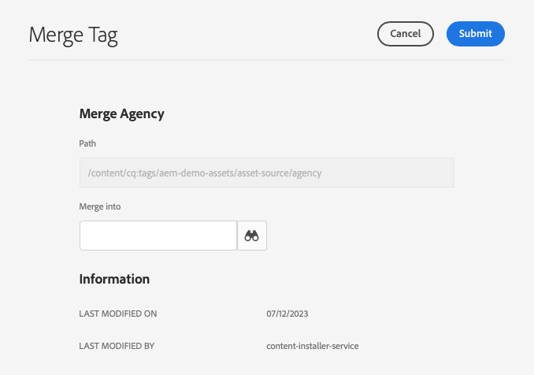

# Amministrazione dei tag {#administering-tags}

I tag sono un metodo intuitivo per classificare il contenuto. Possono essere considerate come parole chiave o etichette (metadati) che consentono di trovare più rapidamente il contenuto.

In Adobe Experience Manager (AEM), un tag può essere una proprietà di:

* Un nodo di contenuto per una pagina
   * Consulta il documento [Utilizzo dei tag](/help/sites-cloud/authoring/features/tags.md) per ulteriori informazioni.
* Un nodo di metadati per una risorsa
   * Consulta il documento [Gestione dei metadati per le risorse digitali](/help/assets/manage-metadata.md) per ulteriori informazioni.

>[!TIP]
>
>È consigliabile ridurre al minimo il numero di tag relativi alle stesse idee. Ad esempio, se gestisci i contenuti per un negozio di alimentari all&#39;aperto, probabilmente non avrai bisogno di un tag per entrambi **calzature** e **scarpe**.

## Funzioni tag {#tag-features}

I tag offrono funzioni affidabili per organizzare e gestire i contenuti.

* I tag possono essere raggruppati in vari spazi dei nomi.
   * Gli spazi dei nomi possono essere considerati gerarchie che consentono la creazione di tassonomie.
   * Queste tassonomie sono globali in tutta l&#39;AEM.
* I tag possono essere applicati dagli autori e utilizzati dai visitatori del sito.
* Indipendentemente dall’autore, tutte le forme di tag sono disponibili per la selezione, sia durante l’assegnazione a una pagina che durante la ricerca.
* I tag vengono utilizzati da [Componente Elenco](https://experienceleague.adobe.com/docs/experience-manager-core-components/using/wcm-components/list.html) per generare elenchi dinamici in base ai tag selezionati.

## Requisiti dei tag {#requirements}

Sono disponibili alcuni dettagli tecnici da tenere a mente durante la creazione e la gestione dei tag.

* I tag devono essere univoci all’interno di uno spazio dei nomi specifico.
* Il nome di un tag non può includere delimitatori di tag:
   * Due punti (`:`) - Delimita il tag namespace
   * Barra (`/`) - Delimita i tag secondari
* Se il titolo di un tag include delimitatori di tag, questi verranno eliminati nell’interfaccia utente.
* I tag possono essere creati e la loro tassonomia può essere modificata dai membri del `tag-administrators` gruppo e membri con diritti di modifica per `/content/cq:tags`.
   * Un tag che contiene tag figlio viene definito tag contenitore.
   * Un tag che non è un tag contenitore viene definito tag foglia.
   * Uno spazio dei nomi dei tag può essere un tag foglia o un tag contenitore.

Per ulteriori dettagli tecnici sul funzionamento dei tag, consulta [Framework di assegnazione tag AEM](/help/implementing/developing/introduction/tagging-framework.md).

## Console per assegnazione tag {#tagging-console}

La console dei tag consente di creare e gestire i tag e le relative tassonomie. Puoi utilizzare la console dei tag per gestire i tag:

* Raggruppandoli in spazi dei nomi.
* Analisi dell&#39;utilizzo dei tag esistenti prima di crearne di nuovi.
* Riorganizzazione dei tag senza disconnettere il tag dal contenuto a cui si fa attualmente riferimento.

Per accedere alla console dei tag:

1. Accedi a un ambiente di authoring con privilegi di amministratore.
1. Nel menu di navigazione globale seleziona **`Tools`** > **`General`** >
   **`Tagging`**.

## Creazione di nuovi tag {#creating-new-tags}

Esistono diversi passaggi per creare e utilizzare i tag per organizzare i contenuti.

1. [Creare uno spazio dei nomi per i tag](#creating-namespaces) (o sceglierne uno esistente da riutilizzare).
1. [Crea un nuovo tag.](#creating-tags)
1. [Pubblica il tag.](#publishing-tags)

### Creazione di spazi dei nomi {#creating-namespaces}

Per organizzare altri tag viene utilizzato uno spazio dei nomi. Può essere considerato come il tag di livello più basso e viene in genere utilizzato per raggruppare altri tag.

1. Per creare uno spazio dei nomi, apri [console di assegnazione tag](#tagging-console) e seleziona la **Crea** nella barra degli strumenti e quindi **Crea spazio dei nomi**.

   

1. Fornisci le informazioni necessarie.

   * **Titolo** - Titolo dello spazio dei nomi visualizzato dall’utente nell’interfaccia utente (facoltativo)
   * **Nome** - Se non viene specificato alcun nome, viene creato un nome di nodo valido dalla **Titolo**. Consulta il documento [Framework di assegnazione tag AEM](/help/implementing/developing/introduction/tagging-framework.md#tagid) per ulteriori informazioni.
   * **Descrizione** - Descrizione dello spazio dei nomi (facoltativo)

1. Una volta inserite le informazioni richieste, seleziona **Crea**.

Viene creato lo spazio dei nomi. Nella console dei tag, gli spazi dei nomi si trovano al livello più basso (nella colonna all’estrema sinistra della console) e sono rappresentati da icone di cartelle, che riflettono la loro natura di &quot;contenitore&quot; o raggruppamento di altri tag.

Ora puoi [creare nuovi tag](#creating-tags) in questo spazio dei nomi o [gestisci i tag esistenti.](#managing-tags)

Uno spazio dei nomi non deve necessariamente contenere tag secondari. Poiché uno spazio dei nomi è di per sé un tag, può essere utilizzato per organizzare il contenuto come qualsiasi altro tag. Tuttavia, per continuare a creare una tassonomia dei tag strutturata, è possibile [crea tag secondari](#creating-tags) in quello spazio dei nomi in base ai requisiti del progetto.

### Creazione di tag {#creating-tags}

I tag vengono generalmente aggiunti agli spazi dei nomi.

1. Per creare un tag, apri [console di assegnazione tag.](#tagging-console)

1. Seleziona lo spazio dei nomi in cui desideri creare il tag. In alternativa, seleziona un altro tag per creare un tag secondario al di sotto di esso.

1. Seleziona la **Crea** sulla barra degli strumenti e quindi **Crea tag**.

1. Il **Crea tag** viene visualizzata una finestra di dialogo. Fornisci le informazioni richieste per il nuovo tag.

   * **Titolo** - Titolo da visualizzare per il tag (obbligatorio)
   * **Nome** - Nome del tag (obbligatorio). Se non viene specificato, viene creato un nome di nodo valido dal **Titolo**. Consulta [TagID](/help/implementing/developing/introduction/tagging-framework.md#tagid).
   * **Descrizione** - Una descrizione del tag
   * **Percorso tag** : viene impostato automaticamente sullo spazio dei nomi (o tag) selezionato nella console di assegnazione tag. Per aggiornare manualmente questo valore, tocca o fai clic sull’icona del selettore del percorso.

   

1. Seleziona **Invia**.

Il tag viene creato e la console viene aggiornata per mostrare il nuovo tag.

I tag consentono di creare in modo flessibile la propria tassonomia in base alle esigenze organizzative.

* Puoi creare tag secondari di tag esistenti selezionando il tag principale nella console prima di creare il nuovo tag.
* Se crei un tag senza selezionare uno spazio dei nomi o un altro tag, viene effettivamente creato uno spazio dei nomi.

### Pubblicazione dei tag {#publishing-tags}

Come per la creazione di qualsiasi altro contenuto in AEM, dopo aver creato un tag (o namespace), questo esiste solo nell’ambiente di authoring. Affinché i tag siano disponibili per gli utenti, devi pubblicarli.

1. Per pubblicare un tag, apri [console di assegnazione tag.](#tagging-console)

1. Seleziona il tag o i tag da pubblicare e, nella barra degli strumenti, seleziona **Pubblica**.

   

1. Il **Pubblica tag** richiede una conferma per la pubblicazione dei tag selezionati. Seleziona **Pubblica**.

   

1. L’azione di pubblicazione viene confermata con un **Completato** .

   

I tag selezionati sono in coda per la pubblicazione. Analogamente al contenuto della pagina, vengono pubblicati solo i tag selezionati, indipendentemente dal fatto che contengano o meno tag secondari.

Per pubblicare un’intera tassonomia (uno spazio dei nomi e tag secondari), la best practice prevede la creazione di un’ [pacchetto](/help/implementing/developing/tools/package-manager.md) dello spazio dei nomi (vedi [Nodo principale tassonomia](/help/implementing/developing/introduction/tagging-framework.md#taxonomy-root-node)).

<!--
Be sure to [apply permissions](#setting-tag-permissions) to the namespace before creating the package.
-->

## Gestione dei tag {#managing-tags}

Puoi eseguire diverse azioni sui tag e sugli spazi dei nomi esistenti per gestirli e organizzarli. È sufficiente selezionare un tag o uno spazio dei nomi nel [console di assegnazione tag](#tagging-console) per visualizzare nella barra degli strumenti le azioni disponibili.

* [Visualizza proprietà](#viewing-tag-properties)
* [Modifica](#editing-tags)
* [Annulla pubblicazione](#unpublishing-tags)
* [Riferimenti](#viewing-tag-references)
* [Spostare](#moving-tags)
* [Unisci](#merging-tags)
* [Eliminare](#deleting-tags)

Quando lo spazio sulla barra degli strumenti è sufficiente, dietro l’icona con i puntini di sospensione sono disponibili opzioni aggiuntive.

### Visualizzazione delle proprietà dei tag {#viewing-tag-properties}

Quando nella console dei tag è selezionato un singolo tag, uno spazio dei nomi o un altro tag, i dettagli di base del tag selezionato, ad esempio l’ora dell’ultima modifica e dell’ultima pubblicazione, vengono visualizzati nella colonna a sinistra della colonna del tag.

Per visualizzare ulteriori dettagli sul tag, tra cui chi l’ha pubblicato per ultimo e quando, passa dalla console al **Proprietà** visualizzazione.

1. Per visualizzare le proprietà di un tag, apri [console di assegnazione tag.](#tagging-console)

1. Seleziona il tag di cui desideri visualizzare le proprietà e, nella barra a sinistra, seleziona **Proprietà**.

   

1. Le proprietà dettagliate del tag selezionato vengono visualizzate nella barra a sinistra.

   

Per ulteriori dettagli sulla selezione delle modalità di visualizzazione e della barra, consulta [Operazioni di base](/help/sites-cloud/authoring/getting-started/basic-handling.md#rail-selector).

### Modifica dei tag {#editing-tags}

I tag e gli spazi dei nomi possono essere modificati dopo la creazione.

1. Per modificare un tag, apri [console di assegnazione tag.](#tagging-console)

1. Seleziona il tag da modificare e, nella barra degli strumenti, seleziona **Modifica**.

1. Apporta le modifiche desiderate. È possibile modificare:

   * **Titolo**
   * **Descrizione**
   * [**Localizzazione**](#managing-tags-in-different-languages)

1. Dopo aver apportato le modifiche, seleziona **Invia**.

Per informazioni dettagliate sull’aggiunta delle traduzioni per lingua, consulta la sezione su [Gestione dei tag in lingue diverse](#managing-tags-in-different-languages).

Se le modifiche apportate riguardano un tag già pubblicato, potrebbe essere utile [ripubblicarlo.](#publishing-tags)

### Annullamento della pubblicazione dei tag {#unpublishing-tags}

Per disattivare i tag nell’istanza di authoring e rimuoverli dall’istanza di pubblicazione, puoi annullarne la pubblicazione.

1. Per annullare la pubblicazione di un tag, apri [console di assegnazione tag.](#tagging-console)

1. Seleziona il tag o i tag da annullare la pubblicazione e, nella barra degli strumenti, seleziona **Annulla pubblicazione**.

   

1. Il **Annulla pubblicazione tag** richiede una conferma per la pubblicazione dei tag selezionati. Seleziona **Pubblica**.

   

1. L’azione di annullamento della pubblicazione viene confermata con un **Completato** .

   

I tag selezionati sono in coda per l&#39;annullamento della pubblicazione. Se il tag selezionato è un tag contenitore, tutti i relativi tag figlio verranno disattivati nell’ambiente di authoring e rimossi dall’ambiente di pubblicazione.

### Visualizzazione dei riferimenti dei tag {#viewing-tag-references}

Può essere utile vedere a quale contenuto viene applicato un particolare tag. Per farlo, utilizza **Riferimenti** nella console dei tag.

1. Per visualizzare i riferimenti di un tag, aprite [console di assegnazione tag.](#tagging-console)

1. Seleziona il tag di cui desideri visualizzare i riferimenti e, nella barra a sinistra, seleziona **Riferimenti**.

   

1. Il numero totale di riferimenti per il tag selezionato viene visualizzato nella barra a sinistra.

   

1. Seleziona il numero di riferimenti tag per visualizzare l’elenco dettagliato dei contenuti assegnati al tag.

   

Passa il mouse o seleziona un contenuto con riferimento nell’elenco per visualizzare il percorso completo del contenuto.

Per ulteriori dettagli sulla selezione delle modalità di visualizzazione e della barra, consulta [Operazioni di base](/help/sites-cloud/authoring/getting-started/basic-handling.md#rail-selector).

### Spostamento dei tag {#moving-tags}

Può essere necessario riorganizzare la tassonomia dei tag spostando un tag in una nuova posizione o rinominandolo.

>[!TIP]
>
>È consigliabile che solo gli amministratori possano spostare e rinominare i tag.

1. Per spostare o rinominare un tag, aprire [console di assegnazione tag.](#tagging-console)

1. Seleziona il tag da spostare o rinominare e fai clic su **Sposta** nella barra degli strumenti.

1. In **Sposta tag** , specifica la proprietà da modificare.

   * **Rinomina in** - Nuovo nome da assegnare al tag
      * Questo campo viene precompilato con il nome corrente del tag.
      * Lascia invariato se desideri solo spostare il tag e non rinominarlo.
   * **Sposta in** - Posizione in cui si desidera spostare il tag
      * Questo campo viene precompilato con la posizione corrente del tag.
      * Lascia invariato se desideri rinominare solo il tag e non spostarlo.

   

1. Seleziona **Invia**.

Il tag viene rinominato e/o spostato nella nuova posizione. Quando il tag selezionato è un tag contenitore, lo spostamento del tag comporta lo spostamento anche di tutti i tag figlio.

### Unione di tag {#merging-tags}

Se la tassonomia dei tag include duplicati o tag simili, può essere utile unirli. Quando il tag `A` viene unito nel tag `B`, tutte le pagine con tag `A` diventa taggato con tag `B` tag e `A` non è più disponibile per gli autori.

1. Per unire due tag, apri [console di assegnazione tag.](#tagging-console)

1. Seleziona il tag da unire in un altro tag, quindi fai clic su **Unisci** nella barra degli strumenti.

1. In **Unisci tag** , seleziona la **Sfoglia** icona del **Unisci in** per specificare in quale tag si desidera unire il tag selezionato.

   

1. Seleziona **Invia**.

Il tag selezionato nella console viene unito al tag specificato nella finestra di dialogo. Quando un tag di riferimento viene spostato o unito, il tag non viene fisicamente eliminato in modo tale da poter mantenere i riferimenti. Consulta [Framework di assegnazione tag AEM](/help/implementing/developing/introduction/tagging-framework.md#moving-and-merging-tags) per ulteriori informazioni.

### Eliminazione dei tag {#deleting-tags}

Se la tassonomia dei tag cambia e non è necessario specificare un tag o uno spazio dei nomi, è possibile eliminarlo.

1. Per eliminare un tag, apri [console di assegnazione tag.](#tagging-console)

1. Seleziona il tag da eliminare, quindi fai clic su **Elimina** nella barra degli strumenti.

1. Il **Elimina tag** richiede una conferma per eliminare i tag selezionati. Seleziona **Elimina**.

   

1. L’AEM verifica che non sia presente alcun riferimento al tag.

   1. Se non viene trovato alcun riferimento, l&#39;AEM chiede la conferma finale per l&#39;eliminazione. Seleziona **Elimina**

      

   1. Se vengono trovati dei riferimenti, l&#39;AEM li presenta e chiede una conferma finale per la loro cancellazione.

      

I tag selezionati vengono eliminati e rimossi in modo permanente dall’ambiente di authoring. Se il tag è stato pubblicato, viene rimosso anche dall’ambiente di pubblicazione. Se il tag selezionato è un tag contenitore, vengono rimossi anche tutti i relativi tag figlio.

<!--

## Setting Tag Permissions {#setting-tag-permissions}

Tag permissions are ['secure (by default)'](/help/sites-administering/production-ready.md); a best practice for the publish environment that requires read permission to be explicitly allowed for tags. Bascially, this is done by creating a package of the Tag Namespace after permissions have been set on author, and installing the package on all publish instances.

* on author instance

    * sign in with administrative privileges
    * access the [Security Console](/help/sites-administering/security.md#accessing-user-administration-with-the-security-console),

        * for example, browse to http://localhost:4502/useradmin

    * in the left pane, select the group (or user) for which [read permission](/help/sites-administering/security.md#permissions) is to be granted
    * in the right pane, locate the **Path **to the Tag Namespace

        * for example, `/content/cq:tags/mycommunity`

    * select the `checkbox`in the **Read** column
    * select **Save**

* ensure all publish instances have same permissions

    * one approach is to [create a package](/help/sites-administering/package-manager.md#package-manager) of the namespace on author

        * on `Advanced` tab, for `AC Handling` select `Overwrite`

    * replicate the package

        * choose `Replicate` from package manager

-->

## Gestione dei tag in lingue diverse {#managing-tags-in-different-languages}

Il `title` di un tag può essere tradotta in più lingue. Una volta tradotto, il titolo del tag appropriato può essere visualizzato in base all’utente o alla lingua del contenuto.

Supponiamo di avere un tag denominato `Animals` che vogliamo tradurre in tedesco e francese.

1. Apri [console di assegnazione tag.](#tagging-console)

1. Seleziona il tag da tradurre, quindi fai clic su **Modifica** nella barra degli strumenti.

1. In **Modifica tag** nella finestra di dialogo **Localizzazione** , selezionare la lingua di destinazione, ad esempio il tedesco.

1. In **Tedesco** che viene visualizzato, inserisci il titolo tradotto.

1. Ripeti i due passaggi precedenti per il francese.

   

1. Seleziona **Invia**.

Per le pagine di contenuto, la lingua scelta per il tag viene presa dalla lingua della pagina, se disponibile.

Tuttavia, nell’ambiente di authoring, AEM utilizza l’impostazione della lingua utente. Quindi nella console di assegnazione tag, per `Animals` tag, `Animaux` verrebbe visualizzato per un utente che imposta la lingua sul francese nelle proprietà utente.

Per aggiungere una nuova lingua alla finestra di dialogo, consulta il documento [Creazione di tag nelle applicazioni AEM](/help/implementing/developing/introduction/tagging-applications.md#adding-a-new-language-to-the-edit-tag-dialog)

>[!TIP]
>
>Per ulteriori informazioni sulle funzioni di localizzazione dell’AEM, consulta [Traduzione Di Contenuti Per Siti Multilingue](/help/sites-cloud/administering/translation/overview.md).
