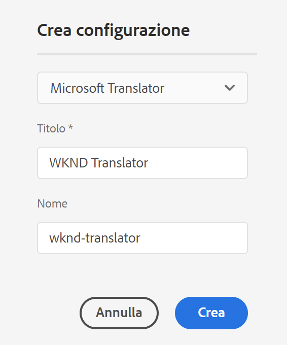
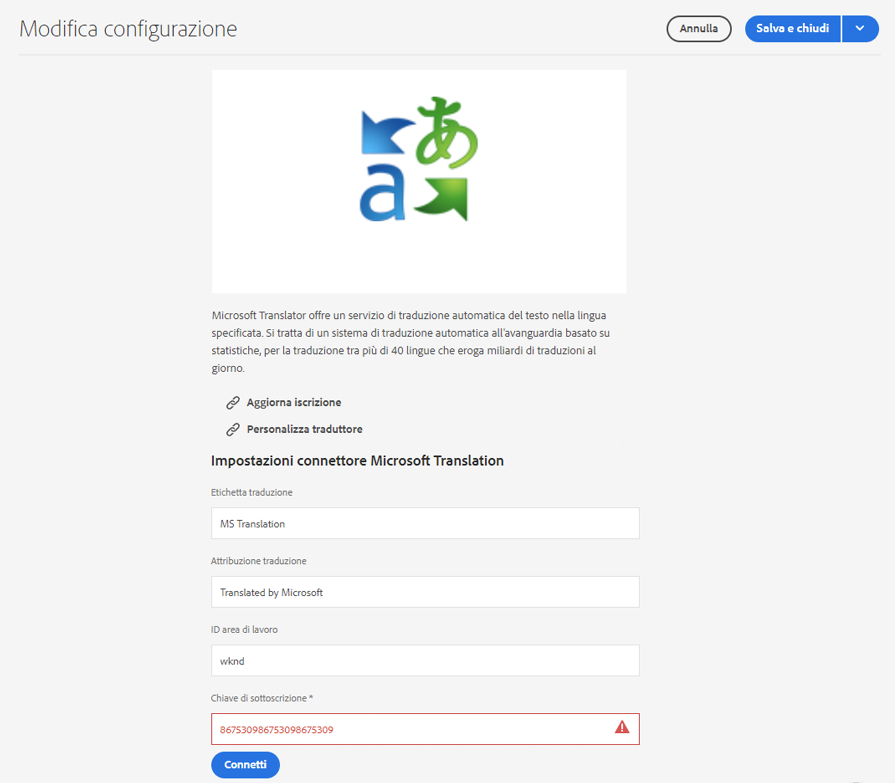

# Connessione a Microsoft Translator {#connecting-to-microsoft-translator}

Crea una configurazione per il servizio cloud [Microsoft Translator](https://hub.microsofttranslator.com) per utilizzare il tuo account Microsoft Translation per tradurre AEM contenuto o risorse di pagina.

>[!NOTE]
>
>AEM fornisce un account di prova di Microsoft Translation che consente un massimo di 2 000 000 caratteri tradotti gratuiti al mese. Per ottenere una sottoscrizione account adeguata per i sistemi di produzione, vedere [Aggiornamento della configurazione della licenza di prova di Microsoft Translator](#upgrading-the-microsoft-translator-trial-license-configuration).

| Proprietà | Descrizione |
|---|---|
| Etichetta traduzione | Nome visualizzato del servizio di traduzione |
| Attribuzione traduzione | (Facoltativo) Per i contenuti generati dall’utente, l’attribuzione visualizzata accanto al testo tradotto, ad esempio `Translations by Microsoft` |
| ID area di lavoro | (Facoltativo) L&#39;ID del motore Microsoft Translator personalizzato da utilizzare |
| Chiave di sottoscrizione | Chiave di abbonamento Microsoft per Microsoft Translator |

Dopo aver creato la configurazione, è necessario [attivarla](#activating-the-translator-service-configurations).

Nella procedura seguente viene creata una configurazione di Microsoft Translator.

1. Nel pannello di navigazione [fai clic o tocca ](/help/sites-cloud/authoring/getting-started/basic-handling.md#first-steps) Strumenti **Strumenti** -> **Cloud Services** -> **Cloud Services di traduzione**.
1. Passa alla posizione in cui desideri creare la configurazione. Normalmente si trova nella directory principale del sito o può essere una configurazione globale predefinita.
1. Tocca o fai clic sul pulsante **Crea** .
1. Definisci la configurazione.
   1. Seleziona **Microsoft Translator** nel menu a discesa.
   1. Digita un titolo per la configurazione. Il titolo identifica la configurazione sia nella console Cloud Services che negli elenchi a discesa delle proprietà della pagina.
   1. Facoltativamente, digita un nome da utilizzare per il nodo del repository che memorizza la configurazione.

   

1. Fai clic su **Crea**.
1. Nella finestra **Modifica configurazione**, fornisci i valori per il servizio di traduzione descritto nella tabella precedente.

   

1. Tocca o fai clic su **Connetti** per verificare la connessione.
1. Tocca o fai clic su **Salva e chiudi**.

## Aggiornamento della configurazione della licenza di prova di Microsoft Translator {#upgrading-the-microsoft-translator-trial-license-configuration}

Le pagine di configurazione di Microsoft Translation forniscono un comodo collegamento al sito Web Microsoft per ottenere un abbonamento a un account adeguato per i sistemi di produzione.

1. Nel pannello di navigazione [tocca o fai clic su **Strumenti** -> **Cloud Services** -> **Cloud Services di traduzione**.](/help/sites-cloud/authoring/getting-started/basic-handling.md#first-steps)
1. Tocca o fai clic sulla configurazione di Microsoft Translator esistente.
1. Tocca o fai clic su **Modifica**.
1. Nella finestra **Modifica configurazione**, tocca o fai clic su **Aggiorna sottoscrizione**. Viene visualizzata una pagina Web Microsoft con ulteriori dettagli sul servizio.

## Personalizzazione del motore di traduzione Microsoft {#customizing-your-microsoft-translator-engine}

Le pagine di configurazione di Microsoft Translation forniscono un comodo collegamento al sito Web Microsoft per personalizzare il motore Microsoft Translator.

1. Nel pannello di navigazione [tocca o fai clic su **Strumenti** -> **Cloud Services** -> **Cloud Services di traduzione**.](/help/sites-cloud/authoring/getting-started/basic-handling.md#first-steps)
1. Tocca o fai clic sulla configurazione di Microsoft Translator esistente.
1. Tocca o fai clic su **Modifica**.
1. Nella finestra **Modifica configurazione**, tocca o fai clic su **Personalizza traduttore**. Utilizzare la pagina Web Microsoft visualizzata per personalizzare il servizio.

## Attivazione delle configurazioni del servizio di traduzione {#activating-the-translator-service-configurations}

Devi attivare le configurazioni del servizio cloud per supportare i contenuti tradotti replicati nell’istanza di pubblicazione. Utilizzare il metodo di [pubblicazione di una struttura](/help/sites-cloud/authoring/fundamentals/publishing-pages.md#publishing-and-unpublishing-a-tree) per attivare i nodi del repository che memorizzano le configurazioni di Microsoft Translator. I nodi si trovano sotto i seguenti nodi padre:

* `/libs/settings/cloudconfigs/translation/msft-translation`
