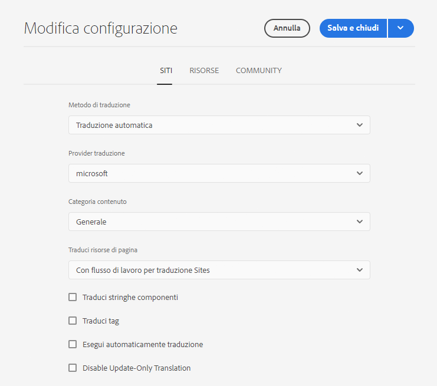
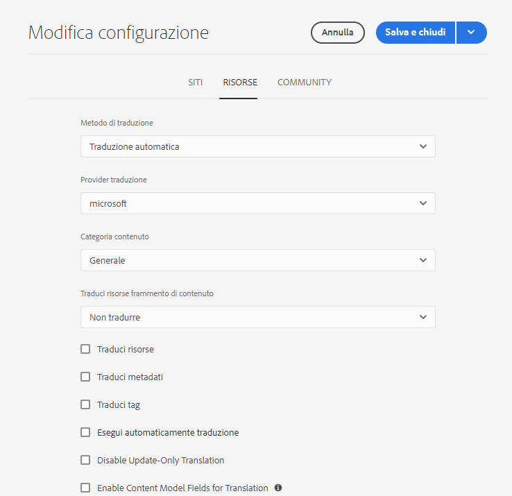

# Configurazione del framework di integrazione della traduzione {#configuring-the-translation-integration-framework}

Il Translation Integration Framework si integra con servizi di traduzione di terze parti per orchestrare la traduzione dei contenuti AEM. Comporta tre passaggi fondamentali.

1. [Connessione al fornitore di servizi di traduzione.](#connecting-to-a-translation-service-provider)
1. [Creare una configurazione del framework di integrazione della traduzione.](#creating-a-translation-integration-configuration)
1. [Associa le configurazioni cloud alle pagine.](#configuring-pages-for-translation)

Per una panoramica delle funzioni di traduzione dei contenuti di AEM, vedi [Traduzione di contenuti per siti multilingue](overview.md).

>[!TIP]
>
>Se non hai ancora tradotto i contenuti, consulta il [Percorso di traduzione Sites](/help/journey-sites/translation/overview.md), per una guida attraverso la traduzione dei contenuti AEM Sites tramite i potenti strumenti di traduzione di AEM, ideali per chi non ha esperienza di AEM o di traduzione.

## Connessione a un fornitore di servizi di traduzione {#connecting-to-a-translation-service-provider}

Crea una configurazione cloud che connette AEM al provider di servizi di traduzione. AEM include la possibilità di [connettersi a Microsoft® Translator](connect-ms-translator.md) per impostazione predefinita.

I seguenti fornitori di servizi di traduzione forniscono un’implementazione dell’API AEM per i progetti di traduzione.

* [Microsoft](connect-ms-translator.md)
* [Translations.com](https://exchange.adobe.com/experiencecloud.details.90104.globallink-connect-plus-for-aem.html) (Adobe Exchange Premier Partner)
* [Clay Tablet Technologies](https://exchange.adobe.com/experiencecloud.details.90064.clay-tablet-translation-for-experience-manager.html)
* [Lionbridge](https://exchange.adobe.com/experiencecloud.details.100064.lionbridge-connector-for-experience-manager-63.html)
* [Memsource](https://exchange.adobe.com/experiencecloud.details.103166.memsource-connector-for-adobe-experience-manager.html)
* [Cloudwords](https://exchange.adobe.com/experiencecloud.details.90019.html)
* [XTM Cloud](https://exchange.adobe.com/experiencecloud.details.105037.xtm-connect-for-adobe-experience-manager.html)
* [Lingotek](https://exchange.adobe.com/experiencecloud.details.90088.lingotek-collaborative-translation-platform.html)
<!-- THIS URL IS 404 * [RWS](https://partners.adobe.com/exchangeprogram/experiencecloud/exchange.details.108277.html) -->
* [Smartling](https://www.smartling.com/software/integrations/adobe-experience-manager/)
* [Systran](https://exchange.adobe.com/experiencecloud.details.90233.systran-for-adobe-experience-manager.html)

Dopo aver installato un pacchetto di connettori, puoi crearne una configurazione cloud. In genere, è necessario fornire le credenziali per l&#39;autenticazione con il servizio di traduzione. Per informazioni sull&#39;aggiunta di una configurazione cloud per il connettore Microsoft® Translator, vedere [Integrazione con Microsoft® Translator](connect-ms-translator.md).

Se necessario, è possibile creare più configurazioni cloud per lo stesso connettore. Ad esempio, crea una configurazione per ciascuno degli account o dei progetti che hai con lo stesso fornitore.

Dopo aver configurato una connessione, potete creare la configurazione del Translation Integration Framework che la utilizza.

## Creazione di una configurazione dell’integrazione di traduzione {#creating-a-translation-integration-configuration}

Crea una configurazione del framework di integrazione della traduzione in modo da poter specificare come tradurre il contenuto. La configurazione include le seguenti informazioni:

* Quale fornitore di servizi di traduzione utilizzare
* Se deve essere eseguita la traduzione umana o automatica
* Ad esempio, se tradurre altri contenuti associati a una pagina o a una risorsa, come i tag.

Dopo aver creato una configurazione del framework, associa la configurazione cloud alle pagine che desideri tradurre. Quando il processo di traduzione viene avviato, il flusso di lavoro di traduzione procede in base alla configurazione del framework associato.

Quando diverse sezioni del sito Web hanno requisiti di traduzione diversi, crea di conseguenza configurazioni di framework multiple. Ad esempio, un sito Web multilingue potrebbe includere copie in lingua inglese, spagnola e giapponese. Il proprietario del sito utilizza due diversi fornitori di servizi di traduzione per le versioni in spagnolo e giapponese. Pertanto, sono attive due configurazioni del framework. Ogni configurazione utilizza un provider di servizi di traduzione diverso.

Dopo aver configurato un Translation Integration Framework, puoi [associarlo alle pagine](preparation.md) che lo usano.

>[!TIP]
>
>Per una panoramica delle funzioni di traduzione dei contenuti di AEM, vedi [Traduzione di contenuti per siti multilingue](overview.md).

Una singola configurazione del framework controlla come vengono tradotti il contenuto e le risorse della pagina. Per creare una configurazione di traduzione:

1. Nell&#39;menu di navigazione [globale,](/help/sites-cloud/authoring/basic-handling.md#global-navigation) seleziona **Strumenti > Cloud Services Cloud Services** Traduzione.
1. Passa alla posizione in cui desideri creare la configurazione nella struttura del contenuto. Questo è spesso basato su un sito specifico o può essere globale.
1. Fornire le seguenti informazioni nei campi e quindi selezionare **Crea**.:
   1. Seleziona **Tipo di configurazione** nel menu a discesa.
   1. Inserisci un **Titolo** per la configurazione. Il **Titolo** identifica la configurazione nella console **Cloud Services** così come negli elenchi a discesa delle proprietà della pagina.
   1. Facoltativamente, digita un **Nome** da utilizzare per il nodo dell’archivio che memorizza la configurazione.
1. **Nella finestra Configurazione** Modifica, configurare le proprietà nelle **schede Sites** e Assets **, quindi selezionare** Salva e **Chiudi**.

### Proprietà di configurazione Sites {#sites-configuration-properties}

La scheda **Sites** controlla come viene eseguita la traduzione del contenuto della pagina.

| Proprietà | Descrizione |
|---|---|
| Metodo di traduzione | Questa proprietà definisce il metodo di traduzione applicato dal framework per il contenuto del sito: - Traduzione automatica: il fornitore di traduzione esegue la traduzione utilizzando la traduzione automatica in tempo reale. - Traduzione umana: il contenuto viene inviato al team di traduttori del fornitore di traduzione. - Non tradurre: il contenuto non viene inviato per la traduzione. Questo consente di saltare alcune parti di contenuto che non sarebbero tradotte, ma che potrebbero essere aggiornate con i contenuti più recenti. |
| Provider traduzione | Questa proprietà definisce il fornitore di traduzione per eseguire la traduzione. Il fornitore viene visualizzato nell’elenco quando è installato il connettore corrispondente. |
| Categoria contenuto | (Solo traduzione automatica) Questa proprietà è una categoria che descrive il contenuto che si sta traducendo. La categoria può influenzare la scelta della terminologia e della formulazione durante la traduzione dei contenuti. |
| Traduci tag | Questa opzione consente di tradurre i tag associati alla pagina. |
| Traduci risorse di pagina | Questa proprietà definisce come tradurre le risorse aggiunte ai componenti dal file system o a cui le risorse fanno riferimento: - Non tradurre: le risorse di pagina non sono tradotte. - Utilizzo del flusso di lavoro di traduzione dei siti: le risorse vengono gestite in base alle proprietà di configurazione nella scheda **Sites**. - Utilizzo del flusso di lavoro di traduzione delle risorse: le risorse vengono gestite in base alle proprietà configurate nella scheda **Assets**. |
| Esegui traduzione automatica | Abilita questa proprietà per eseguire automaticamente i processi di traduzione dopo la creazione dei progetti di traduzione. Quando si seleziona questa opzione, non è possibile rivedere e modificare l’ambito del processo di traduzione. |
| Disattiva la traduzione di solo aggiornamento | Quando questa opzione è selezionata, l&#39;aggiornamento del progetto di traduzione invia tutti i campi traducibili per la traduzione, non solo quelli modificati dall&#39;ultima traduzione. |

### Proprietà di configurazione Assets {#assets-configuration-properties}

Le proprietà di Assets controllano la modalità di configurazione delle risorse. Per ulteriori informazioni sulla traduzione delle risorse, consulta [Creazione di copie per lingua per Assets](/help/assets/translate-assets.md).

| Proprietà | Descrizione |
|---|---|
| Metodo di traduzione | Questa proprietà seleziona il tipo di traduzione eseguito dal framework per le risorse: - Traduzione automatica: il fornitore di traduzione avvia immediatamente la traduzione automatica. - Traduzione umana: il contenuto viene inviato automaticamente al fornitore di traduzione per essere tradotto manualmente. -Non tradurre: le risorse non vengono inviate per la traduzione. |
| Provider traduzione | Questa proprietà definisce il fornitore di traduzione per eseguire la traduzione. Il fornitore viene visualizzato nell’elenco quando è installato il connettore corrispondente. |
| Categoria contenuto | (Solo traduzione automatica) Questa proprietà descrive il contenuto che si sta traducendo. La categoria può influenzare la scelta della terminologia e della formulazione durante la traduzione dei contenuti. |
| Traduci risorse | Attiva questa proprietà per includere le risorse nel progetto di traduzione. |
| Traduci metadati | Attivare questa proprietà in modo da poter tradurre risorsa metadati. |
| Traduci tag | Attiva questa proprietà in modo da poter tradurre i tag associati al risorsa. |
| Esegui traduzione automatica | Selezionate questa proprietà per eseguire automaticamente i lavori di traduzione dopo la creazione dei progetti di traduzione. Quando si seleziona questa opzione, non è possibile rivedere o modificare l’ambito del processo di traduzione. |
| Disattiva la traduzione di solo aggiornamento | Quando questa opzione è selezionata, l&#39;aggiornamento del progetto di traduzione invia tutti i campi traducibili per la traduzione, non solo quelli modificati dall&#39;ultima traduzione. |
| Abilita campi modello di contenuto per la traduzione | L&#39;abilitazione di questa opzione utilizza il campo Traducibile nei modelli di frammenti di contenuto per determinare se il **campo è tradotto e crea [automaticamente le regole](rules.md) di traduzione di conseguenza.](/help/sites-cloud/administering/content-fragments/content-fragment-models.md#properties) [** Questa opzione sostituisce eventuali regole di traduzione create. |

## Configurazione pagine per la traduzione {#configuring-pages-for-translation}

Per configurare la traduzione delle pagine sorgente in altre lingue, associa le pagine alle seguenti configurazioni cloud:

* La configurazione cloud che connette AEM al fornitore di traduzione.
* Il framework di integrazione della traduzione che configura i dettagli della traduzione.

Il framework di integrazione cloud configurazione della traduzione identifica la configurazione cloud da utilizzare per la connessione al provider di servizi. Quando si associa una pagina origine a una configurazione cloud del framework, la pagina deve essere associata alla configurazione cloud del fornitore del servizio utilizzato dalla configurazione cloud del framework.

Quando si associa una pagina a una configurazione cloud, i discendenti della pagina ereditano tale associazione. Ad esempio, se la `/content/wknd/language-masters/en/magazine` pagina è stata associata a un framework di integrazione delle traduzioni, la pagina e le `magazine` pagine secondarie sottostanti vengono tradotte in base al framework.

Se necessario, è possibile sovrascrivere tale associazione in una pagina discendente. Prendiamo ad esempio il contenuto di un sito web che tratta principalmente argomenti di viaggi e lifestyle. Alcune pagine del sito sono tuttavia dedicate alla descrizione dell’azienda. In tal caso, la pagina principale del sito potrebbe essere associata a un framework di integrazione della traduzione che specifica la traduzione automatica utilizzando la categoria Stile di vita. Il ramo che descrive l&#39;azienda utilizzerebbe un framework che esegue la traduzione automatica utilizzando la categoria Generale.

### Associazione di una pagina a un fornitore di traduzione {#associating-a-page-with-a-translation-provider}

Associa una pagina al fornitore di traduzione utilizzato per tradurre tale pagina e le relative pagine discendenti.

1. Nella console Sites seleziona la pagina da configurare e seleziona **Visualizza Proprietà**.
1. Seleziona la scheda **Servizi cloud**.
1. Seleziona la configurazione dall&#39;elenco **a discesa Aggiungi configurazione** .
1. Seleziona **Salva e chiudi**.

### Associazione di pagine a un framework di integrazione della traduzione {#associating-pages-with-a-translation-integration-framework}

Associa una pagina a un framework di integrazione della traduzione che definisce come eseguire la traduzione della pagina e delle relative pagine discendenti.

1. Nella console Sites seleziona la pagina da configurare e seleziona **Visualizza Proprietà**.
1. Seleziona la scheda **Servizi cloud**.
1. Seleziona la configurazione dall&#39;elenco **a discesa Aggiungi configurazione** .
1. Seleziona **Salva e chiudi**.
