# Gestione dei progetti di traduzione {#managing-translation-projects}

I progetti di traduzione consentono di gestire la traduzione dei contenuti AEM. Un progetto di traduzione è un tipo di AEM [progetto](/help/sites-cloud/authoring/projects/overview.md) che contiene risorse da tradurre in altre lingue. Queste risorse sono le pagine e le risorse delle [copie della lingua](preparation.md) create dal master della lingua.

Quando si aggiungono risorse a un progetto di traduzione, viene creato un processo di traduzione per tali risorse. I processi forniscono i comandi e le informazioni sullo stato utilizzati per gestire i flussi di lavoro di traduzione umana e di traduzione automatica che vengono eseguiti sulle risorse.

I progetti di traduzione sono elementi a lungo termine, definiti per lingua e metodo/provider di traduzione per allinearsi alla governance organizzativa per la globalizzazione. Devono essere iniziati una volta, sia durante la traduzione iniziale che manualmente, e rimanere in vigore per tutto il contenuto e le attività di aggiornamento della traduzione.

I progetti e i lavori di traduzione vengono creati con flussi di lavoro di preparazione della traduzione. Questi flussi di lavoro hanno tre opzioni, sia per la traduzione iniziale (Crea e traduci) che per gli aggiornamenti (Aggiorna traduzione):

1. [Crea nuovo progetto](#creating-translation-projects-using-the-references-panel)
1. [Aggiungi al progetto esistente](#adding-pages-to-a-translation-project)
1. [Solo struttura del contenuto](#creating-the-structure-of-a-language-copy)

AEM rileva se viene creato un progetto di traduzione per la traduzione iniziale del contenuto o per aggiornare copie in lingua già tradotte. Quando crei un progetto di traduzione per una pagina e indichi le copie per lingua per le quali stai traducendo, AEM rileva se la pagina sorgente esiste già nelle copie per lingua di destinazione:

* **La copia in lingua non include la pagina:** AEM considera questa situazione come la traduzione iniziale. La pagina viene immediatamente copiata nella copia per lingua e inclusa nel progetto. Quando la pagina tradotta viene importata in AEM, AEM la copia direttamente nella copia per lingua.
* **La copia per lingua include già la pagina:** AEM considera questa situazione come una traduzione aggiornata. Viene creato un lancio e una copia della pagina viene aggiunta al lancio e inclusa nel progetto. I lanci consentono di rivedere le traduzioni aggiornate prima di inviarle alla copia per lingua:

   * Quando la pagina tradotta viene importata in AEM, sovrascrive la pagina nel lancio.
   * La pagina tradotta sovrascrive la copia in lingua solo quando viene promosso il lancio.

Ad esempio, la `/content/wknd/fr` directory principale lingua viene creata per la traduzione francese della lingua master `/content/wknd/en`. Non ci sono altre pagine nella copia in lingua francese.

* Viene creato un progetto di traduzione per la pagina `/content/wknd/en/products` e tutte le pagine figlie, con targeting per la copia in lingua francese. Poiché la copia per lingua non include la pagina `/content/wknd/fr/products`, AEM copia immediatamente la pagina `/content/wknd/en/products` e tutte le pagine figlie nella copia per lingua francese. Le copie sono incluse anche nel progetto di traduzione.
* Viene creato un progetto di traduzione per la pagina `/content/wknd/en` e tutte le pagine figlie, con targeting per la copia in lingua francese. Poiché la copia per lingua include la pagina corrispondente alla pagina `/content/wknd/en` (la directory principale lingua), AEM copia la pagina `/content/wknd/en` e tutte le pagine figlie e le aggiunge a un lancio. Le copie sono incluse anche nel progetto di traduzione.

## Traduzione dalla console Sites {#performing-initial-translations-and-updating-existing-translations}

I progetti di traduzione possono essere creati o aggiornati direttamente dalla console Sites.

### Creazione di progetti di traduzione tramite il pannello Riferimenti {#creating-translation-projects-using-the-references-panel}

Crea progetti di traduzione in modo da poter eseguire e gestire il flusso di lavoro per la traduzione delle risorse del tuo language master. Quando si creano i progetti, è possibile specificare la pagina nel master della lingua che si sta traducendo e le copie della lingua per le quali si sta eseguendo la traduzione:

* La configurazione cloud del framework di integrazione della traduzione associato alla pagina selezionata determina molte proprietà dei progetti di traduzione, ad esempio il flusso di lavoro di traduzione da utilizzare.
* Viene creato un progetto per ogni copia della lingua selezionata.
* Viene creata e aggiunta a ciascun progetto una copia della pagina selezionata e delle risorse associate. Queste copie vengono successivamente inviate al provider di traduzione per la traduzione.

È possibile specificare di selezionare anche le pagine figlie della pagina selezionata. In questo caso, a ogni progetto vengono aggiunte anche copie delle pagine figlie in modo che vengano tradotte. Quando delle pagine figlie sono associate a diverse configurazioni del framework di integrazione della traduzione, AEM crea altri progetti.

Puoi anche [creare manualmente progetti di traduzione](#creating-a-translation-project-using-the-projects-console).

### Traduzioni iniziali e aggiornamento traduzioni {#initial-and-updating}

Il pannello Riferimenti indica se si stanno aggiornando le copie della lingua esistenti o se si sta creando la prima versione delle copie della lingua. Quando esiste una copia per lingua per la pagina selezionata, viene visualizzata la scheda Aggiorna copie per lingua per consentire l’accesso ai comandi relativi al progetto.

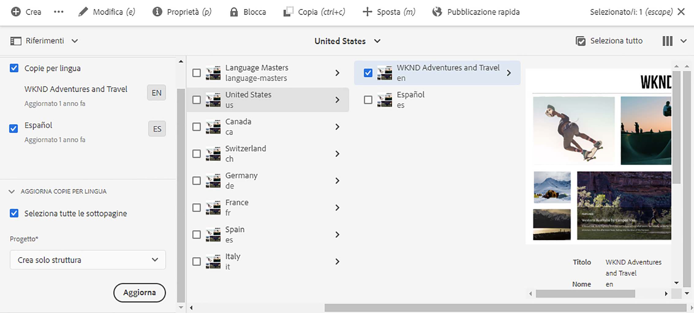

Dopo aver tradotto, è possibile [rivedere la traduzione](#reviewing-and-promoting-updated-content) prima di sovrascrivere con essa la copia per lingua. Se non esiste una copia per la lingua per la pagina selezionata, viene visualizzata la scheda Crea e traduci per consentire l’accesso ai comandi relativi al progetto.

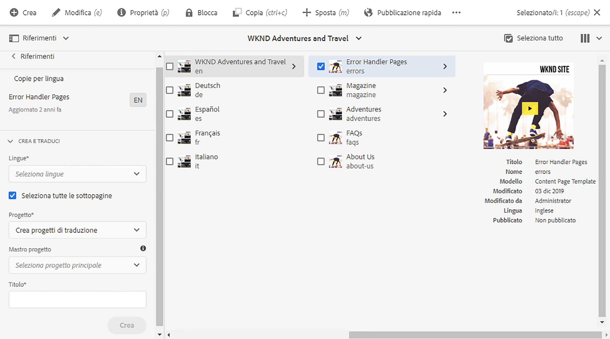

### Creare progetti di traduzione per una nuova copia in lingua {#create-translation-projects-for-a-new-language-copy}

1. Usa la console Sites per selezionare la pagina che stai aggiungendo ai progetti di traduzione.

1. Utilizzando la barra degli strumenti, apri la barra **Riferimenti** .

   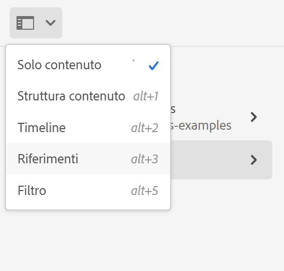

1. Selezionare **Copie per lingua**, quindi selezionare le copie per lingua per le quali si stanno traducendo le pagine di origine.
1. Tocca o fai clic su **Crea e traduci**, quindi configura il processo di traduzione:

   * Utilizza il menu a discesa **Lingue** per selezionare una copia per lingua di cui desideri tradurre. Seleziona le lingue aggiuntive richieste. Le lingue visualizzate nell&#39;elenco corrispondono alle [radici della lingua create](preparation.md#creating-a-language-root).
      * Selezionando più lingue si crea un progetto con un lavoro di traduzione per ogni lingua.
   * Per tradurre la pagina selezionata e tutte le pagine figlie, selezionare **Seleziona tutte le sottopagine**. Per tradurre solo la pagina selezionata, deselezionare l’opzione.
   * Per **Progetto**, seleziona **Crea progetto di traduzione**.
   * Facoltativamente per **Project Master**, seleziona un progetto da cui ereditare i ruoli utente e le autorizzazioni.
   * In **Titolo** digitare un nome per il progetto.

   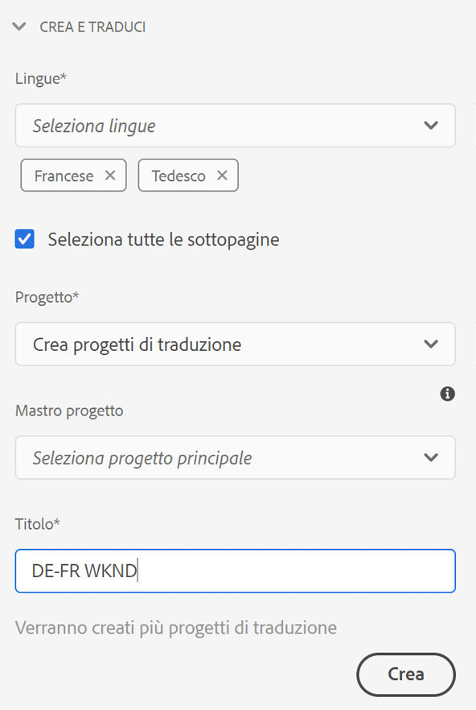

1. Tocca o fai clic su **Crea**.

### Creare progetti di traduzione per una copia in lingua esistente {#create-translation-projects-for-an-existing-language-copy}

1. Usa la console Sites per selezionare la pagina da aggiungere ai progetti di traduzione.

1. Utilizzando la barra degli strumenti, apri la barra **Riferimenti** .

   

1. Selezionare **Copie per lingua**, quindi selezionare le copie per lingua per le quali si stanno traducendo le pagine di origine.
1. Tocca o fai clic su **Aggiorna copie per lingua**, quindi configura il processo di traduzione:

   * Per tradurre la pagina selezionata e tutte le pagine figlie, selezionare **Seleziona tutte le sottopagine**. Per tradurre solo la pagina selezionata, deselezionare l’opzione.
   * Per **Progetto**, seleziona **Crea progetto di traduzione**.
   * Facoltativamente per **Project Master**, seleziona un progetto da cui ereditare i ruoli utente e le autorizzazioni.
   * In **Titolo** digitare un nome per il progetto.

   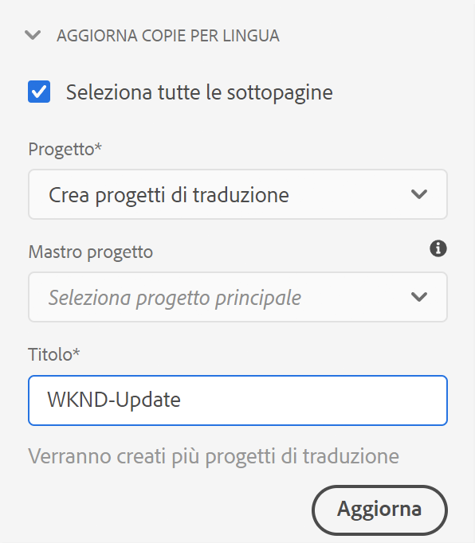

1. Tocca o fai clic su **Crea**.

### Aggiunta di pagine a un progetto di traduzione {#adding-pages-to-a-translation-project}

Dopo aver creato un progetto di traduzione, puoi utilizzare la barra **Risorse** per aggiungere pagine al progetto. L’aggiunta di pagine è utile quando si includono pagine di rami diversi nello stesso progetto.

Quando aggiungi delle pagine a un progetto di traduzione, queste vengono incluse in un nuovo lavoro di traduzione. È inoltre possibile [aggiungere pagine a un processo esistente](#adding-pages-assets-to-a-translation-job).

Come per la creazione di un nuovo progetto, quando si aggiungono pagine, le copie delle pagine vengono aggiunte a un lancio quando necessario per evitare la sovrascrittura delle copie in lingua esistenti. (Consulta [Creazione di progetti di traduzione per copie in lingua esistenti](#performing-initial-translations-and-updating-existing-translations).)

1. Usa la console Sites per selezionare la pagina che stai aggiungendo al progetto di traduzione.

1. Utilizzando la barra degli strumenti, apri la barra **Riferimenti** .

   

1. Selezionare **Copie per lingua**, quindi selezionare le copie per lingua per le quali si stanno traducendo le pagine di origine.

   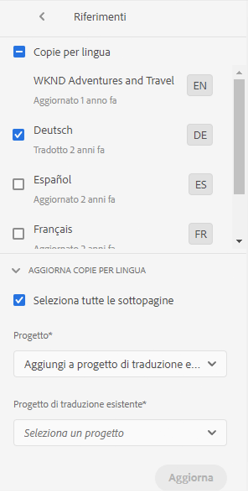

1. Tocca o fai clic su **Aggiorna copie per lingua**, quindi configura le proprietà:

   * Per tradurre la pagina selezionata e tutte le pagine figlie, selezionare **Seleziona tutte le sottopagine**. Per tradurre solo la pagina selezionata, deselezionare l’opzione.
   * Per **Progetto**, seleziona **Aggiungi al progetto di traduzione esistente**.
   * Seleziona il progetto in **Progetto di traduzione esistente**.

   >[!NOTE]
   >
   >La lingua di destinazione impostata nel progetto di traduzione deve corrispondere al percorso della copia per lingua, come mostrato nella barra dei riferimenti.

1. Tocca o fai clic su **Aggiorna**.

### Creazione della struttura di una copia in lingua {#creating-the-structure-of-a-language-copy}

È possibile creare solo la struttura della copia per lingua, consentendo di copiare il contenuto e le modifiche strutturali nel master lingua in copie per lingua (non tradotte). Questo non è correlato a un lavoro o a un progetto di traduzione. Puoi utilizzarlo per mantenere sincronizzati i master lingua, anche senza traduzione.

Compilare la copia per lingua in modo che contenga il contenuto della lingua master che si sta traducendo. Prima di compilare la copia per lingua, è necessario aver [creato la directory principale lingua](preparation.md#creating-a-language-root) della copia per lingua.

1. Utilizzare la console Sites per selezionare la directory principale della lingua principale utilizzata come origine.
1. Apri la barra dei riferimenti facendo clic o toccando **Riferimenti** nella barra degli strumenti.

   

1. Selezionare **Copie per lingua**, quindi selezionare le copie per lingua da compilare.

   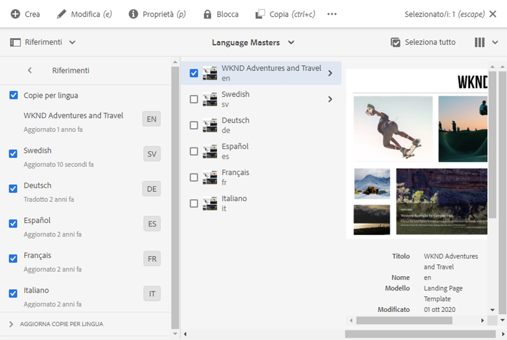

1. Tocca o fai clic su **Aggiorna copie per lingua** per visualizzare gli strumenti di traduzione e configurare le proprietà:

   * Selezionare l&#39;opzione **Seleziona tutte le sottopagine**.
   * Per **Progetto**, selezionare **Crea solo struttura**.

   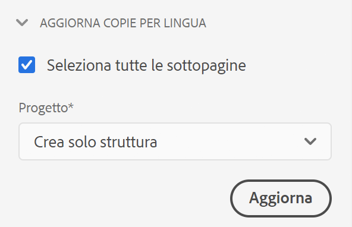

1. Tocca o fai clic su **Aggiorna**.

### Aggiornamento della memoria di traduzione {#updating-translation-memory}

Le modifiche manuali dei contenuti tradotti possono essere sincronizzate nuovamente con il sistema di gestione della traduzione (TMS) per addestrare la memoria di traduzione.

1. Dalla console Sites, dopo aver aggiornato il contenuto di testo in una pagina tradotta, seleziona **Aggiorna memoria di traduzione**.
1. Una vista a elenco mostra un confronto affiancato dell’origine e della traduzione per ogni componente di testo modificato. Selezionare gli aggiornamenti di traduzione da sincronizzare con la memoria di traduzione e selezionare **Aggiorna memoria**.

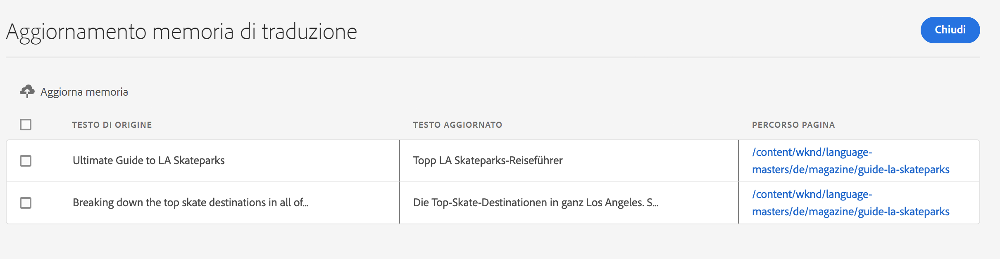

AEM invierà nuovamente le stringhe selezionate al sistema di gestione della traduzione.

### Verifica dello stato di traduzione di una pagina {#check-translation-status}

È possibile selezionare una proprietà nella vista a elenco della console Sites per verificare se una pagina è stata tradotta, è in traduzione o non è ancora stata tradotta.

1. Nella console del sito, passa alla [vista a elenco.](/help/sites-cloud/authoring/getting-started/basic-handling.md#viewing-and-selecting-resources)
1. Tocca o fai clic su **Visualizza impostazioni** nel menu a discesa della vista.
1. Nella finestra di dialogo, controlla la proprietà **Translated** e tocca o fai clic su **Aggiorna**.

Nella console Sites viene ora visualizzata la colonna **Translated** che mostra lo stato di traduzione delle pagine elencate.

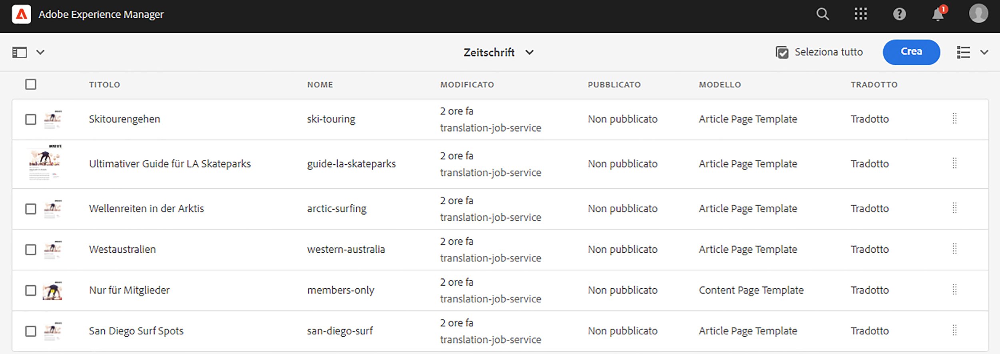

## Gestione dei progetti di traduzione dalla console Progetto

Nella console progetti è possibile accedere a numerose attività di traduzione e opzioni avanzate.

### Informazioni sulla console Progetti

I progetti di traduzione in AEM utilizzano la console standard [Progetti AEM.](/help/sites-cloud/authoring/projects/overview.md) Se non conosci i progetti AEM, consulta la relativa documentazione.

Come qualsiasi altro progetto Un progetto di traduzione è costituito da tessere che presentano una panoramica delle attività del progetto.

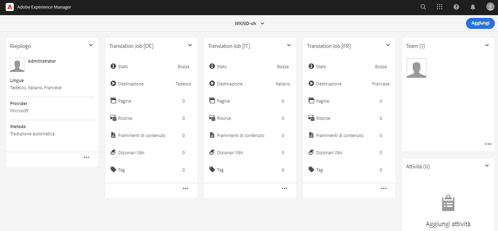

* **Riepilogo** : panoramica del progetto
* **Attività**  - Una o più attività di traduzione
* **Team**  - Utenti che collaborano al progetto di traduzione
* **Attività** : elementi che devono essere completati nell’ambito dello sforzo di traduzione

Utilizzare i comandi e i pulsanti di ellissi nella parte superiore e inferiore delle tessere (rispettivamente) per accedere ai controlli e alle opzioni per le varie tessere.

### Creazione di un progetto di traduzione tramite la console Progetti {#creating-a-translation-project-using-the-projects-console}

Puoi creare manualmente un progetto di traduzione se preferisci utilizzare la console dei progetti invece che la console Sites.

Quando crei manualmente un progetto di traduzione, devi fornire valori per le seguenti proprietà relative alla traduzione in aggiunta alle proprietà di base [a1/>:](/help/sites-cloud/authoring/projects/managing.md#creating-a-project)

* **Nome:** nome del progetto
* **Lingua di origine:** la lingua del contenuto di origine
* **Lingua di destinazione:** la lingua o le lingue in cui il contenuto viene tradotto
   * Se sono selezionate più lingue, viene creato un processo per ogni lingua all’interno del progetto.
* **Metodo di traduzione:** selezionare  **** Traduzione umana per indicare che la traduzione deve essere eseguita manualmente.

1. Nella barra degli strumenti della console progetti, tocca o fai clic su **Crea**.
1. Seleziona il modello **Progetto di traduzione** , quindi tocca o fai clic su **Avanti**.
1. Immetti i valori per la scheda delle proprietà **Base** .
1. Tocca o fai clic su **Avanzate** e fornisci valori per le proprietà relative alla traduzione.
1. Tocca o fai clic su **Crea**. Nella casella di conferma, tocca o fai clic su **Fine** per tornare alla console dei progetti oppure tocca o fai clic su **Apri progetto** per aprire e iniziare a gestire il progetto.

### Aggiunta di pagine e risorse a un lavoro di traduzione {#adding-pages-assets-to-a-translation-job}

Puoi aggiungere pagine, risorse o tag al processo di traduzione del progetto di traduzione. Per aggiungere pagine o risorse:

1. Nella parte inferiore della sezione del lavoro di traduzione del progetto di traduzione, tocca o fai clic sui puntini di sospensione.

   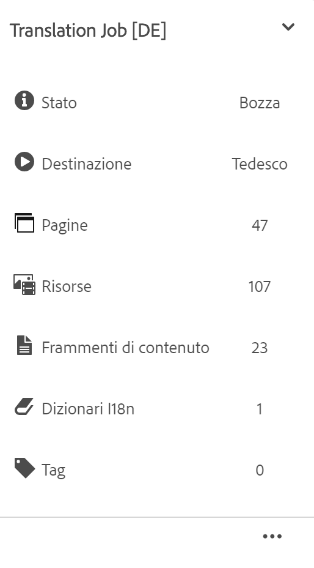

1. Nella finestra successiva, tocca o fai clic sul pulsante **Aggiungi** nella barra degli strumenti, quindi seleziona **Risorse/Pagine**.

   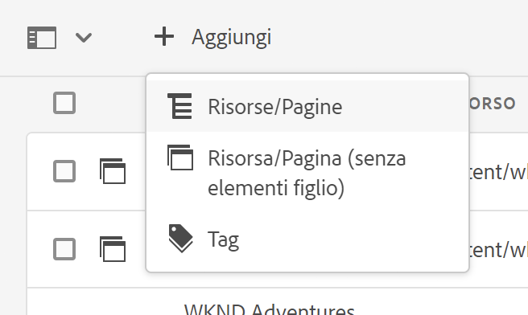

1. Nella finestra modale, seleziona l’elemento più in alto del ramo che desideri aggiungere, quindi tocca o fai clic sull’icona del segno di spunta. La selezione multipla è abilitata in questa finestra.

   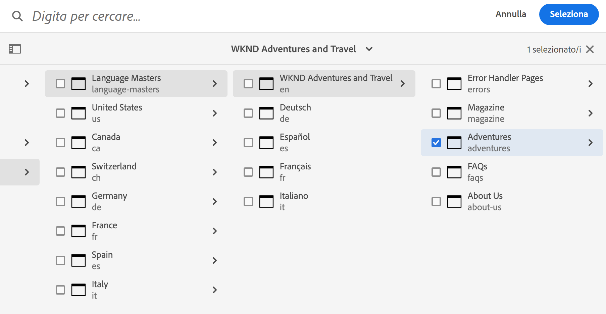

1. In alternativa, puoi selezionare l’icona di ricerca per cercare facilmente le pagine o le risorse da aggiungere al lavoro di traduzione.

   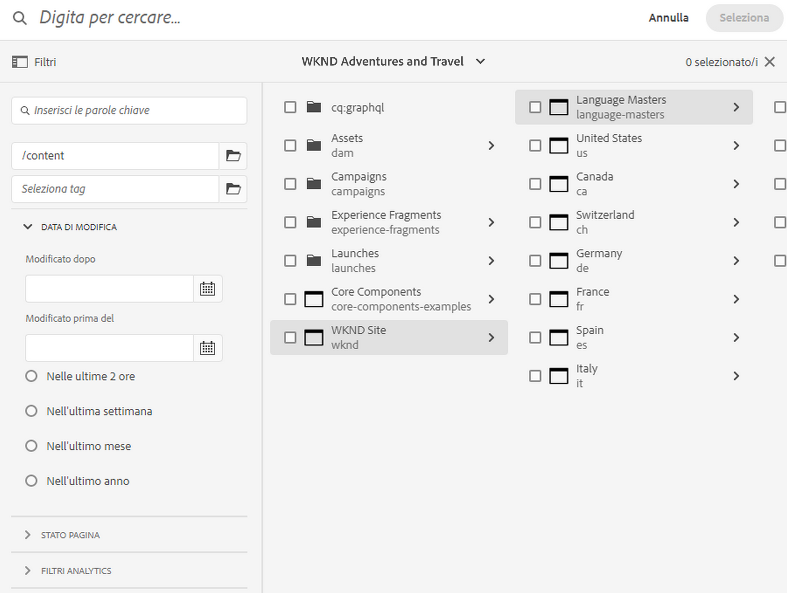

1. Una volta selezionato, tocca o fai clic su **Seleziona**. Le pagine e/o le risorse vengono aggiunte al processo di traduzione.

>[!TIP]
>
>Questo metodo aggiunge al progetto le pagine/risorse e i relativi elementi secondari. Seleziona **Risorsa/Pagina (senza elementi figlio)** se desideri aggiungere solo gli elementi principali.

### Aggiunta di tag a un processo di traduzione {#adding-tags-to-a-translation-job}

Puoi aggiungere tag a un progetto di traduzione in modo analogo a come aggiungi risorse e pagine a un progetto. Seleziona  **** Tag nel menu  **** Aggiungi e segui gli stessi passaggi.

### Visualizzazione dei dettagli del progetto di traduzione {#seeing-translation-project-details}

Le proprietà del progetto di traduzione sono accessibili tramite il pulsante con i puntini di sospensione della sezione di riepilogo del progetto. Oltre alle informazioni generiche [sul progetto](/help/sites-cloud/authoring/projects/overview.md#project-info), le proprietà del progetto di traduzione contengono specifiche per la traduzione.

Nel progetto di traduzione, tocca o fai clic sull’ellissi nella parte inferiore della sezione Riepilogo di traduzione . La maggior parte delle proprietà specifiche del progetto si trova nella scheda **Avanzate** .

* **Lingua di origine:** la lingua delle pagine che vengono tradotte
* **Lingua di destinazione:** la lingua o le lingue in cui le pagine vengono tradotte
* **Configurazione cloud:** la configurazione cloud per il connettore del servizio di traduzione utilizzato per il progetto
* **Metodo di traduzione:** Il flusso di lavoro di traduzione, sia  **Human** Translationor  **Machine Translation**
* **Provider di traduzione:** il provider di servizi di traduzione che sta eseguendo la traduzione
* **Categoria di contenuto:**  (traduzione automatica) la categoria di contenuto utilizzata per la traduzione
* **Credenziale del provider di traduzione:** le credenziali per l&#39;accesso al provider
* **Promuovi automaticamente i lanci di traduzione:** dopo aver ricevuto il contenuto tradotto, i lanci di traduzione vengono promossi automaticamente
   * **Elimina lancio dopo la promozione:**  se i lanci di traduzione vengono promossi automaticamente, elimina il lancio dopo la promozione
* **Approva automaticamente traduzioni:** dopo aver ricevuto il contenuto tradotto, i lavori di traduzione vengono approvati automaticamente
* **Ripeti traduzione:** configura l’esecuzione ricorrente di un progetto di traduzione selezionando la frequenza con cui il progetto creerà ed eseguirà automaticamente i lavori di traduzione

Quando un progetto viene creato utilizzando la barra dei riferimenti di una pagina, queste proprietà vengono configurate automaticamente in base alle proprietà della pagina di origine.

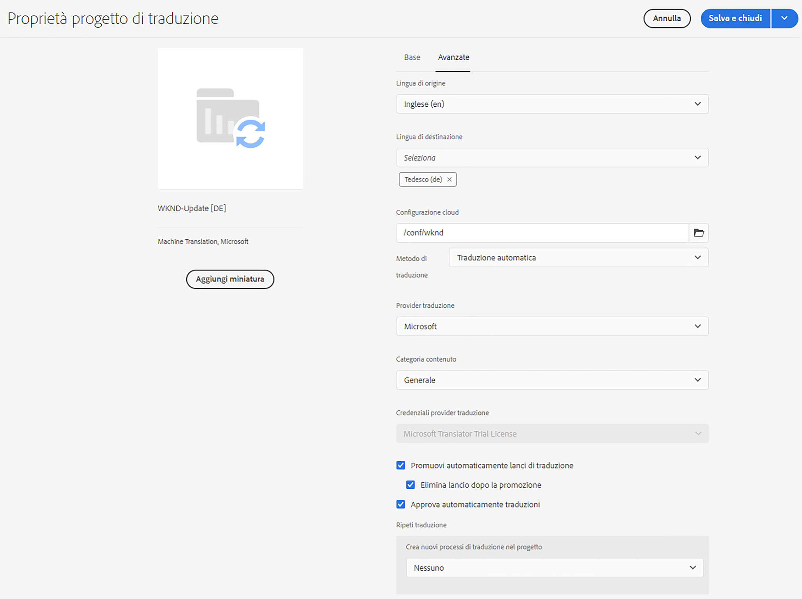

### Monitoraggio dello stato di un processo di traduzione {#monitoring-the-status-of-a-translation-job}

Il riquadro del lavoro di traduzione di un progetto di traduzione fornisce lo stato di un processo di traduzione, nonché il numero di pagine e risorse nel processo.

La tabella seguente descrive ogni stato di un processo o di un elemento del processo:

| Stato | Descrizione |
|---|---|
| **Bozza** | Il processo di traduzione non è stato avviato. I lavori di traduzione sono nello stato **Bozza**** al momento della creazione. |
| **Inviato** | I file nel processo di traduzione hanno questo stato quando sono stati inviati correttamente al servizio di traduzione. Questo stato può verificarsi dopo l&#39;attivazione del comando **Request Scope** o del comando **Start**. |
| **Conteggio richiesto** | Per il flusso di lavoro di traduzione umana, i file nel processo sono stati inviati al fornitore di traduzione per l&#39;ambito. Questo stato viene visualizzato dopo l&#39;attivazione del comando **Request Scope** . |
| **Conteggio completato** | Il fornitore ha delimitato il processo di traduzione. |
| **Impegnato per la traduzione** | Il proprietario del progetto ha accettato l&#39;ambito. Questo stato indica che il fornitore di traduzione deve iniziare a tradurre i file nel processo. |
| **Traduzione in corso** | Per un processo, la traduzione di uno o più file nel processo non è ancora completa. Per un elemento del processo, l&#39;elemento viene tradotto. |
| **Tradotto** | Per un lavoro, la traduzione di tutti i file nel processo è completa. Per un elemento del processo, l&#39;elemento viene tradotto. |
| **Pronto per la revisione** | L’elemento nel processo viene tradotto e il file è stato importato in AEM. |
| **Completa** | Il proprietario del progetto ha indicato che il contratto di traduzione è completo. |
| **Annulla** | Indica che il fornitore della traduzione deve interrompere il lavoro su un processo di traduzione. |
| **Aggiornamento errore** | Errore durante il trasferimento di file tra AEM e il servizio di traduzione. |
| **Stato sconosciuto** | Errore sconosciuto. |

Per visualizzare lo stato di ciascun file nel processo, tocca o fai clic sui puntini di sospensione nella parte inferiore della tessera.

### Impostazione della data di scadenza dei processi di traduzione {#setting-the-due-date-of-translation-jobs}

Specifica la data prima della quale il fornitore di traduzione deve restituire i file tradotti. L’impostazione della data di scadenza funziona correttamente solo quando il fornitore di traduzione utilizzato supporta questa funzione.

1. Tocca o fai clic sui puntini di sospensione nella parte inferiore della sezione di riepilogo della traduzione.

   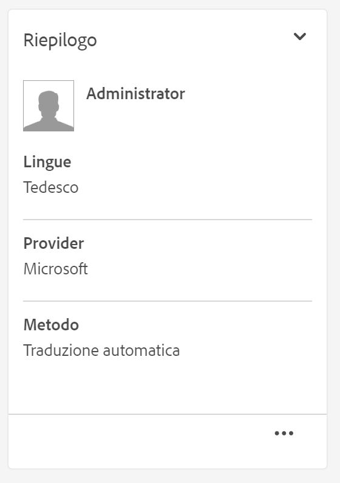

1. Nella scheda **Base** , utilizza il selettore data della proprietà **Data di scadenza** per selezionare la data di scadenza.

   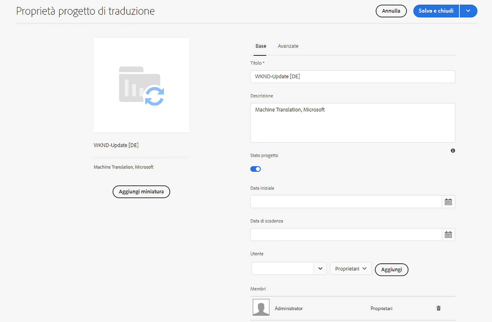

1. Tocca o fai clic su **Salva e chiudi**.

### Applicazione dell’ambito a un processo di traduzione {#scoping-a-translation-job}

Ambito di un processo di traduzione per ottenere una stima del costo della traduzione dal provider di servizi di traduzione. Quando si esegue l&#39;ambito di un processo, i file di origine vengono inviati al fornitore di traduzione che confronta il testo con il proprio pool di traduzioni memorizzate (memoria di traduzione). In genere, l’ambito corrisponde al numero di parole che richiedono la traduzione.

Per ottenere ulteriori informazioni sui risultati dell&#39;ambito, contatta il fornitore della traduzione.

>[!NOTE]
>
>L&#39;ambito è facoltativo e si applica solo alla traduzione umana. Puoi avviare un lavoro di traduzione senza ambito.

Quando si esegue l&#39;ambito di un processo di traduzione, lo stato del processo è **Ambito richiesto**. Quando il fornitore di traduzione restituisce l&#39;ambito, lo stato viene modificato in **Ambito completato**. Al termine dell&#39;ambito è possibile utilizzare il comando **Mostra ambito** per esaminare i risultati dell&#39;ambito.

L’ambito funziona correttamente solo quando il fornitore di traduzione utilizzato supporta questa funzione.

1. Nella console progetti , apri il progetto di traduzione.
1. Nel titolo del processo di traduzione, tocca o fai clic sul menu dei comandi, quindi tocca o fai clic su **Request Scope**.
1. Quando lo stato del processo cambia in **Ambito completato**, tocca o fai clic sul menu dei comandi, quindi tocca o fai clic su **Mostra ambito**.

### Avvio dei processi di traduzione {#starting-translation-jobs}

Avvia un processo di traduzione per tradurre le pagine di origine nella lingua di destinazione. La traduzione viene eseguita in base ai valori delle proprietà della sezione di riepilogo della traduzione.

Puoi avviare un singolo processo dall’interno del progetto.

1. Nella console Progetti , apri il progetto di traduzione.
1. Nella sezione del processo di traduzione, tocca o fai clic sul menu dei comandi, quindi tocca o fai clic su **Avvia**.
1. Nella finestra di dialogo dell&#39;azione che conferma l&#39;avvio della traduzione, tocca o fai clic su **Chiudi**.

Dopo aver avviato il processo di traduzione, il riquadro del processo di traduzione mostra la traduzione nello stato **In corso** .

Puoi anche avviare tutti i processi di traduzione per un progetto.

1. Nella console del progetto, seleziona il progetto di traduzione.
1. Nella barra degli strumenti, tocca o fai clic su **Avvia processi di traduzione**.
1. Nella finestra di dialogo, controlla l’elenco dei processi che verranno avviati e quindi conferma con **Start** o interrompi con **Annulla**.

### Annullamento di un processo di traduzione {#canceling-a-translation-job}

Annulla un processo di traduzione per interrompere il processo di traduzione e impedire al fornitore di traduzione di eseguire ulteriori traduzioni. È possibile annullare un processo quando lo stato del processo è **Impegnato per la traduzione** o **Traduzione in corso**.

1. Nella console Progetti , apri il progetto di traduzione.
1. Nella sezione del processo di traduzione, tocca o fai clic sul menu dei comandi, quindi tocca o fai clic su **Annulla**.
1. Nella finestra di dialogo dell&#39;azione che conferma l&#39;annullamento della traduzione, tocca o fai clic su **OK**.

### Accetta e rifiuta flusso di lavoro {#accept-reject-workflow}

Quando il contenuto torna dopo la traduzione ed è nello stato **Pronto per la revisione**, puoi accedere al lavoro di traduzione e accettare/rifiutare il contenuto.

Se si seleziona **Rifiuta traduzione**, è possibile aggiungere un commento.

Il rifiuto del contenuto lo invia nuovamente al fornitore di traduzione dove sarà in grado di visualizzare il commento.

### Completamento e archiviazione dei processi di traduzione {#completing-and-archiving-translation-jobs}

Completa un lavoro di traduzione dopo aver esaminato i file tradotti dal fornitore.

1. Nella console Progetti , apri il progetto di traduzione.
1. Nella sezione del processo di traduzione, tocca o fai clic sul menu dei comandi, quindi tocca o fai clic su **Completa**.
1. Il processo ora ha lo stato **Completa**.

Per i flussi di lavoro di traduzione umana, il completamento di una traduzione indica al fornitore che il contratto di traduzione è stato soddisfatto e che deve salvare la traduzione nella propria memoria di traduzione.

Archivia un processo di traduzione al termine e non è più necessario visualizzare i dettagli dello stato del processo.

1. Nella console Progetti , apri il progetto di traduzione.
1. Nella sezione del processo di traduzione, tocca o fai clic sul menu dei comandi, quindi tocca o fai clic su **Archivia**.

Quando archivi il lavoro di traduzione, la porzione del lavoro di traduzione viene rimossa dal progetto.

## Revisione e utilizzo di contenuti tradotti {#reviewing-and-promoting-updated-content}

È possibile utilizzare la console Sites per esaminare il contenuto, confrontare le copie per lingua e attivare il contenuto.

### Promozione del contenuto aggiornato {#promoting-updated-content}

Quando il contenuto viene tradotto per una copia in lingua esistente, rivedi le traduzioni, apporta modifiche se necessario e quindi promuovi le traduzioni per spostarlo nella copia in lingua. È possibile rivedere i file tradotti quando il processo di traduzione mostra lo stato **Pronto per la revisione**.

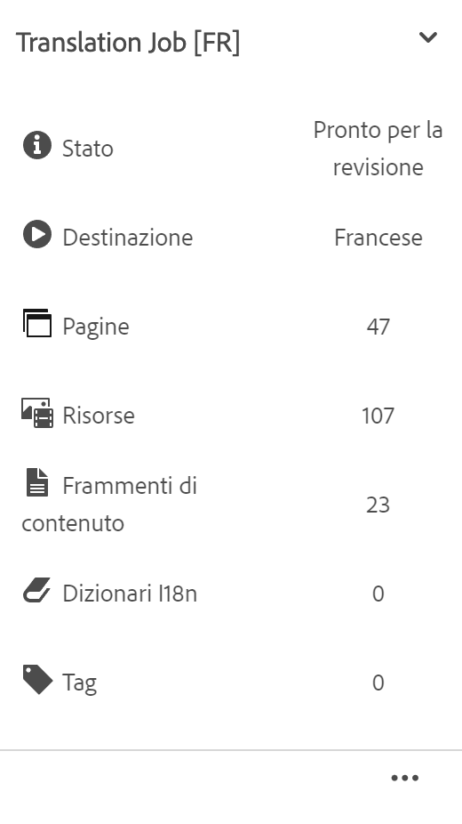

1. Seleziona la pagina nel master lingua, tocca o fai clic su **Riferimenti**, quindi tocca o fai clic su **Copie per lingua**.
1. Tocca o fai clic sulla copia per lingua da rivedere.

   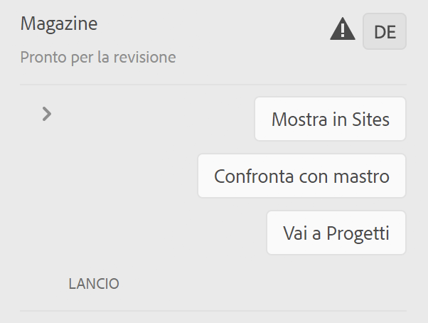

1. Tocca o fai clic su **Launch** per visualizzare i comandi relativi al lancio.

   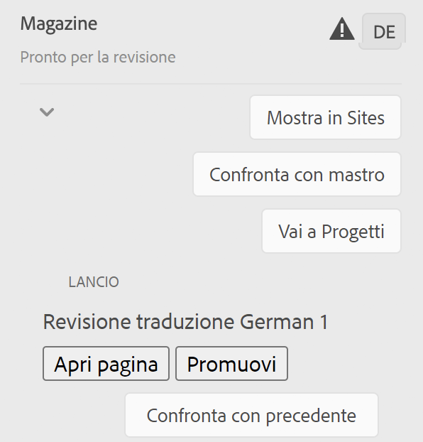

1. Per aprire la copia di lancio della pagina per esaminare e modificare il contenuto, fai clic su **Apri pagina**.
1. Dopo aver rivisto il contenuto e apportato le modifiche necessarie, per promuovere la copia del lancio fai clic su **Promuovi**.
1. Nella pagina **Promuovi lancio** , specifica le pagine da promuovere, quindi tocca o fai clic su **Promuovi**.

### Confronto delle copie per lingua {#comparing-language-copies}

Per confrontare le copie della lingua con il master della lingua:

1. Nella console Sites individua la copia per lingua da confrontare.
1. Apri la barra [Riferimenti.](/help/sites-cloud/authoring/getting-started/basic-handling.md#references)
1. Sotto l&#39;intestazione **Copie** selezionare **Copie per lingua.**
1. Seleziona la copia specifica per la lingua e puoi fare clic su **Confronta con principale** o **Confronta con precedente**, se applicabile.

   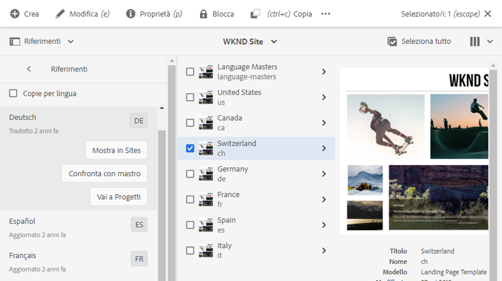

1. Le due pagine (di lancio e di origine) verranno aperte una accanto all&#39;altra.
   * Per informazioni complete sull&#39;utilizzo di questa funzionalità, consulta [Differenze tra pagine](/help/sites-cloud/authoring/features/page-diff.md).

## Importazione ed esportazione di processi di traduzione {#import-export}

Sebbene AEM offra diverse soluzioni e interfacce di traduzione, è anche possibile importare ed esportare manualmente le informazioni sul processo di traduzione.

### Esportazione di un processo di traduzione {#exporting-a-translation-job}

Puoi scaricare il contenuto di un processo di traduzione, ad esempio per inviare a un provider di traduzione non integrato con AEM tramite un connettore, o per rivedere il contenuto.

1. Dal menu a discesa del riquadro del lavoro di traduzione, tocca o fai clic su **Esporta**.
1. Nella finestra di dialogo, fare clic o toccare **Scarica file esportato** e, se necessario, utilizzare la finestra di dialogo del browser Web per salvare il file.
1. Nella finestra di dialogo, tocca o fai clic su **Chiudi**.

### Importazione di un processo di traduzione {#importing-a-translation-job}

Puoi importare contenuti tradotti in AEM, ad esempio quando il provider di traduzione ve li invia perché non sono integrati con AEM tramite un connettore.

1. Dal menu a discesa del riquadro del lavoro di traduzione, tocca o fai clic su **Importa**.
1. Utilizzare la finestra di dialogo del browser Web per selezionare il file da importare.
1. Nella finestra di dialogo, tocca o fai clic su **Chiudi**.
