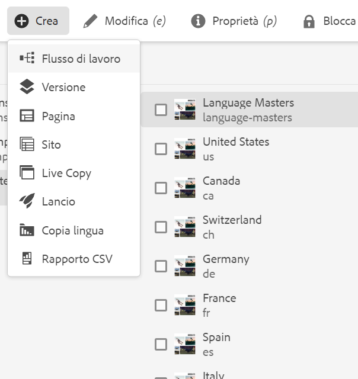
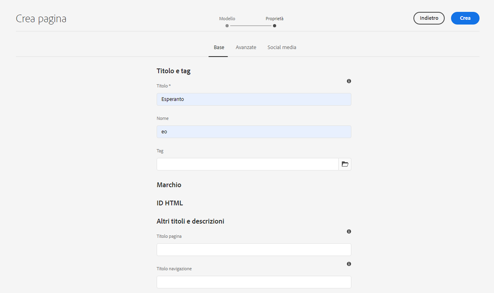
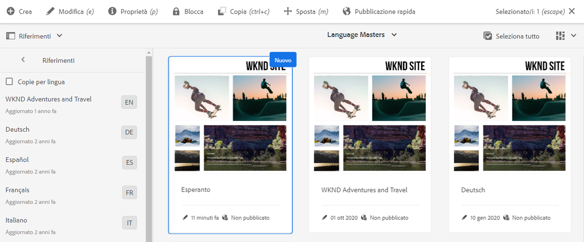
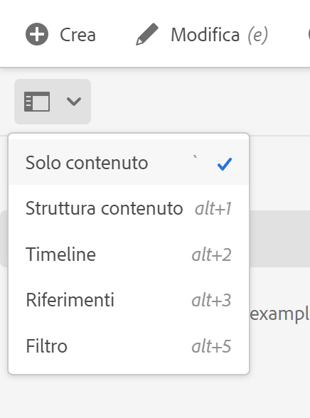

# Preparazione del contenuto per la traduzione {#preparing-content-for-translation}

I siti web multilingue forniscono generalmente una certa quantità di contenuto in più lingue. Il sito viene creato in una lingua e poi tradotto in altre lingue. In genere, i siti multilingue sono composti da rami di pagine, in cui ogni ramo contiene le pagine del sito in una lingua diversa.

Il [sito di esercitazione WKND](/help/implementing/developing/introduction/develop-wknd-tutorial.md) include diversi rami di lingua e utilizza la seguente struttura:

```text
/content
    |- wknd
        |- language-masters
            |- en
            |- de
            |- es
            |- fr
            |- it
        |- us
            |- en
            |- es
        |- ca
            |- en
            |- fr
        |- ch
            |- de
            |- fr
            |- it
        |- de
            |- de
        |- fr
            |- fr
        |- es
            |- es
        |- it
            |- it
```

La copia per lingua per la quale originariamente si è creato il contenuto del sito è la lingua master. Il maestro di lingua è la fonte tradotta in altre lingue.

Ogni ramo linguistico di un sito è denominato copia per lingua. La pagina principale di una copia per lingua, nota come lingua principale, identifica la lingua del contenuto nella copia per lingua. Ad esempio, `/content/wknd/fr` è la directory principale della lingua per la copia in lingua francese. Le copie per lingua devono utilizzare una [directory principale lingua configurata correttamente](preparation.md#creating-a-language-root) in modo che la lingua corretta sia utilizzata per le traduzioni di un sito di origine.

Utilizza i seguenti passaggi per preparare il sito alla traduzione:

1. Creare la directory principale della lingua della lingua master. Ad esempio, la directory principale della lingua del sito di dimostrazione WKND inglese è `/content/wknd/language-masters/en`. Assicurati che la directory principale della lingua sia configurata correttamente in base alle informazioni contenute in [Creazione di una directory principale della lingua](preparation.md#creating-a-language-root).
1. Creare il contenuto della lingua master.
1. Crea la directory principale della lingua di ogni copia per la lingua del sito. Ad esempio, la copia in lingua francese del sito di esempio WKND è `/content/wknd/language-masters/fr`.

Dopo aver preparato il contenuto per la traduzione, puoi creare automaticamente le pagine mancanti nelle copie della lingua e nei relativi progetti di traduzione. (Consulta [Creazione di un progetto di traduzione](managing-projects.md).) Per una panoramica del processo di traduzione dei contenuti in AEM, consulta [Traduzione di contenuti per siti web multilingue](overview.md).

## Creazione di una directory principale della lingua {#creating-a-language-root}

Crea una directory principale della lingua come pagina principale di una copia per lingua che identifica la lingua del contenuto. Dopo aver creato la directory principale lingua, puoi creare progetti di traduzione che includono la copia per lingua.

Per creare la directory principale della lingua è necessario creare una pagina e utilizzare un codice della lingua ISO come valore per la proprietà **Name** . Il codice della lingua deve essere in uno dei seguenti formati:

* `<language-code>` - Il codice della lingua supportato è un codice a due lettere come definito, ad esempio, dallo standard ISO-639-1  `en`.
* `<language-code>_<country-code>` o  `<language-code>-<country-code>` - Il codice del paese supportato è un codice a due lettere minuscolo o superiore, come definito dalla norma ISO 3166, ad esempio  `en_US`,  `en_us`,  `en_GB`,  `en-gb`.

Puoi utilizzare entrambi i formati, in base alla struttura scelta per il sito globale.  Ad esempio, la pagina principale della copia in lingua francese del sito WKND ha `fr` come proprietà **Name**. Nota che la proprietà **Name** viene utilizzata come nome del nodo della pagina nell&#39;archivio e quindi determina il percorso della pagina (`http://<host>:<4502>/content/wknd/language-masters/fr.html`).

1. Passa ai siti.
1. Tocca o fai clic sul sito per il quale vuoi creare una copia per lingua.
1. Tocca o fai clic su **Crea**, quindi tocca o fai clic su **Pagina**.

   

1. Seleziona il modello di pagina, quindi tocca o fai clic su **Avanti**.
1. Nel campo **Nome** digitare il codice del paese nel formato `<language-code>` o `<language-code>_<country-code>`, ad esempio `en`, `en_US`, `en_us`, `en_GB`, `en_gb`. Digita un titolo per la pagina.

   

1. Tocca o fai clic su **Crea**. Nella finestra di dialogo di conferma, tocca o fai clic su **Fine** per tornare alla console Sites oppure su **Apri** per aprire la copia per lingua.

## Visualizzazione dello stato delle radici della lingua {#seeing-the-status-of-language-roots}

AEM fornisce una barra **Riferimenti** che mostra un elenco di radici della lingua create.



Segui la procedura seguente per visualizzare le copie della lingua per una pagina utilizzando il selettore della barra [a.](/help/sites-cloud/authoring/getting-started/basic-handling.md#rail-selector)

1. Nella console Sites, seleziona una pagina del sito e quindi tocca o fai clic su **Riferimenti**.

   

1. Nella barra dei riferimenti, tocca o fai clic su **Copie per lingua**. La barra laterale mostra le copie in lingua del sito Web.

## Copie per lingua a più livelli {#multiple-levels}

Le radici della lingua possono anche essere raggruppate sotto i nodi, ad esempio per regione, pur essendo ancora riconosciute come radici delle copie della lingua.

```text
/content
    |- wknd
        |- language-masters
            |- europe
                |- de
                |- fr
                |- it
                |- es
                ]- pt
            |- americas
                |- en
                |- es
                |- fr
                |- pt
            |- asia
                |- ...
            |- africa
                |- ...
            |- oceania
                |- ...
        |- europe
        |- americas
        |- asia
        |- africa
        |- oceania            
```

>[!NOTE]
>
>È consentito un solo livello. Ad esempio, quanto segue non consente alla pagina `es` di risolvere una copia per lingua:
>
>* `/content/wknd/language-masters/en`
>* `/content/wknd/language-masters/americas/central-america/es`

>
> 
Questa `es` copia della lingua non verrà rilevata perché si trova a 2 livelli (`americas/central-america`) lontano dal nodo `en`.

>[!TIP]
>
>In questa configurazione, le radici della lingua possono avere qualsiasi nome di pagina, anziché solo il codice ISO della lingua. AEM sempre controllare prima il percorso e il nome, ma se il nome della pagina non identifica una lingua, AEM controllerà la proprietà `cq:language` della pagina per l&#39;identificazione della lingua.
