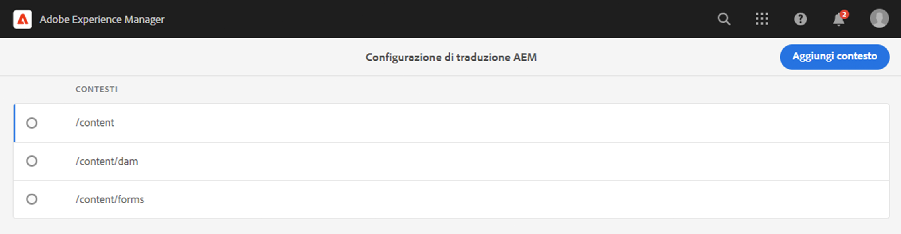
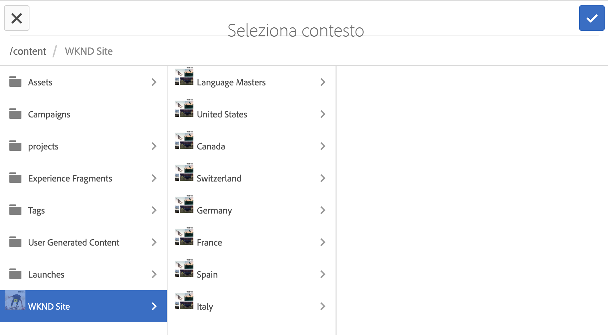
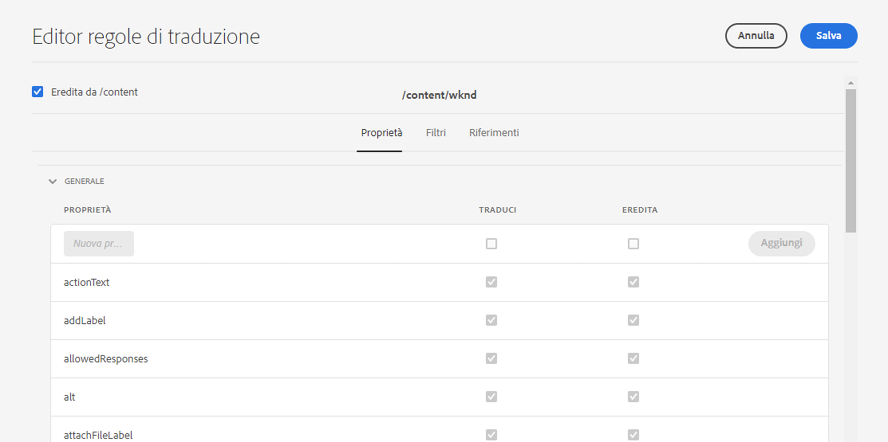
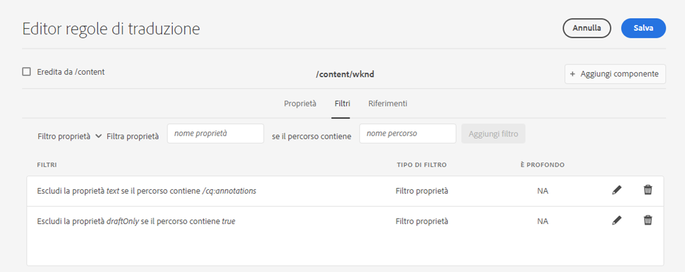
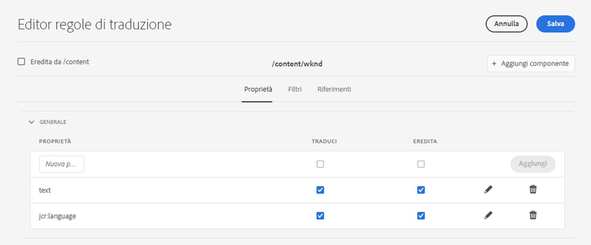

# Identificazione del contenuto da tradurre {#identifying-content-to-translate}

Le regole di traduzione identificano il contenuto da tradurre per le pagine, i componenti e le risorse inclusi nei progetti di traduzione o esclusi da essi. Quando una pagina o una risorsa viene tradotta, AEM estrae questo contenuto in modo che possa essere inviato al servizio di traduzione.

Le pagine e le risorse sono rappresentate come nodi nell’archivio JCR. Il contenuto estratto è uno o più valori di proprietà dei nodi. Le regole di traduzione identificano le proprietà che contengono il contenuto da estrarre.

Le regole di traduzione sono espresse in formato XML e memorizzate nelle seguenti posizioni possibili:

* `/libs/settings/translation/rules/translation_rules.xml`
* `/apps/settings/translation/rules/translation_rules.xml`
* `/conf/global/settings/translation/rules/translation_rules.xml`

Il file si applica a tutti i progetti di traduzione.

Le regole includono le seguenti informazioni:

* Percorso del nodo a cui si applica la regola
   * La regola si applica anche ai discendenti del nodo.
* Nomi delle proprietà del nodo che contengono il contenuto da tradurre
   * La proprietà può essere specifica per un tipo di risorsa specifico o per tutti i tipi di risorsa.

Ad esempio, puoi creare una regola che traduca il contenuto aggiunto dagli autori a tutti i componenti di testo sulle tue pagine. La regola può identificare il nodo `/content` e la proprietà `text` per il componente `core/wcm/components/text/v2/text`.

È stata aggiunta una [console](#translation-rules-ui) per la configurazione delle regole di traduzione. Le definizioni nell’interfaccia utente compileranno il file per tuo conto.

Per una panoramica delle funzioni di traduzione dei contenuti in AEM, consulta [Traduzione di contenuti per siti multilingue](overview.md).

>[!NOTE]
>
>AEM supporta la mappatura uno-a-uno tra i tipi di risorse e gli attributi di riferimento per la traduzione del contenuto di riferimento su una pagina.

## Sintassi delle regole per pagine, componenti e risorse {#rule-syntax-for-pages-components-and-assets}

Una regola è un elemento `node` con uno o più elementi secondari `property` e uno o più elementi secondari `node`:

```xml
<node path="content path">
          <property name="property name" [translate="false"]/>
          <node resourceType="component path" >
               <property name="property name" [translate="false"]/>
          </node>
</node>
```

Ciascuno di questi elementi `node` ha le seguenti caratteristiche:

* L&#39;attributo `path` contiene il percorso del nodo principale del ramo a cui si applicano le regole.
* Gli elementi secondari `property` identificano le proprietà del nodo da tradurre per tutti i tipi di risorse:
   * L&#39;attributo `name` contiene il nome della proprietà.
   * L’attributo facoltativo `translate` è uguale a `false` se la proprietà non è tradotta. Per impostazione predefinita, il valore è `true`. Questo attributo è utile quando si ignorano le regole precedenti.
* Gli elementi secondari `node` identificano le proprietà del nodo da tradurre per tipi di risorse specifici:
   * L&#39;attributo `resourceType` contiene il percorso che viene risolto nel componente che implementa il tipo di risorsa.
   * Gli elementi secondari `property` identificano la proprietà del nodo da tradurre. Usa questo nodo nello stesso modo degli elementi secondari `property` per le regole del nodo.

La regola di esempio seguente fa sì che il contenuto di tutte le proprietà `text` sia tradotto per tutte le pagine sotto il nodo `/content`. La regola è efficace per qualsiasi componente che memorizza il contenuto in una proprietà `text` , ad esempio il componente testo.

```xml
<node path="/content">
          <property name="text"/>
</node>
```

L’esempio seguente traduce il contenuto di tutte le proprietà `text` e anche altre proprietà del componente immagine. Se altri componenti hanno proprietà con lo stesso nome, la regola non si applica ad essi.

```xml
<node path="/content">
      <property name="text"/>
      <node resourceType="core/wcm/components/image/v2/image">
         <property name="image/alt"/>
         <property name="image/jcr:description"/>
         <property name="image/jcr:title"/>
      </node>
</node>
```

## Sintassi delle regole per l’estrazione di risorse dalle pagine {#rule-syntax-for-extracting-assets-from-pages}

Utilizza la sintassi della regola seguente per includere le risorse incorporate nei componenti o a cui si fa riferimento da essi:

```xml
<assetNode resourceType="path to component" assetReferenceAttribute="property that stores asset"/>
```

Ogni elemento `assetNode` ha le seguenti caratteristiche:

* Un attributo `resourceType` uguale al percorso che viene risolto nel componente
* Un attributo `assetReferenceAttribute` che è uguale al nome della proprietà che memorizza il binario della risorsa (per le risorse incorporate) o il percorso della risorsa di riferimento

L’esempio seguente estrae le immagini dal componente immagine:

```xml
<assetNode resourceType="core/wcm/components/image/v2/image" assetReferenceAttribute="fileReference"/>
```

## Regole di sovrascrittura {#overriding-rules}

Il file `translation_rules.xml` è costituito da un elemento `nodelist` con diversi elementi secondari `node`. AEM legge l&#39;elenco dei nodi dall&#39;alto verso il basso. Quando più regole eseguono il targeting dello stesso nodo, viene utilizzata la regola inferiore nel file. Ad esempio, le seguenti regole fanno sì che tutto il contenuto delle proprietà `text` sia tradotto, ad eccezione del ramo `/content/mysite/en` delle pagine:

```xml
<nodelist>
     <node path="/content”>
           <property name="text" />
     </node>
     <node path=“/content/mysite/en”>
          <property name=“text” translate=“false" />
     </node>
<nodelist>
```

## Proprietà filtro {#filtering-properties}

Puoi filtrare i nodi con una proprietà specifica utilizzando un elemento `filter` .

Ad esempio, le seguenti regole fanno sì che tutto il contenuto delle proprietà `text` sia tradotto, ad eccezione dei nodi in cui la proprietà `draft` è impostata su `true`.

```xml
<nodelist>
    <node path="/content”>
     <filter>
   <node containsProperty="draft" propertyValue="true" />
     </filter>
        <property name="text" />
    </node>
<nodelist>
```

## Interfaccia utente delle regole di traduzione {#translation-rules-ui}

È disponibile anche una console per configurare le regole di traduzione.

Per accedervi:

1. Passa a **Strumenti**, quindi **Generale**.

1. Seleziona **Configurazione traduzione**.

Nell’interfaccia utente delle regole di traduzione è possibile:

1. **Aggiungi contesto**, che consente di aggiungere un percorso.

   

1. Usa il browser percorsi per selezionare il contesto desiderato e tocca o fai clic sul pulsante **Conferma** per salvare.

   

1. Quindi devi selezionare il tuo contesto e quindi fare clic su **Modifica**. Verrà aperto l’Editor regole di traduzione.

   

Puoi modificare quattro attributi tramite l’interfaccia utente:

* `isDeep`
* `inherit`
* `translate`
* `updateDestinationLanguage`

### isDeep {#isdeep}

**`isDeep`**  è applicabile nei filtri dei nodi ed è true per impostazione predefinita. Controlla se il nodo (o i suoi predecessori) contiene tale proprietà con il valore della proprietà specificato nel filtro. Se false, controlla solo il nodo corrente.

Ad esempio, i nodi figlio vengono aggiunti a un processo di traduzione anche quando il nodo principale ha la proprietà `draftOnly` impostata su true per contrassegnare il contenuto in bozza. Qui `isDeep` entra in gioco e controlla se i nodi principali hanno la proprietà `draftOnly` come true ed esclude tali nodi figlio.

Nell&#39;editor, è possibile controllare/deselezionare **È profondo** nella scheda **Filtri**.



Ecco un esempio del codice XML risultante quando **Is Deep** è deselezionato nell&#39;interfaccia utente:

```xml
 <filter>
    <node containsProperty="draftOnly" isDeep="false" propertyValue="true"/>
</filter>
```

### eredita {#inherit}

**`inherit`** è applicabile alle proprietà. Per impostazione predefinita ogni proprietà viene ereditata, ma se si desidera che alcune proprietà non vengano ereditate dall&#39;elemento secondario, è possibile contrassegnare questa proprietà come false in modo che venga applicata solo a quel nodo specifico.

Nell&#39;interfaccia utente, è possibile selezionare/deselezionare **Eredita** nella scheda **Proprietà** .

### traduci {#translate}

**`translate`** viene utilizzato semplicemente per specificare se tradurre o meno una proprietà.

Nell&#39;interfaccia utente, è possibile selezionare/deselezionare **Traduci** nella scheda **Proprietà** .

### updateDestinationLanguage {#updatedestinationlanguage}

**`updateDestinationLanguage`** viene utilizzato, ad esempio, per le proprietà prive di testo ma di codici lingua  `jcr:language`. L&#39;utente non traduce il testo, ma le impostazioni internazionali della lingua dall&#39;origine alla destinazione. Tali proprietà non vengono inviate per la traduzione.

Nell&#39;interfaccia utente, è possibile controllare o deselezionare **Traduci** nella scheda **Proprietà** per modificare questo valore, ma per le proprietà specifiche che hanno codici di lingua come valore.

Per chiarire la differenza tra `updateDestinationLanguage` e `translate`, ecco un semplice esempio di contesto con due sole regole:



Il risultato nel file xml sarà simile al seguente:

```xml
<property inherit="true" name="text" translate="true" updateDestinationLanguage="false"/>
<property inherit="true" name="jcr:language" translate="false" updateDestinationLanguage="true"/>
```

## Modifica manuale del file delle regole {#editing-the-rules-file-manually}

Il file `translation_rules.xml` installato con AEM contiene un set predefinito di regole di traduzione. Puoi modificare il file per supportare i requisiti dei tuoi progetti di traduzione. Ad esempio, puoi aggiungere regole per tradurre il contenuto dei componenti personalizzati.

Se modifichi il file `translation_rules.xml`, mantieni una copia di backup in un pacchetto di contenuto. La reinstallazione di alcuni pacchetti AEM può sostituire il file `translation_rules.xml` corrente con l&#39;originale. Per ripristinare le regole in questa situazione, puoi installare il pacchetto che contiene la copia di backup.

>[!NOTE]
>
>Dopo aver creato il pacchetto di contenuti, ricostruisci il pacchetto ogni volta che modifichi il file.

## Esempio di file delle regole di traduzione {#example-translation-rules-file}

```xml
<?xml version="1.0" encoding="UTF-8"?><nodelist>
  <node path="/content">
    <property name="addLabel"/>
    <property name="allowedResponses"/>
    <property name="alt"/>
    <property name="attachFileLabel"/>
    <property name="benefits"/>
    <property name="buttonLabel"/>
    <property name="chartAlt"/>
    <property name="confirmationMessageToggle"/>
    <property name="confirmationMessageUntoggle"/>
    <property name="constraintMessage"/>
    <property name="contentLabel"/>
    <property name="denyText"/>
    <property name="detailDescription"/>
    <property name="emptyText"/>
    <property name="helpMessage"/>
    <property name="image/alt"/>
    <property name="image/jcr:description"/>
    <property name="image/jcr:title"/>
    <property name="jcr:description"/>
    <property name="jcr:title"/>
    <property name="heading"/>
    <property name="label"/>
    <property name="main"/>
    <property name="listLabel"/>
    <property name="moreText"/>
    <property name="pageTitle"/>
    <property name="placeholder"/>
    <property name="requiredMessage"/>
    <property name="resetTitle"/>
    <property name="subjectLabel"/>
    <property name="subtitle"/>
    <property name="tableData"/>
    <property name="text"/>
    <property name="title"/>
    <property name="navTitle"/>
    <property name="titleDivContent"/>
    <property name="toggleLabel"/>
    <property name="transitionLabel"/>
    <property name="untoggleLabel"/>
    <property name="name"/>
    <property name="occupations"/>
    <property name="greetingLabel"/>
    <property name="signInLabel"/>
    <property name="signOutLabel"/>
    <property name="pretitle"/>
    <property name="cq:panelTitle"/>
    <property name="actionText"/>
    <property name="cq:language" updateDestinationLanguage="true"/>
    <node pathContains="/cq:annotations">
      <property name="text" translate="false"/>
    </node>
    <node path="/content/wknd"/>
  </node>
  <node path="/content/forms">
    <property name="text" translate="false"/>
  </node>
  <node path="/content/dam">
    <property name="dc:description"/>
    <property name="dc:rights"/>
    <property name="dc:subject"/>
    <property name="dc:title"/>
    <property name="defaultContent"/>
    <property name="jcr:description"/>
    <property name="jcr:title"/>
    <property name="pdf:Title"/>
    <property name="xmpRights:UsageTerms"/>
    <property name="main"/>
    <property name="adventureActivity"/>
    <property name="adventureDescription"/>
    <property name="adventureDifficulty"/>
    <property name="adventureGearList"/>
    <property name="adventureGroupSize"/>
    <property name="adventureItinerary"/>
    <property name="adventurePrice"/>
    <property name="adventureTitle"/>
    <property name="adventureTripLength"/>
    <property name="adventureType"/>
    <node pathContains="/jcr:content/metadata/predictedTags">
      <property name="name"/>
    </node>
  </node>
  <assetNode assetReferenceAttribute="fragmentPath" resourceType="cq/experience-fragments/editor/components/experiencefragment"/>
  <assetNode assetReferenceAttribute="fragmentVariationPath" resourceType="core/wcm/components/experiencefragment/v1/experiencefragment"/>
  <assetNode assetReferenceAttribute="fileReference" resourceType="dam/cfm/components/contentfragment"/>
  <assetNode resourceType="docs/components/download"/>
  <assetNode resourceType="docs/components/image"/>
  <assetNode assetReferenceAttribute="fileReference" resourceType="foundation/components/image"/>
  <assetNode assetReferenceAttribute="asset" resourceType="foundation/components/video"/>
  <assetNode assetReferenceAttribute="fileReference" resourceType="foundation/components/download"/>
  <assetNode assetReferenceAttribute="fileReference" resourceType="core/wcm/components/download/v1/download"/>
  <assetNode assetReferenceAttribute="fileReference" resourceType="wcm/foundation/components/image"/>
  <assetNode assetReferenceAttribute="fragmentPath" resourceType="core/wcm/components/contentfragment/v1/contentfragment"/>
  <assetNode assetReferenceAttribute="fileReference" resourceType="core/wcm/components/image/v2/image"/>
</nodelist>
```
