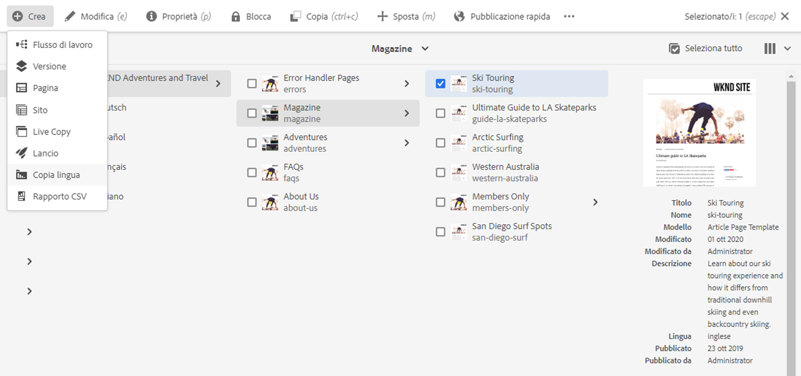
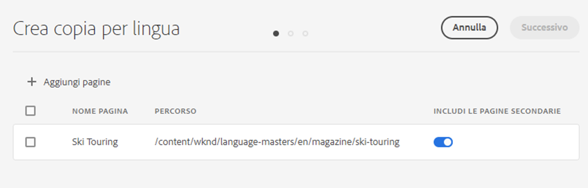
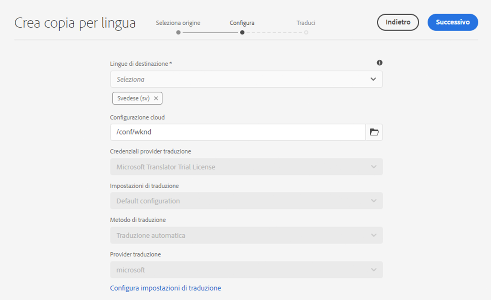
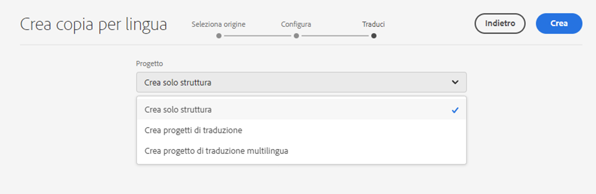
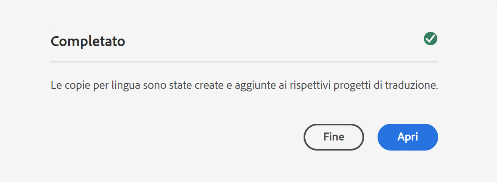

# Creazione guidata copia lingua {#language-copy-wizard}

La Creazione guidata copia in lingua è un’esperienza guidata per la creazione e la strumentazione di una struttura di contenuto multilingue. La creazione guidata rende la creazione di una copia della lingua semplice e veloce.

>[!NOTE]
>
>Per creare una copia in lingua di un sito, l’utente deve essere membro del gruppo `project-administrators` .

Per accedere alla procedura guidata:

1. Nella console Sites, seleziona una pagina e tocca o fai clic su **Crea** e seleziona **Copia lingua**.

   

1. Viene visualizzata la procedura guidata al passaggio **Seleziona origine** che consente di aggiungere/rimuovere pagine. È inoltre possibile includere o escludere le pagine secondarie. Seleziona le pagine da includere e tocca o fai clic su **Avanti**.

   

1. Il passaggio **Configura** della procedura guidata consente di aggiungere/rimuovere le lingue e selezionare il metodo di traduzione. Tocca o fai clic su **Avanti**.

   

   >[!NOTE]
   >
   >Per impostazione predefinita, è disponibile una sola impostazione di traduzione. Per poter selezionare altre impostazioni, devi prima configurare le configurazioni cloud. Consulta [Configurazione del framework di integrazione della traduzione](integration-framework.md).

1. Nel passaggio **Traduci** della procedura guidata puoi scegliere se creare solo la struttura, creare un nuovo progetto di traduzione o aggiungere a un progetto di traduzione esistente.

   >[!NOTE]
   >
   >Se hai selezionato più lingue nel passaggio precedente, verranno creati più progetti di traduzione.

   

1. Il pulsante **Crea** termina la procedura guidata. Tocca o fai clic su **Fine** per chiudere la procedura guidata o su **Apri** per visualizzare il progetto di traduzione risultante.

   
