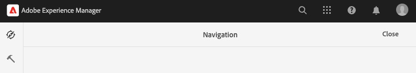
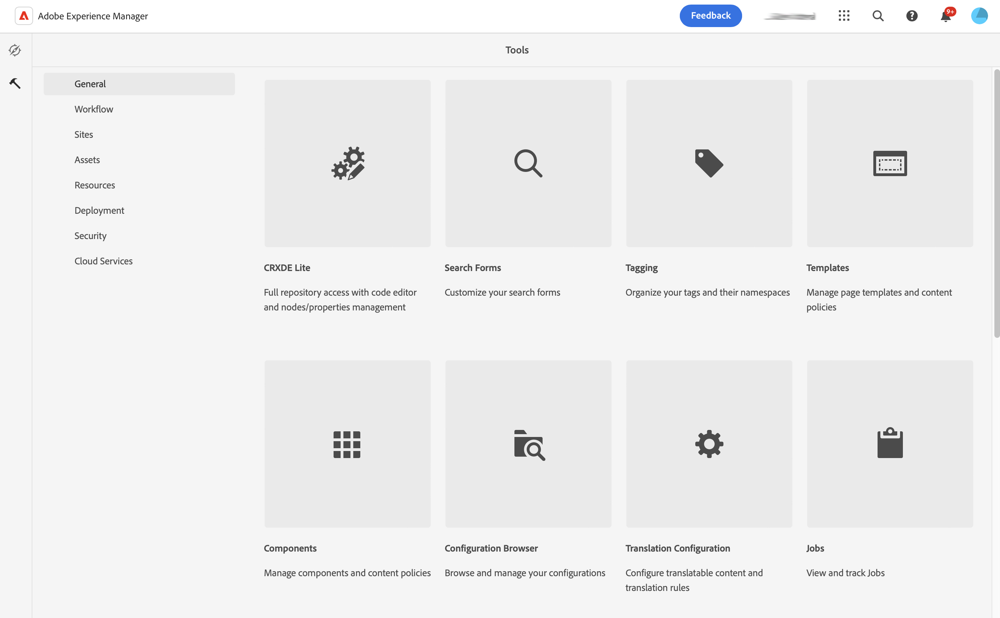
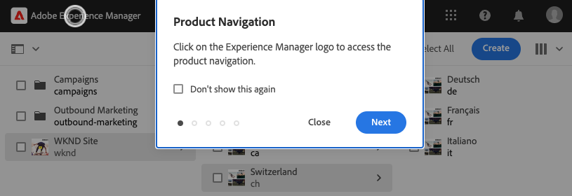

# Operazioni di base {#basic-handling}

Questo documento offre una panoramica delle operazioni di base nell’ambiente di authoring AEM.

>[!TIP]
>
>Sono disponibili scelte rapide da tastiera in tutto il AEM. In particolare quando [utilizzo della console sites](/help/sites-cloud/authoring/sites-console/keyboard-shortcuts.md) e [l’editor pagina](/help/sites-cloud/authoring/page-editor/keyboard-shortcuts.md).

{{edge-delivery-authoring}}

## Interfaccia touch {#a-touch-enabled-ui}

L’interfaccia utente di AEM è dotata di funzionalità touch. L&#39;interfaccia touch consente di interagire con il software tramite gesti quali toccare, tenere premuto e scorrere. Poiché l’interfaccia utente di AEM è di tipo touch, puoi usare i gesti touch sui dispositivi abilitati, come il cellulare o il tablet. Tuttavia, sono disponibili anche le azioni del mouse su un dispositivo desktop tradizionale, che offrono flessibilità nella scelta della modalità di creazione dei contenuti.

## Primi passi {#first-steps}

Immediatamente dopo aver effettuato l’accesso, si aprirà il pannello di [navigazione](#navigation-panel). Selezionando una delle opzioni, si apre la rispettiva console.

Per illustrare l’utilizzo di base di AEM, in questo documento viene utilizzata la console **Sites**. Seleziona il **Sites** per iniziare.

## Navigazione nel prodotto  {#product-navigation}

Ogni volta che un utente accede per la prima volta a una console, viene avviato un tutorial relativo alla navigazione nel prodotto. Prenditi un minuto per effettuare la selezione e ottenere una buona panoramica della gestione di base dell’AEM.

Seleziona **Successivo** per passare alla pagina successiva della panoramica. Seleziona **Chiudi** oppure seleziona all’esterno della finestra di dialogo della panoramica da chiudere.

Se non visualizzi tutte le diapositive o non selezioni l’opzione **Non mostrare più**, al prossimo accesso a una console la panoramica viene riavviata.

## Navigazione globale {#global-navigation}

Puoi spostarti tra le diverse console utilizzando il pannello di navigazione globale. Viene attivato come elenco a discesa a schermo intero quando si seleziona **Adobe Experience Manager** in alto a sinistra sullo schermo.

Per chiudere il pannello di navigazione globale e tornare alla posizione precedente, tocca o fai clic su **Chiudi**.

La navigazione globale presenta due pannelli, rappresentati da icone sul lato sinistro dello schermo:

* **[Navigazione](#navigation-panel)** - Rappresentato da una bussola e dal pannello predefinito al momento dell’accesso all’AEM
* **[Strumenti](#tools-panel)**: rappresentati da un martello

Le opzioni disponibili in questi pannelli sono descritte di seguito.

### Pannello di navigazione  {#navigation-panel}

Il **Navigazione** pannello:

Il titolo della scheda del browser si aggiorna per riflettere la posizione in cui ci si sposta nelle console e nel contenuto.

Nel pannello di navigazione sono disponibili le console seguenti:

| Console | Scopo |
|---|---|
| Progetti | La console Progetti consente di accedere direttamente ai progetti. [I progetti sono dashboard virtuali](/help/sites-cloud/authoring/projects/overview.md) che possono essere utilizzati per creare un team. Potrai quindi fornire al team l’accesso a risorse, flussi di lavoro e attività, facilitando la collaborazione verso un obiettivo comune. |
| Sites | [Console Sites](/help/sites-cloud/authoring/sites-console/introduction.md) consente di creare, visualizzare e gestire siti in esecuzione nell’istanza AEM. Da questa console puoi creare, modificare, copiare, spostare ed eliminare pagine di siti web, avviare flussi di lavoro e pubblicare pagine. |
| Frammenti esperienza | Un [frammento di esperienza](/help/sites-cloud/authoring/fragments/content-fragments.md) è un’esperienza autonoma che può essere riutilizzata su tutti i canali, supporta le varianti e non richiede di copiare e incollare le esperienze o parti di esse. |
| Assets | La console Assets consente di importare e gestire le [risorse digitali quali immagini, video, documenti e file audio](/help/assets/overview.md). Puoi usare queste risorse da qualunque sito web in esecuzione nell’istanza di AEM. Puoi anche creare e gestire [Frammenti di contenuto](/help/assets/content-fragments/content-fragments.md) dalla console Assets. |
| Personalizzazione | Questa console fornisce un set di strumenti per la [creazione e modifica di contenuti mirati e la presentazione di esperienze personali](/help/sites-cloud/authoring/personalization/overview.md). |
| Frammenti di contenuto | I [Frammenti di contenuto](/help/sites-cloud/administering/content-fragments/overview.md) ti consentono di progettare, creare, curare e pubblicare contenuti indipendenti dalle pagine. Consentono di preparare contenuti strutturati pronti per l’uso in più posizioni/su più canali, ideali sia per l’authoring delle pagine che per la distribuzione headless. |

## Pannello Strumenti {#tools-panel}

In **Strumenti** Il pannello laterale contiene una serie di categorie, che raggruppano console simili. Il **Strumenti** Le console consentono di accedere a console e strumenti specifici per la gestione di siti web, risorse digitali e altri aspetti dell’archivio dei contenuti. <!--The [Tools consoles](/help/sites-administering/tools-consoles.md) provide access to several specialized tools and consoles that help you administer your websites, digital assets, and other aspects of your content repository.-->

## Intestazione {#the-header}

L’intestazione di è sempre presente nella parte superiore dello schermo. Anche se la maggior parte delle opzioni presenti nell’intestazione rimangono invariate ovunque ti trovi nel sistema, alcune dipendono dal contesto.

* [Navigazione globale](#global-navigation) - Selezionare la **Adobe Experience Manager** per spostarsi tra le diverse console.

  

* [Ricerca](/help/sites-cloud/authoring/search.md) - È inoltre possibile utilizzare [tasto di scelta rapida](/help/sites-cloud/authoring/sites-console/keyboard-shortcuts.md) `/` (barra) per richiamare la ricerca da qualsiasi console.

  

* [Soluzioni](https://www.adobe.com/it/experience-cloud.html) - Seleziona questa opzione per accedere alle altre soluzioni di Adobe.

  

* [Aiuto](#accessing-help)

  

* [Notifiche](/help/sites-cloud/authoring/inbox.md) - Questa icona è contrassegnata con il numero di notifiche incomplete attualmente assegnate.

  

* [Proprietà utente](/help/sites-cloud/authoring/account-environment.md) - Selezionare questa opzione per modificare le impostazioni utente.

  

## Accedere all’Aiuto   {#accessing-help}

Sono disponibili diverse risorse di assistenza e alcuni modi per accedervi.

* **Barra degli strumenti** - A seconda della tua posizione, **Aiuto** apre le risorse appropriate:

  

* **Console** - La prima volta che accedi al sistema [una serie di diapositive introduttive sulla navigazione AEM](#product-navigation).

  

* **Editor pagina** - La prima volta che modifichi una pagina, una serie di diapositive introducono l’editor di pagine.

  

   * Esamina questa panoramica come faresti con la [panoramica di navigazione del prodotto](#product-navigation) la prima volta che accedi a una console.
   * Dal menu [**Informazioni sulle pagine** puoi selezionare **Aiuto**](#accessing-help) per accedervi di nuovo in un secondo tempo.

* **Console Strumenti** - Dal **Strumenti** console è inoltre possibile accedere al **Risorse**:

   * **Documentazione:** visualizza la documentazione per la gestione esperienza web
   * **Risorse per sviluppatori:** risorse per sviluppatori e download

>[!TIP]
>
>Puoi accedere in qualsiasi momento ai tasti di scelta rapida, semplicemente utilizzando il tasto di scelta rapida `?` (punto interrogativo) all’interno della console.
>
>Per una panoramica di tutte le scelte rapide da tastiera, consulta la documentazione seguente:
>
>* [Scelte rapide da tastiera per la modifica delle pagine](/help/sites-cloud/authoring/page-editor/keyboard-shortcuts.md)
>* [Scelte rapide da tastiera per le console](/help/sites-cloud/authoring/sites-console/keyboard-shortcuts.md)
