# Creazione di newsletter di Campaign con AEM {#creating-newsletters}

Questo documento illustra come utilizzare AEM as a Cloud Service per creare newsletter da inviare con Adobe Campaign Classic.

Sfruttando l&#39;integrazione tra AEM as a Cloud Service e Adobe Campaign Classic, puoi creare le newsletter utilizzando AEM potenti strumenti di authoring. Quindi, quando sei pronto per inviare la newsletter, puoi utilizzare le funzioni di gestione e distribuzione dei destinatari di Campaign per inviarla.

## Prerequisiti {#prerequisites}

Prima di poter creare una newsletter con AEM e inviarla con Campaign, devi prima [integrare Adobe Campaign Classic e AEM as a Cloud Service.](/help/sites-cloud/integrating/integrating-campaign-classic.md)

## Creazione della struttura della newsletter {#create-structure}

Il contenuto della newsletter viene gestito in AEM modo analogo a come gestiresti il contenuto del sito. Per iniziare, crea un &quot;sito&quot; in cui inserire il contenuto. All&#39;interno di questo &quot;sito&quot; è possibile raccogliere le newsletter per marchio.

1. Accedi alla tua istanza di authoring AEM.

1. Dalla pagina di navigazione principale, apri le **Sites** console.

1. In un&#39;installazione standard di AEM ci sarà un **Campaign** cartella. Selezionala e fai clic sul pulsante **Crea** e quindi **Pagina**.

   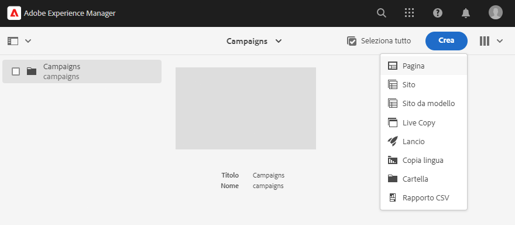

1. Seleziona **Brand** come modello di sito e fai clic su **Successivo**.

   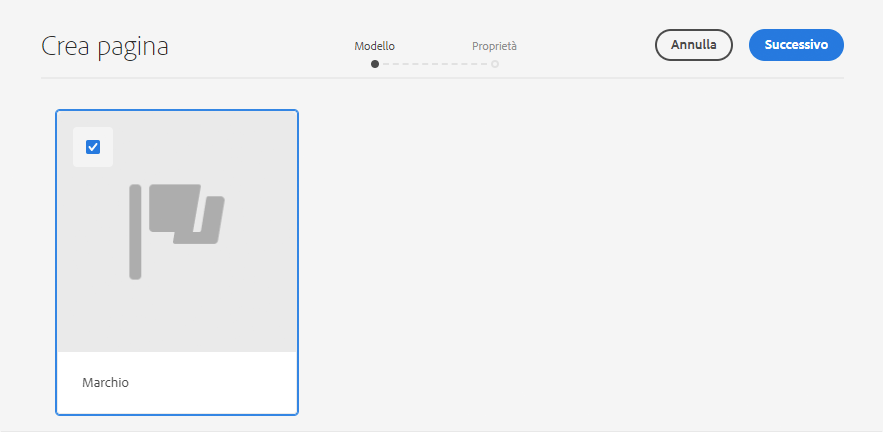

1. Inserisci un **Titolo** e fai clic su **Crea** e poi **Fine**.

   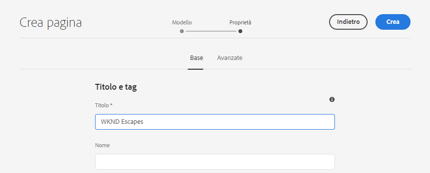

Ora disponi di una struttura di contenuto di base per creare le campagne.

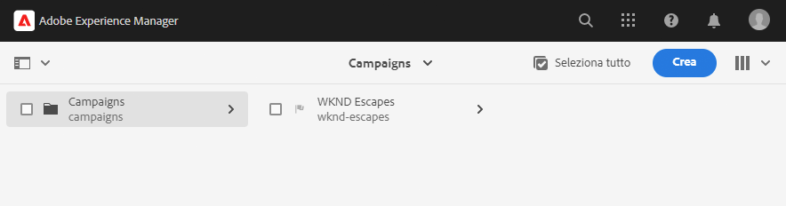

## Creazione di una campagna {#create-campaign}

Ora che disponi di una struttura di contenuto di base per la campagna, puoi creare la campagna stessa. La campagna verrà utilizzata per organizzare eventualmente più newsletter.

1. Utilizzo [vista a colonne](/help/sites-cloud/authoring/getting-started/basic-handling.md#viewing-and-selecting-resources) nella console Sites , seleziona il marchio creato in precedenza (in questo caso, **Escapes WKND**) e quindi seleziona **Area master**, creato automaticamente, quindi fai clic sul pulsante **Crea** e quindi **Pagina**.

   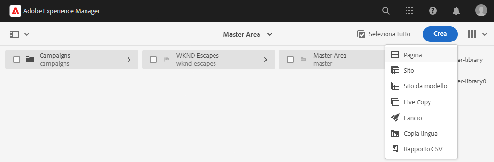

1. Seleziona **Campaign** come modello, fai clic su **Successivo** e **Fine**.

   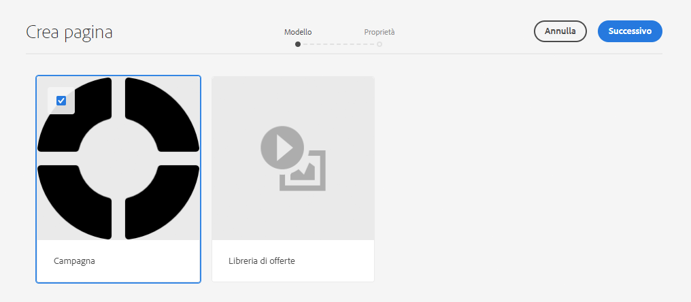

1. Inserisci un **Titolo** per la campagna, quindi fai clic su **Crea** e **Fine**.

   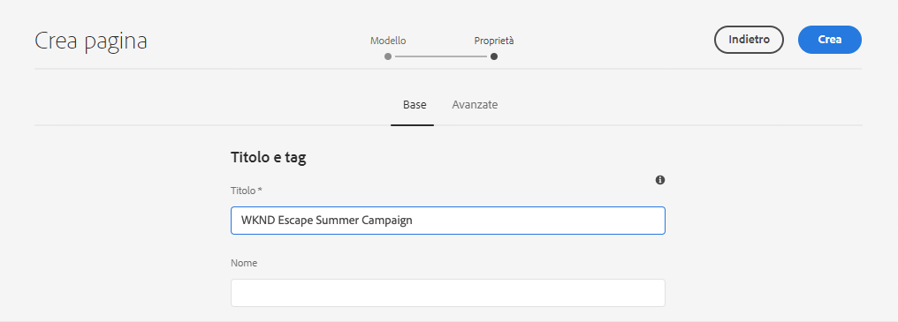

È ora disponibile una campagna per la creazione delle newsletter.

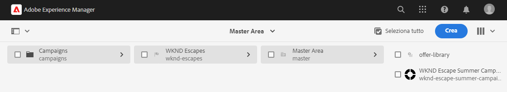

## Selezione della configurazione della campagna {#campaign-configuration}

AEM supportare più configurazioni di integrazione. Per la nuova campagna, è necessario definire le configurazioni da utilizzare per inviare il contenuto della newsletter.

1. Utilizzo [vista a colonne](/help/sites-cloud/authoring/getting-started/basic-handling.md#viewing-and-selecting-resources) nella console Sites individua la campagna creata in precedenza (in questo caso, **Campagna estiva WKND Escape**), quindi selezionala utilizzando la casella di controllo e fai clic sul pulsante **Proprietà** sulla barra degli strumenti.

   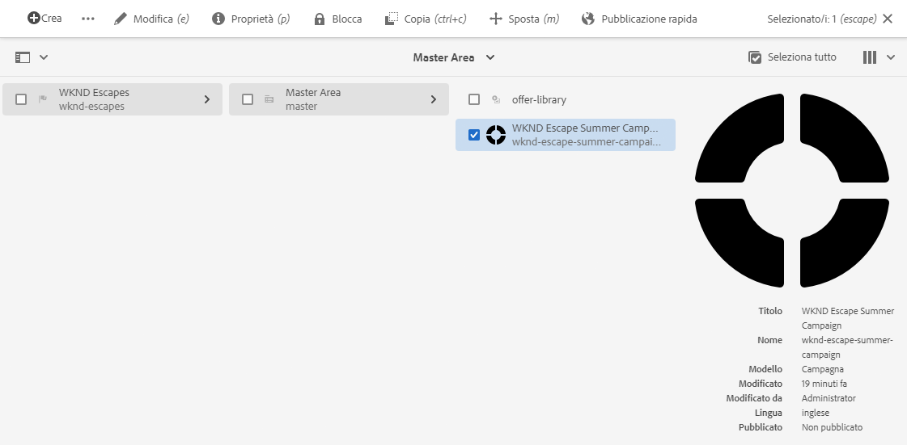

1. In **Proprietà** seleziona la finestra **Cloud Service** per definire l’integrazione da utilizzare con questa campagna.

   * Seleziona **Adobe Campaign** dal **Configurazioni Cloud Service** elenco a discesa.
   * Seleziona la configurazione di integrazione Adobe Campaign desiderata dal **Adobe Campaign** elenco a discesa.
   * Fai clic su **Salva e chiudi**.

   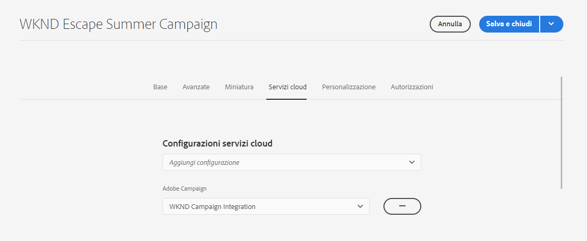

La campagna è ora collegata alla tua integrazione con Adobe Campaign. Puoi creare una newsletter in AEM e inviarla con Adobe Campaign.

## Creare una newsletter {#create-newsletter}

È possibile creare e gestire le newsletter nella struttura dei contenuti della campagna già creata e configurata.

1. Utilizzo [vista a colonne](/help/sites-cloud/authoring/getting-started/basic-handling.md#viewing-and-selecting-resources) nella console Sites individua la campagna configurata in precedenza (in questo caso, **Campagna estiva WKND Escape**), selezionala e fai clic sul pulsante **Crea** e quindi **Pagina**.

   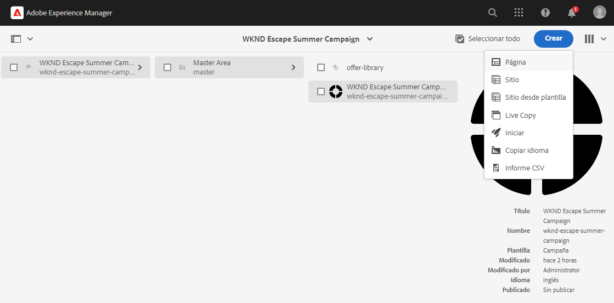

1. Nella procedura guidata Crea pagina, seleziona la **E-mail Adobe Campaign (AC 6.1)** modello e fai clic su **Successivo**.

   

1. Per **Proprietà** passaggio della procedura guidata, immetti **Titolo** per la newsletter, fai clic su **Crea** e **Apri**.

   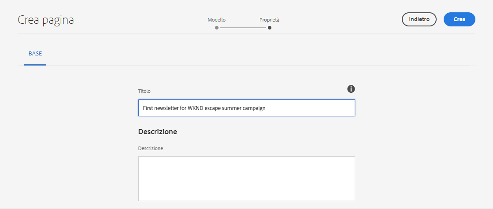

1. Modificate la pagina della newsletter come fareste con qualsiasi altra pagina di contenuto AEM per soddisfare le vostre esigenze.

È ora disponibile una newsletter da inviare con Adobe Campaign.

## Pubblicazione della newsletter {#publishing-newsletter}

Devi pubblicare la newsletter per renderla disponibile ad Adobe Campaign da inviare.

1. Utilizzo [vista a colonne](/help/sites-cloud/authoring/getting-started/basic-handling.md#viewing-and-selecting-resources) nella console Sites individua la newsletter creata in precedenza (in questo caso, **Prima newsletter per la campagna estiva di escape WKND**), selezionala e fai clic sul pulsante **Informazioni pagina** in alto a sinistra e fai clic su **Pubblica pagina**.

1. Seleziona le configurazioni per le quali la pagina deve essere pubblicata e fai clic su **Pubblica**.

   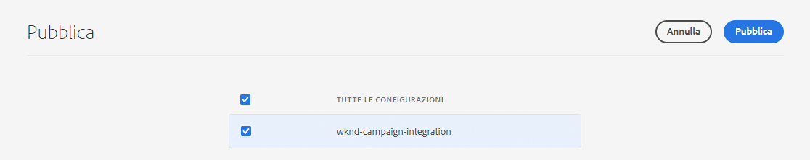

La pagina della newsletter viene ora pubblicata nell’istanza di pubblicazione AEM ed è visibile in Adobe Campaign Classic. Per poterla selezionare all’interno di Adobe Campaign, deve essere approvato.

1. Fai clic sul pulsante **Informazioni pagina** pulsante per la newsletter ancora una volta e seleziona **Avvia flusso di lavoro**.

1. Seleziona **Approva per Adobe Campaign** come modello di flusso di lavoro (fornendo facoltativamente una descrizione) e fai clic sul **Avvia flusso di lavoro** pulsante .

   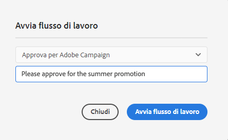

1. Nella parte superiore dell’editor di pagine per newsletter viene visualizzato un banner che fornisce i passaggi successivi nel processo di approvazione. Fai clic su **Completa**.

   

1. In **Elemento di lavoro completo** finestra di dialogo, seleziona **Recensione della newsletter (amministratore)** in **Passaggio successivo** elenco a discesa e fai clic sul pulsante **OK** pulsante .

   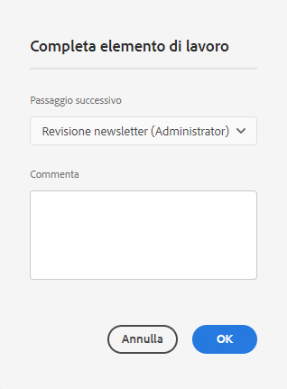

1. Nel banner che appare nella parte superiore dell’editor di pagine per newsletter, fai di nuovo clic su **Completa**.

1. In **Elemento di lavoro completo** finestra di dialogo, seleziona **Approvazione newsletter** in **Passaggio successivo** elenco a discesa e fai clic sul pulsante **OK** pulsante .

   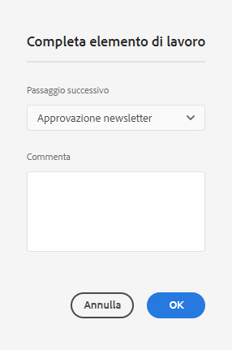

1. Quando la finestra di dialogo viene chiusa, il banner visualizzato nella parte superiore dell’editor di pagine per newsletter scompare a causa del completamento del flusso di lavoro di approvazione.

La newsletter viene ora pubblicata in AEM e approvata per l’utilizzo in Adobe Campaign.

>[!TIP]
>
>I passaggi del flusso di lavoro descritti sono semplificati qui per illustrare il processo. In un normale flusso di lavoro, la creazione e l’approvazione della newsletter funzionano normalmente in ruoli diversi
>
>Vedere il documento [Utilizzo dei flussi di lavoro](/help/sites-cloud/authoring/workflows/overview.md) per ulteriori dettagli sull’utilizzo dei flussi di lavoro.

## Creazione di un destinatario {#creating-recipient}

Per poter inviare la newsletter creata in AEM, devi innanzitutto definire i destinatari in Adobe Campaign Classic.

1. Accedi a Adobe Campaign Classic utilizzando la console client.

1. Seleziona **Strumenti** -> **Esplora risorse** dalla barra dei menu.

1. Nell’esploratore, passa alla **Profili e destinazioni** -> **Destinatari** nodo.

   

1. Fai clic su **Nuovo** nella barra degli strumenti e fornire i dettagli del destinatario.

   * Nome
   * Cognome
   * Indirizzo e-mail

1. Fai clic su **Salva**.

Ora disponi di un destinatario a cui inviare la newsletter tramite Adobe Campaign Classic.

## Creazione di una consegna e-mail {#create-delivery}

L’ultimo passaggio consiste nell’inviare la newsletter creata in AEM al destinatario aggiunto in Adobe Campaign Classic.

1. Accedi a Adobe Campaign Classic utilizzando la console client.

1. Seleziona **Strumenti** -> **Esplora risorse** dalla barra dei menu.

1. Nell’esploratore, passa alla **Campaign Management** -> **Consegne** nodo e fai clic su **Nuovo**.

   

1. In **Consegna** finestra di dialogo, seleziona **Consegna e-mail con contenuto AEM** come **Modello di consegna** dall’elenco a discesa e fai clic su **Continua**.

   

1. In **Parametri e-mail** fai clic sulla sezione **Da** collega e inserisci le informazioni del mittente e fai clic su **OK**.

   * Indirizzo mittente
   * Campo Da

   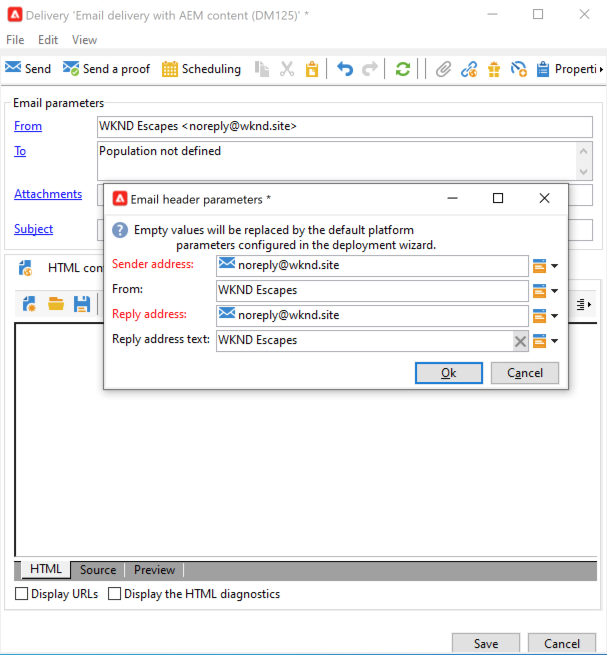

1. In **Parametri e-mail** fai clic sulla sezione **A** per aprire **Seleziona Target** finestra di dialogo e quindi fai clic su **Aggiungi**.

   

1. In **Seleziona l’elemento di destinazione** finestra di dialogo, seleziona **Un destinatario** e fai clic su **Successivo**.

   

1. Utilizzando i filtri, seleziona il destinatario desiderato [creato in precedenza](#creating-recipient) e fai clic su **Fine**.

   

1. Indietro nel **Seleziona Target** finestra di dialogo, fai clic su **OK**.

1. Nella finestra di consegna, fai clic su **Sincronizza**.

   

1. In **Sincronizzazione con AEM contenuto** selezionate dall’elenco la newsletter creata in precedenza, quindi fate clic su **OK**.

1. Il contenuto dell’e-mail di Adobe Campaign viene sincronizzato con il contenuto della newsletter creato in AEM.

   * Fai clic su **Aggiorna contenuto** se il contenuto non viene caricato automaticamente.

1. Fai clic su **Invia** per inviare l’e-mail.

1. In **Invia a destinazione della consegna principale** finestra di dialogo, seleziona **Consegna quanto prima** quindi fai clic su **Analizza**.

   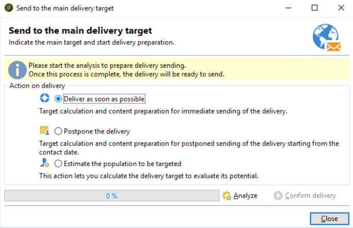

1. Il passaggio di analisi crea la consegna, combinando il contenuto con i destinatari. Una volta creata la consegna, fai clic su **Conferma consegna** per l’invio dell’e-mail. Fai clic su **Sì** per confermare.

1. La consegna è iniziata. Fai clic su **Chiudi**.

   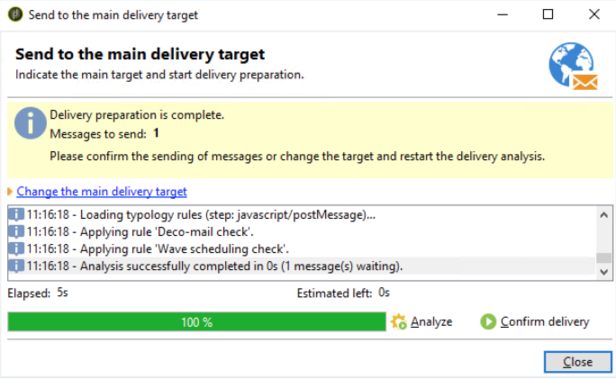

1. Fai clic su **Salva** per salvare la consegna.

La newsletter è stata inviata!

>[!TIP]
>
>In questo esempio viene mostrata una distribuzione semplificata dell’invio di una newsletter a un singolo destinatario. Naturalmente, una consegna normale conterrebbe molti destinatari diversi, che Adobe Campaign semplifica la gestione. Fai riferimento alla [Documentazione di Adobe Campaign Classic](https://experienceleague.adobe.com/docs/campaign-classic.html) per ulteriori dettagli sulla gestione di consegna e destinatari.
