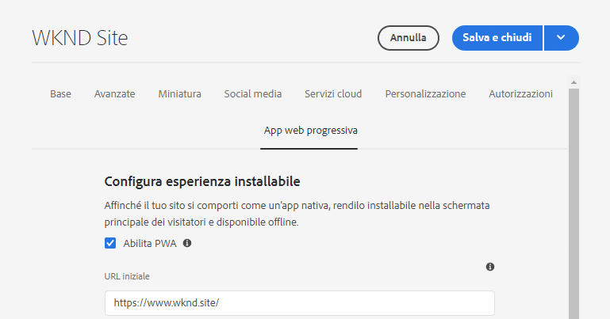
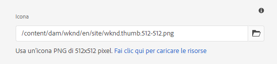
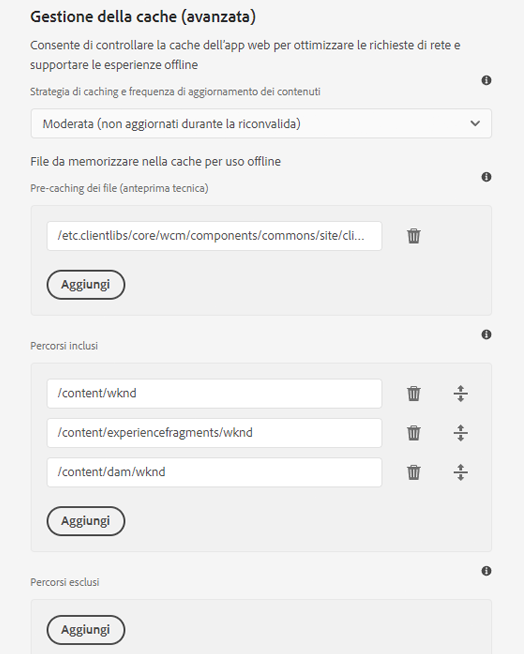

# Abilitazione delle funzioni progressive dell&#39;app Web {#enabling-pwa}

Attraverso una configurazione semplice, un autore di contenuti può ora abilitare le funzionalità delle app Web progressive (PWA) per le esperienze create in  AEM Sites.

>[!CAUTION]
>
>Si tratta di una funzione avanzata che richiede:
>
>* Conoscenza dei PWA
>* Conoscenza del sito e della struttura del contenuto
>* Informazioni sulle strategie di caching
>* Supporto del team di sviluppo

>
>
Prima di utilizzare questa funzione è consigliabile discuterne con il team di sviluppo per definire il modo migliore per sfruttarla al meglio per il progetto.

## Introduzione {#introduction}

[Le app Web progressive (PWA) ](https://developer.mozilla.org/en-US/docs/Web/Progressive_web_apps) consentono esperienze app coinvolgenti per i siti AEM, consentendo loro di essere memorizzate localmente sul computer di un utente e di essere accessibili offline. Un utente potrebbe navigare in un sito mentre è in movimento, anche se perde una connessione Internet. I PWA consentono esperienze perfette anche se la rete viene persa o instabile.

Anziché richiedere una nuova codifica del sito, l&#39;autore del contenuto può configurare le proprietà PWA come scheda aggiuntiva nelle proprietà di [pagina](/help/sites-cloud/authoring/fundamentals/page-properties.md) di un sito.

* Quando viene salvata o pubblicata, questa configurazione attiva un gestore eventi che scrive i file manifesto [file](https://developer.mozilla.org/en-US/docs/Web/Manifest) e [service worker](https://developer.mozilla.org/en-US/docs/Web/API/Service_Worker_API) che abilitano le funzioni PWA sul sito.
* Il manifest e il service worker sono memorizzati in [configurazione sensibile al contesto](https://experienceleague.adobe.com/docs/experience-manager-core-components/using/developing/context-aware-configs.html) applicabile al sito. Vengono inoltre mantenute le mappature Sling per garantire che il service worker venga servito dalla radice dell&#39;applicazione per abilitare il proxy del contenuto che consente funzionalità offline all&#39;interno dell&#39;app.

Con il PWA , l&#39;utente ha una copia locale del sito , dando un&#39;esperienza di tipo app anche senza una connessione Internet .

>[!NOTE]
>
>Le app Web progressive sono una tecnologia in evoluzione e il supporto per l&#39;installazione locale delle app e altre funzionalità [dipende dal browser utilizzato.](https://developer.mozilla.org/en-US/docs/Web/Progressive_web_apps/Installable_PWAs#Summary)

## Prerequisiti {#prerequisites}

Per poter utilizzare le funzioni PWA per il sito, sono necessari due requisiti per l’ambiente di progetto:

1. [Regolare i ](#adjust-components) componenti per abilitare questa funzione
1. [Regolare i ](#adjust-dispatcher) dispatcher per esporre i file richiesti

Si tratta di passi tecnici che l&#39;autore dovrà coordinare con il team di sviluppo. Questi passaggi sono necessari solo una volta per sito.

### Regolare i componenti {#adjust-components}

I componenti devono includere i [file manifesto](https://developer.mozilla.org/en-US/docs/Web/Manifest) e [service worker,](https://developer.mozilla.org/en-US/docs/Web/API/Service_Worker_API) che supportano le funzioni PWA.

A tal fine, lo sviluppatore dovrà aggiungere il seguente collegamento al file `customheaderlibs.html` del componente pagina.

```xml
<link rel="manifest" href="/content/<projectName>/manifest.webmanifest" crossorigin="use-credentials"/>
```

Lo sviluppatore dovrà inoltre aggiungere il seguente collegamento al file `customfooterlibs.html` del componente pagina.

```xml
<script>
        // Check that service workers are supported
        if ('serviceWorker' in navigator) {
            // Use the window load event to make sure the page load performs well
            window.addEventListener('load', () => {
                let serviceWorker = '/<projectName>sw.js';
                navigator.serviceWorker.register(serviceWorker);
            });
        }
</script>
```

>[!NOTE]
>
>Le versioni future di [Componenti di base](https://experienceleague.adobe.com/docs/experience-manager-core-components/using/introduction.html) includeranno automaticamente queste funzioni. Tuttavia, se utilizzate componenti personalizzati invece dei componenti core, tali regolazioni saranno sempre necessarie.

### Regolare il dispatcher {#adjust-dispatcher}

La funzione PWA genera e utilizza `/content/<sitename>/manifest.webmanifest` file. Per impostazione predefinita, [il dispatcher](/help/implementing/dispatcher/overview.md) non espone tali file. Per esporre questi file, lo sviluppatore deve aggiungere la seguente configurazione al progetto del sito.

```text
File location: [project directory]/dispatcher/src/conf.dispatcher.d/filters/filters.any >

# Allow webmanifest files
/0102 { /type "allow" /extension "webmanifest" /path "/content/*/manifest" }
```

>[!NOTE]
>
>Le versioni future di [AEM Project Archetype](https://experienceleague.adobe.com/docs/experience-manager-core-components/using/developing/archetype/overview.html?lang=en#developing) includeranno questa configurazione.

## Abilitazione del PWA per il sito {#enabling-pwa-for-your-site}

Con [i prerequisiti](#prerequisites) soddisfatti, per un autore di contenuti è molto semplice abilitare le funzionalità PWA a un sito. Di seguito è riportato un profilo di base di come eseguire questa operazione. Le singole opzioni sono descritte nella sezione [Opzioni dettagliate.](#detailed-options)

1. Accedi a AEM.
1. Dal menu principale, toccate o fate clic su **Navigazione** -> **Siti**.
1. Selezionate il progetto del sito e toccate o fate clic su [**Proprietà**](/help/sites-cloud/authoring/fundamentals/page-properties.md) oppure utilizzate il tasto di scelta rapida `p`.
1. Selezionate la scheda **App Web progressiva** e configurate le proprietà applicabili. Come minimo si desidera:
   1. Selezionare l&#39;opzione **Abilita PWA**.
   1. Definire l&#39; **URL di avvio**.

      

   1. Caricate un&#39;icona png da 512x512 in DAM e fate riferimento ad essa come icona per l&#39;app.

      

   1. Configurate i percorsi che desiderate vengano disconnessi dal service di lavoro. I percorsi standard sono:
      * `/content/<sitename>`
      * `/content/experiencefragements/<sitename>`
      * `/content/dam/<sitename>`
      * Qualsiasi riferimento a font di terze parti
      * `/etc/clientlibs/<sitename>`

      


1. Toccate o fate clic su **Salva e chiudi**.

Il sito è ora configurato e può essere [installato come app locale.](#using-pwa-enabled-site)

## Utilizzo del sito abilitato per PWA {#using-pwa-enabled-site}

Ora che il sito è [configurato per supportare il PWA,](#enabling-pwa-for-your-site) è possibile utilizzarlo autonomamente.

1. Accedete al sito in un [browser supportato.](https://developer.mozilla.org/en-US/docs/Web/Progressive_web_apps/Installable_PWAs#Summary)
1. Nella barra degli indirizzi del browser viene visualizzata l&#39;icona `+` che indica che il sito può essere installato come app locale.
   * A seconda del browser, potrebbe anche visualizzare una notifica (ad esempio un banner o una finestra di dialogo) per indicare che è possibile installare come app locale.
1. Installate l&#39;app.
1. L&#39;app verrà installata nella schermata iniziale del dispositivo.
1. Aprite l&#39;app, sfogliate un po&#39; e vedete che le pagine sono disponibili offline.

## Opzioni dettagliate {#detailed-options}

La sezione seguente fornisce maggiori dettagli sulle opzioni disponibili durante la [configurazione del sito per PWA.](#enabling-pwa-for-your-site)

### Configurare l&#39;esperienza installabile {#configure-installable-experience}

Queste impostazioni consentono al sito di comportarsi come un&#39;app nativa, rendendola installabile nella schermata iniziale del visitatore e disponibile offline.

* **Abilita PWA** : questa è l&#39;interruttore principale per attivare il PWA per il sito.
* **URL**  di avvio: questo è l&#39; [URL di avvio ](https://developer.mozilla.org/en-US/docs/Web/Manifest/start_url) preferito che l&#39;app si aprirà quando l&#39;utente carica l&#39;app installata localmente.
   * Può trattarsi di qualsiasi percorso nella struttura del contenuto.
   * Questo non deve essere necessariamente il livello principale ed è spesso una pagina di benvenuto dedicata per l&#39;app.
   * Se questo URL è relativo, l&#39;URL del manifesto viene utilizzato come URL di base per risolverlo.
   * Se lasciata vuota, la funzione utilizza l&#39;indirizzo della pagina Web da cui è stata installata l&#39;app Web.
   * È consigliabile impostare un valore.
* **Modalità**  di visualizzazione: un&#39;app abilitata per PWA continua a essere un sito AEM distribuito tramite un browser. [Queste ](https://developer.mozilla.org/en-US/docs/Web/Manifest/display) opzioni di visualizzazione definiscono il modo in cui il browser deve essere nascosto o altrimenti presentato all&#39;utente sul dispositivo locale.
   * **Standalone** - Il browser è completamente nascosto all&#39;utente e viene visualizzato come un&#39;app nativa. Questo è il valore predefinito.
      * Con questa opzione, la navigazione dell&#39;app deve essere possibile interamente attraverso il contenuto utilizzando collegamenti e componenti nelle pagine del sito senza utilizzare i controlli di navigazione del browser.
   * **Browser**  - Il browser viene visualizzato come normalmente quando si visita il sito.
   * **Interfaccia**  minima: il browser è principalmente nascosto, come un&#39;app nativa, ma sono esposti i controlli di navigazione di base.
   * **Schermo**  intero: il browser è completamente nascosto, come un&#39;app nativa, ma viene riprodotto in modalità a schermo intero.
      * Con questa opzione, la navigazione dell&#39;app deve essere possibile interamente attraverso il contenuto utilizzando collegamenti e componenti nelle pagine del sito senza utilizzare i controlli di navigazione del browser.
* **Orientamento**  dello schermo: come app locale, il PWA deve sapere come gestire gli orientamenti  [del dispositivo.](https://developer.mozilla.org/en-US/docs/Web/Manifest/orientation)
   * **Qualsiasi** : l&#39;app si adatta all&#39;orientamento del dispositivo dell&#39;utente. Questo è il valore predefinito.
   * **Verticale** : consente di forzare l&#39;apertura dell&#39;app nel layout verticale, indipendentemente dall&#39;orientamento del dispositivo dell&#39;utente.
   * **Orizzontale** : consente di forzare l&#39;apertura dell&#39;app nel layout orizzontale, indipendentemente dall&#39;orientamento del dispositivo dell&#39;utente.
* **Colore**  tema: definisce il  [colore dell&#39;](https://developer.mozilla.org/en-US/docs/Web/Manifest/theme_color) app che influisce sul modo in cui il sistema operativo dell&#39;utente locale visualizza la barra degli strumenti dell&#39;interfaccia utente nativa e i controlli di navigazione. A seconda del browser, può influenzare altri elementi di presentazione dell&#39;app.
   * Utilizzate la finestra a comparsa del pozzetto del colore per selezionare un colore.
   * Il colore può essere definito anche dal valore esadecimale o RGB.
* **Colore**  di sfondo: definisce il colore  [di sfondo dell&#39;app, ](https://developer.mozilla.org/en-US/docs/Web/Manifest/background_color) che viene mostrato durante il caricamento dell&#39;app.
   * Utilizzate la finestra a comparsa del pozzetto del colore per selezionare un colore.
   * Il colore può essere definito anche dal valore esadecimale o RGB.
   * Alcuni browser [creano automaticamente una schermata iniziale](https://developer.mozilla.org/en-US/docs/Web/Manifest#Splash_screens) dal nome dell&#39;app, dal colore di sfondo e dall&#39;icona.
* **Icona** : definisce  [l&#39;](https://developer.mozilla.org/en-US/docs/Web/Manifest/icons) icona che rappresenta l&#39;app sul dispositivo dell&#39;utente.
   * L’icona deve essere un file png di dimensione 512x512 pixel.
   * L&#39;icona deve essere [memorizzata in DAM.](/help/assets/overview.md)

### Gestione cache (avanzata) {#offline-configuration}

Queste impostazioni rendono alcune parti del sito disponibili offline e disponibili localmente sul dispositivo del visitatore. Questo consente di controllare la cache dell&#39;app Web per ottimizzare le richieste di rete e supportare esperienze offline.

* **Strategia di memorizzazione nella cache e frequenza di aggiornamento**  del contenuto: questa impostazione definisce il modello di memorizzazione nella cache per il PWA.
   * **Moderatamente**  -  [Questa ](https://web.dev/stale-while-revalidate/) impostazione è valida per la maggior parte dei siti ed è il valore predefinito.
      * Con questa impostazione, il contenuto visualizzato per primo dall&#39;utente verrà caricato dalla cache e mentre l&#39;utente sta consumando tale contenuto, il resto del contenuto della cache verrà nuovamente convalidato.
   * **Frequentemente**  - Questo è il caso per i siti che necessitano di aggiornamenti per essere molto veloci come le case d&#39;asta.
      * Con questa impostazione, l&#39;app cercherà prima il contenuto più recente tramite la rete, e se non è disponibile tornerà alla cache locale.
   * **Raramente**  - Questo è il caso dei siti quasi statici, come le pagine di riferimento.
      * Con questa impostazione, l&#39;app cercherà prima il contenuto nella cache, e se non disponibile tornerà alla rete per recuperarlo.
* **Pre-caching**  dei file: questi file ospitati su AEM verranno salvati nella cache del browser locale quando il service di stampa sta installando e prima di essere utilizzati. Questo garantisce che l&#39;app Web sia completamente funzionante quando è offline.
* **Inserimento**  di percorsi - Le richieste di rete per i percorsi definiti vengono intercettate e il contenuto memorizzato nella cache viene restituito in conformità alla strategia di  **memorizzazione nella cache configurata e alla frequenza di aggiornamento** del contenuto.
* **Esclusioni**  dalla cache: questi file non verranno mai memorizzati nella cache, indipendentemente dalle impostazioni specificate in  **File pre-** cachinghe e  **Percorsi inclusi**.

>[!TIP]
>
>È probabile che il team di sviluppatori disponga di informazioni importanti sulla configurazione offline da configurare.

## Limitazioni  {#limitations}

Non tutte le funzioni PWA sono disponibili per  AEM Sites. Queste sono alcune limitazioni importanti.

* Un utente deve sfogliare la pagina almeno una volta prima che venga memorizzata nella cache offline.
* Le pagine non vengono sincronizzate o aggiornate automaticamente se l&#39;utente non utilizza l&#39;app.
